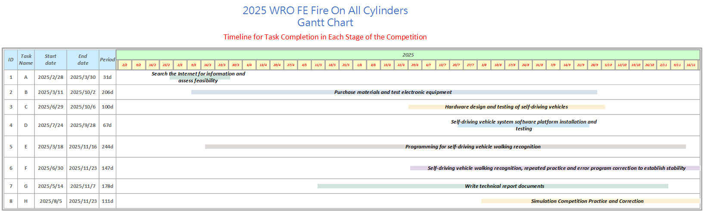

 

- This is the official technical documentation for the WRO Taiwan National Team, **"Fire On All Cylinders."**
- You can find hyperlinks to the technical report content and setup instructions here, provided for quick access by both learners and judges during study or evaluation.
- This technical document will feature a detailed table of contents structured **according to the official scoring criteria**  (such as the engineering journal evaluation rubrics), with all section titles displayed as **hyperlinks**. This allows judges or learners to easily navigate to the key content of the technical documentation for **rapid and efficient evaluation**.

**Special Note:**
- Due to network speed fluctuations, some images may not display correctly. Should this occur, please try refreshing the page to resolve the issue.

#### [For Learners](learners_contents.md)

## Rubric for Judging Engineering Documentation

- ###  ${{\color{red} Hardware Overview }} $ 
  #### 1. Mobility Management
    * [1-1 Vehicle 2D/3D Models in CAD](models/Vehicle_2D_3D/README.md)
    * [1-2 Vehicle Chassis Design](schemes/Vehicle_Chassis_Design/README.md)
    * [1-3 Motor Selection](schemes/Motor/README.md)
  #### 2. Power and Sense Management
    - __2-1 Vehicle Design__
      - [2-1-1 BOM Pats List](schemes/Parts_List/README.md)
      - [2-1-2 Circuit Design](models/Circuit_Design/README.md)
      - [2-1-3 Hardware Fool-Proof Design](schemes/Fool-Proof-Design/README.md)
      - [2-1-4 Assembly Instructions & Wiring Diagrams](schemes/Assembly_Instructions/README.md)
    - __2-2 Power Management__
      - [2-2-1 Battery choice for self-driving cars](schemes/Battery/README.md)
      - [2-2-2 Power Supply System](schemes/Power_Supply_System/README.md)
    - __2-3 Controller Selection__
      - [2-3-1 Main Controller Comparison](schemes/Main_Controller_Choosing/README.md)
      - [2-3-2 Motor & Sensor Intermediate I/O Controller Comparison](schemes/Motor_Sensor_Controller_Choosing/README.md)
    - __2-4 Sense Management__
      - [2-4-1 Ultrasonic rangefinder](schemes/HC-SR04/README.md)
      - [2-4-2 Infrared Sensor](schemes/Infrared-Sensor/README.md)
      - [2-4-3 Gyroscope orientation sensor](schemes/BNO055/README.md)
      - [2-4-4 Camera Selection](schemes/Camera/README.md)

- ### ${{\color{red} Software Overview }} $ 
  #### 3. Obstacle Management
    - [3-1 Software Platform Construction](src/System_Platform_Software/README.md)
    - [3-2 OpenCV Introduction](src/OpenCV/README.md)
 
    - __3-4 Image Recognition Processing and Steering__
      - [3-4-1 Image Recognition Processing](src/Image_Recognition_Processing/README.md)
      - [3-4-2 Parking Lot Departure Steering Control Overview](src/Overview_of_Parking_Lot_Departure_Steering_Control/README.md) 
      - [3-4-3 Steering Control](src/Steering_Control/README.md) 
      - [3-4-4 Automatically record the LAB values of the field](src/Automatically_record_LAB/README.md)
    - __3-5 Programming - Vehicle’s control program__
      - [3-5-1 Open Challenge Code Overview](src/Programming/Open_Challenge/README.md)
      - [3-5-2 Obstacle Challenge Code Overview](src/Programming/Obstacle_Challenge/README.md)
      - [3-5-3 Vehicle Departure Procedure Guide](src/Vehicle_Departure_Procedure_Guide/README.md)
      - [3-5-4 Vehicle Parking Procedure Guide](src/Vehicle_Parking_Procedure_Guide/README.md)
    - __3-6 Remote Connection__
      - [3-6-1 NoMachine software Introduction](other/NoMachine/README.md)

- ### ${{\color{red} Other}} $
  #### 4. Pictures – Team and Vehicle
    - [4-1 Team Members Introduction](t-photos/README.md)
    - [4-2 Vehicle Photos](v-photos/README.md)  
  #### 5. Performance Videos - Challenge rounds
    - [5-1 Open Challenge rounds](video/Open_Challenge/video.md)
    - [5-2 Obstacle Challenge rounds](video/Obstacle_Challenge/video.md)
    - [5-3 Self-Driving Car Design Process Video](video/Design_Process_Video/video.md)
  #### 6. GitHub Utilization-GitHub
    - [6-1 GitHub Editing Tools Introduction (VScode Edit/GIT)](src/GitHub_Edit/README.md)
    - [6-2 GitHub Web Editor Supported Markup Languages](src/GitHub_Languages/README.md)  
  #### 7. Engineering Factor
    - [7-1 Learning Journey](other/Learning_Journey/README.md)
      - [February](other/Learning_Journey/README.md#20250228--20250330)
      - [March](other/Learning_Journey/README.md#20250301--20250307)
      - [April](other/Learning_Journey/README.md#20250403--20250414)
      - [May](other/Learning_Journey/README.md#20250501--20250507)
      - [June](other/Learning_Journey/README.md#20250604--20250608)
      - [July](other/Learning_Journey/README.md#20250702--20250721)
      - [August](other/Learning_Journey/README.md#20250811--20250817)
      - [September](other/Learning_Journey/README.md#20250901--20250906)
      - [October](other/Learning_Journey/README.md#20250928--20251006)
      - [November](other/Learning_Journey/README.md#20251027--20251101)

- ### Autonomous Vehicle Design: Key Upgrades and Iterations
  This autonomous vehicle design **builds upon** the rich experience inherited from the senior team (**Shinan-Fire-On-All-Cylinders**) and integrates my practical insights from last year's World Competition.

  We didn't just reference the successful elements of the previous year's winning teams; we implemented **key technological iterations**:

  * **Controller Upgrade:** The main controller has been upgraded from the standard Jetson Orin Nano to the **superior-performing Nvidia Jetson Orin Nano**.
  * **Mechanical Overhaul:** We have **restructured and optimized** the vehicle's mechanical components, specifically the steering and chassis.
  * **Vision Enhancement:** Image processing has been **significantly enhanced** for greater efficiency and accuracy.

  The integration of all these upgrades and innovative design elements is squarely aimed at **comprehensively strengthening** the vehicle's overall performance and competitiveness.

  

 
