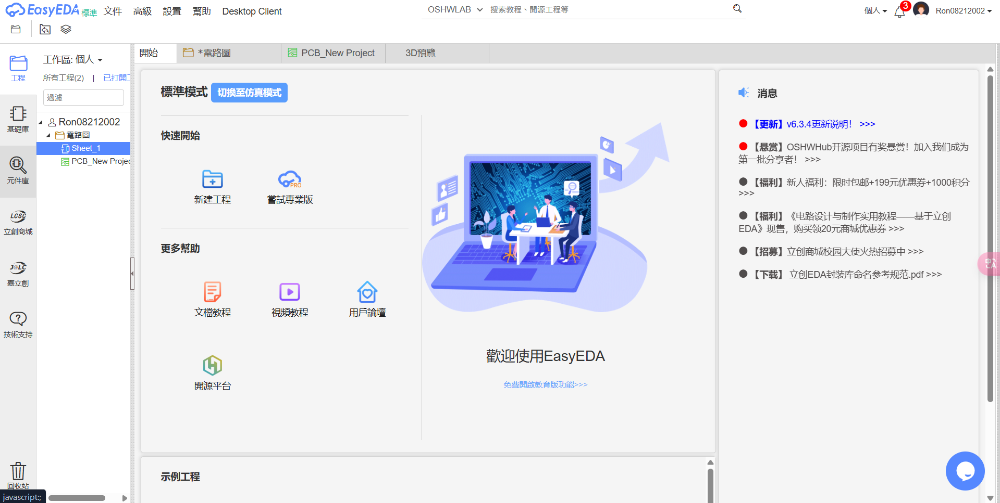
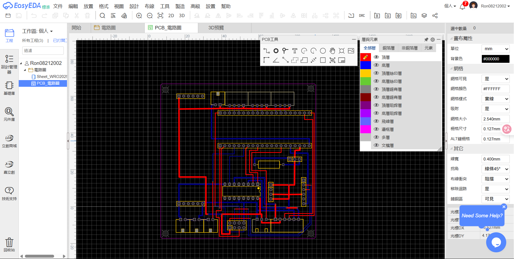

 ## 
 Circuit Design -電路設計

 #### 中文:
  - 在我們自動駕駛汽車的電路板設計中，我們採用了 EasyEDA一款具備直覺式圖形介面的電路設計軟體。透過這項工具，我們大幅提升了焊接的準確性與接線精度，減少了錯誤發生的機率，同時有效降低了元件燒毀的風險。
  - 我們採用洗電路板方式，不僅有效降低焊接錯誤與短路風險，還能提升外觀品質。同時，此作法帶來更高的製程靈活性與操作便利性。
  - 電路板的主要功能是為各種感測器、馬達及控制器提供電力與訊號連接，確保各元件之間能夠順暢通訊與協同運作。
 #### 英文:
  - In the design of the circuit board for our autonomous vehicle, we used EasyEDA, a circuit design software with an intuitive graphical interface. By using this tool, we significantly improved the accuracy of soldering and the precision of wiring, reduced the likelihood of errors, and effectively minimized the risk of component damage.
  - We adopted a PCB cleaning process that not only effectively reduces soldering errors and the risk of short circuits, but also enhances the visual quality of the board. Additionally, this approach offers greater flexibility in the manufacturing process and improved ease of operation.
  -The primary function of the circuit board is to provide power and signal connections for various sensors, motors, and controllers, ensuring smooth communication and coordinated operation among all components.communication and cooperation among them.

 ## 實體電路板比較

 

   <table>
      <tr>
         <th colspan=3>第一代</th>
      </tr>
      <tr>
         <td align=center ></td>
         <td align=center ></td>
         <td>
         描述
            <ol>
               <li>線路雜亂</li>
               <li>焊接時間長</li>
            <ol>
         </td>
      </tr>
      <tr>
         <th colspan=3>第二代</th>
      </tr>
      <tr>
         <td align=center ></td>
         <td align=center ></td>
         <td>
         描述
            <ol>
               <li>Pin 腳間的距離有誤</li>
            <ol>
         </td>
      </tr>
      <tr>
         <th colspan=3>第三代</th>
      </tr>
      <tr>
         <td align=center ></td>
         <td align=center ></td>
         <td>
         描述
            <ol>
               <li>設計錯誤導致極性顛倒</li>
            <ol>
         </td>
      </tr>
      <tr>
         <th colspan=3>第四代</th>
      </tr>
      <tr>
         <td align=center ></td>
         <td align=center ></td>
         <td>
         描述
            <ol>
               <li>需要新增 插拔式接線端子</li>
               <li>將感測器接口改為兩個紅外線、兩個超音波</li>
            <ol>
         </td>
      </tr>
      <tr>
         <th colspan=3>第五代</th>
      </tr>
      <tr>
         <td align=center ></td>
         <td align=center ></td>
         <td>
         描述
            <ol>
               <li>電路繪畫錯誤，在第六版電路中將BNO055的不必要腳位取消</li>
               <li></li>
            <ol>
         </td>
      </tr>
   </table>
 

 ## 電路原理圖比較

 - ### 初代設計 

 

   <table>
      <tr>
         <th>3D 檢視圖</th>
         <th>電路原理圖</th>
         <th>PBC 布局圖</th>
      </tr>
      <tr>
         <td align=center ></td>
         <td align=center ></td>
         <td align=center ></td>
      </tr>
   </table>
 

 - ### 最新版設計

 

   <table>
      <tr>
         <th>3D 檢視圖</th>
         <th>電路原理圖</th>
         <th>PBC 布局圖</th>
      </tr>
      <tr>
         <td align=center ></td>
         <td align=center ></td>
         <td align=center ></td>
      </tr>
   </table>
 

 ***
 - ### Supplementary Information -補充資訊
 
 - #### Adafruit BNO055 電路說明

 #### 中文
   在自駕車電路設計的初始版本中，Adafruit BNO055 IMU感測器正極由Raspberry Pi Pico W提供，而資料傳輸是連接到Jetson Orin Nano。然而由於該設計未能形成完整電源迴路，導致系統缺乏統一電位基準，進而造成感測數據異常，尤其航向角輸出長時間固定於0°，無法反映實際姿態變化。
   
   為解決此問題，設計方案改以 Jetson Orin Nano 提供 BNO055 的正極電源，並將地線直接連接至 Orin 之 GND 腳位，以確保電源迴路閉合並建立穩定的電位基準。經過此調整後，感測器數據恢復正常，航向角能隨著車體旋轉而準確變化，滿足自駕車定位與導航控制之需求。

 - #### EasyEDA Introduction  -EasyEDA 簡介
 #### 中文:
   __EasyEDA__ 是一款免費的線上電子設計自動化（EDA）軟體，可用於設計與模擬電子電路，以及製作印刷電路板（PCB）。它提供簡單且使用者友善的圖形介面，具備多種功能，非常適合電子愛好者與專業工程師使用。
   - EasyEDA 可直接在網頁瀏覽器中使用，無需安裝軟體，因此具備跨平台的可用性。它支援電路設計、模擬、PCB 製作，並允許團隊共同協作進行電子專案。
   #### 英文:

   __EasyEDA__ is a free online Electronic Design Automation (EDA) software used for designing, simulating electronic circuits, and creating printed circuit boards (PCBs). It offers a simple and user-friendly graphical interface, with a variety of features that make it ideal for both hobbyists and professional engineers.
   - EasyEDA can be used directly in a web browser without the need for software installation, making it cross-platform accessible. It supports circuit design, simulation, PCB creation, and also allows teams to collaborate on electronic projects.

   - ### __EasyEDA的主要功能包括：__

   - ### The main features of EasyEDA include:

   
   #### 中文:
   
   - 電路圖設計： 使用其豐富的元件庫設計電路圖，該元件庫包含電阻器、电容器、電晶體、積體電路（IC）等多種元件。
   - PCB 設計： 支援多層 PCB 設計，並提供自動佈線功能，協助使用者高效率地完成電路板佈局。
   - 內建的 SPICE 模擬功能可讓使用者在製造前先行虛擬測試電路。
   - 元件庫： 提供大量的元件庫，並支援從其他 CAD 工具匯入元件，或自行建立自訂元件。
   - 協作工具： 使用者可以與團隊成員共享設計圖，以進行協同作業。
   - 雲端儲存： 設計檔案可儲存在雲端，方便隨時隨地存取與修改，也有助於與團隊成員之間的協作。
   - 製造整合： EasyEDA 與 JLCPCB 無縫整合，使用者可直接提交設計進行生產，輕鬆訂購客製化的 PCB。

   #### 英文:
   - Schematic Design: Design circuit diagrams using its extensive component library, which includes resistors, capacitors, transistors, integrated circuits (ICs), and more.Schematic Design: Design circuit diagrams using its extensive component library, which includes resistors, capacitors, transistors, integrated circuits (ICs), and more.
   - PCB Design: Supports multi-layer PCB design and provides an auto-routing feature to help users efficiently layout their boards.
   - Simulation: Built-in SPICE simulation allows users to virtually test circuits before manufacturing.
   - Component Library: Offers a vast component library and supports importing parts from other CAD tools or creating custom components.
   - Collaboration Tools: Allows users to share designs with teammates for collaborative work.
   - Cloud Storage: Design files can be saved in the cloud, making it easy to modify and access from anywhere, as well as facilitating collaboration with team members.
   - Manufacturing Integration: EasyEDA is seamlessly integrated with JLCPCB, allowing users to directly submit designs for production and easily order custom PCBs.
   ### Summarize -總結
   #### 中文:
   整體而言，EasyEDA 是一款功能強大且操作簡便的電子設計工具。無論是初學者還是專業工程師，它都能提供符合需求的各項功能。其雲端可存取性、簡單的操作介面，以及與製造商的整合，使其成為設計與製作電子電路的絕佳選擇。
#### 英文:
   __Overall, EasyEDA is a powerful and easy-to-use tool for electronic design. Whether you're a beginner or a professional engineer, it offers features to meet your needs. Its cloud-based accessibility, simple operation, and integration with manufacturers make it an excellent choice for designing and producing electronic circuits.__

   - Software link：[EasyEDA](https://easyeda.com/)
 

    <table>
    <tr>
    <th>EasyEDA of Official website.</th>
    <th>Schematic Design</th>
    </tr><tr>
    <td></td>
    <td></td>
    </tr>
    </table>
    

# 
[Return Home](../../)
  
