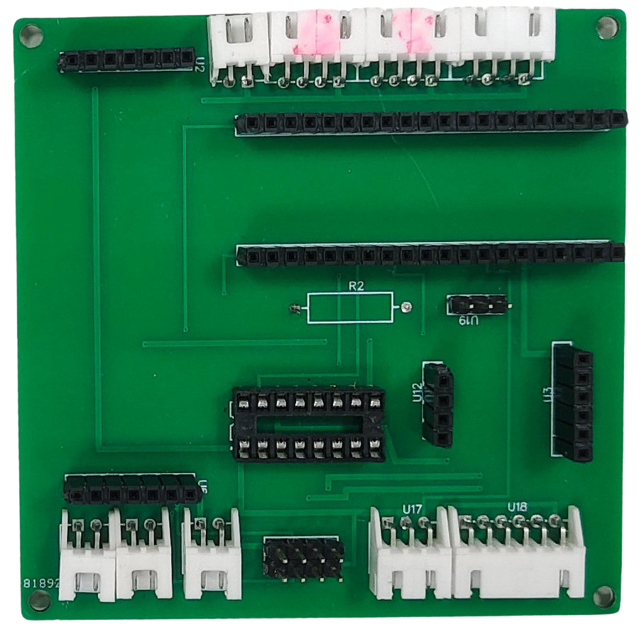
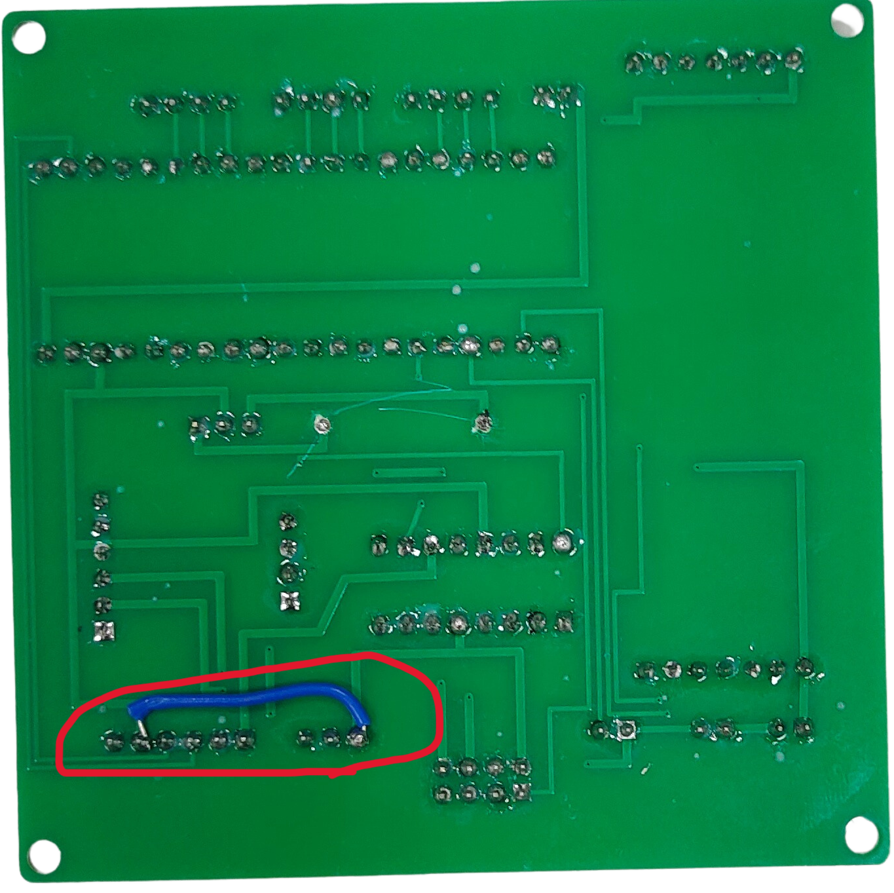
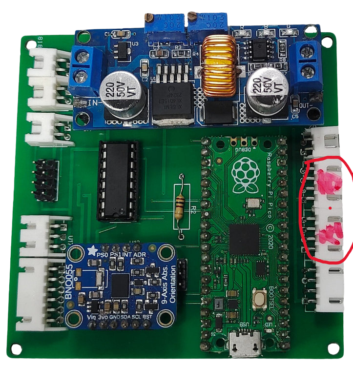
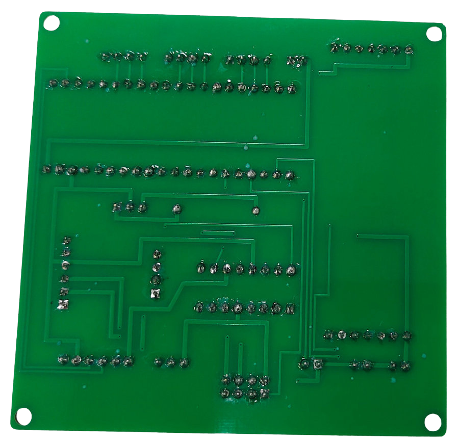
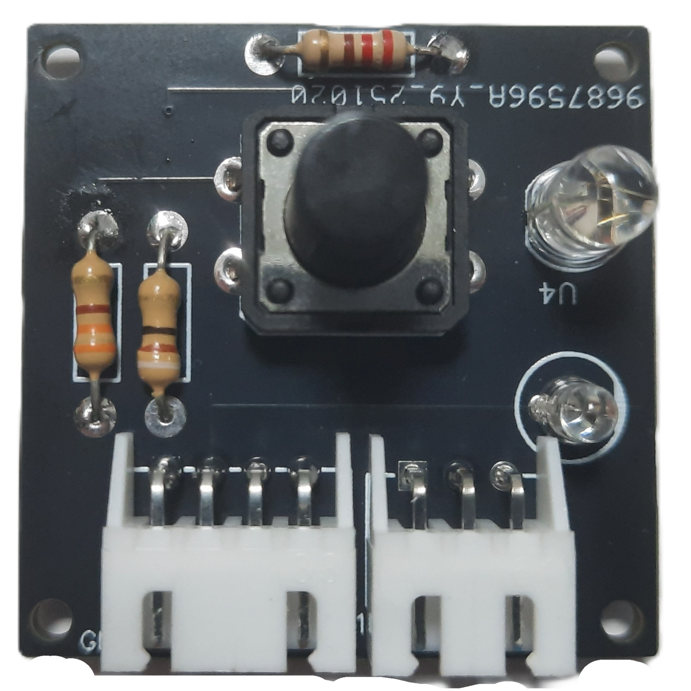
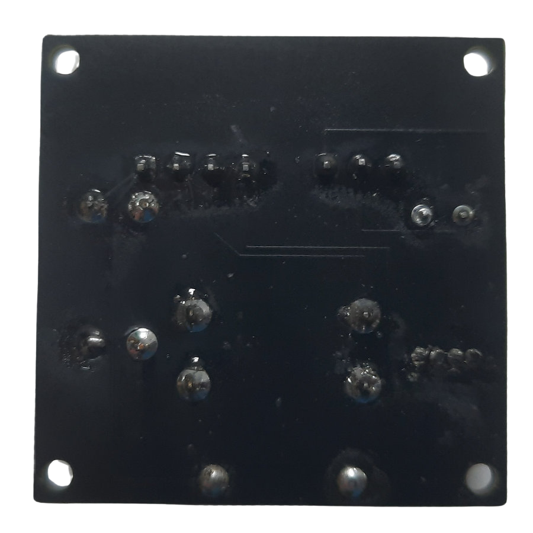
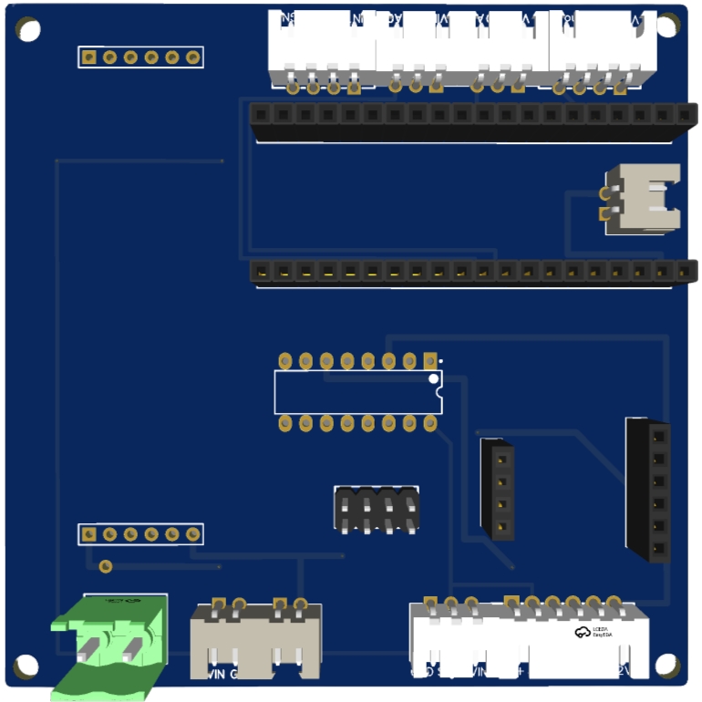
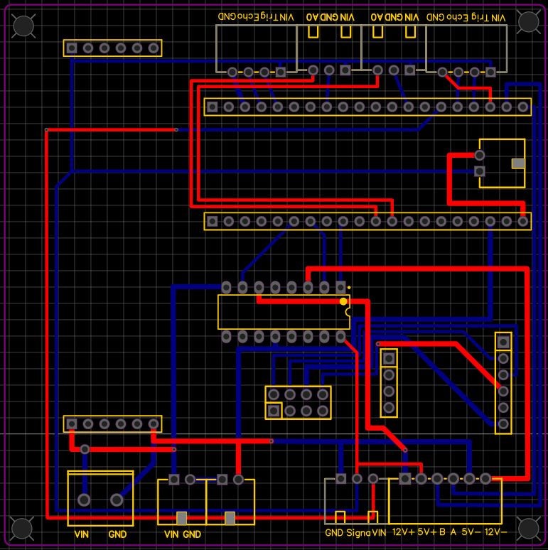

 ## 
 Circuit Design 

- In the design process of our **Self-Driving Car** circuit board, we utilized **EasyEDA**, a professional circuit design software featuring an **intuitive graphical interface**. Through this tool, we have **significantly enhanced** the **accuracy** of soldering and the **precision** of wiring, thereby **effectively reducing** the error rate during the manufacturing process, and minimizing the **risk of component burnout**.

- We adopted a **professional Printed Circuit Board (PCB) manufacturing method** (i.e., "PCB etching/fabrication"). This approach has not only **substantially mitigated** the **potential risks** of soldering errors and short circuits but has also **improved the aesthetic quality of the finished product**. Concurrently, this manufacturing technique offers **greater process flexibility** and **operational convenience**.

- The **core function** of this circuit board is to provide a stable and reliable **power supply** and **signal transmission interface** for the **integrated** various **sensors**, **motors**, and the **upper and lower layer controllers**. This ensures that all critical electronic components can achieve **smooth communication** and **efficient collaborative operation**, laying a solid foundation for the execution of the **Vehicle's control program**.

 - ### The Process of Identifying and Correcting Physical Circuit Board Design Issues 
   - ### Circuit Design Optimization and Iteration
   The circuit design for this project underwent several versions to achieve maximum performance and reliability:

<table>
   <tr>
      <th colspan=3 >Initial Phase and Fundamental Design Flaws V1.0 (Pegboard)</th>
   </tr>
   <tr>
      <td align=center  width="25%"></td>
      <td align=center  width="25%"></td>
   <td>

   __Description:__          

   - This design utilized a PCB pegboard (also known as a universal PCB) as the material for circuit construction. However, this choice resulted in an extremely time-consuming process for circuit design and soldering. Furthermore, the wiring layout appeared cluttered, lacking systematic planning and aesthetic quality. This not only severely hindered the efficiency of subsequent debugging and fault diagnosis, but also posed significant circuit reliability risks, including issues like cold solder joints, poor soldering, and short circuits.
               
   </td>
   </tr>
   <tr>
      <th colspan=3>Adopting Professional Fabrication and Discovering Parameter Errors V2.0 (PCB)</th>
   </tr>
   <tr>
      <td align=center width="25%" ></td>
       <td align=center  width="25%"></td>
      <td>

   __Description:__

   - In order to resolve the various issues present in the old circuit board design (V1.0), we utilized EasyEDA software to redraw the circuit and generate a new Printed Circuit Board (PCB) layout (V2.0). We then submitted this design for professional manufacturing at a factory. This comprehensive process allowed us to successfully acquire industry-standard knowledge of PCB design and fabrication.

   - The team was highly excited upon receiving the factory-produced V2.0 PCB. However, during the component installation phase, we discovered that the electronic components could not be properly assembled. After careful inspection and verification, we confirmed that this was a design error caused by incorrectly setting the component's pin header pitch during the PCB design stage.
            
   </td>
   </tr>
   <tr>
      <th colspan=3>Critical Polarity Error and Subsequent Rectification V3.0 (PCB)</th>
   </tr>
   <tr>
      <td align=center width="25%"></td>
      <td align=center width="25%"></td>
   <td>

   __Description:__
      
   - Given the incorrect component pin pitch issue found in the previous PCB version (V2.0), we immediately referenced the standard example diagrams built into the EasyEDA software to precisely recalibrate the correct pin pitch parameters. We then sent this revised design (V3.0) to the factory for production.

   - However, upon receiving the factory-produced V3.0 PCB and proceeding with the functional testing phase, we discovered that the polarity of the entire circuit was reversed. After detailed circuit tracing and inspection, we ultimately confirmed that this problem stemmed from an operational error during the circuit board design stage: we mistakenly drew the trace layer that should have been on the bottom layer of the PCB onto the top layer.

            
   </td>
   </tr>
   <tr>
       <th colspan=3>Critical Polarity Error and Subsequent Rectification V4.0 (PCB)</th>
   </tr>
    <tr>
      <td align=center  width="25%"></td>
      <td align=center width="25%"></td>
   <td>

   __Description:__

   - Addressing the issue of reversed circuit polarity in the previous PCB version (V3.0), we performed a complete redraw of the schematic. Only after multiple strict verifications to ensure the design was correct did we submit the file for production, resulting in the accurate Printed Circuit Board (V4.0).

   - Subsequently, due to upgrading the robot's main controller to a Jetson Orin Nano and deciding to switch to infrared sensors for detecting proximity to the parking area walls, it became necessary to add two 2-Pin female connectors to the circuit board. Simultaneously, we redesigned the terminal blocks to provide a stable, plug-and-play power connection point for the Jetson Orin Nano. Based on these functional changes and upgrades, we were compelled to redesign the circuit and submit the new board version (V5.0) to the factory for re-printing.

   </td>
   </tr>
   <tr>
      <th colspan=3>Functional Upgrades and Final Circuit Architecture V5.0 (PCB)</th>
   </tr>
   <tr>
      <td align=center width="25%" ></td>
      <td align=center width="25%"></td>
   <td>
      
   __Description:__

- Correction of BNO055 Gyroscope Sensor Anomaly
Upon obtaining the new Printed Circuit Board (V5.0), testing revealed an intermittent issue where the BNO055 gyroscope sensor would return an angle reading of zero. Troubleshooting confirmed that this anomaly stemmed from the sensor's VCC/GND being supplied by the Raspberry Pi Pico W, while its signal lines were connected to the Jetson Orin Nano main controller. This configuration, where the power and signal sources were on different circuits (i.e., lacking a common ground reference), caused the sensor to malfunction. We immediately revised the design, ensuring that both the power and signal sources for the BNO055 gyroscope sensor are now supplied exclusively by the Jetson Orin Nano main controller to establish a stable electrical potential reference.

- Independent Switch Control Circuit Board (Secondary PCB)
Furthermore, to comply with the competition rule requiring the Jetson Orin Nano to detect the start button press before operation can begin, we designed a second, independent circuit board:
   - Start Button Integration: The start button circuit was independently connected to the Jetson Orin Nano's General-Purpose Input/Output (GPIO) interface, ensuring the main controller detects the start command as per regulations.
   - Debugging and Status Display: To optimize the debugging process, we added RGB LEDs to this board.
   - Functional Purpose: The LEDs are used to display the color of the nearest object detected by the vehicle in real-time, facilitating quick diagnostics and status monitoring.
   - This board is dedicated to the self-driving car's start button control and status indication.

   </td>
   </tr>
     </table>  
  

     <table>
   <tr>
       <th colspan=4>Final Version(PCB)</th>
   </tr>
   <tr>
      <td align=center width="30%"></td>
      <td align=center width="30%"></td>   
      <td align=center width="20%"></td>
      <td align=center width="20%"></td>
   </tr>
      </table>

 - ### Circuit Schematic Drawing

   <table>
      <tr>
      <th colspan=3>Main PCB</th>
      </tr>
      <tr>
         <th>3D view</th>
         <th>circuit schematic</th>
         <th>PBC layout drawing</th>
      </tr>
      <tr>
         <td align=center width="30%"></td>
         <td align=center width="40%"></td>
         <td align=center width="30%" ></td>
      </tr>
      <tr>
      <th colspan=3>Secondary PCB(Switch Control Circuit Board )
      </tr>
      <tr>
         <th>3D view</th>
         <th>circuit schematic</th>
         <th>PBC layout drawing</th>
      </tr>
      <tr>
         <td align=center ></td>
         <td align=center ></td>
         <td align=center ></td>
      </tr>
   </table>

   <table>
   <th align=center>	Overall circuit schematic  </th>
   <tr>
   <td align=center >
   </td>
   </tr>
   </table>
 

 ***
 - ### Supplementary Information
 
 - #### Experience Sharing - BNO055 Gyroscope Sensor Circuit Design Error and Establishment of Common Ground Reference

   1. Initial Design Flaw: Lack of a Common Ground Reference
   In the initial design phase of the self-driving car's circuitry, the Adafruit BNO055 IMU sensor employed a distributed power model: its VCC/GND was supplied by the Raspberry Pi Pico W, while its data lines (signals) were connected to the Jetson Orin Nano main controller.

      This cross-device power and signal configuration, however, resulted in a serious design defect: the power loop failed to share a common ground (GND) with the signal loop. Consequently, the system lacked a unified electrical potential reference (Common Ground Reference). This electrical inconsistency was the root cause of the anomalous sensor data, specifically manifested as the Heading Angle output being stuck at 0° for extended periods, completely failing to reflect the vehicle's true attitude changes.

   2. The Solution: Correcting Power Path and Establishing a Common Ground
   To definitively resolve this circuit reliability issue, we revised the design scheme:

      - Unified Power and Signal Source: The Jetson Orin Nano was designated to directly provide the positive power to the BNO055 sensor.

      - Securing Common Ground: The sensor's ground line (GND) was connected directly to the Orin controller's GND pin.

      This critical adjustment ensured the closure of the power circuit and established a stable common ground reference between the two devices. Following this correction, the sensor data immediately returned to normal, and the heading angle accurately varied with the vehicle's rotation, fully meeting the high-precision requirements for autonomous vehicle localization and navigation control.

 - #### EasyEDA Introduction

   __EasyEDA__ is a free online Electronic Design Automation (EDA) software used for designing, simulating electronic circuits, and creating printed circuit boards (PCBs). It offers a simple and user-friendly graphical interface, with a variety of features that make it ideal for both hobbyists and professional engineers.
   - EasyEDA can be used directly in a web browser without the need for software installation, making it cross-platform accessible. It supports circuit design, simulation, PCB creation, and also allows teams to collaborate on electronic projects.

   - ### The main features of EasyEDA include:

   - Schematic Design: Design circuit diagrams using its extensive component library, which includes resistors, capacitors, transistors, integrated circuits (ICs), and more.Schematic Design: Design circuit diagrams using its extensive component library, which includes resistors, capacitors, transistors, integrated circuits (ICs), and more.
   - PCB Design: Supports multi-layer PCB design and provides an auto-routing feature to help users efficiently layout their boards.
   - Simulation: Built-in SPICE simulation allows users to virtually test circuits before manufacturing.
   - Component Library: Offers a vast component library and supports importing parts from other CAD tools or creating custom components.
   - Collaboration Tools: Allows users to share designs with teammates for collaborative work.
   - Cloud Storage: Design files can be saved in the cloud, making it easy to modify and access from anywhere, as well as facilitating collaboration with team members.
   - Manufacturing Integration: EasyEDA is seamlessly integrated with JLCPCB, allowing users to directly submit designs for production and easily order custom PCBs.

   ### Summarize

   __Overall, EasyEDA is a powerful and easy-to-use tool for electronic design. Whether you're a beginner or a professional engineer, it offers features to meet your needs. Its cloud-based accessibility, simple operation, and integration with manufacturers make it an excellent choice for designing and producing electronic circuits.__

   - Software link：[EasyEDA](https://easyeda.com/)
 

    <table>
    <tr>
    <th>EasyEDA of Official website.</th>
    <th>Schematic Design</th>
    </tr><tr>
    <td></td>
    <td></td>
    </tr>
    </table>
    

# 
[Return Home](../../)
  
