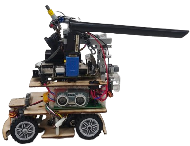
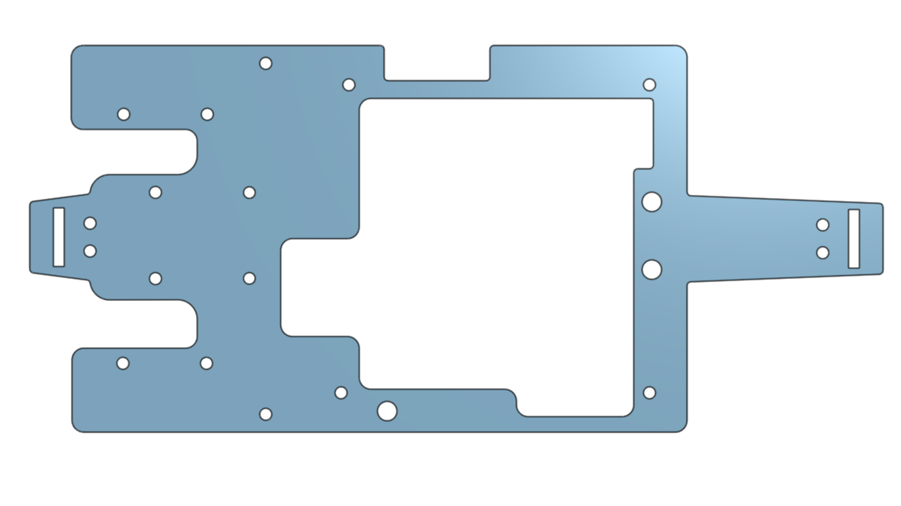
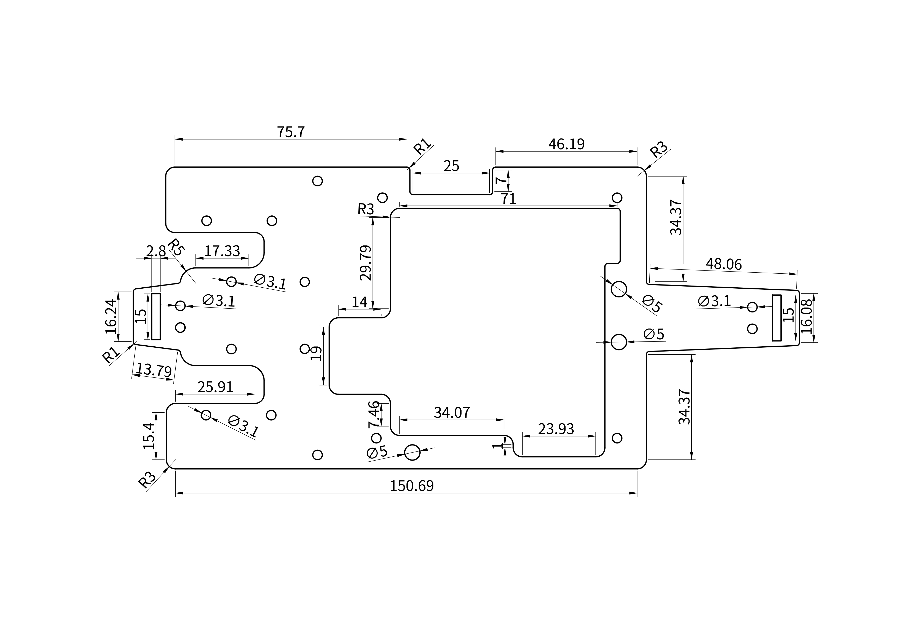
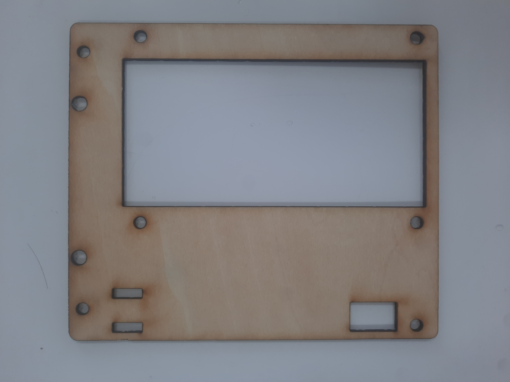
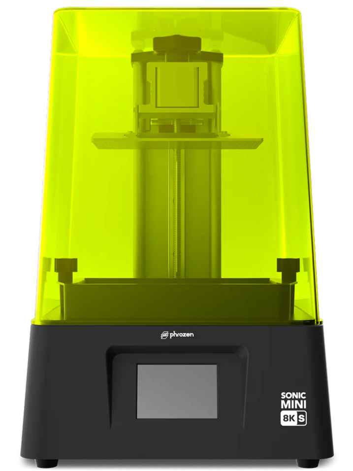
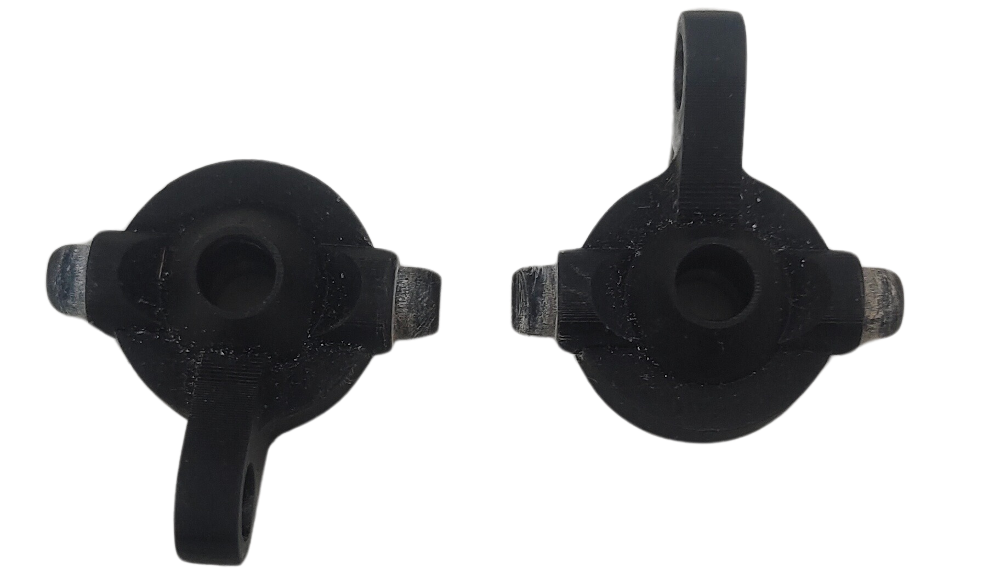
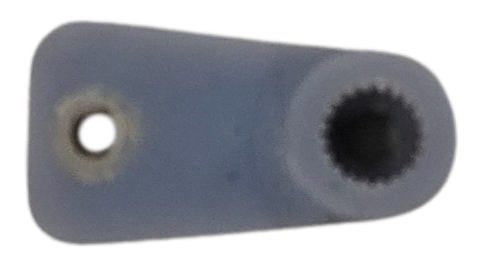
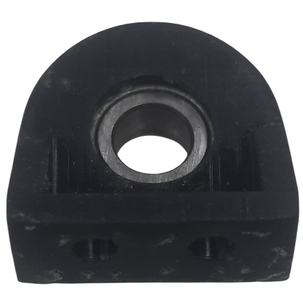

## 
3D Vehicle Model Design -3D車輛模型設計

- 根據去年的經驗，我們將自駕車的長度由原本的21公分縮短至17公分，不僅大幅提升了停車的靈活性，也讓車輛能更自如地穿梭於狹小空間中。為更有效應對當前的競賽任務，我們對自駕車的設計與結構進行了全面調整與優化，顯著提升了整體性能與運行穩定性。

- 本次比賽所使用的車輛底盤是我們自行研發的內部設計。接下來將介紹車輛底盤的設計與製作過程。

- 我們使用 Onshape 設計車輛的 3D 模型結構，並根據底盤的特性，利用激光切割機和立體光刻（SLA）3D 打印機等設備製造所需的車輛零部件。

- Based on last year's experience, we shortened the length of the self-driving car from 21 cm to 17 cm, which significantly improved parking flexibility and allowed the vehicle to move more freely in narrow spaces. To better respond to the current competition tasks, we comprehensively adjusted and optimized the design and structure of the car, greatly enhancing its overall performance and operational stability.

- The vehicle chassis used in this competition is our in-house, self-developed design. The following will introduce the vehicle chassis design and production process.

- We use Onshape to design the 3D model structure of the vehicle, and based on the chassis's characteristics, we manufacture the necessary vehicle parts using equipment such as laser cutting machines and Stereolithography (SLA) 3D Printer.

    <table>
    <tr>
    <th width=30%>
2024 Before shortening (縮短前) </th>
    <th width=30%>
2025 After shortening (縮短後) </th>
    <th width=30%>
2025 最終出賽機型</th>
    </tr><tr>
    <td></td> 
    <td></td> 
    <td></td>
    </tr>
    </table>
 
 

- ### Onshape Model Draft -Onshape 模型草圖
  - #### 3D modeling software  Onshape Introduction -3D 建模軟體  Onshape 介紹
    #### 中文
    - 我們使用 Onshape 來設計自駕車的 3D 模型。Onshape 是一款免費且易於使用的網頁版 CAD 軟體。
    - 在 Onshape 建立模型後，可以輸出 2D 尺寸圖，接著可將其送至雷射切割機進行切割，或轉換後送至 3D 印表機進行列印。
    - 本次比賽所製作的所有 3D／2D 車輛模型皆使用 OnShape 設計完成。
    #### 英文
    - We use Onshape to design 3D models of self-driving cars. Onshape is a free and easy-to-use web-based CAD software.
    - After creating a model in Onshape, you can output a 2D dimension drawing, which can then be sent to a laser-cutting machine for cutting or converted and sent to a 3D printer for output.
    - All 3D/2D vehicle models created for this competition were designed in OnShape.
    - Software Website：[Onshape](https://www.onshape.com/en/) 
    

    <table>
    <tr>
    <th>
Onshape Website (Onshape 網站) </th>
    <th>
3D CAD drawing of vehicle chassis components (車輛底盤零件的 3D CAD 圖面)</th>

    </tr><tr>
    <td wdith="50%"></td> 
    <td width="50%"></td> 
    </tr>
    </table>
    
 

  - #### Design and production of 3D/2D models for vehicle parts  -車輛零件的 3D/2D 模型設計與製作
    

    <table>
    <tr>
    <th>
3D Vehicle Model(3D 車輛模型) </th>
    <th>
Vehicle Underfloor(車輛底板)</th>
    <th>
Vehicle Mid-Deck(車輛中層板)</th>
    <th>
Vehicle Top Deck(車輛頂層板)</th>
    </tr><tr>
    <td align="center" width="25%"></td> 
    <td align="center" width="25%"></td> 
    <td align="center" width="25%"></td> 
    <td align="center" width="25%"></td> 
    </tr>
    </table>
    
 
     

    <table>
    <tr>
    <th>
3D Vehicle Chassis Design (車輛底盤 3D 設計)</th>
    <th>
3D Vehicle Chassis Models (車輛底盤 3D 模型)</th>
    </tr><tr>
    <td width="50%">
</td> 
    <td width="50%"></td> 
    </tr>
    </table>
    
 

  - #### The Production of Vehicle Chassis Panels Introduction - Using a laser-cutting machine -車輛底盤板件製作簡介 — 使用雷射切割機
  #### 中文:
    - 雷射切割機是一種利用雷射光束來切割材料的設備。雷射光束具有高能量密度，能夠快速且精確地切割各種材料，包括木材、金屬、塑膠、紙張等。
    - 我們使用學校提供的雷射切割機，製作車輛底盤所需的「車輛底板」、「車輛中層板」與「車輛頂層板」。我們依照自行設計的車輛平面尺寸圖，切割厚度為 3mm 的木板。
    - 我們選用較輕的木板作為車輛平面結構的材料，以降低車輛的整體重量。
    - 在設計車輛結構時，我們首先使用 3D 建模軟體 Onshape 來創建設計草圖並生成工程圖（DXF 文件）。這些圖紙隨後被匯入雷射切割機的編輯軟體（LaserWorkV）進行詳細調整。最後，根據設計草圖，我們描繪出切割線並將木板切割成形。
    #### 英文:
    - A laser-cutting machine is a device that utilizes a laser beam to cut materials. The laser beam has high energy density and can cut a variety of materials, including wood, metal, plastic, paper, and more, quickly and precisely.
    - We use the laser-Cutting machine provided by the school to produce the 'vehicle underfloor,' 'vehicle mid-deck,' and 'vehicle top deck' required for the vehicle chassis. We cut 3mm thick wooden boards according to the self-designed vehicle flat panel dimensions chart.  
    - We use lighter-weight wooden boards as the material for vehicle flat panels to reduce the vehicle's weight. 
    - When designing the vehicle structure, we first used 3D modeling software Onshape to create draft designs and generate engineering drawings (DXF files). These drawings were then imported into the laser cutter's editing software (LaserWorkV) for detailed adjustments. Finally, based on the design drafts, we outlined the lines and cut the wooden boards into shape.

 
  - #### Vehicle Chassis Panels Dimensions Chart -車輛底盤板件尺寸圖表
    

    <table>
    <tr>
    <th>
Vehicle Underfloor(車輛底板)</th> 
    <th>
Vehicle Mid-Deck(車輛中層板)</th>
    <th>
Vehicle Top Deck(車輛頂層板)</th>
    </tr><tr>
    <td></td> 
    <td></td> 
    <td></td>
    </tr>
    </table>
    
 

  - #### Vehicle Body Wooden Panels Produced Using a Laser Cutting Machine -使用雷射切割機製作的車身木質板件
     

     <table>
     <tr>
     <th>
Vehicle Underfloor (車輛底板)</th>
     <th>
Vehicle Mid-Deck(車輛中層板)</th>
     <th>
Vehicle Top Deck(車輛上層板)</th>
     </tr>
     <tr>
     <td width="30%"></td>
     <td width="30%"></td>
     <td width="30%"></td>
     </tr>
     </table>
     

  - ####  Operation of Laser-Cutting Machine-雷射切割機操作
    

 - ###  3D Vehicle Model - Onshape Model Sketch-3D 車輛模型 — Onshape 模型草圖
 - #### 中文:
     - 我們使用 Onshape 進行設計，並使用光固化（SLA）3D 印表機製作本次競賽所需的車輛底盤 3D 列印零件。  其設計與製作流程如下：
 - #### 英文:   
     - We used Onshape for the design and employed a Stereolithography (SLA) 3D Printer to manufacture the 3D-printed parts for the vehicle chassis needed for this competition. The design and production process is as follows:
    - #### The usage and introduction of Stereolithography (SLA) 3D printers -光固化（SLA）3D 印表機的使用與介紹
    - #### 中文:
      - 光固化（SLA）3D 列印技術使用液態感光樹脂作為材料，並透過雷射固化的方式逐層成型。SLA 印表機擅長製作高精度且幾何結構複雜的零件，特別適合用於對細節要求較高的原型製作與模型開發。
      - 為了解決去年所使用的 SLA 3D 印表機在列印範圍與品質上的限制，我們特別採用了 8K 解析度的 SLA 3D 印表機（Phrozen Sonic Mini 8K）與紫外線固化箱，以提升列印品質與精度。
      - #### 英文:
      - Stereolithography (SLA) 3D printing technology uses liquid photosensitive resin as the material and forms objects layer by layer through laser curing.  SLA printers excel in producing high-precision parts with complex geometries, making them especially suitable for prototyping and model making where fine details are required.
      - To address the limitations in printing range and quality of last year's SLA 3D printer, we specifically adopted an 8K resolution SLA 3D printer (Phrozen Sonic Mini 8K) and an ultraviolet curing box to enhance print quality and precision.
      - #### 中文:
      - SLA 3D 印表機的使用流程通常包含以下幾個步驟：

        - 設計與準備： 首先在 CAD 軟體中設計 3D 模型，並轉換成可列印的 STL 檔案。

        - 列印設定： 將 STL 檔匯入 SLA 印表機的切片軟體中，並設定如層厚、樹脂種類等列印參數。

        - 列印過程： SLA 印表機利用雷射逐層固化樹脂來成型模型。由於每一層都由雷射精準固化，因此成品具有高精度與光滑的表面。

        - 後處理： 列印完成後，從樹脂槽中取出成品，清洗以去除多餘樹脂，並放入紫外線固化箱中進行二次固化，以提升硬度與穩定性。

        - SLA 3D 印表機廣泛應用於製造、醫療、珠寶及工業設計等領域。由於其高精度與優異的表面處理能力，特別適合製作對品質與細節要求極高的零件。
      - #### 英文:
       - __The usage process of SLA 3D printers typically includes the following steps:__ 
         - __Design and Preparation:__ First, design the 3D model in CAD software and convert it into a printable STL file.
         - __Print Setup:__ Load the STL file into the slicing software of the SLA printer, and set printing parameters such as layer thickness and resin type.
         - __Printing Process:__ The SLA printer uses a laser to cure the resin layer by layer, forming the model. Since each layer is precisely cured by the laser, the printed product has high precision and a smooth surface.
         - __Post-Processing:__ After printing, the finished product is removed from the resin vat, cleaned to remove excess resin, and subjected to secondary curing in a UV curing box to increase hardness and stability.
      
          SLA 3D printers are widely used in industries such as manufacturing, healthcare, jewelry, and industrial desgn. Due to their high precision and fine surface treatment, they are particularly suitable for producing parts that require high quality and detailed features.

      - #### Comparison between Stacked 3D Printer and  Stereolithography (SLA) 3D Printer-堆疊式3D列印機與立體光固化（SLA）3D列印機的比較
      
         透過對3D車用零件進行實際列印與操作比較，我們得出以下結論：

         By conducting practical printing and operation comparisons of the 3D vehicle parts, we have reached the following conclusions:
        

        <table>
        <tr align="center">
        <th rowspan="2">Photo (照片)</th>
        <th> Stacked 3D Printe (堆疊式3D列印機)</th>
        <th> Stereolithography (SLA) 3D Printer(Phrozen Sonic Mini 8K) (立體光固化（SLA）3D列印機（Phrozen Sonic Mini 8K）)</th>
        </tr><tr align="center">
        <td></td>
        <td></td>
        </tr><tr align="">
        <td>The required printing time (所需列印時間)</td>
        <td>Faster(較快)</td>
        <td>Slower(較慢)</td>
        </tr><tr>
        <td>Exterior(外觀)</td>
        <td>Exterior with signs of layering(外觀有分層痕跡)</td>
        <td>Smooth(光滑的)</td>
        </tr><tr>
        <td>Hardness(硬度)</td>
        <td>Dependent on the density(取決於密度)</td>
        <td>Dependent on the exposure time(取決於曝光時間)</td>
        </tr>
        </tr><tr>
        <td>Size dimensions（尺寸規格) </td>
        <td>Supports larger dimensions but does not support overly small dimensions(支持較大的尺寸，但不支持過於小的尺寸)</td>
        <td>Supports smaller dimensions(支持較小的尺寸)</td>
        </tr>
        </table>
        

     - #### Description of the resin used in Stereolithography (SLA) 3D Printer-立體光固化（SLA）3D列印機所使用樹脂的描述
       立體光固化（SLA）3D列印機所使用的樹脂種類多樣，不同樹脂在性能上有明顯差異。常見的SLA樹脂類型包括：

       The types of resin used in Stereolithography (SLA) 3D printers vary, and different resins offer distinct performance comparisons. Common types of SLA resins include:
       - #### 中文:
       - 標準樹脂：適用於一般用途，表面光滑度佳，但強度和耐久性相對較低。
       - 高強度樹脂：具有較高的抗拉強度和剛性，適合需要承受力量的零件。
       - 彈性樹脂：具備彈性和柔韌性，適用於需要一定變形能力的零件。
       - 高溫樹脂：耐熱性優異，適合需在高溫環境下運作的零件。
       -  耐衝擊樹脂：具有良好的抗衝擊性和韌性，適用於容易碰撞的零件。
       - 每種樹脂在物理特性、表面品質、強度和耐久性方面各有優勢，樹脂的選擇需根據具體應用需求決定。
       - 在比賽過程中，車輛經常碰撞側牆和障礙物，導致如「方向軸支架」和「十字銷」等零件斷裂。因此，我們進行了耐衝擊樹脂和高強度樹脂的實驗測試。測試結果顯示，使用耐衝擊樹脂製作的零件過於柔軟，無法滿足需求。最終，我們選擇使用高強度樹脂製造這些零件，以提升其耐久性和強度。
      - #### 英文:
        - __Standard resin:__ Suitable for general use, offering good surface finish, but relatively lower strength and durability.
        - __High-strength resin:__ Provides higher tensile strength and rigidity, ideal for parts that need to withstand force.
        - __Flexible resin:__ Has elasticity and flexibility, suitable for parts that require some degree of deformation.
        - __High-temperature resin:__ Excellent heat resistance, suitable for parts that need to operate at high temperatures.
        - __Impact-resistant resin:__ Offers good impact resistance and toughness, ideal for parts that are prone to collisions.

          Each type of resin has different advantages in terms of physical properties, surface quality, strength, and durability, and the choice of resin depends on the specific application requirements.

        During the competition, the vehicle often collided with side walls and obstacles, causing parts like the "Steering shaft holder" and "Cross pin" to break. As a result, we conducted experimental tests with impact-resistant resin and high-strength resin. The tests showed that parts made from impact-resistant resin were too soft to meet the requirements. In the end, we chose to use high-strength resin to manufacture these parts, improving their durability and strength.

    

    <table>
    <tr>
    <th>High-strength resin(高強度樹脂)</th>
    <th>Impact-resistant resin(耐衝擊樹脂)</th>
    <th>Printing completed(列印完成)<th>
    </tr>
    <tr>
    <td></td> 
    <td></td> 
    <td><td>
    </tr>
    </table>
    
 

    - ####  3D Vehicle Model Dimension Diagram-3D車輛模型尺寸圖
      

      <table>
      <tr>
      <th width="30%">Front Assembly(前部組件)</th>
      <th width="30%">Steering Knuckle(轉向節)</th>
      <th width="30%">Bearing Holder(軸承座)</th>

    </tr><tr>
      <td></td> 
      <td></td> 
      <td></td>
  
      </tr>
      </table>
      
 
       

      <table>
      <tr>
      <th width="25%">Steering shaft holder(轉向軸支架)</th>
      <th width="25%">Motor Holder(馬達支架)</th>
       <th width="25%">Steering rod(轉向橫桿)</th>
       <th width="25%">Motor steering rod(馬達轉向拉桿)</th>
  

    </tr><tr>
      <td></td>
      <td></td>
      <td></td>
       <td></td>
      </tr>
      </table>
      
 

  - ####  Vehicle body support components produced with Stereolithography (SLA) 3D Printer-使用立體光固化（SLA）3D列印機製作的車體支撐零件
      

      <table>
      <tr>
      <th>Front Assembly(前部組件)</th>
      <th>Steering Knuckle(轉向節)</th>
      <th>Steering shaft holder(轉向軸支架)</th>
      </tr><tr>
      <td></td> 
      <td></td> 
      <td></td> 
      </tr>
      </table>
      
 

      

      <table>
      <tr>
      <th width="25%">Steering rod(轉向橫桿)</th>
      <th width="25%">Bearing Holder(軸承座)</th>
      <th width="25%">Motor Holder(馬達支架)</th>
      <th width="25%">Motor steering rod(馬達向拉桿)</th>
      </tr><tr>
      <td></td> 
      <td></td> 
      <td></td>
      <td></td>
      </tr>
      </table>
      
 

 ***
- ### Supplementary Information-補充資訊
- #### 中文:
    - __維護流程：__
      如果不定期進行維護，SLA 3D列印機可能會因樹脂堵塞而無法使用，因此需要定期清潔。我們記錄了從學長姐那裡學到的清潔方法，並開始自行進行清潔。

    1. 列印完成後，物件會附著在列印平台上，因此我們先將平台拆下進行清潔。
    2. 將平台放置在支架上，然後放入UV固化清洗機中。
    3. 設定時間，等待清洗機完成清潔。機器會旋轉清洗槽內的酒精，對平台和列印物件進行第一次清洗。
    4. 用清水將物件上的酒精沖洗乾淨。
    5. 使用刮刀將物件從平台上取下。
    6. 去除物件邊緣的支撐結構。
    7. 使用酒精進行第二次清潔，徹底清除物件上的殘餘樹脂。
    8. 用酒精清潔平台上殘留的樹脂。
    9. 清洗完後再將平台進行打磨。
    10. 最後將平台擦乾，並重新安裝回SLA 3D列印機上。
    - #### 英文:
    - __Maintenance Process:__

       Without regular maintenance, a stereolithography 3D printer may become clogged with resin and become unusable, requiring periodic cleaning. So we recorded the cleaning methods we learned from our seniors and started cleaning orselves.
     
    1. After printing is completed, the object will adhere to the printing platform, so we remove the platform for cleaning.
    2. Place the platform on a rack and put it into the UV curing washing machine.    
    3. Set the time and wait for the washing machine to complete the cleaning. The machine will rotate the alcohol in the washing tank to perform the first cleaning of the platform and the object.
    4. Rinse the alcohol off the finished product with water.
    5. Use a scraper to remove the object from the platform.
    6. Remove the support structures from the edges of the object.
    7. Perform a second cleaning with alcohol to thoroughly clean the resin off the object.
    8. Clean any remaining resin off the platform with alcohol.
    9. Finally, dry the platform and reinstall it back onto the stereolithography 3D printer of machine.

    

    <table>
    <tr>
    <td>Step 1</td>
    <td>Step 2</td> 
    <td>Step 3</td></tr>
    <tr align="center">
    <td></td>
    <td></td> 
    <td></td>
    </tr>
    <td>Step 4</td>
    <td>Step 5</td> 
    <td>Step 6</td></tr>
    <tr align="center">
    <td></td>
    <td></td>
    <td></td>
    </tr align="center">
    <td>Step 7</td>
    <td>Step 8</td>
    <td>Step 9</td></tr>
    <tr>
    <td></td>
    <td></td>
    <td></td>
    </tr align="center">
    <td>Step 10</td></tr>
    <tr>
    <td></td>
    </tr>
    </table>
    

   - 由於立體光固化（SLA）3D列印機製作的零件相對較軟，因此我們需要將其放入紫外線固化箱中，透過紫外線進行二次固化。這個過程能夠使零件變硬並減少變形，從而避免對車輛運動產生負面影響。
   
   - Since the parts printed by the stereolithography (SLA) 3D printer are relatively soft, we need to place them in an ultraviolet curing box, where they are exposed to UV light for secondary curing. This process hardens the parts and reduces deformation, thereby preventing any negative impact on the vehicle's movement.

   

    <table>
    <tr>
    <th>Ultraviolet curing box(紫外線固化箱)</th>
    </tr><tr>
    <td></td>
    </tr>
    </table>
    

   

# 
[Return Home](../../)
  
  
