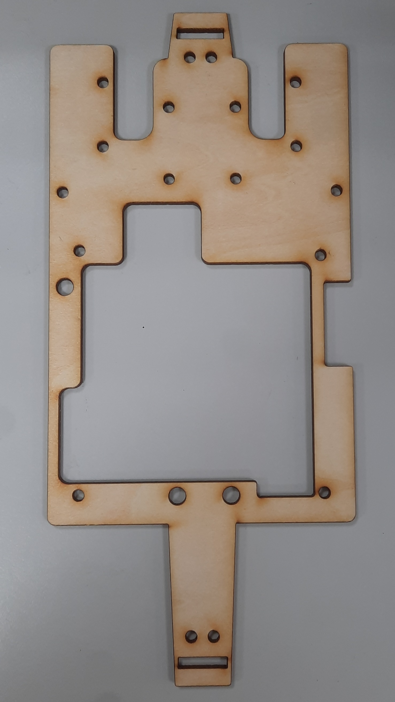
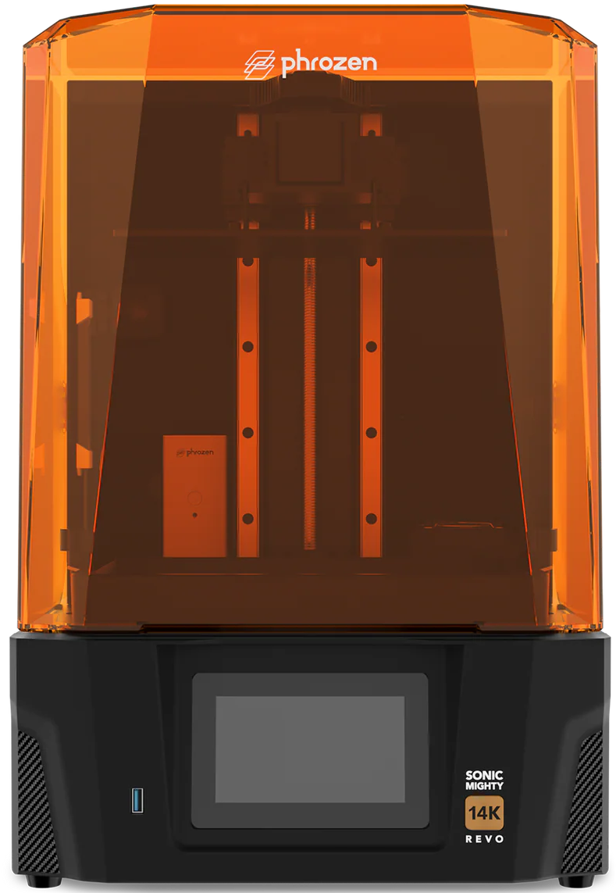
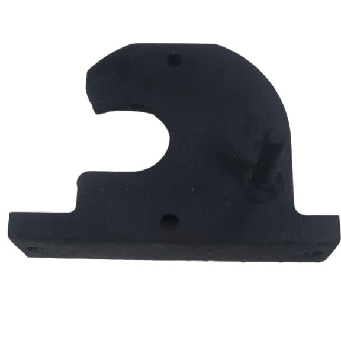

## 
3D Vehicle Model Design -3D車輛模型設計

- 我們的隊員胡賢邑，憑藉多年參與 WRO未來工程師挑戰賽（WRO Future Engineers Category）的經驗，在機械結構設計與 車輛控制程式（Vehicle’s control program）優化方面，累積了扎實的實戰基礎，鑒於每年競賽主題與規則的調整 ，特別是今年新增了在障礙賽回合中（Obstacle Challenge rounds）執行 平行停車（parallel parking）及從 起始區（含停車場）（starting section (including the parking lot)）出發的任務 。我們評估發現，若沿用去年車身寬9.8公分、長18.5公分的設計，將不利於執行停車動作，因為規則規定停車區的長度為車輛長度的1.5倍 。因此，我們決定將 自駕車（Vehicle）的長度從18.5公分調整延長至23.4公分，並將車身形狀改為橢圓設計。此優化不僅顯著提升了停車的靈活性，也使車輛在通過狹窄通道（a narrow corridor）時更加順暢，總體而言，為更有效地完成當前競賽任務，我們對自駕車的整體設計與機械結構進行了全面性調整與優化，顯著提升了車輛的整體性能與運行穩定性。

- 在本次競賽中，我們沿用了先前製造車輛所累積的設備與技術基礎。其中，**自駕車**（Self-Driving-Cars）的核心組件——**底盤**（Chassis），是完全由我們團隊自行研發設計而成，以確保技術的獨立性與高度客製化能力。

- 在設計方面，我們使用 **Onshape** 進行車輛的 **3D 模型結構** 設計。接著，我們根據底盤的特性與組件需求，利用 **激光切割機**（Laser Cutting Machine）和 **立體光刻（SLA）3D 打印機**（SLA 3D Printer）等精密製造設備，製作出所需的車輛零部件。

- 接下來，我們將詳細介紹本次競賽中自駕車（Self-Driving-Cars）底盤（Chassis）的設計理念與精密的製作過程。

- Our teammate, Hu Xianyi, possesses a solid foundation of practical experience in mechanical design and **Vehicle’s control program** optimization, leveraged from years of participation in the **WRO Future Engineers Category**.
- Considering the annual changes to the competition themes and rules, particularly the addition this year of executing **parallel parking**  during **Obstacle Challenge rounds**  and starting from the **starting section (including the parking lot)**. We determined that reusing last year's vehicle design (9.8 cm wide, 18.5 cm long) would be disadvantageous for the parking maneuver, as the rules stipulate that the parking lot length is $1.5 \times$ the length of the robot. Consequently, we decided to modify and extend the length of our **Self-Driving Car**from the original 18.5 cm to 23.4 cm, and adopt an ellipsoidal body shape. This optimization not only significantly enhances parking flexibility but also allows the vehicle to navigate a **narrow corridor**  more smoothly.
- Overall, to more effectively complete the current competition tasks, we conducted a comprehensive adjustment and optimization of the vehicle's design and mechanical structure, leading to a notable improvement in the vehicle's overall performance and operational stability.
- For this competition, we continued to utilize the foundational equipment and technical expertise accumulated from our previous vehicle builds. Critically, the core component of our **Self-Driving Car**—the **chassis**—was entirely developed and designed in-house by our team, ensuring technical independence and high customizability.

- Regarding the design process, we used **Onshape** to create the vehicle's **3D model structure**. Subsequently, based on the characteristics of the chassis and component requirements, we utilized precision manufacturing equipment such as a **Laser Cutting Machine** and a **Stereolithography (SLA) 3D Printer** to fabricate the necessary vehicle components.

- **Next, we will provide a detailed introduction to the design philosophy and precise fabrication process of the chassis for our Self-Driving Car in this competition.**

    <table>
    <tr>
    <th width=30%>
2024 Season Competition Self-Driving Car Prototype 2024世界賽機型 </th>
    <th width=30%>
2025 WRO Taiwan Final Self-Driving Car Prototype</th>
    <th width=30%>
2025 WRO World Final Competition Prototype 2025 世界賽最終出賽機型</th>
    </tr><tr>
    <td></td> 
    <td></td> 
    <td></td>
    </tr>
    </table>
 
 

- ### Onshape 3D Model Structure Sketch -Onshape 模型草圖
  - #### 3D Modeling Software Onshape Introduction -3D 建模軟體  Onshape 介紹
    * 我們選擇使用 **Onshape** [cite: 981, 982] 來設計 **自駕車** [cite: 1] 的 **3D 模型結構** ，這是一款免費且易於操作的網頁版 CAD 軟體。
    * 在 **Onshape** 完成模型建立後，我們能夠輸出所需的 **2D 尺寸圖** 。這些圖檔可直接用於 **激光切割機** [cite: 593]（Laser Cutting Machine）進行切割，或轉換為適當格式後送至 **3D 打印機** （3D Printer）進行零件製造。
    * 本次競賽中所需的所有 **3D/2D 車輛模型** ，均透過 **Onshape** 平台設計完成。

    * We chose **Onshape** [cite: 981, 982] to design the **3D model structure**  of our **Self-Driving Car**[cite: 1]. It is a free and user-friendly web-based CAD software.
    * After completing the model creation in **Onshape**, we can output the necessary **2D dimension drawings**. These files can then be sent directly to a **Laser Cutting Machine** [cite: 593] for cutting, or converted and sent to a **3D Printer** for part fabrication.
    * All **3D/2D vehicle models**  required for this competition were designed entirely using the **Onshape** platform.

    - Software Website：[Onshape](https://www.onshape.com/en/) 
    

    <table>
    <tr>
    <th>
Onshape Website (Onshape 網站) </th>
    <th>
3D CAD drawing of vehicle chassis components (車輛底盤零件的 3D CAD 圖面)</th>

    </tr><tr>
    <td wdith="50%"></td> 
    <td width="50%"></td> 
    </tr>
    </table>
    
 

  - #### Design and production of 3D/2D models for vehicle parts  -車輛零件的 3D/2D 模型設計與製作
    

    <table>
    <tr>
    <th>
3D Vehicle Model(3D 車輛模型) </th>
    <th>
Vehicle Underfloor(車輛底板)</th>
    <th>
Vehicle Mid-Deck(車輛中層板)</th>
    <th>
Vehicle Top Deck(車輛頂層板)</th>
    </tr><tr>
    <td align="center" width="25%"></td> 
    <td align="center" width="25%"></td> 
    <td align="center" width="25%"></td> 
    <td align="center" width="25%"></td> 
    </tr>
    </table>
    
 
     

    <table>
    <tr>
    <th>
3D Vehicle Chassis Design (車輛底盤 3D 設計)</th>
    <th>
3D Vehicle Chassis Models (車輛底盤 3D 模型)</th>
    </tr><tr>
    <td width="50%">
</td> 
    <td width="50%"></td> 
    </tr>
    </table>
    
 

  - #### The Production of Vehicle Chassis Panels Introduction - Using a laser-cutting machine -車輛底盤板件製作簡介 — 使用雷射切割機
  #### 中文:
    - 為了應對新的競賽規則（例如新增的平行停車任務 ），我們不僅將 自駕車（Vehicle）的車身進行了加長 ，同時也優化了轉向結構（Steering Motor ）。因此，車輛底盤 的結構和尺寸也必須進行相應的全面調整，以更好地適應和支撐新系統的需求。
    - **雷射切割機的應用與製造流程**
      - 雷射切割機（Laser Cutting Machine）是一種利用高能量密度的雷射光束來精確切割材料的設備，能夠快速處理木材、金屬、塑膠、紙張等多種材料。
      - 我們利用學校提供的雷射切割機，製作了 自駕車（Self-Driving-Cars）底盤 的主要平面結構件，包括：車輛底板、車輛中層板、與車輛頂層板。

      - **材料選用與設計整合：**
        - 我們選用厚度為 3mm 的輕質木板 作為車輛平面結構的材料，這有助於有效降低車輛的整體重量。
        - 在設計流程上，我們首先使用 Onshape 這款 3D 建模軟體來創建設計草圖，並生成工程圖文件（DXF 格式）。
        - 隨後，這些圖紙會被匯入雷射切割機的編輯軟體（LaserWorkV）中進行細部調整。
        - 最後，根據精確的設計草圖描繪出切割線，將輕質木板精確切割成所需的車輛底盤組件。
  #### 英文: 
    - To accommodate the new competition rules (such as the added parallel parking task ), we not only extended the length of the **Vehicle body** but also optimized the **Steering structure** . Consequently, the structure and dimensions of the vehicle chassis were comprehensively adjusted to better meet the requirements of the new system.
    
    - **Application and Manufacturing Process of the Laser Cutting Machine**
      - A Laser Cutting Machine is an equipment that utilizes a high-energy-density laser beam to precisely cut materials. It is capable of rapidly processing various materials, including wood, metal, plastic, and paper.

      - We utilized the laser cutting machine provided by our school to manufacture the main planar structural components of the Self-Driving Car's chassis, including the Vehicle Bottom Plate, the Vehicle Middle Plate, and the Vehicle Top Plate.
      - **Material Selection and Design Integration:** 
        - We selected 3mm thick lightweight wood panels as the material for the vehicle's planar structures, which helps to effectively reduce the overall weight of the vehicle.

        - In the design process, we first used the 3D modeling software Onshape to create the design sketch and generate engineering drawing files (DXF format).

        - Subsequently, these drawings were imported into the laser cutting machine's editing software (LaserWorkV) for detailed adjustments.

        - Finally, the cutting lines were traced according to the precise design sketch, and the lightweight wood panels were accurately cut into the required vehicle chassis components.

   - #### Vehicle Chassis Panels Dimensions Chart -車輛底盤板件尺寸圖表
    

    <table>
    <tr>
    <th>
Vehicle Underfloor(車輛底板)</th> 
    <th>
Vehicle Mid-Deck(車輛中層板)</th>
    <th>
Vehicle Top Deck(車輛頂層板)</th>
    </tr><tr>
    <td width="30%"></td> 
    <td width="30%"></td> 
    <td width="30%"></td>
    </tr>
    </table>
    
 

  - #### Vehicle Body Wooden Panels Produced Using a Laser Cutting Machine -使用雷射切割機製作的車身木質板件
     

     <table>
     <tr>
     <th>
Vehicle Underfloor (車輛底板)</th>
     <th>
Vehicle Mid-Deck(車輛中層板)</th>
     <th>
Vehicle Top Deck(車輛上層板)</th>
     </tr>
     <tr>
     <td width="30%"></td>
     <td width="30%"></td>
     <td width="30%"></td>
     </tr>
     </table>
     

  - ####  Operation of Laser-Cutting Machine-雷射切割機操作
    

 - ###  3D Vehicle Model - Onshape Model Sketch-3D 車輛模型 — Onshape 模型草圖
 - #### Design and Fabrication Process for Stereolithography (SLA) 3D Printed Parts 光固化（SLA）3D 打印零件的設計與製作流程
  
     - 我們主要使用 Onshape 進行 3D 模型結構 設計 。接著，我們利用 光固化（SLA）3D 打印機（Stereolithography (SLA) 3D Printer）來製作本次競賽所需的車輛底盤 3D 列印零件，其設計與製作流程如下：

     - We primarily used Onshape for designing the 3D model structure. Subsequently, we utilized a Stereolithography (SLA) 3D Printer to fabricate the 3D printed parts for the vehicle chassis required for this competition.The design and fabrication process is as follows:
     
    - #### The usage and introduction of Stereolithography (SLA) 3D printers -光固化（SLA）3D 印表機的使用與介紹
      * **光固化（SLA）技術特性與設備升級** 
        - 技術特性： 光固化（SLA）3D 列印技術 使用液態感光樹脂作為材料，並透過雷射（或高解析度光）固化的方式逐層成型。SLA 打印機擅長製作高精度且幾何結構複雜的零件，特別適合用於對細節要求較高的原型製作與模型開發。

        - 設備升級： 為了克服去年所使用的 SLA 3D 打印機在列印範圍與品質上的限制，我們特別採用了配備 10.1 吋 14K 解析度 的大尺寸 SLA 3D 打印機（Phrozen Sonic Mighty Revo 14K），並搭配紫外線固化箱。

        - 效益： 此次設備升級顯著提升了零件的列印品質與精度，確保我們能製造出符合 自駕車 嚴格結構要求的客製化組件。
      * **Stereolithography (SLA) Technology and Equipment Upgrade**
        - Technology Features: Stereolithography (SLA) 3D printing technology uses liquid photosensitive resin as the material and cures it layer by layer using a laser (or high-resolution light). SLA printers excel at producing parts with high precision and complex geometric structures, making them particularly suitable for prototyping and model development that require high detail.

        - Equipment Upgrade: To address the limitations in printing area and quality of the SLA 3D printer used last year, we specifically adopted a large-format SLA 3D printer featuring a 10.1-inch 14K resolution (Phrozen Sonic Mighty Revo 14K), complemented by a UV curing station.

        - Benefit: This equipment upgrade significantly enhanced the printing quality and precision of the components, ensuring we can manufacture customized parts that meet the stringent structural requirements of the Self-Driving Car.

      - #### 中文:
      - SLA 3D 印表機的使用流程通常包含以下幾個步驟：

        - 設計與準備： 首先在 CAD 軟體中設計 3D 模型，並轉換成可列印的 STL 檔案。

        - 列印設定： 將 STL 檔匯入 SLA 印表機的切片軟體中，並設定如層厚、樹脂種類等列印參數。

        - 列印過程： SLA 印表機利用雷射逐層固化樹脂來成型模型。由於每一層都由雷射精準固化，因此成品具有高精度與光滑的表面。

        - 後處理： 列印完成後，從樹脂槽中取出成品，清洗以去除多餘樹脂，並放入紫外線固化箱中進行二次固化，以提升硬度與穩定性。

        - SLA 3D 印表機廣泛應用於製造、醫療、珠寶及工業設計等領域。由於其高精度與優異的表面處理能力，特別適合製作對品質與細節要求極高的零件。
      - #### 英文:
       - __The usage process of SLA 3D printers typically includes the following steps:__ 
         - __Design and Preparation:__ First, design the 3D model in CAD software and convert it into a printable STL file.
         - __Print Setup:__ Load the STL file into the slicing software of the SLA printer, and set printing parameters such as layer thickness and resin type.
         - __Printing Process:__ The SLA printer uses a laser to cure the resin layer by layer, forming the model. Since each layer is precisely cured by the laser, the printed product has high precision and a smooth surface.
         - __Post-Processing:__ After printing, the finished product is removed from the resin vat, cleaned to remove excess resin, and subjected to secondary curing in a UV curing box to increase hardness and stability.
      
          SLA 3D printers are widely used in industries such as manufacturing, healthcare, jewelry, and industrial desgn. Due to their high precision and fine surface treatment, they are particularly suitable for producing parts that require high quality and detailed features.

      - #### Comparison between Fused Deposition Modeling (FDM) 3D Printer and  Stereolithography (SLA) 3D Printer

         By conducting practical printing and operation comparisons of the 3D vehicle parts, we have reached the following conclusions:
        

        <table>
        <tr align="center">
        <th rowspan="2">Photo</th>
        <th> FDM 3D Printer</th>
        <th> SLA 3D Printer(Sonic Mighty Revo 14K)</th>
        </tr><tr align="center">
        <td></td>
        <td></td>
        </tr><tr align="">
        <td>The required printing time</td>
        <td>Faster</td>
        <td>Slower</td>
        </tr><tr>
        <td>Exterior</td>
        <td>Exterior with signs of layering</td>
        <td>Smooth</td>
        </tr><tr>
        <td>Hardness</td>
        <td>Dependent on the density</td>
        <td>Dependent on the exposure time</td>
        </tr>
        </tr><tr>
        <td>Size dimensions.</td>
        <td>Supports larger dimensions but does not support overly small dimensions.</td>
        <td>Supports smaller dimensions.</td>
        </tr>
        </table>
        

      * **Conclusion: Why SLA is Selected for the Competition Vehicle**
        - 在自動駕駛汽車競賽中，零件的幾何精度和結構細節至關重要。您的團隊選擇SLA 3D列印機（例如Phrozen Sonic Mighty Revo 14K）是因為它能夠有效率地生產高精度、幾何形狀複雜的零件，確保客製化零件滿足車輛嚴格的結構要求，尤其適用於轉向系統等高精度組件。
        
        - In the Self-Driving Car competition, the geometric precision and structural detail of the parts are crucial. Your team's selection of an SLA 3D Printer (e.g., Phrozen Sonic Mighty Revo 14K) is due to its superior ability to produce high-precision, geometrically complex components, ensuring the custom-made parts meet the stringent structural demands of the vehicle, particularly for high-accuracy assemblies like the steering system.
        
        
     - #### Description of the resin used in Stereolithography (SLA) 3D Printer-立體光固化（SLA）3D列印機所使用樹脂的描述
       立體光固化（SLA）3D列印機所使用的樹脂種類多樣，不同樹脂在性能上有明顯差異。常見的SLA樹脂類型包括：

       The types of resin used in Stereolithography (SLA) 3D printers vary, and different resins offer distinct performance comparisons. Common types of SLA resins include:
       - #### 中文:
       - 標準樹脂：適用於一般用途，表面光滑度佳，但強度和耐久性相對較低。
       - 高強度樹脂：具有較高的抗拉強度和剛性，適合需要承受力量的零件。
       - 彈性樹脂：具備彈性和柔韌性，適用於需要一定變形能力的零件。
       - 高溫樹脂：耐熱性優異，適合需在高溫環境下運作的零件。
       - 耐衝擊樹脂：具有良好的抗衝擊性和韌性，適用於容易碰撞的零件。
       
       - 每種樹脂在物理特性、表面品質、強度和耐久性方面各有優勢，樹脂的選擇需根據具體應用需求決定。
       - 在比賽過程中，車輛經常碰撞側牆和障礙物，導致如「方向軸支架」和「十字銷」等零件斷裂。因此，我們進行了耐衝擊樹脂和高強度樹脂的實驗測試。測試結果顯示，使用耐衝擊樹脂製作的零件過於柔軟，無法滿足需求。最終，我們選擇使用高強度樹脂製造這些零件，以提升其耐久性和強度。

      - #### 英文:
        - __Standard resin:__ Suitable for general use, offering good surface finish, but relatively lower strength and durability.
        - __High-strength resin:__ Provides higher tensile strength and rigidity, ideal for parts that need to withstand force.
        - __Flexible resin:__ Has elasticity and flexibility, suitable for parts that require some degree of deformation.
        - __High-temperature resin:__ Excellent heat resistance, suitable for parts that need to operate at high temperatures.
        - __Impact-resistant resin:__ Offers good impact resistance and toughness, ideal for parts that are prone to collisions.

          Each type of resin has different advantages in terms of physical properties, surface quality, strength, and durability, and the choice of resin depends on the specific application requirements.

        During the competition, the vehicle often collided with side walls and obstacles, causing parts like the **"Steering shaft holder"** and **"Cross pin"** to break. As a result, we conducted experimental tests with **Impact-resistant resin** and **High-strength resin**. The tests showed that parts made from impact-resistant resin were too soft to meet the requirements. In the end, we chose to use **High-strength resin** to manufacture these parts, improving their durability and strength.

    

    <table>
    <tr>
    <th>High-strength resin(高強度樹脂)</th>
    <th>Impact-resistant resin(耐衝擊樹脂)</th>
    <th>3D Fabrication Complete(3D列印完成)</th>
    </tr>
    <tr>
    <td align=center></td> 
    <td align=center></td> 
    <td></td>
    </tr>
    </table>
    
 

    - ####  3D Vehicle Model Dimension Diagram-3D車輛模型尺寸圖

      

        <table>
          <tr>
            <th>Front Assembly</th>
            <th>Steering Knuckle</th>
            <th>Bearing Holder</th>
          </tr>
          <tr>
            <td align=center></td>
            <td align=center></td>
            <td align=center></td>
          </tr>
        </table>
      

      

        <table>
          <tr>
            <th>Steering shaft holder</th>
            <th>Motor steering rod</th>
            <th>Steering rod</th>
          </tr>
          <tr>
            <td align=center></td>
            <td align=center></td>
            <td align=center></td>
          </tr>
        </table>
      

      

        <table>
          <tr>
            <th>Motor Holder</th>
            <th>Ultrasonic stent</th>
            <th>Infrared bracket</th>
          </tr>
          <tr>
            <td></td>
            <td></td>
            <td></td>
          </tr>
        </table>
      

      

        <table>
          <tr>
            <th>Lens Mount 鏡頭支架</th>
            <th>Lens Module Fine-Tuning Mechanism 鏡頭模組微調機構</th>
          </tr>
          <tr>
            <td align=center width=500></td>
            <td align=center width=500></td>
          </tr>
        </table>
      

    - ####  Vehicle body support components produced with Stereolithography (SLA) 3D Printer-使用立體光固化（SLA）3D列印機製作的車體支撐零件

      

        <table>
          <tr>
            <th>Front Assembly</th>
            <th>Steering Knuckle</th>
            <th>Bearing Holder</th>
          </tr>
          <tr>
            <td align=center height=200></td>
            <td align=center></td>
            <td align=center></td>
          </tr>
        </table>
      

      

        <table>
          <tr>
            <th>Steering shaft holder</th>
            <th>Motor steering rod</th>
            <th>Steering rod</th>
          </tr>
          <tr>
            <td align=center height=200></td>
            <td align=center></td>
            <td align=center></td>
          </tr>
        </table>
        

      

        <table>
          <tr>
            <th>Motor Holder</th>
            <th>Ultrasonic stent</th>
            <th>Infrared bracket</th>
          </tr>
          <tr>
            <td align=center height=200></td>
            <td align=center></td>
            <td align=center></td>
          </tr>
        </table>
      

      

        <table>
          <tr>
            <th>Lens Mount 鏡頭支架</th>
            <th>Lens Module Fine-Tuning Mechanism 鏡頭模組微調機構</th>
          </tr>
          <tr>
            <td align=center width=500></td>
            <td align=center width=500></td>
          </tr>
        </table>
      

 ***
- ### Supplementary Information-補充資訊
- #### 中文:
    - __維護流程：__
      如果不定期進行維護，SLA 3D列印機可能會因樹脂堵塞而無法使用，因此需要定期清潔。我們記錄了從學長姐那裡學到的清潔方法，並開始自行進行清潔。

    1. 列印完成後，物件會附著在列印平台上，因此我們先將平台拆下進行清潔。
    2. 將平台放置在支架上，然後放入UV固化清洗機中。
    3. 設定時間，等待清洗機完成清潔。機器會旋轉清洗槽內的酒精，對平台和列印物件進行第一次清洗。
    4. 用清水將物件上的酒精沖洗乾淨。
    5. 使用刮刀將物件從平台上取下。
    6. 去除物件邊緣的支撐結構。
    7. 使用酒精進行第二次清潔，徹底清除物件上的殘餘樹脂。
    8. 用酒精清潔平台上殘留的樹脂。
    9. 清洗完後再將平台進行打磨。
    10. 最後將平台擦乾，並重新安裝回SLA 3D列印機上。
    - #### 英文:
    - __Maintenance Process:__

       Without regular maintenance, a stereolithography 3D printer may become clogged with resin and become unusable, requiring periodic cleaning. So we recorded the cleaning methods we learned from our seniors and started cleaning orselves.
     
    1. After printing is completed, the object will adhere to the printing platform, so we remove the platform for cleaning.
    2. Place the platform on a rack and put it into the UV curing washing machine.    
    3. Set the time and wait for the washing machine to complete the cleaning. The machine will rotate the alcohol in the washing tank to perform the first cleaning of the platform and the object.
    4. Rinse the alcohol off the finished product with water.
    5. Use a scraper to remove the object from the platform.
    6. Remove the support structures from the edges of the object.
    7. Perform a second cleaning with alcohol to thoroughly clean the resin off the object.
    8. Clean any remaining resin off the platform with alcohol.
    9. Finally, dry the platform and reinstall it back onto the stereolithography 3D printer of machine.

    

    <table>
    <tr>
    <td>Step 1</td>
    <td>Step 2</td> 
    <td>Step 3</td></tr>
    <tr align="center">
    <td></td>
    <td></td> 
    <td></td>
    </tr>
    <td>Step 4</td>
    <td>Step 5</td> 
    <td>Step 6</td></tr>
    <tr align="center">
    <td></td>
    <td></td>
    <td></td>
    </tr align="center">
    <td>Step 7</td>
    <td>Step 8</td>
    <td>Step 9</td></tr>
    <tr>
    <td></td>
    <td></td>
    <td></td>
    </tr align="center">
    <td>Step 10</td></tr>
    <tr>
    <td></td>
    </tr>
    </table>
    

   - 由於立體光固化（SLA）3D列印機製作的零件相對較軟，因此我們需要將其放入紫外線固化箱中，透過紫外線進行二次固化。這個過程能夠使零件變硬並減少變形，從而避免對車輛運動產生負面影響。
   
   - Since the parts printed by the stereolithography (SLA) 3D printer are relatively soft, we need to place them in an ultraviolet curing box, where they are exposed to UV light for secondary curing. This process hardens the parts and reduces deformation, thereby preventing any negative impact on the vehicle's movement.

   

    <table>
    <tr>
    <th>Ultraviolet curing box(紫外線固化箱)</th>
    </tr><tr>
    <td></td>
    </tr>
    </table>
    

   

# 
[Return Home](../../)
