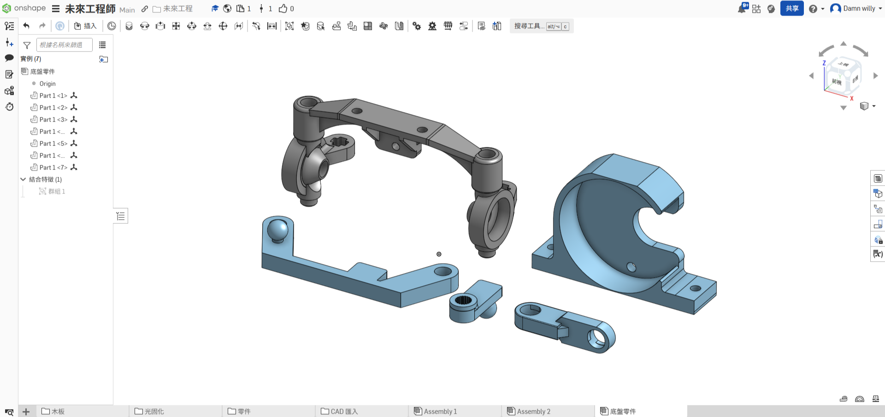
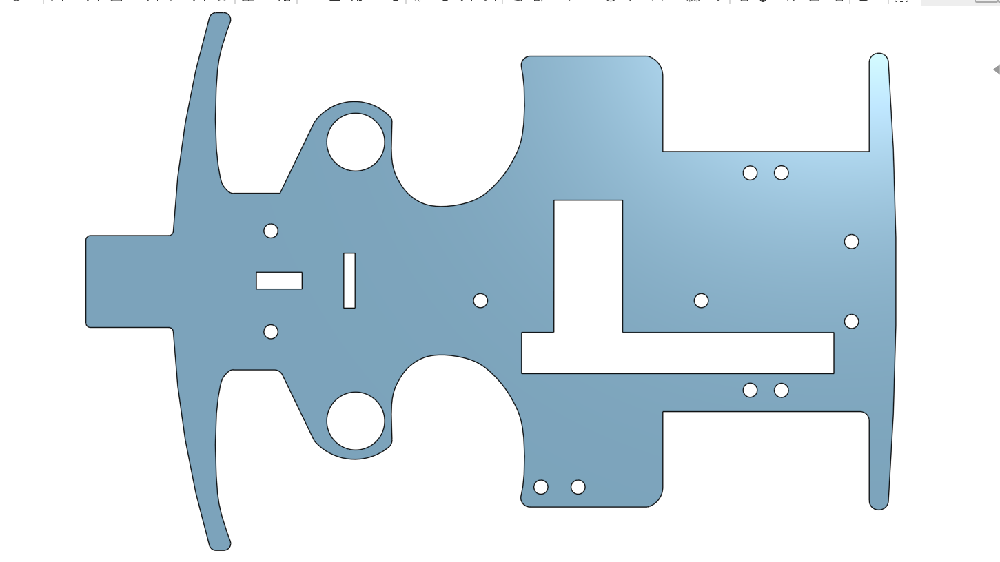
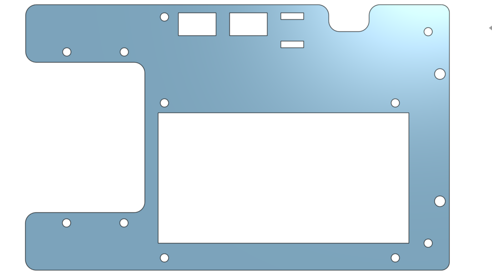

## 
3D Vehicle Model Design -3D車輛模型設計

- Our teammate, HU,SIAN-YI, possesses a solid foundation of practical experience in mechanical design and **Vehicle’s control program** optimization, leveraged from years of participation in the **WRO Future Engineers Category**.
- Considering the annual changes to the competition themes and rules, particularly the addition this year of executing **parallel parking**  during **Obstacle Challenge rounds**  and starting from the **starting section (including the parking lot)**. We determined that reusing last year's vehicle design (9.8 cm wide, 18.5 cm long) would be disadvantageous for the parking maneuver, as the rules stipulate that the parking lot length is $1.5 \times$ the length of the robot. Consequently, we decided to modify and extend the length of our **Self-Driving Car**from the original 18.5 cm to 23.4 cm, and adopt an ellipsoidal body shape. This optimization not only significantly enhances parking flexibility but also allows the vehicle to navigate a **narrow corridor**  more smoothly.
- Overall, to more effectively complete the current competition tasks, we conducted a comprehensive adjustment and optimization of the vehicle's design and mechanical structure, leading to a notable improvement in the vehicle's overall performance and operational stability.
- For this competition, we continued to utilize the foundational equipment and technical expertise accumulated from our previous vehicle builds. Critically, the core component of our **Self-Driving Car**—the **chassis**—was entirely developed and designed in-house by our team, ensuring technical independence and high customizability.

- Regarding the design process, we used **Onshape** to create the vehicle's **3D model structure**. Subsequently, based on the characteristics of the chassis and component requirements, we utilized precision manufacturing equipment such as a **Laser Cutting Machine** and a **Stereolithography (SLA) 3D Printer** to fabricate the necessary vehicle components.

- **Next, we will provide a detailed introduction to the design philosophy and precise fabrication process of the chassis for our Self-Driving Car in this competition.**

    <table>
    <tr>
    <th width=30%>
2024 Season Competition Self-Driving Car Prototype </th>
    <th width=30%>
2025 WRO Taiwan Final Self-Driving Car Prototype</th>
    <th width=30%>
2025 WRO World Final Competition Prototype 2025</th>
    </tr><tr>
    <td></td> 
    <td></td> 
    <td></td>
    </tr>
    </table>
 
 

- ### Onshape 3D Model Structure Sketch -Onshape
  - #### 3D Modeling Software Onshape Introduction
    * We chose **Onshape** [cite: 981, 982] to design the **3D model structure**  of our **Self-Driving Car**[cite: 1]. It is a free and user-friendly web-based CAD software.
    * After completing the model creation in **Onshape**, we can output the necessary **2D dimension drawings**. These files can then be sent directly to a **Laser Cutting Machine** [cite: 593] for cutting, or converted and sent to a **3D Printer** for part fabrication.
    * All **3D/2D vehicle models**  required for this competition were designed entirely using the **Onshape** platform.

    - Software Website：[Onshape](https://www.onshape.com/en/) 
    

    <table>
    <tr>
    <th>
Onshape Website </th>
    <th>
3D CAD drawing of vehicle chassis components</th>

    </tr><tr>
    <td wdith="50%"></td> 
    <td width="50%"></td> 
    </tr>
    </table>
    
 

  - #### Design and production of 3D/2D models for vehicle parts
    

    <table>
    <tr>
    <th>
3D Vehicle Model </th>
    <th>
Vehicle Underfloor</th>
    <th>
Vehicle Mid-Deck</th>
    <th>
Vehicle Top Deck</th>
    </tr><tr>
    <td align="center" width="25%"></td> 
    <td align="center" width="25%"></td> 
    <td align="center" width="25%"></td> 
    <td align="center" width="25%"></td> 
    </tr>
    </table>
    
 
     

    <table>
    <tr>
    <th>
3D Vehicle Chassis Design</th>
    <th>
3D Vehicle Chassis Models</th>
    </tr><tr>
    <td width="50%">
</td> 
    <td width="50%"></td> 
    </tr>
    </table>
    
 

  - #### The Production of Vehicle Chassis Panels Introduction - Using a laser-cutting machine
    - To accommodate the new competition rules (such as the added parallel parking task ), we not only extended the length of the **Vehicle body** but also optimized the **Steering structure** . Consequently, the structure and dimensions of the vehicle chassis were comprehensively adjusted to better meet the requirements of the new system.
    
    - **Application and Manufacturing Process of the Laser Cutting Machine**
      - A Laser Cutting Machine is an equipment that utilizes a high-energy-density laser beam to precisely cut materials. It is capable of rapidly processing various materials, including wood, metal, plastic, and paper.

      - We utilized the laser cutting machine provided by our school to manufacture the main planar structural components of the Self-Driving Car's chassis, including the Vehicle Bottom Plate, the Vehicle Middle Plate, and the Vehicle Top Plate.
      - **Material Selection and Design Integration:** 
        - We selected 3mm thick lightweight wood panels as the material for the vehicle's planar structures, which helps to effectively reduce the overall weight of the vehicle.

        - In the design process, we first used the 3D modeling software Onshape to create the design sketch and generate engineering drawing files (DXF format).

        - Subsequently, these drawings were imported into the laser cutting machine's editing software (LaserWorkV) for detailed adjustments.

        - Finally, the cutting lines were traced according to the precise design sketch, and the lightweight wood panels were accurately cut into the required vehicle chassis components.

   - #### Vehicle Chassis Panels Dimensions Chart
    

    <table>
    <tr>
    <th>
Vehicle Underfloor</th> 
    <th>
Vehicle Mid-Deck</th>
    <th>
Vehicle Top Deck</th>
    </tr><tr>
    <td width="30%"></td> 
    <td width="30%"></td> 
    <td width="30%"></td>
    </tr>
    </table>
    
 

  - #### Vehicle Body Wooden Panels Produced Using a Laser Cutting Machine
     

     <table>
     <tr>
     <th>
Vehicle Underfloor</th>
     <th>
Vehicle Mid-Deck</th>
     <th>
Vehicle Top Deck</th>
     </tr>
     <tr>
     <td width="30%"></td>
     <td width="30%"></td>
     <td width="30%"></td>
     </tr>
     </table>
     

  - ####  Operation of Laser-Cutting Machine
    

 - ###  3D Vehicle Model - Onshape Model Sketch
    - #### Design and Fabrication Process for Stereolithography (SLA) 3D Printed Parts
  
       We primarily used Onshape for designing the 3D model structure. Subsequently, we utilized a Stereolithography (SLA) 3D Printer to fabricate the 3D printed parts for the vehicle chassis required for this competition.The design and fabrication process is as follows:

      - #### Comparison between Fused Deposition Modeling (FDM) 3D Printer and  Stereolithography (SLA) 3D Printer

         By conducting practical printing and operation comparisons of the 3D vehicle parts, we have reached the following conclusions:
        

        <table>
        <tr align="center">
        <th rowspan="2">Photo</th>
        <th> FDM 3D Printer</th>
        <th> SLA 3D Printer(Sonic Mighty Revo 14K)</th>
        </tr><tr align="center">
        <td></td>
        <td></td>
        </tr><tr align="">
        <td>The required printing time</td>
        <td>Faster</td>
        <td>Slower</td>
        </tr><tr>
        <td>Exterior</td>
        <td>Exterior with signs of layering</td>
        <td>Smooth</td>
        </tr><tr>
        <td>Hardness</td>
        <td>Dependent on the density</td>
        <td>Dependent on the exposure time</td>
        </tr>
        </tr><tr>
        <td>Size dimensions.</td>
        <td>Supports larger dimensions but does not support overly small dimensions.</td>
        <td>Supports smaller dimensions.</td>
        </tr>
        </table>
        

       
        In the Self-Driving Car competition, the geometric precision and structural detail of the parts are crucial. Your team's selection of an **SLA 3D Printer (e.g., Phrozen Sonic Mighty Revo 14K)** is due to its superior ability to produce high-precision, geometrically complex components, ensuring the custom-made parts meet the stringent structural demands of the vehicle, particularly for high-accuracy assemblies like the steering system.
        
     
      - #### The usage and introduction of Stereolithography (SLA) 3D printers
        - __The usage process of SLA 3D printers typically includes the following steps:__ 
          - __Design and Preparation:__ First, design the 3D model in CAD software and convert it into a printable STL file.
          - __Print Setup:__ Load the STL file into the slicing software of the SLA printer, and set printing parameters such as layer thickness and resin type.
          - __Printing Process:__ The SLA printer uses a laser to cure the resin layer by layer, forming the model. Since each layer is precisely cured by the laser, the printed product has high precision and a smooth surface.
          - __Post-Processing:__ After printing, the finished product is removed from the resin vat, cleaned to remove excess resin, and subjected to secondary curing in a UV curing box to increase hardness and stability.
        
          SLA 3D printers are widely used in industries such as manufacturing, healthcare, jewelry, and industrial desgn. Due to their high precision and fine surface treatment, they are particularly suitable for producing parts that require high quality and detailed features.
       
        - #### Description of the resin used in Stereolithography (SLA) 3D Printer
          The types of resin used in Stereolithography (SLA) 3D printers vary, and different resins offer distinct performance comparisons. Common types of SLA resins include:
          - __Standard resin:__ Suitable for general use, offering good surface finish, but relatively lower strength and durability.
          - __High-strength resin:__ Provides higher tensile strength and rigidity, ideal for parts that need to withstand force.
          - __Flexible resin:__ Has elasticity and flexibility, suitable for parts that require some degree of deformation.
          - __High-temperature resin:__ Excellent heat resistance, suitable for parts that need to operate at high temperatures.
          - __Impact-resistant resin:__ Offers good impact resistance and toughness, ideal for parts that are prone to collisions.

          Each type of resin has different advantages in terms of physical properties, surface quality, strength, and durability, and the choice of resin depends on the specific application requirements.

        During the competition, the vehicle often collided with side walls and obstacles, causing parts like the **"Steering shaft holder"** and **"Cross pin"** to break. As a result, we conducted experimental tests with **Impact-resistant resin** and **High-strength resin**. The tests showed that parts made from impact-resistant resin were too soft to meet the requirements. In the end, we chose to use **High-strength resin** to manufacture these parts, improving their durability and strength.

    

    <table>
    <tr>
    <th>High-strength resin</th>
    <th>Impact-resistant resin</th>
    <th>3D Fabrication Complete</th>
    </tr>
    <tr>
    <td align=center></td> 
    <td align=center></td> 
    <td></td>
    </tr>
    </table>
    
 

    - ####  3D Vehicle Model Dimension Diagram

      

        <table>
          <tr>
            <th>Front Assembly</th>
            <th>Steering Knuckle</th>
            <th>Bearing Holder</th>
          </tr>
          <tr>
            <td align=center></td>
            <td align=center></td>
            <td align=center></td>
          </tr>
        </table>
      

      

        <table>
          <tr>
            <th>Steering shaft holder</th>
            <th>Motor steering rod</th>
            <th>Steering rod</th>
          </tr>
          <tr>
            <td align=center></td>
            <td align=center></td>
            <td align=center></td>
          </tr>
        </table>
      

      

        <table>
          <tr>
            <th>Motor Holder</th>
            <th>Ultrasonic stent</th>
            <th>Infrared bracket</th>
          </tr>
          <tr>
            <td></td>
            <td></td>
            <td></td>
          </tr>
        </table>
      

      

        <table>
          <tr>
            <th>Lens Mount</th>
            <th>Lens Module Fine-Tuning Mechanism</th>
          </tr>
          <tr>
            <td align=center width=500></td>
            <td align=center width=500></td>
          </tr>
        </table>
      

    - ####  Vehicle body support components produced with Stereolithography (SLA) 3D Printer

      

        <table>
          <tr>
            <th>Front Assembly</th>
            <th>Steering Knuckle</th>
            <th>Bearing Holder</th>
          </tr>
          <tr>
            <td align=center height=200></td>
            <td align=center></td>
            <td align=center></td>
          </tr>
        </table>
      

      

        <table>
          <tr>
            <th>Steering shaft holder</th>
            <th>Motor steering rod</th>
            <th>Steering rod</th>
          </tr>
          <tr>
            <td align=center height=200></td>
            <td align=center></td>
            <td align=center></td>
          </tr>
        </table>
        

      

        <table>
          <tr>
            <th>Motor Holder</th>
            <th>Ultrasonic stent</th>
            <th>Infrared bracket</th>
          </tr>
          <tr>
            <td align=center height=200></td>
            <td align=center></td>
            <td align=center></td>
          </tr>
        </table>
      

      

        <table>
          <tr>
            <th>Lens Mount</th>
            <th>Lens Module Fine-Tuning Mechanism</th>
          </tr>
          <tr>
            <td align=center width=500></td>
            <td align=center width=500></td>
          </tr>
        </table>
      

 ***
- ### Supplementary Information
    - __Maintenance Process:__

       Without regular maintenance, a stereolithography 3D printer may become clogged with resin and become unusable, requiring periodic cleaning. So we recorded the cleaning methods we learned from our seniors and started cleaning orselves.
     
      1. After printing is completed, the object will adhere to the printing platform, so we remove the platform for cleaning.
      2. Place the platform on a rack and put it into the UV curing washing machine.    
      3. Set the time and wait for the washing machine to complete the cleaning. The machine will rotate the alcohol in the washing tank to perform the first cleaning of the platform and the object.
      4. Rinse the alcohol off the finished product with water.
      5. Use a scraper to remove the object from the platform.
      6. Remove the support structures from the edges of the object.
      7. Perform a second cleaning with alcohol to thoroughly clean the resin off the object.
      8. Clean any remaining resin off the platform with alcohol.
      9. Finally, dry the platform and reinstall it back onto the stereolithography 3D printer of machine.

    

    <table>
    <tr>
    <td>Step 1</td>
    <td>Step 2</td> 
    <td>Step 3</td></tr>
    <tr align="center">
    <td></td>
    <td></td> 
    <td></td>
    </tr>
    <td>Step 4</td>
    <td>Step 5</td> 
    <td>Step 6</td></tr>
    <tr align="center">
    <td></td>
    <td></td>
    <td></td>
    </tr align="center">
    <td>Step 7</td>
    <td>Step 8</td>
    <td>Step 9</td></tr>
    <tr>
    <td></td>
    <td></td>
    <td></td>
    </tr align="center">
    <td>Step 10</td></tr>
    <tr>
    <td></td>
    </tr>
    </table>
    

   Since the parts printed by the stereolithography (SLA) 3D printer are relatively soft, we need to place them in an ultraviolet curing box, where they are exposed to UV light for secondary curing. This process hardens the parts and reduces deformation, thereby preventing any negative impact on the vehicle's movement.

   

    <table>
    <tr>
    <th>Ultraviolet curing box</th>
    </tr><tr>
    <td></td>
    </tr>
    </table>
    

   

# 
[Return Home](../../)
