<div align="center"></div>

# <div align="center">Project Development and Technical Learning Journey </div>

- The following is a development record of the self-driving car model design and task-solving, covering mechanical design and manufacturing, circuit design and implementation, electronic device selection, programming and testing, and the overall problem-solving process.

- ### Autonomous Vehicle Design: Key Upgrades and Iterations
  This autonomous vehicle design **builds upon** the rich experience inherited from the senior team (**Shinan-Fire-On-All-Cylinders**) and integrates my practical insights from last year's World Competition.

  We didn't just reference the successful elements of the previous year's winning teams; we implemented **key technological iterations**:

  * **Controller Upgrade:** The main controller has been upgraded from the standard Jetson Nano to the **superior-performing Nvidia Jetson Orin Nano**.
  * **Mechanical Overhaul:** We have **restructured and optimized** the vehicle's mechanical components, specifically the steering and chassis.
  * **Vision Enhancement:** Image processing has been **significantly enhanced** for greater efficiency and accuracy.

  The integration of all these upgrades and innovative design elements is squarely aimed at **comprehensively strengthening** the vehicle's overall performance and competitiveness.
## 2025/02/28 ~ 2025/03/07  

**Member:** HU,SIAN-YI, LIN ZHAN-RONG, ZHANG YI-WEI

**Content:**  


### **Team Experience and Model Weight Reduction Strategy** 

Our teammate, **HU,SIAN-YI**, has accumulated a profound **practical foundation** in the fields of **mechanical design** and **program control optimization**, drawing upon his years of experience participating in the "Future Engineers Competition".

<div align="center">
<table width="100%">
<tr>
<th>Team photo </th>
<th>Funny photo </th>
</tr>
<tr>
<td width="50%">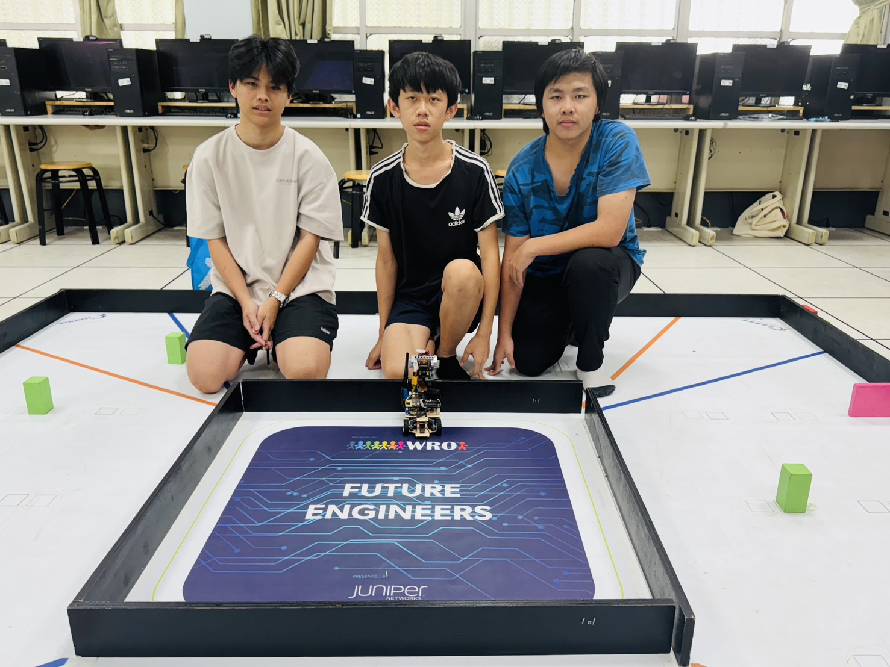
</td>
<td width="50%">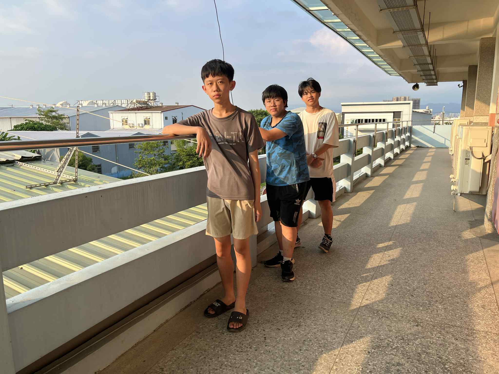
</td>
</tr>
</table>
</div>

Considering the annual changes in competition themes and rules, and having **assimilated the excellent achievements of last year's world champion team in image recognition technology**, our team conducted in-depth discussions and decided to implement a **critical weight reduction design** for this year's competition model.

By **simplifying the overall vehicle structure**, we **aim to achieve** the following key advantages and performance conditions:
* We **expect** to optimize the robot's **smoothness when entering and exiting the parking area**.
* **Significantly enhance** its **maneuverability and agility** on the field.
* **Enable** it to **avoid obstacles more precisely**.
* Thereby **comprehensively stabilize the vehicle's operational performance**. 
<div align="center">
<table>
<tr align="center">
<th>2024 World Championship Vehicle Model</th>
<th>Tentative Vehicle Model for the 2025 National Competition</th>
<th>Team Research and Data Review Process Documentation</th>
</tr>
<tr align="center">
<td width="33%"></td> 
<td width="33%"></td> 
<td width="33%"> 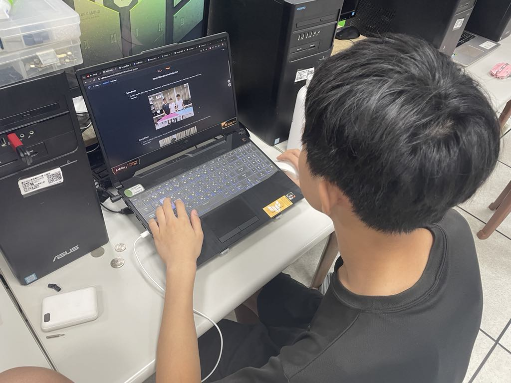</td>
</tr>
</table>
</div>

**Design Reference, Technical Findings, and Correction Strategy**
- To establish the design foundation and optimization direction for this project, we conducted the following referencing and analysis:
Design Reference Sources: We reviewed the engineering documentation from our school's past teams and conducted a deep analysis of the technical files from last year's world champion team.

- Technical Findings and Correction Strategy:

   - Image Recognition: We found that last year's world champion team executed image recognition technology in an extremely correct and highly efficient manner, marking this as an area worthy of deep study and emulation. Consequently, we established this technical direction as our primary strategy for correction and enhancement.

    - Model Size and Obstacle Avoidance: Furthermore, we observed that some teams' vehicle models were significantly smaller than ours. These smaller models demonstrated superior performance in their ability to avoid obstacles.


## 2025/03/08 ~ 2025/03/14
**Member:** HU,SIAN-YI, LIN ZHAN-RONG, ZHANG YI-WEI

**Content:**

### **System Deployment and Remote Development Environment Setup** 

This week's work focused on **system installation** and **driver downloads**.

Considering the risks associated with directly operating the **Jetson Nano** via a small screen, specifically **inconvenient interface operation** and the potential for **damage to the connection ports**, we decided to adopt a more efficient development approach: we deployed **NoMachine remote desktop software** on the Jetson Nano. This action aims to provide an **efficient and stable** remote operational environment for the subsequent tasks of **autonomous driving program writing** and **system debugging**.

**Supporting Documentation:**
Photos of the system installation, driver downloads, and remote desktop functionality test are attached below as evidence.


<div align="center">
    <table>
        <tr align=center>
            <th width=50% style="text-align: center;">Jetson  Nano Software Environment Installation</th>
            <th width=50% style="text-align: center;">Jetson  Nano Software Environment Testing</th>
        </tr>
        <tr>
            <td>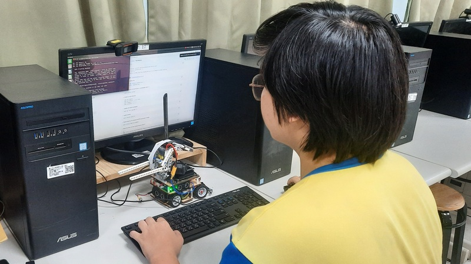</td>
            <td></td>
        </tr>
    </table>
</div>

## 2025/03/15 ~ 2025/03/21

**Member:** HU,SIAN-YI, LIN ZHAN-RONG, ZHANG YI-WEI

**Content:** 

### **Second Generation Circuit Design and Initial PCB Practical Experience** 

#### **Design Motivation and Process Transition**
To **prevent potential short-circuit damage to the controllers caused by soldering on pegboards** and to achieve a **cleaner, more configurable** board layout, we decided to use **EasyEDA software to draw the Printed Circuit Board (PCB)**. Subsequently, we produced the **Second Generation circuit board** using the **chemical etching process**.

#### **Design Error and Practical Learning**
As this was the team's **first time** designing a PCB, we initially **overlooked the standard component layout templates built into the design software (EasyEDA)**. Instead, we relied on **manual measurement of the pin header pitch** as the design basis. However, due to our **limited experience**, after the second-generation board was fabricated, we discovered that the **pitch setting was too small**, ultimately preventing the electronic components from being properly inserted.

#### **Experience Summary and Subsequent Action**
Despite this setback, this failure provided **invaluable hands-on experience**. It prompted us to immediately launch the **design correction and optimization process**, and the revised design was subsequently sent to the factory for the **Third Generation Version**.

<div align="center">
    <table>
        <tr align=center>
            <th width=50% style="text-align: center;">Initial Design V1.0 (Pegboard) - Front View</th>
            <th width=50% style="text-align: center;">Initial Design V1.0 (Pegboard) - Back View</th>
        </tr>
        <tr>
            <td width=50%>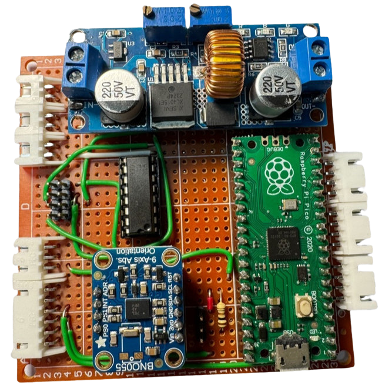</td>
            <td width=50%>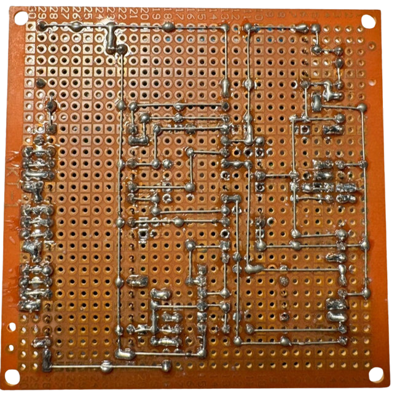</td>
        </tr>
    </table>
</div>

<div align="center" >
    <table >
        <tr align="center">
            <th>Second-Generation Design V2.0 (PCB) - Front View</th>
            <th>Second-Generation Design V2.0 (PCB) - Back View</th>
        </tr>
        <tr align="center">
            <td width=50%></td>
            <td width=50%></td>
        </tr>
    </table>
</div>

## 2025/03/22 ~ 2025/03/28
**Member:** HU,SIAN-YI, LIN ZHAN-RONG, ZHANG YI-WEI

**Content:** 

### **Autonomous Car Program Commencement and Communication Protocol Study**

This week, we officially initiated the **coding of the autonomous car's core program**. To ensure the **Main Control Unit (Nvidia Jetson Nano)** and the **Auxiliary Unit (Raspberry Pi Pico)** can achieve **efficient coordinated operation**, we dedicated time to deeply research key **communication protocols and technical aspects**.

The specific research areas included:
* **Main-Auxiliary Unit Communication:** Investigating the **stable communication mechanism between the Nvidia Jetson Nano and the Raspberry Pi Pico**.
* **Precise Encoder Control:** Studying how to utilize the **Raspberry Pi Pico to precisely control the DC motor's encoder**, enabling accurate speed and position management.
* **Sensor Data Acquisition:** Implementing technical steps such as **value reading and data processing** for the **ultrasonic sensor**.

 <div align=center>
    <table>
        <tr>
            <th align=center>Search for relevant materials.</th>
            <th align=center>Write a self-driving car program.</th>
        </tr>
        <tr>
            <td></td>
            <td>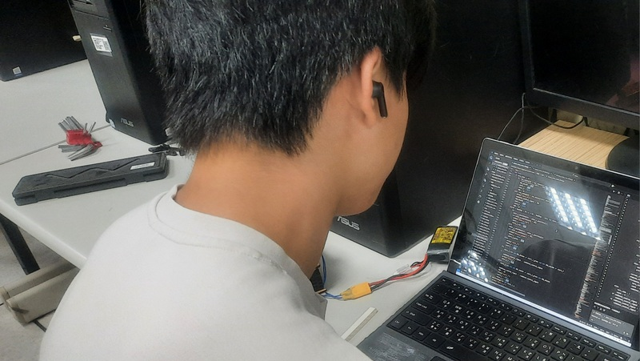</td>
        </tr>
    </table>
 </div>

## 2025/03/29 ~ 2025/04/04
**Member:** HU,SIAN-YI, LIN ZHAN-RONG, ZHANG YI-WEI

**Content:** 

### **Jetson Nano System Setup and UART Communication Implementation**

This week, team member **HU,SIAN-YI** successfully completed the **operating system installation for the Nvidia Jetson Nano**, configuring all necessary hardware drivers and software packages.

#### **System Configuration Highlights:**
* **Hardware Drivers:** Successfully installed drivers for the **TP-Link T3U Plus (AC1300)** wireless adapter, the **IMX477 camera module**, and the **BNO055 gyroscope sensor**.
* **Software Environment:** Installed the **OPENCV** package for image recognition, **Cython** for performance acceleration, and software utility packages for **UART and I2C communication tools**.

#### **Program Development and Communication Implementation:**
* Building on this foundation, we have **successfully written the basic program architecture for the autonomous car**.
* Crucially, we **successfully implemented the UART (Universal Asynchronous Receiver-Transmitter) protocol**, establishing and verifying a **stable communication mechanism between the Raspberry Pi Pico and the Nvidia Jetson Nano**.
* This key achievement allows us to smoothly and reliably transmit **control commands (such as speed and steering)** generated by the **Nvidia Jetson Nano (Main Control Unit)** to the **Raspberry Pi Pico (Auxiliary Control Unit)** for low-level execution.

#### The UART Program is Shown Below

  **Nvidia Jetson Nano**
   ```python
    import serial as AC
    import struct
    combined_control_signal = 30
    turn_side = 0
    PWM = 80
    try:
        ser = AC.Serial('/dev/ttyTHS1', 115200, timeout=1)
    except AC.SerialException as e:
        print(f"Error: Could not open serial port: {e}")
        exit()
    data_to_send = (int(combined_control_signal), int(turn_side),int(PWM))
    header = b"A"
    send_data_value = struct.pack('3i', *data_to_send)
    send_data_value = header + send_data_value
    ser.write(send_data_value)
   ```
   **Raspberry Pi Pico**
   
   ```python
    from machine import UART, Pin
    import struct
    uart = UART(0, baudrate=115200, tx=Pin(16), rx=Pin(17))
    def jetson_nano_return(number):
        global data_value
        HEADER = b"A"
        HEADER_SIZE = len(HEADER)
        DATA_SIZE = 12
        TOTAL_SIZE = HEADER_SIZE + DATA_SIZE
        if uart.any():
            data = uart.read(TOTAL_SIZE)
            if len(data) == TOTAL_SIZE:
                header_index = data.find(HEADER)
                if header_index != -1:
                    start_index = header_index + HEADER_SIZE
                    data = data[start_index:] + data[:start_index]
                    data_value = struct.unpack('3i', data[:DATA_SIZE])
                    return data_value[number]
                else:
                    print("Error: Incorrect header received.")
            else:
                print("Error: Incomplete data received.")
        return data_value[number]

   ```
## 2025/04/05 ~ 2025/04/11

**Member:** HU,SIAN-YI, LIN ZHAN-RONG, ZHANG YI-WEI

**Content:**  

### PCB Layout Error Correction and UART Transmission Optimization

#### **1. PCB Layout Error and Version Correction (V3.0/V4.0)**
* **Pitch Correction:** During the development of the **Second Generation Version**, based on feedback from the prior generation, we used the design software's built-in **standard example diagrams** to recalibrate the pin header pitch, successfully correcting the original design error.
* **Polarity Reversal:** However, due to an **operational oversight**, when implementing the PCB layout, we **mistakenly treated the back view as the front design**, which resulted in a major issue of **reversed polarity** upon board fabrication.
* **Error Fix:** Fortunately, this error was discovered immediately during the assembly and testing phase. We promptly corrected the layout orientation in the **subsequent version** and **comprehensively reviewed the alignment specifications of all layers** to ensure the design file and the final physical product were **completely consistent**.

#### **2. UART Transmission Issue and Ongoing Optimization**
While testing **UART data transmission**, we discovered **instances of data loss (dropping data)**. To ensure the reliability of control command transmission, we are **continuously developing and debugging the code**, focusing on correcting this error to **enhance communication stability**.

<div align="center" >
    <table>
        <tr>
            <th>Third-Generation Design V3.0 (PCB) - Front View</th>
            <th>Third-Generation Design V3.0 (PCB) - Back View</th>
        </tr>
        <tr align="center">
            <td>
                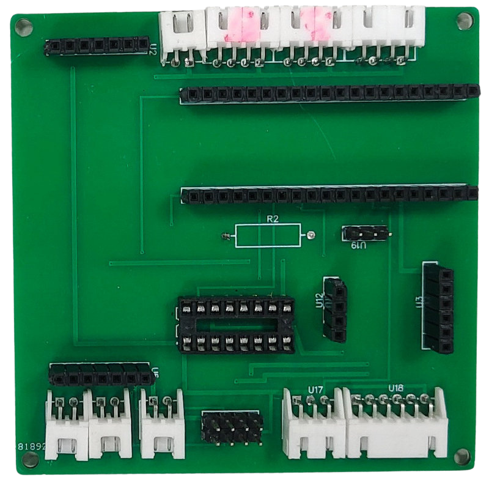
            </td>
            <td>
                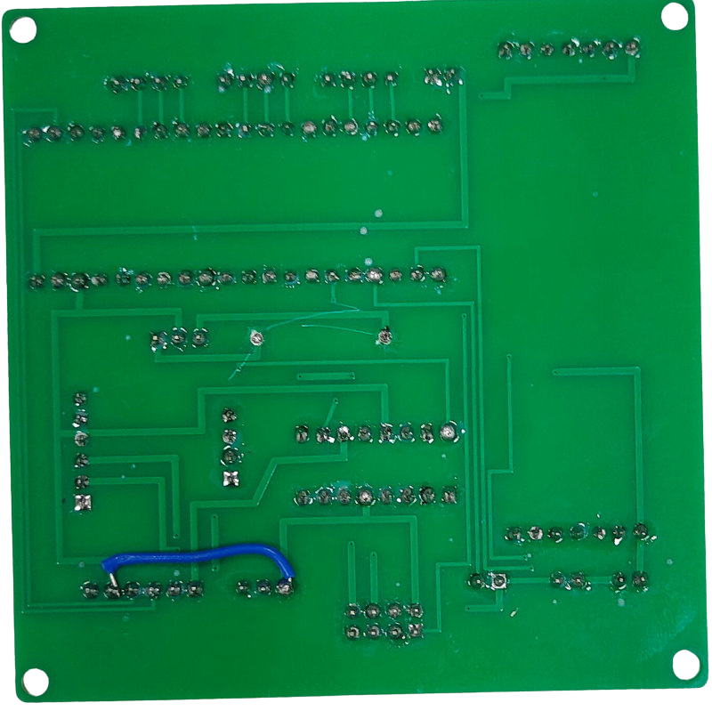
            </td>
        </tr>
    </table>
</div>


## 2025/04/12 ~ 2025/04/18
**Member:** HU,SIAN-YI, LIN ZHAN-RONG, ZHANG YI-WEI

**Content:**

### **Open Challenge Program Application and Obstacle Challenge Strategy Optimization** 

#### **1. Open Challenge Program Application**
Since the competition rules for the **Open Challenge rounds** remain consistent with previous years, we decided to **utilize last year's established program for initial performance testing**.

#### **2. Obstacle Challenge Rounds Program Modification and Optimization**
Given that this year's competition rules **added the task of starting from the parking lot** and **parallel parking into the parking zone** within the **Obstacle Challenge rounds**, we were required to **modify and deeply optimize** last year's autonomous car **obstacle avoidance program**.

#### **3. Obstacle Avoidance Strategy and Logic**
Our implemented obstacle avoidance strategy and logic are as follows:
* **Path Reference:** **Two path lines with specific slopes are drawn** on the image screen, serving as the vehicle's **reference direction** for travel.
* **Target Center Calculation:** Through the `detect_color_final` subroutine located in the `function.py` file, the system **calculates the center coordinates of the target object** on the screen.
* **Turning Angle Calculation:** The autonomous car subsequently **calculates the required turning angle based on the coordinate difference between the object's center coordinates and the path lines**, thereby executing **precise obstacle avoidance maneuvers**.

- The image below displays the autonomous car's actual operational screen during mission execution.
 <div align=center>
    <table>
        <tr>
            <th colspan=3 >Screenshot of the Image Feed During Jetson Nano Program Execution - Jetson Nano </th>
        </tr>
        <tr>
            <td>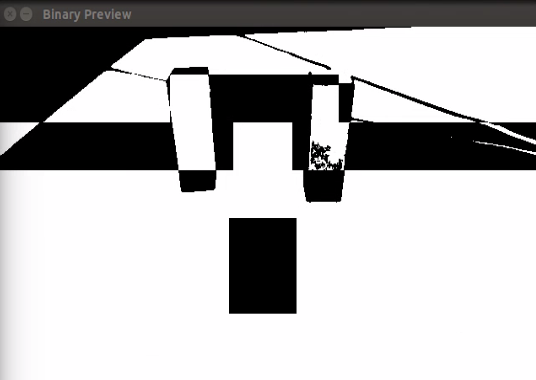</td>
            <td></td>
            <td></td>
        </tr>
    </table>
 </div>


## 2025/04/19 ~ 2025/04/25
**Member:** HU,SIAN-YI, LIN ZHAN-RONG, ZHANG YI-WEI

**Content:**

### **Obstacle Challenge Program Optimization and Compound Steering Logic**

#### **1. Steering Mode and Lap Counting Mechanism**
This week, we continued optimizing the Obstacle Challenge program by adding a **detection mechanism for the start and end of steering**. This mechanism is used to **determine if the vehicle is still within the turning zone**, facilitating the **accurate counting of completed laps** around the field.

* **Mode Switching:** When the image screen **detects the specific lines marking the turning zone**, the system automatically switches to the **"Steering Mode"**.
* **Exit Turning Zone Logic:** The program requires the simultaneous satisfaction of **three conditions** to confirm the vehicle has left the turning zone and increment the steering count:
    * **Heading Angle Change**
    * **HSV Color Recognition**
    * **Time Condition**

#### **2. Compound Obstacle Avoidance Optimization During Steering**
* Following practical testing, we found that the original steering logic occasionally led to the vehicle **colliding with the obstacle blocks**.
* To resolve this issue, we **added a compound obstacle detection logic** within the steering mechanism:
    1.  When the autonomous car **identifies an obstacle block during the turning process**, it **prioritizes obstacle avoidance**.
    2.  If it detects the vehicle body is **approaching a wall**, it **prioritizes moving away from the wall**.
    3.  **Finally**, it determines whether the vehicle has exited the turning zone.

**The logic code for determining the exit from the turning zone is shown below.**

```python
if elapsed_time >= 0.7 and color_y_positions[0] ==0 and color_y_positions[1] == 0 and
    heading < target_heading[count+1] + 35 and heading > target_heading[count+1] - 35:
    turn_side = 2
    if count >= 3:
        count = 0
        round_number +=1
        if round_number == 2:
            turn_side = 3
            time_count = 0
            start_time = time.time()
    else:
        count += 1
        combined_control_signal = 0
```


## 2025/04/26 ~ 2025/05/02
**Member:** HU,SIAN-YI, LIN ZHAN-RONG, ZHANG YI-WEI

**Content:** 

### **Program Auto-Startup Mechanism and Pico Signal Detection**

#### **Need and Implementation of Auto-Startup Mechanism**
To address the efficiency issue of manually starting the main program before every operation, we designed and implemented an **automated startup mechanism** on the **Jetson Nano**.

* **Service Script Writing:** We authored a **startup script (`open-mode.sh`)** and configured it using the **Linux Systemctl service (`open-mode.service`)**, enabling the system to **automatically execute this script upon every boot**.
* **Startup Signal Detection:** After execution, the startup script (running `open-mode.py`) continuously **monitors the Raspberry Pi Pico via the UART protocol for a specific "Program Start" signal**. Once a valid signal is received, the main control loop of the autonomous car commences execution.

The code for `open-mode.service`, `open-mode.sh`, and `open-mode.py` is provided below.

* **open-mode.service Code**
 ```bash
[Unit]
Description=Open Terminal with Python Script on Boot
After=graphical.target network.target
Wants=graphical.target

[Service]
Type=simple
User=user
Environment="DISPLAY=:0"
Environment="XAUTHORITY=/home/user/.Xauthority"
Environment="DBUS_SESSION_BUS_ADDRESS=unix:path=/run/user/1000/bus"
WorkingDirectory=/home/user/code
ExecStart=/bin/bash -c "/home/user/code/open-mode.sh"
Restart=on-failure
RestartSec=5s

[Install]
WantedBy=default.target
 ```

* **open-mode.sh Code**
 ```bash
#!/bin/bash
while [ ! -e /tmp/.X11-unix/X0 ]; do
    sleep 1
done
until xhost >/dev/null 2>&1; do
    sleep 1
done
export DISPLAY=:0
export XAUTHORITY=/home/user/.Xauthority
export DBUS_SESSION_BUS_ADDRESS=unix:path=/run/user/1000/bus

/usr/bin/gnome-terminal --title='start code' -- bash -c '/home/user/code/open-mode.py; exec bash'
 ```

* **open-mode.py Code**
 ```python
#!/usr/bin/python3
import Jetson.GPIO as GPIO
import time
import subprocess
import os

GPIO.setmode(GPIO.BOARD) 
input_pin = 7
output_pin = 40
GPIO.setup(output_pin, GPIO.OUT)
GPIO.setup(input_pin, GPIO.IN)

process = None
GPIO.output(output_pin, GPIO.LOW)
try:
    command = "xrandr --fb 1900x1240"
    subprocess.run(command, shell=True)
    GPIO.output(output_pin, GPIO.LOW)
    while True:
 
        if GPIO.input(input_pin) == GPIO.HIGH:
            print("A high level was detected, so another program was executed.")        
            if process is not None and process.poll() is None: 
                time.sleep(1)  
                continue
            command = "echo '0000' | sudo -S chmod 777 /dev/ttyTHS1"
            subprocess.run(command, shell=True)
            folder_path = "/home/user/code/"  
            os.chdir(folder_path)          
            
            process = subprocess.Popen(
                ["xterm", "-e", "/usr/bin/python3", "/home/user/code/jetson_nano_main_final.py"]
            ) 

        else:
            if process is not None and process.poll() is None: 
                print("Terminate the previously running program.")
                process.terminate()  
                process.wait()      
            GPIO.output(output_pin, GPIO.LOW)
            print("LOW，Turn Light")

        time.sleep(1)

except KeyboardInterrupt:
    GPIO.cleanup()
 ```

## 2025/05/03 ~ 2025/05/09
**Member:** HU,SIAN-YI, LIN ZHAN-RONG, ZHANG YI-WEI

**Content:**

### **Obstacle Challenge Parking Procedure Design and Strategy**

This week, our focus is dedicated to finalizing the **parking procedure programming for the Obstacle Challenge rounds**.

* **Parking Strategy:** We adopted the method of **Perpendicular Reverse Parking** (or **Right-Angle Back-in Parking**) as our primary strategy, ensuring the vehicle can **precisely and efficiently enter the designated parking area**.
* **Flow Description:** The image below illustrates the **detailed execution flow diagram for the parking procedure**.


 <div align=center>
    <table>
        <tr>
            <th>2025 National Competition: Parallel Reverse Parking Procedure Diagram </th>
        </tr>
        <tr>
            <td></td>
        </tr>
    </table>
 </div>


## 2025/05/10 ~ 2025/05/16
**Member:** HU,SIAN-YI, LIN ZHAN-RONG, ZHANG YI-WEI

**Content:** 

### **Parking Procedure Stability Optimization and Ultrasonic Sensor Integration** 

* After repeated testing, we found that the autonomous car's **parking parameter tuning process was overly cumbersome**. The main reason was that the **tolerance range set in the program was too small**, often causing the vehicle to **collide with the parking zone walls** during execution.
* To resolve this issue, we **activated the ultrasonic sensor mounting holes previously reserved on the chassis** and **utilized the ultrasonic sensor readings to assist** the autonomous car in completing the parking maneuver.
* This design **significantly enhanced the stability and success rate of the parking procedure**, effectively addressing the low tolerance problem.

The code for reading the ultrasonic sensor values is shown below.

 ```python
def measure_distance(trig, echo):
    # Send trigger pulse
    trig.value(0)
    time.sleep_us(2)
    trig.value(1)
    time.sleep_us(10)
    trig.value(0)

    # Read Echo pulse width
    duration = time_pulse_us(echo, 1)

    # Calculate distance (speed of sound is approximately 343 m/s)
    distance = (duration / 2) * 0.0343

    return distance
 ```

## 2025/05/17 ~ 2025/05/23
**Member:** HU,SIAN-YI, LIN ZHAN-RONG, ZHANG YI-WEI

**Content:**

### **Parking Optimization Results and Parking Zone Exit Procedure Development**

#### **1. Parking Feature Optimization Results**
With the **integration of the ultrasonic sensor-assisted parking function** last week, the number of required **parameter adjustments during parking significantly decreased**, validating the effectiveness of the new design.

#### **2. Parking Zone Exit Procedure Development**
This week, we began coding the **"Parking Zone Exit Procedure"** for the **Obstacle Challenge rounds**. The key design aspects of this procedure are:
* **Control Unit:** The exit procedure is controlled by the **Jetson Nano main controller**.
* **Direction Determination Logic:** The system determines the required **clockwise or counterclockwise travel direction** at the start of the competition by **detecting the Region of Interest (ROI) values on the left and right sides of the image frame**.
* **Mode Switching:** Once the autonomous car **successfully exits the parking zone**, the system automatically switches the mode to **"Obstacle Avoidance Mode"** and continues to proceed based on the avoidance logic.

The **autonomous car's exit procedure code** is shown below.

 ```python
if turn_side == 8:
    PWM = -45
    if  roi_values[0]> roi_values[1] and start_0:
        ROI_0 = True
        start_1 = True
        start_0 = False
    elif  roi_values[0]< roi_values[1]and start_0:
        ROI_1 = True
        start_1 = True
        start_0 = False
    if  abs(heading) < 60 and start_1 or abs(heading) > 80 and start_1:
        if ROI_1:
            combined_control_signal = 180
        elif ROI_0:
            combined_control_signal = -180
    if abs(heading) > 60 and abs(heading) < 80 and start_1:
        start_2 = True
        start_1 = False
    if start_2:
        PWM = 40
        combined_control_signal = 0
    if start_2 and roi_values[2] > 4000:
        start_2 = False
        start_3 = True
    if abs(heading) > 10 and abs(heading) < 170 and start_3:
        if ROI_1:
            combined_control_signal = -180
        elif ROI_0:
            combined_control_signal = 180
    if abs(heading) < 10 and start_3  or abs(heading) > 170 and start_3:
        start_2 = False
        start_1 = False
        turn_side = 0
 ```

## 2025/05/24 ~ 2025/05/30
**Member:** HU,SIAN-YI, LIN ZHAN-RONG, ZHANG YI-WEI

**Content:**

### **Steering Angle Limitation and Mechanism Protection**

The **servo motor-driven front-wheel steering mechanism** of the autonomous car has **limited rotation angle capacity**. If the rotation angle is set **too wide**, it could potentially lead to the **steering structure being twisted and broken**, or cause the **servo motor to burn out**.

Therefore, to **prevent damage to the servo motor-driven front-wheel steering mechanism or the steering structure from being twisted**, we **added a strict angle limitation** at the end of the code's control logic, ensuring that steering maneuvers always remain within the safe operating range of the mechanism.

The code for **limiting the steering angle** is shown below.

 ```python
if combined_control_signal > 180:
    combined_control_signal=160
if combined_control_signal < -180:
    combined_control_signal=-160
 ```

## 2025/05/31 ~ 2025/06/06  
**Member:** HU,SIAN-YI, LIN ZHAN-RONG, ZHANG YI-WEI

**Content:** 

### **Main Circuit Board Fourth Generation Functional Test Results** 

Following the successful correction of design issues found in the previous two versions (V2.0 and V3.0), the **Main Circuit Board's Fourth Generation Version (V4.0) has successfully passed functional testing**. The results from actual operational tests indicate that there are **no anomalies in the pin header connections or the circuit layout**, and the **system operates stably**.

Notably, due to its stable performance, the V4.0 version **became the primary circuit board used during the National Competition**.


<div align="center" >
    <table >
        <tr align="center">
            <th>Fourth-Generation Design V4.0 (PCB) - Front View</th>
            <th>Fourth-Generation Design V4.0 (PCB) - Back View</th>
        </tr>
        <tr align="center">
            <td></td>
            <td>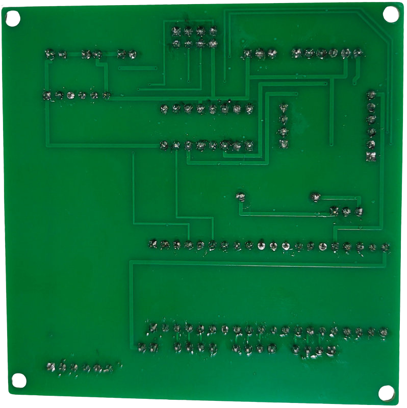</td>
        </tr>
    </table>
</div>

## 2025/06/28 ~ 2025/07/11
**Member:** HU,SIAN-YI, LIN ZHAN-RONG, ZHANG YI-WEI

**Content:** 

### **Chassis Friction Correction and Steering Smoothness Optimization** 

While testing the obstacle avoidance program, we observed that the autonomous car experienced **slight stuttering during cornering**. Inspection revealed the problem originated from the **chassis structure**: as the **steering knuckle was in direct contact with the chassis**, the resulting **excessive friction** caused the drivetrain to **jam**.

To resolve this issue, we implemented the following chassis optimization:
* **Enlarged the holes originally used to fix the steering knuckle**.
* **Switched to placing bearings** within the enlarged holes to **reduce friction**.

Following testing, the **new chassis structure incorporating bearings effectively improved steering smoothness**, allowing the autonomous car to navigate corners **more smoothly**.

 <div align=center>
    <table>
        <tr>
            <th colspan=2>Before and After Modification</th>
        </tr>
        <tr>
            <td>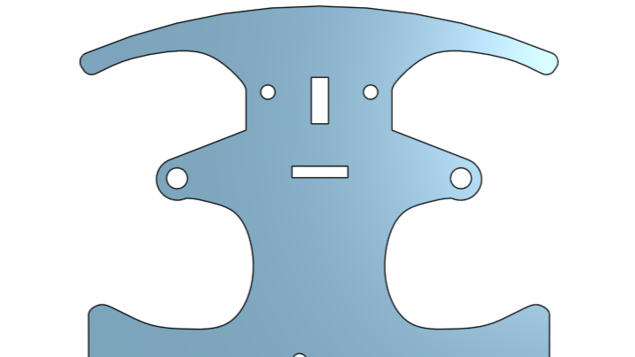</td>
            <td></td>
        </tr>
    </table>
 </div>

## 2025/08/16 ~ 2025/08/22
**Member:** HU,SIAN-YI, LIN ZHAN-RONG, ZHANG YI-WEI

**Content:** 

* Below are the **3D View**, **Schematic Diagram**, and **PCB Layout** of the **currently corrected and finalized circuit board**.
* We are **continuing to conduct program and functional testing for the Obstacle Challenge rounds** this week.

  <div align=center>
    <table>
    <tr>
    <th>3D view</th>
    <th>Circuit schematic</th>
    <th>PCB layout drawing</th>
       </tr>
       <tr>
    <td align=center >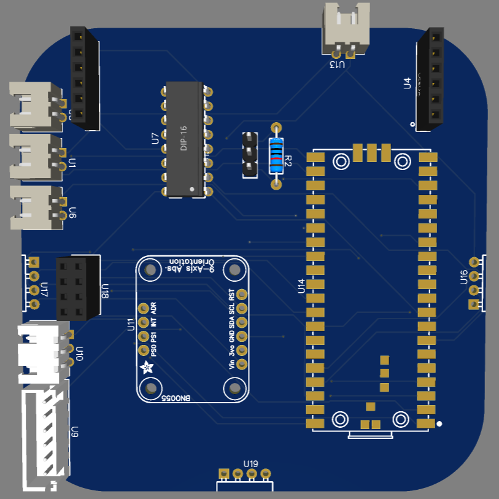</td>
    <td align=center >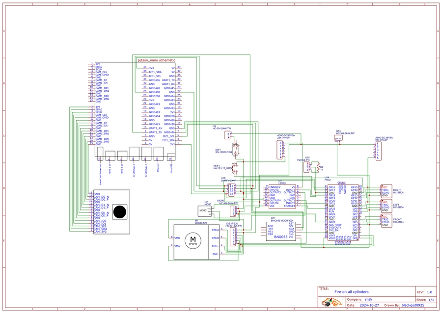</td>
    <td align=center ></td>
       </tr>
    </table>
  </div>
 

## 2025/08/23 ~ 2025/08/29
**Member:** HU,SIAN-YI, LIN ZHAN-RONG, ZHANG YI-WEI

**Content:** 

### **National Competition Journey, Challenges, and Qualification** 🏆

Our National Competition took place on **August 23rd**. Despite a challenging process, we successfully qualified.

#### **Morning Qualifying Rounds**
* **First Attempt:** The round ended prematurely as the vehicle **collided with the inner side wall**.
* **Second Attempt:** We successfully **completed the three-lap circuit task**, but during the **final parking maneuver**, the autonomous car **exceeded the designated parking zone**, preventing us from earning full points.
* **Result:** Even without achieving a perfect score, our strong performance allowed us to **successfully advance to the afternoon final rounds**.

#### **Afternoon Final Rounds (Obstacle Challenge)**
* **Final Challenges:** In the afternoon finals, we **still failed to achieve a perfect solution**.
    * **Obstacle Avoidance:** In the first round, the autonomous car **moved an obstacle block**, resulting in an incomplete score for the obstacle avoidance task.
    * **Parking Issue:** During the final parking sequence, the vehicle **left the parking/starting zone after passing the final obstacle**, thus failing to complete the parking task.

#### **Final Achievement and Outlook**
Despite a **difficult and challenging competition process**, we successfully secured the **first-place ranking**, earning the qualification to **represent Taiwan in the WRO Future Engineers World Final**. We plan to **fully absorb the practical experience and lessons learned from this National Competition** and aim to participate in the World Final **in better condition**, striving to achieve **outstanding results and bring honor back home**.

 <div align=center>
    <table>
        <tr>
            <th>Awaiting Testing</th>
            <th>Competition Action Photo</th>
            <th>Award Ceremony Photo</th>
        </tr>
        <tr>
            <td></td>
            <td>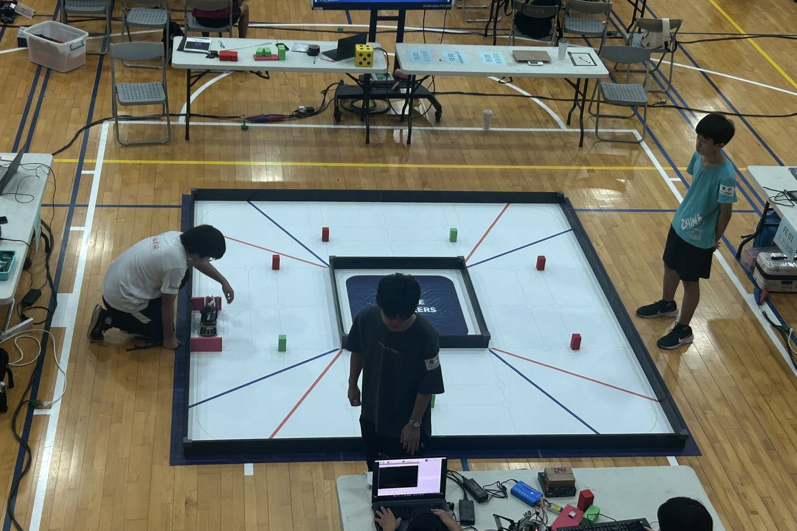</td>
            <td>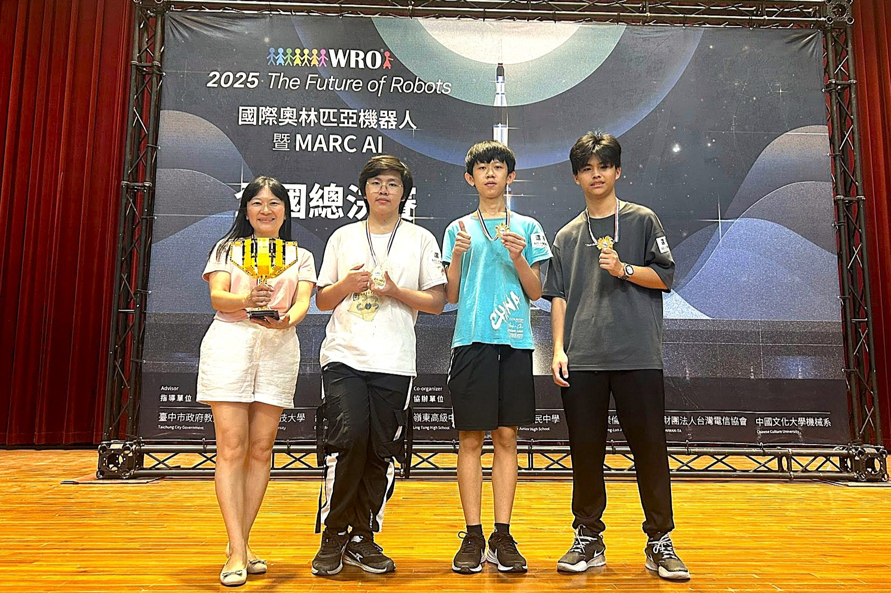</td>
        </tr>
    </table>
 </div>


## 2025/08/30 ~ 2025/09/05
**Member:** HU,SIAN-YI, LIN ZHAN-RONG, ZHANG YI-WEI

**Content:**

### **Main Controller Upgrade to Jetson Orin Nano and Communication Optimization** 

#### **1. Main Controller Upgrade Decision and Rationale**
During our participation in the National Competition, we identified that the **Jetson Nano lacked sufficient computational performance** to handle the complexity of the required competition programs. Concurrently, considering that the **more efficient Nvidia Jetson Orin Nano controller had seen a price reduction**, and the **Nvidia Jetson Nano is now discontinued**—making the procurement of backup controllers challenging—we decided to upgrade the main controller to the **significantly more computationally efficient Jetson Orin Nano**.

#### **2. Communication Protocol and Auxiliary Controller Swap**
Following the main controller upgrade, we began investigating the use of the **WebSockets protocol** to establish **communication between the Jetson Orin Nano and the Raspberry Pi Pico**. As WebSockets communication necessitates **stable network connectivity for both ends**, we replaced the original Raspberry Pi Pico with the **WiFi-enabled Raspberry Pi Pico W**, meeting the requirement for wireless communication and setting the foundation for the future system architecture.


<div align=center>
    <table>
       <tr>
           <th width=50%>2025 National Competition Vehicle Model
           <th width=50%>2025 National Competition Model: Latest Version Under Ongoing Optimization
       </tr>
       <tr>
           <td align=center>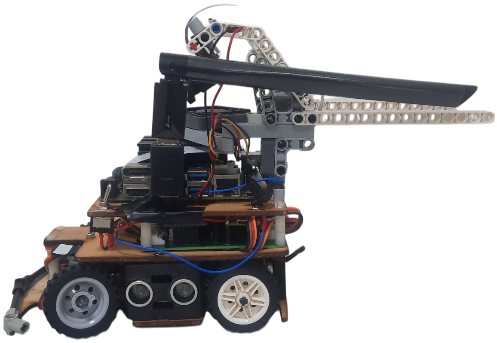</td>
           <td align=center>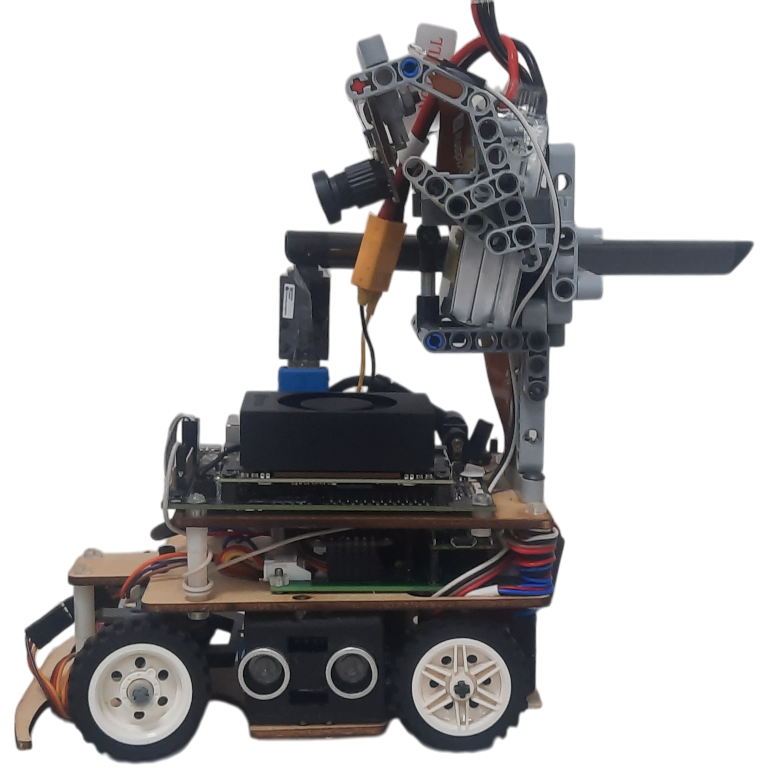</td>
       </tr>
       <tr>
           <th>Second Generation Steering Structure (V2.0) </th>
           <th>Third Generation Steering Structure (V3.0) </th>
       </tr>
       <tr>
           <td align=center></td>
           <td align=center>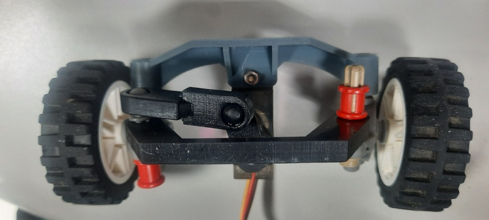</td>
       </tr>
       <tr>
           <th colspan=2>Onshape 3D Model Structure Sketch</th>
       </tr>
       <tr>
           <td align=center></td>
           <td align=center></td>
       </tr>
       <tr>
           <th>Raspberry Pi Pico</th>
           <th>Raspberry Pi Pico W</th>
       </tr>
       <tr>
           <td align=center>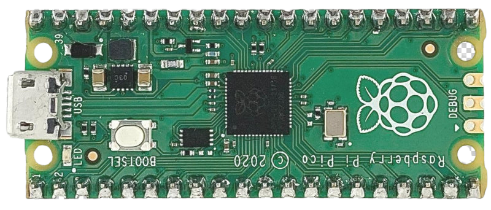</td>
           <td align=center></td>
       </tr>
    </table>
</div>

## 2025/09/06 ~ 2025/09/12
**Member:** HU,SIAN-YI, LIN ZHAN-RONG, ZHANG YI-WEI

**Content:**

### **Steering Optimization, Complex Parking Flow, and Assembly Experience**

#### **1. Correction of Third-Generation Steering Torque Issue**
After identifying a **torque structure problem** in the third-generation steering mechanism, we implemented a critical correction:
* **Component Replacement:** We **deprecated the original spherical cross joint component**.
* **Optimization Goal:** The **rounded end was moved to the linkage rod**, ensuring that when the **steering angle is 0 degrees**, the **steering rack and the linkage rod are precisely aligned at 90 degrees**, thus optimizing mechanical transmission efficiency.

#### **2. New Complexified Parking Procedure Flow**
* **Procedure Refinement:** We began **rewriting a new autonomous car parking procedure flow**.
* **Design Objective:** The new parking flow is designed to be **more complex than the procedure used in the National Competition**, anticipating stricter requirements in the World Final.

A comparison diagram of the two procedures is shown below.

#### **3. Experience Sharing on 3D Printed Parts Assembly**
* **Assembly Challenge:** We faced **significant difficulties** when **installing the spherical joint section of the steering structure** because the parts had already **undergone UV curing**.
* **Solution and Process:** Our solution involved the following steps:
    1.  Prior to **UV curing**, we first **finely sanded the parts with sandpaper**.
    2.  The parts were then **assembled** and placed into the **UV curing machine as an assembled unit**.
    3.  After curing was complete, **oil was applied to the connection points of the movable components**.
* **Result:** This sequence of steps **successfully resolved issues related to difficult assembly and rough rotation**.


 <div align=center>
    <table>
        <tr>
            <th>Fourth Generation Steering Structure (V4.0) </th>
            <th>Photo of Teammate Coding the Forward Parking Program</th></th>
        </tr>
        <tr>
            <td></td>
            <td></td>
        </tr>
    </table>
 </div>

 <div align=center>
    <table>
        <tr>
            <th>2025 National Competition: Parallel Reverse Parking Procedure Diagram</th>
            <th>2025 WRO World Final: Diagram of the Parallel Reverse Parking Procedure</th>
        </tr>
        <tr align=center>
            <td>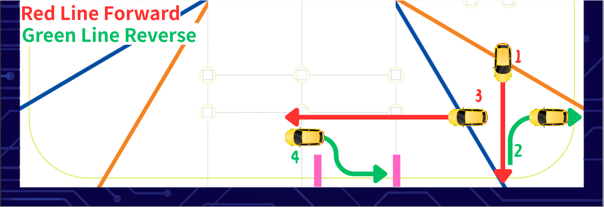</td>
            <td>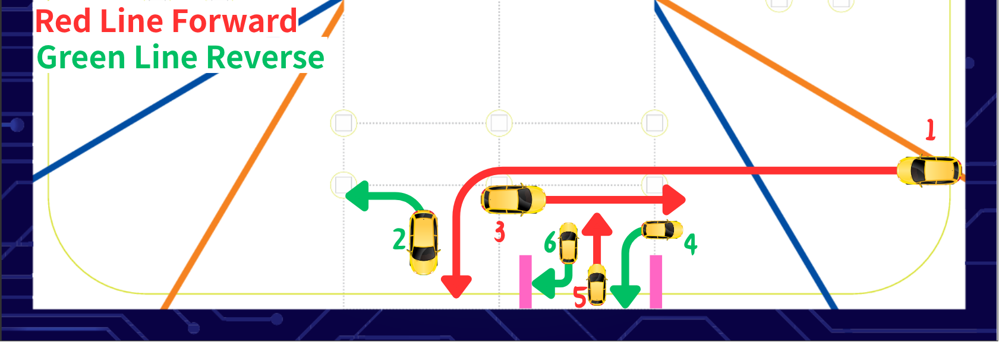</td>
        </tr>
    </table>
 </div>

 <div align=center>
    <table>
        <tr>
            <th>Fine Sanding the Ball Joints of the Steering Mechanism</th>
            <th>Assembly of the Steering Mechanism</th>
        </tr>
        <tr>
            <td></td>
            <td></td>
        </tr>
        <tr>
            <th>Ultraviolet (UV) Post-Curing of 3D Printed Parts</th>
            <th>Applying Silicone Oil to the Ball Joints</th>
        </tr>
        <tr>
            <td></td>
            <td></td>
        </tr>
    </table>
 </div>

## 2025/09/07 ~ 2025/09/13
**Member:** HU,SIAN-YI, LIN ZHAN-RONG, ZHANG YI-WEI

**Content:**

### **Jetson Nano System Downgrade and Dedicated Workstation Setup** 

As the **newly purchased Nvidia Jetson Nano** was equipped with the **latest operating system version (JetPack 6.2.1)**, testing revealed that it **did not support** the **IMX477 camera module**, a crucial piece of equipment for our competition.

To resolve this critical issue, we decided to **downgrade the operating system to JetPack version 5.1.2**, which ensures that the camera module is supported and fully operational.

During this process, we learned the procedures for **upgrading and downgrading the JetPack system** from our instructor. However, since the **Nvidia SDK Manager** requires a **physical Ubuntu host machine** to function correctly, our instructor specially **set up an Ubuntu system host machine** at the back of the club room, dedicated solely to operating the SDK Manager.

The procedure for using the SDK Manager to perform JetPack upgrades and downgrades is as follows.

 <div align=center>
    <table>
        <tr>
            <th colspan=2>Learning the Operational Procedures for JetPack Operating System Upgrades and Downgrades </th>
        </tr>
        <tr>
            <td></td>
            <td></td>
        </tr>
    </table>
 </div>

- ### Installation Commands 

 ```bash
wget https://developer.download.nvidia.com/compute/cuda/repos/ubuntu2204/x86_64/cuda-keyring_1.1-1_all.deb
sudo dpkg -i cuda-keyring_1.1-1_all.deb
sudo apt-get update
sudo apt-get -y install sdkmanager
 ```

  - ### NVIDIA SDK Manager: Operational Procedure for JetPack OS Upgrades and Downgrades
<div align=center>
<table>
<tr>
<th>Connect Host - Connect the Jetson Orin Nano controller to the Ubuntu host machine via a USB cable..</th>
<th>Confirm Connection - Verify that the Jetson Orin Nano is successfully connected and recognized by the SDK Manager.</th>
<th>Select Dev Kit - Select the target Developer Kit in the interface.</th>
</tr>
<tr>
<td>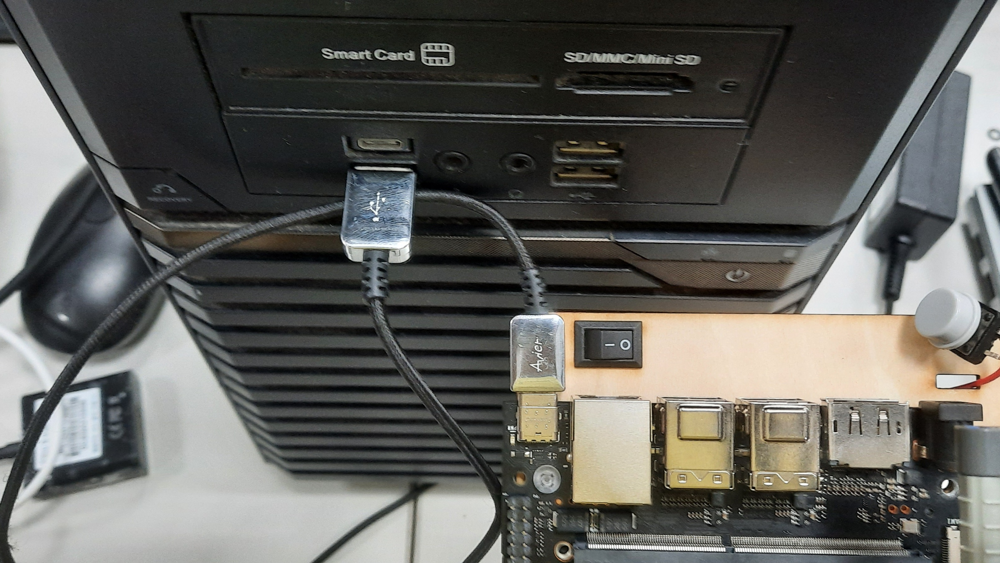</td>
<td>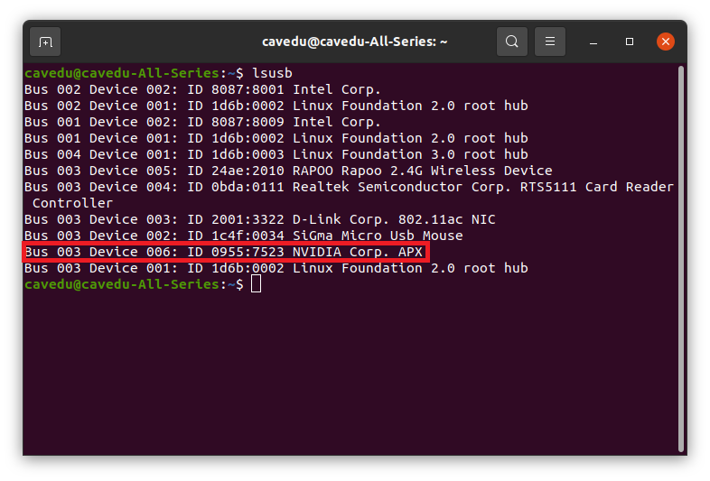</td>
<td>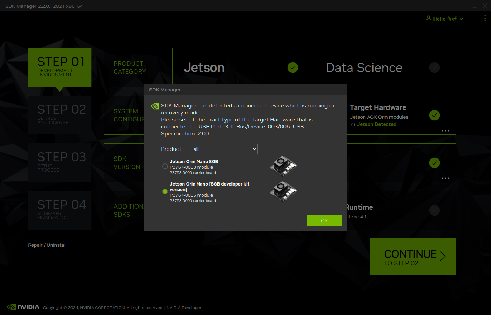</td>
</tr>
<tr>
<th>Choose Version - Select the desired JetPack version from the menu for installation or downgrade.</th>
<th>Check Options - Check the required software components on the left side (such as OS, SDKs), and click "Next".</th>
<th>Enter Password - Enter the administrator password as prompted.</th>
</tr>
<tr>
<td>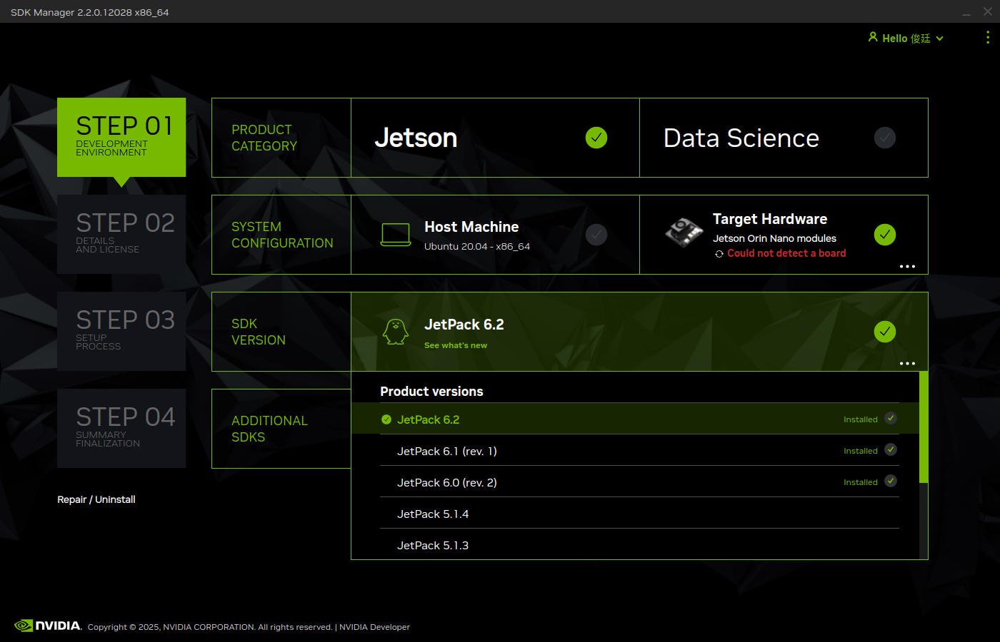</td>
<td>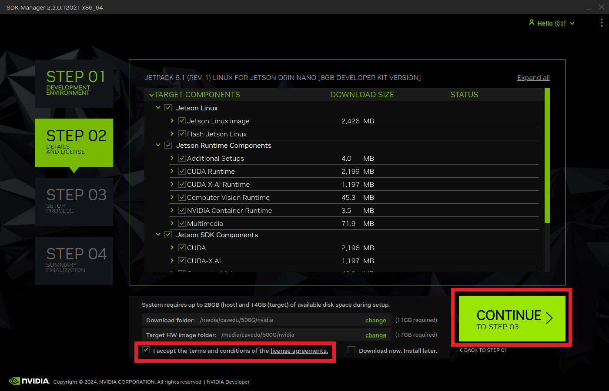</td>
<td>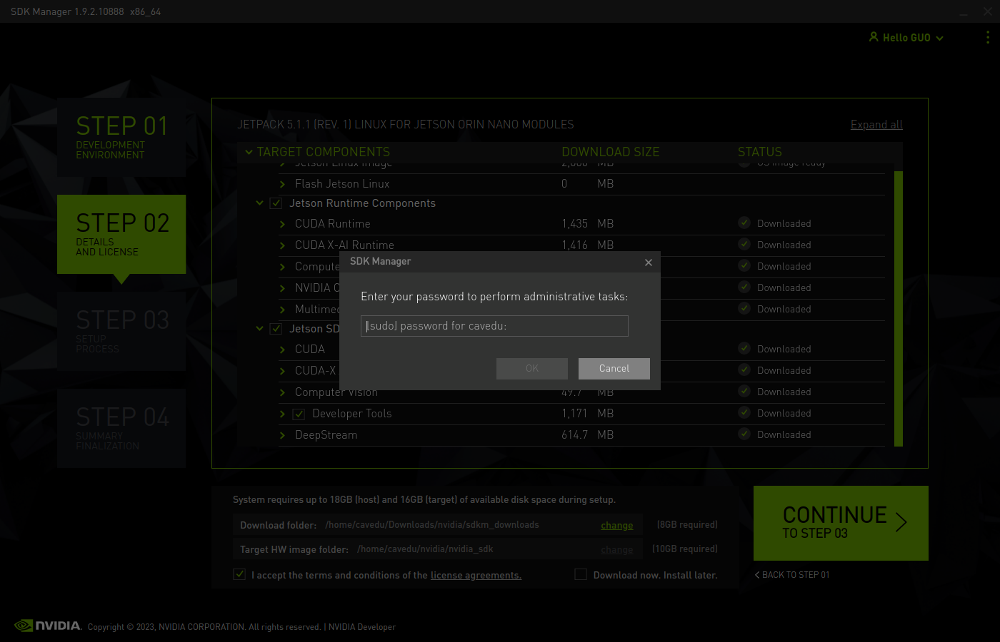</td>
</tr>
<tr>
<th>Fill Info - Fill in the relevant information for the target board.</th>
<th>Finish Install - After installation is complete, click "Finish" to exit.</th>
<th>System Interface - The Jetson Orin Nano system interface after installation is complete (Result presentation).</th>
</tr>
<tr>
<td>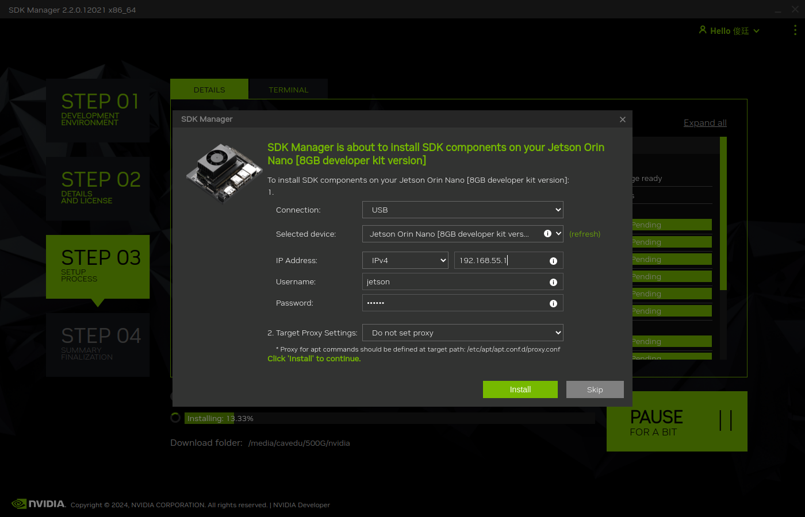</td>
<td>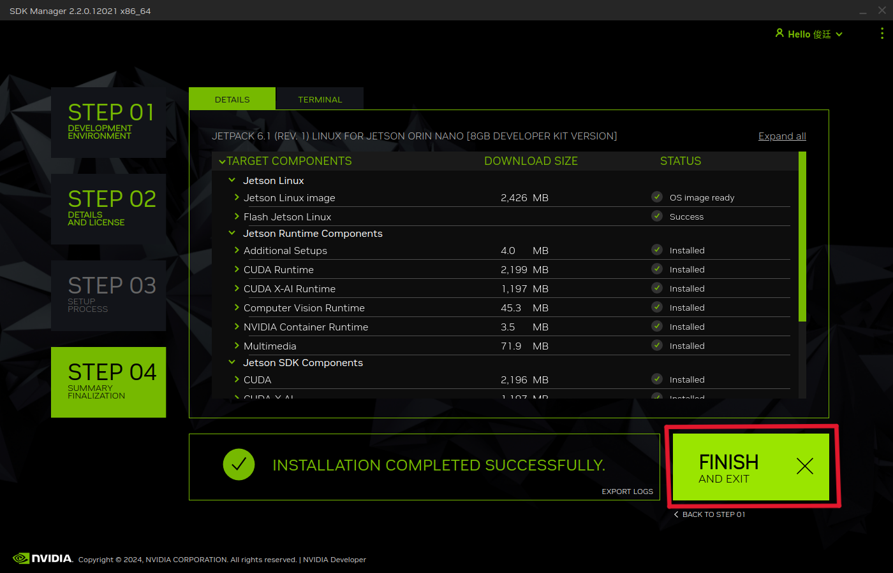</td>
<td>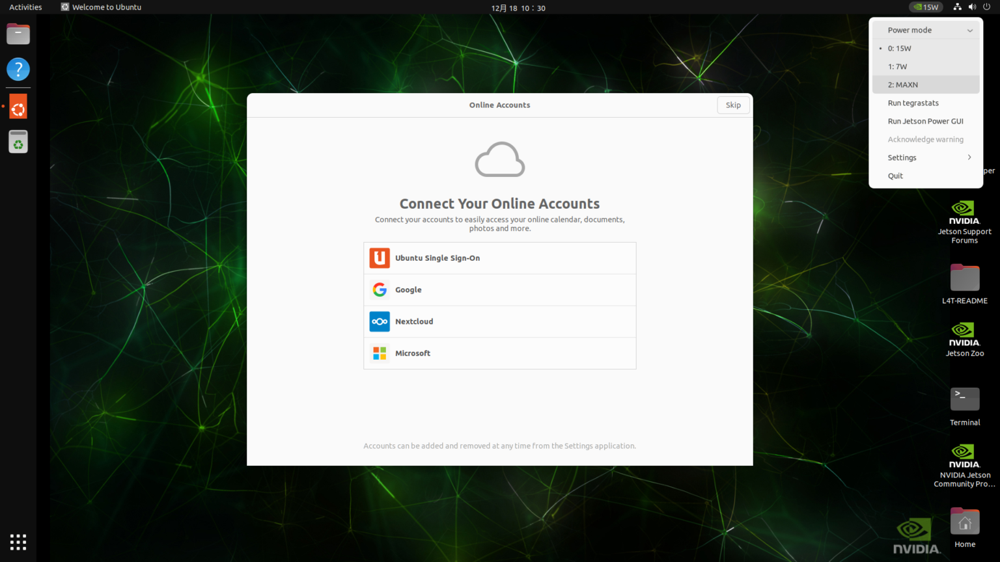</td>
</tr>
</table>
</div>

## 2025/09/14 ~ 2025/09/20
**Member:** HU,SIAN-YI, LIN ZHAN-RONG, ZHANG YI-WEI

**Content:**

### **V5.0 PCB Design Motivation and 3D Printing Precision Correction** 

#### **1. Fifth Generation PCB Design Requirement and Motivation**
Because we replaced the original I/O controller, the **Raspberry Pi Pico, with the Raspberry Pi Pico W**, we encountered an issue with **unavailable pins** when attempting to **switch the ultrasonic sensors to infrared sensors**. Furthermore, we needed to **add plug-in terminal blocks** to the circuit board for connecting the **power supply lines for the Jetson Orin Nano**. Consequently, we initiated the design process for the **Fifth Generation PCB**.

#### **2. Steering Knuckle Toe-in Issue: The Impact of 8K vs. 14K Print Precision**
This week, we discovered that the assembled **steering knuckles** exhibited a **toe-in** problem. This issue was related to the upgrade in 3D printer precision:
* **Older Prints:** Our first and second-generation steering structures were printed using a **Stereolithography (SLA) 3D Printer 8K**.
* **New Print and Issue:** The third and fourth-generation steering structures were upgraded to use a **Stereolithography (SLA) 3D Printer 14K**. However, the 14K printer, due to its precision characteristics, printed the component's angles **larger than the original design angle** in specific areas. This resulted in the vehicle's two front wheels exhibiting a **toe-in** issue after the steering structure was assembled.
* **Solution:** We made **further modifications to the steering knuckle design** to ensure the vehicle's two front wheels are **parallel**, thereby resolving the steering difficulty.

 <div align=center>
    <table>
        <tr>
            <th colspan=2>Design Evolution of the Fifth GenerationPCB (V5.0)</th>
        </tr>
        <tr>
            <td></td>
            <td></td>
        </tr>
        <tr>
            <th>Circuit schematic</th>
            <th>PCB layout drawing</th>
        </tr>
        <tr>
            <td></td>
            <td></td>
        </tr>
        <tr>
        <th>Overhead view of the main circuit board	</th>
         <th>Bottom View of the Main Circuit Board</th>
        </tr>
        <tr>
            <td align=center width="25%" >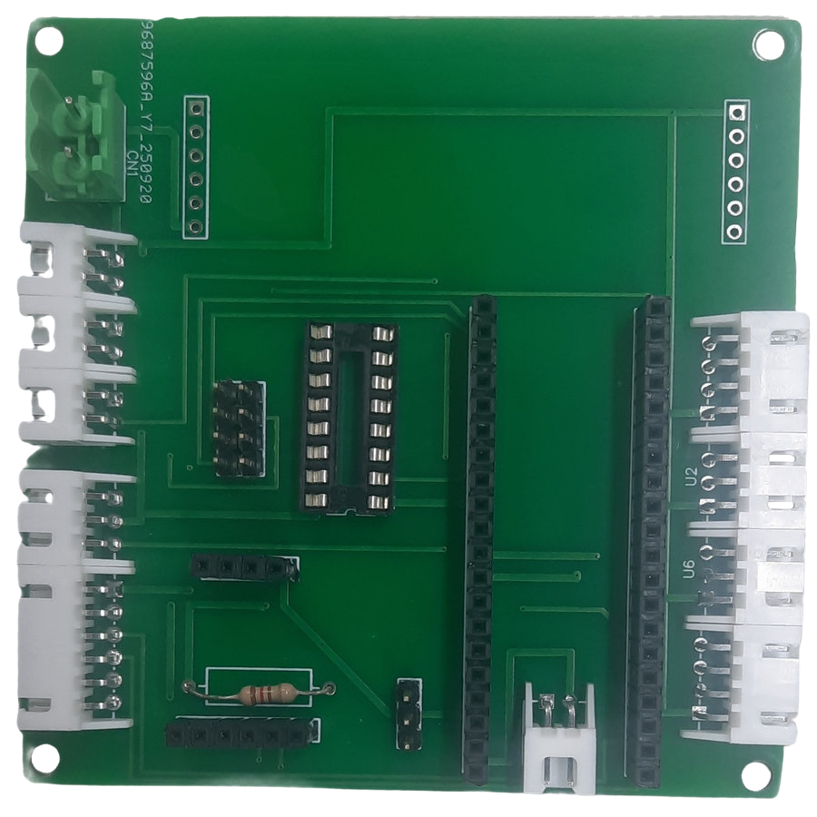</td>
            <td align=center width="25%">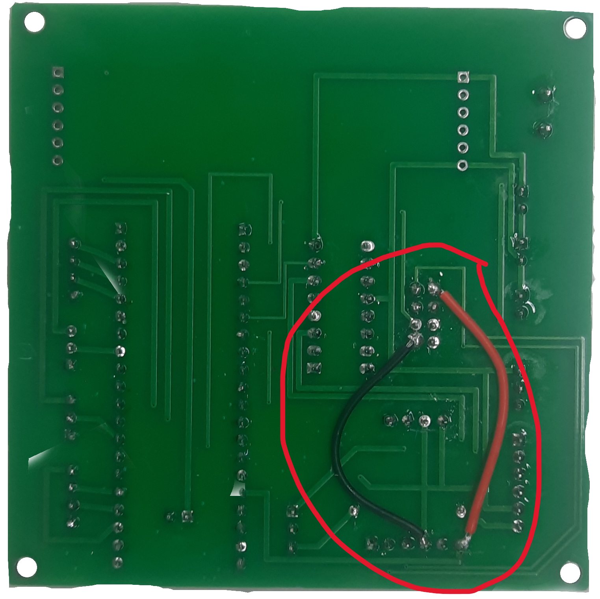</td>
        <tr>
        <th  colspan = 2>Comparison of Physical Print Results Between SLA 3D Printers at 8K and 14K Resolutions</th>
        </tr>
        <tr>
            <th> Stereolithography (SLA) 3D Printer 8K</th>
            <th> Stereolithography (SLA) 3D Printer 14K</th>
        </tr>
        <tr>
            <td align=center></td>
            <td align=center>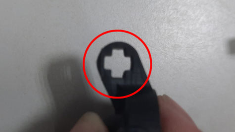</td>
        </tr>
        <tr>
            <th colspan=2>The Steering Structure Exhibits a Toe-in Phenomenon(This condition is visible as the two front wheels noticeably converge inwards)</th>
        </tr>
        <tr>
            <td colspan=2 align=center></td>
        </tr>
    </table>
 </div>

 ## 2025/09/21 ~ 2025/09/27
 **Member:** HU,SIAN-YI, LIN ZHAN-RONG, ZHANG YI-WEI

 **Content:**

### **Parking Positioning Sensor Optimization and BNO055 Power Correction**

#### **1. Hardware Adjustment for Parking Positioning Sensors**
* **Ultrasonic Sensor Repositioning:** Initially, our autonomous car's ultrasonic sensors were mounted on the **mid-rear sides of the vehicle body**, making it easy for the **entire vehicle body to leave the starting zone** without detecting the parking block. We therefore designed **new wooden plates and brackets** to mount the ultrasonic sensors on the **front sides of the autonomous car**.
* **Infrared Sensor Integration:** Since relying solely on ultrasonic sensors **could not achieve precise positioning for parking**, we decided to **add infrared sensors**, installing them on the **front and rear** of the car to **detect side walls and parking lot walls**. Consequently, we **redesigned the new vehicle chassis plate and L-shaped infrared brackets**.

#### **2. Electronic Correction of BNO055 Gyroscope Sensor Anomaly**
Upon receiving the new PCB (V5.0), testing revealed an intermittent issue where the **BNO055 gyroscope sensor** would return an angle reading of **zero**.
* **Root Cause:** This anomaly occurred because the sensor's VCC/GND was supplied by the **Raspberry Pi Pico W**, while its signal lines were connected to the **Jetson Orin Nano main controller**. This configuration, where the **power and signal sources were on different circuits (i.e., lacking a common ground reference)**, caused the sensor to **malfunction**.
* **Correction:** We revised the design to ensure that **both the power and signal sources for the BNO055 gyroscope sensor are uniformly supplied by the Jetson Orin Nano controller**, thereby **establishing a stable electrical potential reference**.

 <div align=center>
    <table>
        <tr>
            <th>Central Wooden Layer with Added Mounting Holes for the Ultrasonic Sensor Bracket.</th>
            <th>Additionally, the Central Wooden Layer After Modification to Include Infrared Sensor Bracket Mounting Holes.</th>
            <th>Synchronizing and Optimizing the Top Wooden Layer Based on the Revised Specifications of the Central Plate.</th>
        </tr>
        <tr>
            <td></td>
            <td>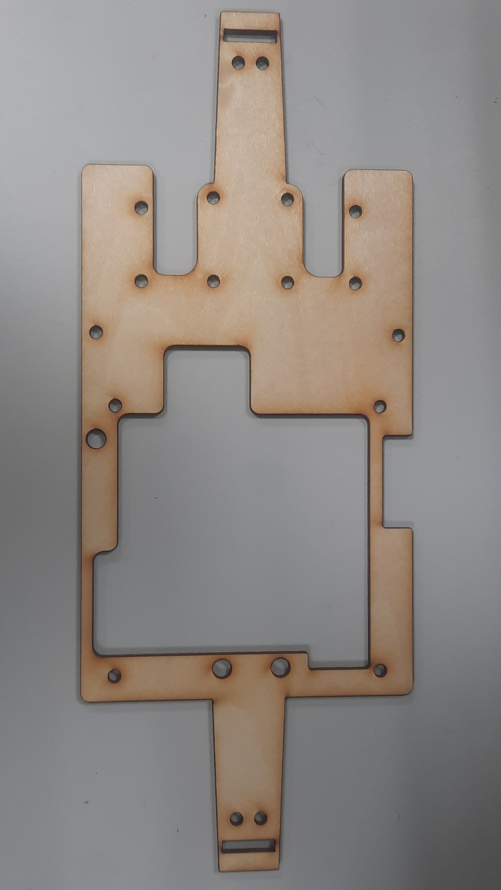</td>
            <td></td>
        </tr>
    </table>
 </div>

 <div align=center>
    <table>
        <tr>
            <th>Ultrasonic Sensor stent</th>
            <th>Infrared Sensor bracket</th>
        </tr>
        <tr>
            <td></td>
            <td></td>
        </tr>
    </table>
 </div>

 <div align=center>
    <table width=100%>
        <tr>
            <th colspan=2>Photo of the Actual Installation Location of the Ultrasonic Sensor.</th>
        </tr>
        <tr>
            <td colspan=2></td>
        </tr>
        <tr>
            <th colspan=2>Photo of the Final Actual Installation Location of the Infrared Sensor.</th>
        </tr>
        <tr align=center>
            <td width=50% >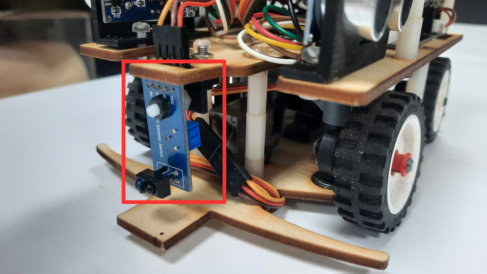</td>
            <td width=50% >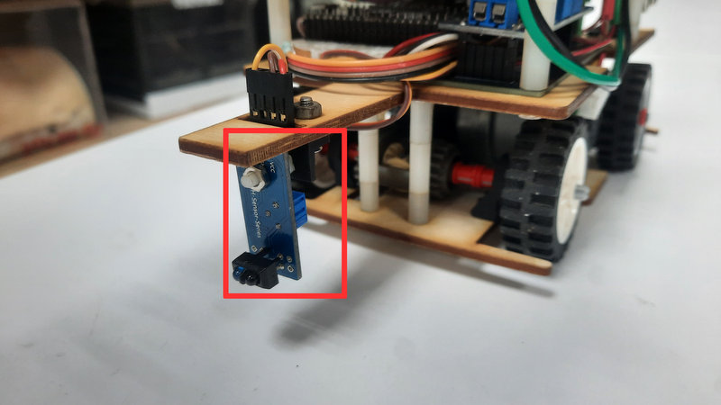</td>
        </tr>
    </table>
 </div>

 <div align=center>
    <table>
         <tr>
        <th colspan = 2 >Final Version(PCB)</th>
        </tr>
        <tr>
            <th>Circuit Schematic</th>
            <th>PBC Layout Drawing</th>
        </tr>
        <tr>
            <td align=center >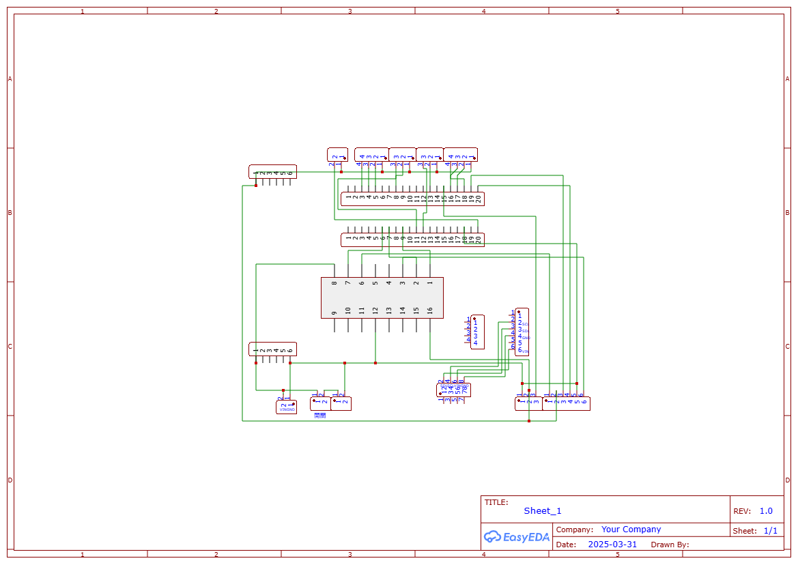</td>
            <td align=center ></td>
        </tr>
        <tr>
            <th>Overhead view of the main circuit board</th>
            <th>Bottom View of the Main Circuit Board</th>
        </tr>
        <tr align=center>
            <td></td>
            <td>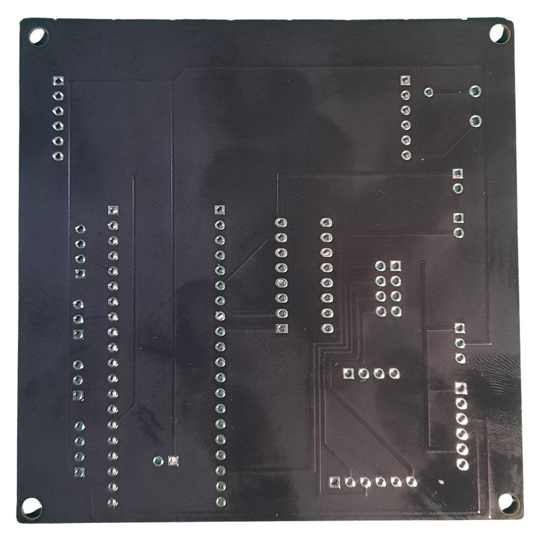</td>
        </tr>
    </table>
 </div>

 ## 2025/09/28 ~ 2025/10/06
 **Member:** HU,SIAN-YI, LIN ZHAN-RONG, ZHANG YI-WEI

 **Content:**

### **Post-National Competition Model Optimization and System Stability Enhancement** 

#### **1. Mechanism and Sensor Protection Optimization**
* **Shortening Wheelbase and Steering Correction:** While coding the exit procedure, we noticed the car was prone to colliding with parking blocks. We initially attempted to **modify the robot's overall wheelbase** by **removing empty space on the base plate to shorten the wheel distance**. Although the issue was mitigated, the tolerance remained too small. Thus, we further modified the **limit block of the steering linkage**, **reducing its size** to give the steering mechanism **more rotation space**.
* **Infrared Sensor Protection:** During testing, we found that if the autonomous car malfunctioned and **collided with a wall or block, the infrared sensors were usually the first to be damaged**. To protect them, we **shortened the front infrared mounting block** and **extended the base plate by 19 mm**, preventing the infrared sensors from sustaining impact damage due to erroneous judgment.

#### **2. Communication Hardware Replacement and Optimization**
* **Network Receiver Swap:** Since the autonomous car uses **WebSocket for data transmission**, the network antenna is critical. However, the original **TP-Link AC1300 receiver was about 18 CM long**, making it bulky. We found an alternative, the **ASUS AC1200 receiver**, which is only $2 \text{CM} \times 1.5 \text{CM}$ in size, and **replaced the original receiver with the ASUS AC1200**.

#### **3. Customized Camera Bracket Design**
* **Design Requirement:** The original camera bracket was **assembled using LEGO parts**, making it prone to accidental disassembly.
* **Custom Implementation:** We used **Onshape to design a custom camera bracket module**, consisting of two components: the **lens mounting plate** and the **main bracket body**.
* **Functional Enhancement:** To allow for future adjustments to the camera's viewing angle, we designed **angle-adjustable sliding rails** into the bracket module.

#### **4. Jetson Orin Nano Network AP Mode Setup**
* **Issue Discovered:** During testing, we realized the **Jetson Orin Nano's network had not been set to AP (Access Point) mode**; we were instead using a mobile phone as the network transmission medium.
* **AP Mode Setup:** By searching online, we successfully found the commands to enable the **Jetson Orin Nano's AP mode** and configured it for **automatic startup**.

The commands for manual setup and using the auto-script are provided below.

 <div align=center>
    <table>
        <tr>
            <th>The Optimized and Revised Vehicle Bottom Wooden Layer.</th>
            <th>The Revised Vehicle Mid-Layer Wooden Plate.</th>
        </tr>
        <tr>
            <td align=center></td>
            <td align=center></td>
        </tr>
    </table>
 </div>

 <div align=center>
    <table>
        <tr>
            <th>Lens Mount with Integrated Light Shielding Functionality.</th>
            <th>Lens Module Fine-Tuning Mechanism.</th>
        </tr>
        <tr>
            <td align=center></td>
            <td align=center>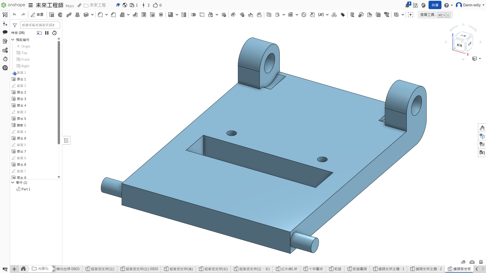</td>
        </tr>
    </table>
 </div>

 <div align=center>
    <table>
        <tr>
            <th>TP-Link AC1300 Wi-Fi Wireless Adapter</th>
            <th>ASUS AC1200  Wi-F  Wireless Adapter</th>
        </tr>
        <tr>
            <td align=center ></td>
            <td align=center ></td>
        </tr>
    </table>
 </div>

 - #### Setting Up Access Point (AP) Mode: Manual Command Operation.

    ```bash
    sudo nmcli dev wifi hotspot ifname wlan0 ssid "snjh_jetson" password "1234567890" 

    sudo nmcli connection modify Hotspot connection.autoconnect yes
    sudo systemctl enable NetworkManager.service
    sudo systemctl status NetworkManager

    ```

 - #### Setting Up Access Point (AP) Mode: Using Automated Script Execution[Set_AP.sh](../../src/System_Platform_Software/code/Set_AP.sh)

    ```bash
    sudo bash ./Set_AP.sh 
    ```

 ## 2025/10/07 ~ 2025/10/13
 **Member:** HU,SIAN-YI, LIN ZHAN-RONG, ZHANG YI-WEI

 **Content:**

### **System Stability, Startup Mechanism, and Hardware Optimization** 

#### **1. Image Recognition Stability Correction**
* **Root Cause:** While conducting **LAB value tuning**, we found that although the values were normal during the adjustment phase, the program **failed to accurately identify objects** during actual operation. Testing confirmed the issue stemmed from **environmental light interference** and **overly strict value tolerances**.
* **Solution:** We implemented two corrective measures:
    1.  **Adding a light shield (hood) above the lens mount**.
    2.  **Allowing a larger margin of error** after tuning the LAB values for a specific object.

#### **2. WebSockets Blocking Issue and Isolated Startup Circuit**
* **Communication Blockage:** During testing, we found that **WebSockets would block all previous actions until a connection was successfully established**, executing them simultaneously afterward. This caused anomalies upon program startup, such as the **robot moving forward while the servo motor was inactive, or the chassis being unresponsive**.
* **Startup Control Transfer:** To resolve this, we decided to assign **program startup control to the Jetson Orin Nano**.
* **Circuit Correction:** We needed to modify the program start button circuit. During this change, we encountered a problem where the **button's pressed state was not updating**. Consulting online resources revealed the necessity of connecting the circuit using a **pull-up resistor**.
* **Isolated PCB Design:** Consequently, we used **EasyEDA to custom-design a separate circuit board** dedicated solely to the **program startup button circuit**.

#### **3. Lens Mount Structure Optimization**
* **Adding Light Shield:** Since a light shield was required, we **added LEGO pinholes** to the lens mount for mounting a **LEGO $5 \times 11$ Technic panel**.
* **Adding Screw Holes:** Later, because we designed the **second independent button/LED circuit board**, we designed **screw holes** above the lens mount for installing this secondary board.

---

### **Independent Switch Control Board (Secondary PCB) Summary**

The purpose of this independent board is:
* **Start Button Integration:** The start button circuit is **independently connected to the Jetson Orin Nano's GPIO interface**, ensuring the main controller detects the start command as per regulations.
* **Debugging and Status Display:** An **RGB LED was added** to the board to optimize the debugging process.
* **Function:** The LED is used to **display the color of the nearest object detected by the vehicle in real-time**, facilitating quick diagnostics and status monitoring.
* **Role:** **This board is dedicated to the autonomous car's start button control and status indication**.

 <div align=center>
 <table>
    <tr>
      <th colspan=3>Switch Control Circuit Board (Secondary PCB)</th>
      </tr>
      <tr>
      <th>3D view</th>
      <th>circuit schematic</th>
      <th>PBC layout drawing</th>
      </tr>
      <tr>
      <td align=center >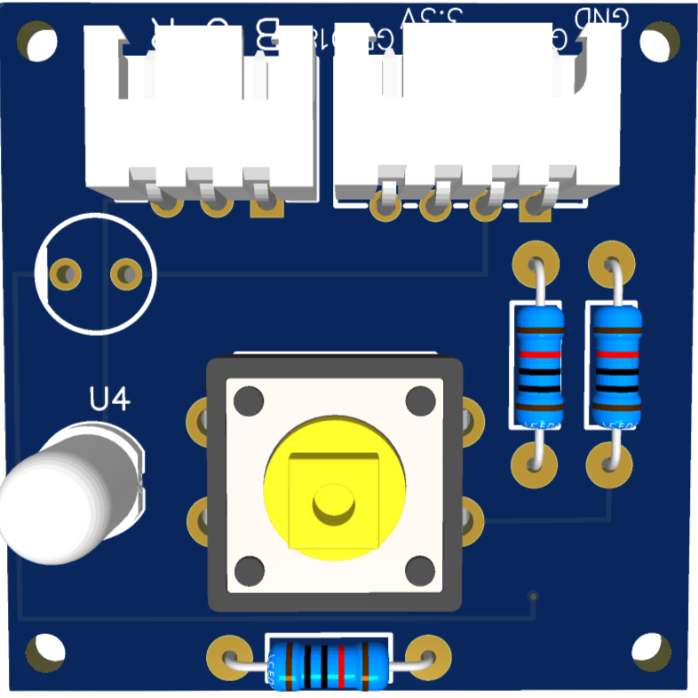</td>
         <td align=center >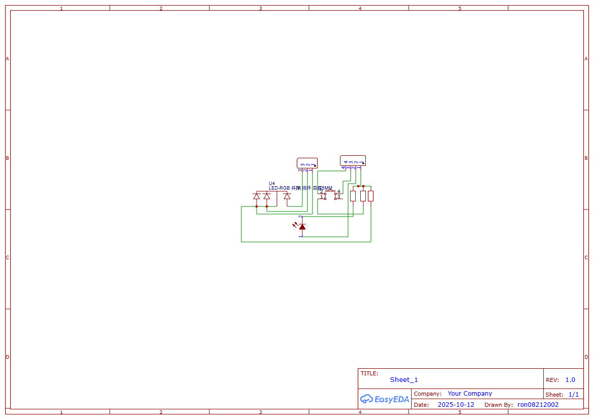</td>
         <td align=center >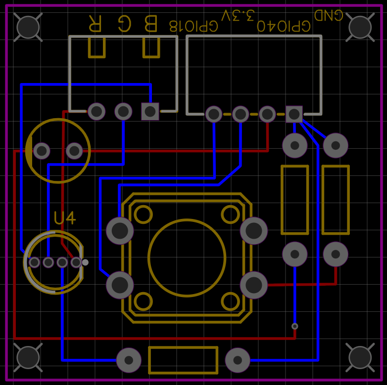</td>
      </tr>
      <tr>
      <th align=center colspan=3>	Overall circuit schematic  </th> 
      </tr>
      <tr>
    <td align=center colspan=3>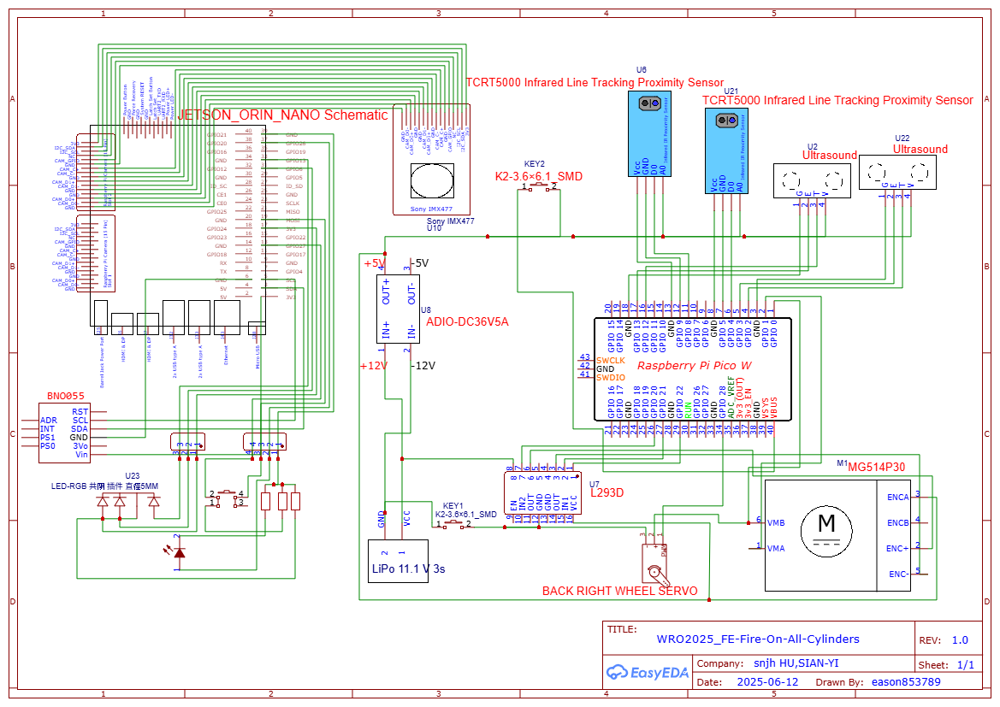
   </td>
   </tr>
      </tr>
      </table>
      </div>


<div align=center>
    <table>
        <tr>
            <th colspan=2>Lens Mount with Integrated Light Shielding Functionality</th>
        </tr>
        <tr>	
            <th>Lens Mount</th>
            <th>Lens Module Fine-Tuning Mechanism</th>
        </tr>
        <tr>
            <td align=center width=500></td>
            <td align=center width=500>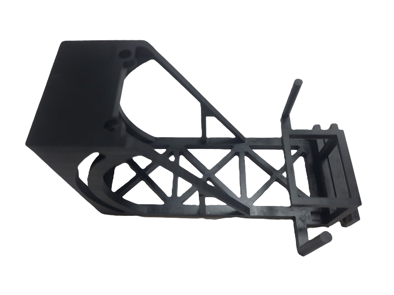</td>
        </tr>
        <tr>	
            <th>Lens Mount Physical Side View</th>
            <th>Lens Mount Physical Front View</th>
        </tr>        
        <td align=center width=500>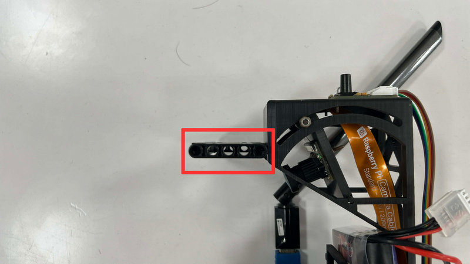</td>
        <td align=center width=500>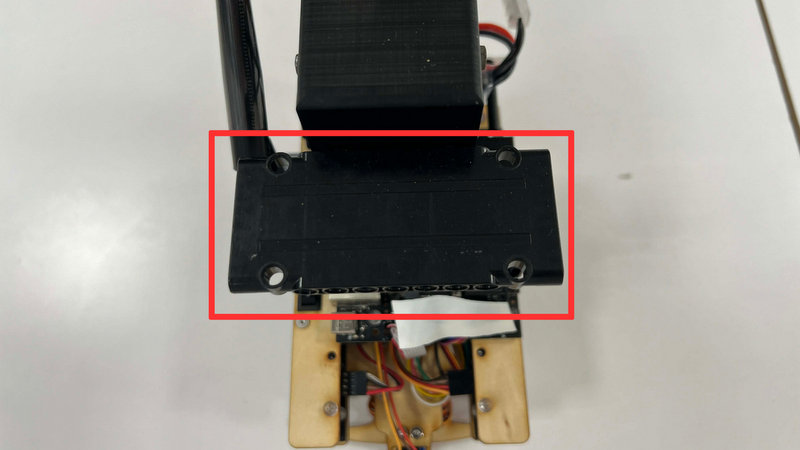</td>
        </tr>
    </table>
</div>


 ## 2025/10/14 ~ 2025/10/20
 **Member:** HU,SIAN-YI, LIN ZHAN-RONG, ZHANG YI-WEI

 **Content:**


### **Infrared Sensor-Assisted Parking and Signal Reading** 

This week, we implemented the **parking procedure using the infrared sensors installed on the front and rear of the robot**.

The **analog signal reading procedure for the infrared sensors** is shown below.

    ```python
    class TCRT5000:
        def __init__(self, adc_pin):
            try:
                self.adc = ADC(Pin(adc_pin))
            except:
                self.adc = None

        def read_raw(self):
            try:
                return self.adc.read_u16()
            except:
                return -1

        def read_percentage(self):
            try:
                raw = self.read_raw()
                if raw == -1:
                    return -1
                percentage = (raw / 65535) * 100
                return round(percentage, 1)
            except:
                return -1

    ```

 ## 2025/10/21 ~ 2025/10/26
 **Member:** HU,SIAN-YI, LIN ZHAN-RONG, ZHANG YI-WEI

 **Content:**
### **Final Program Architecture Completion and Video Production** 

* **Final Architecture and Flow:** This week, we have **completed the final program architecture**. Following previous hardware and logic modifications, our **parking procedure flow has also undergone slight adjustments and optimization**. The diagram below illustrates the **sequential flow of the final version of the parking procedure**.
* **Video Production:** After finalizing the program architecture and procedures, we also **commenced the filming of the introduction video**.
    * **[5-1 Open Challenge rounds](video/Open_Challenge/video.md)**
    * **[5-2 Obstacle Challenge rounds](video/Obstacle_Challenge/video.md)**


 <div align=center>
    <table>
        <tr>
            <th>Final Version Parking Procedure Flow Diagram.</th>
        </tr>
        <tr>
            <td width=1000 align=center>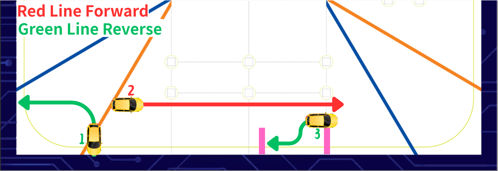</td>
        </tr>
    </table>
 </div>


 ## 2025/10/27 ~ 2025/11/01
 **Member:** HU,SIAN-YI, LIN ZHAN-RONG, ZHANG YI-WEI

 **Content:**
 
**All team members, working diligently overnight in accordance with their previously allocated responsibilities, are urgently continuing to upload the modified engineering documentation to the GitHub project repository**.

<div align=center>
    <table>
        <tr align=center>
            <td colspan=3>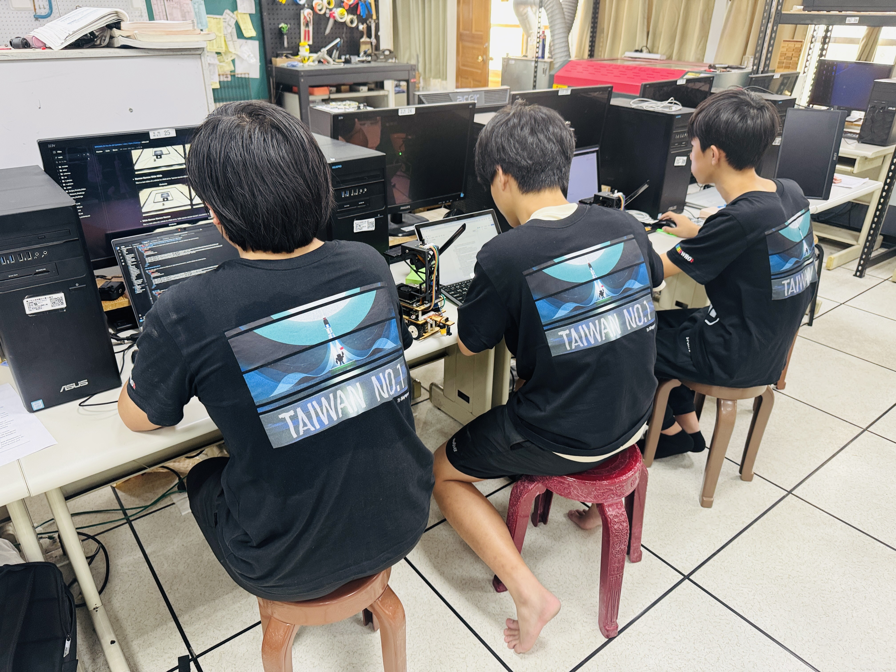</td>
        </tr>
        <tr align=center>
            <td></td>
            <td>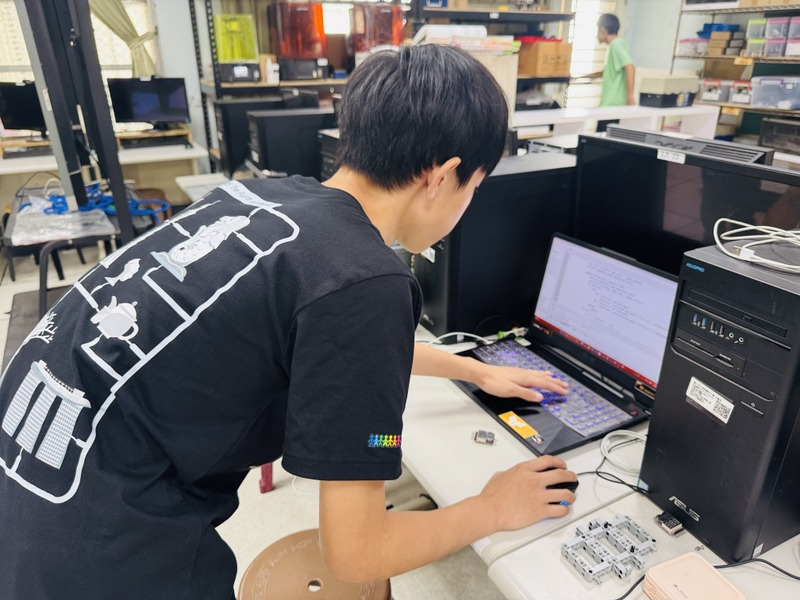</td>
            <td>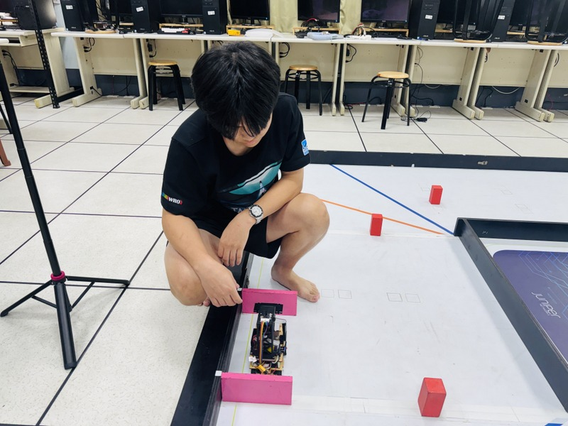</td>
        </tr>
    </table>
</div>

 ## 2025/11/02 ~ 2025/11/08
 **Member:** HU,SIAN-YI, LIN ZHAN-RONG, ZHANG YI-WEI

 **Content:**

### **Communication Protocol Adjustment and Ongoing Engineering Document Updates**

#### **1. Communication Protocol Adjustment Decision and New Challenge**
   - Following confirmation with the **World Final judges** a few days ago, the communication between the main and auxiliary controllers (**Jetson Orin Nano** and **Raspberry Pi Pico W**) **is prohibited from using stable wireless communication protocols such as WebSocket**.

   - Given this rule restriction, we decided to **abandon the previously investigated WebSocket solution** and **revert to the established UART (Universal Asynchronous Receiver-Transmitter) communication protocol** for data transmission.

   - However, since the main controller has been upgraded to the **Jetson Orin Nano**, and we **have not yet implemented UART communication on this specific controller**, this presents a **new technical challenge** for the team.

#### **2. Engineering Document Progress**
   - **Continuing to modify engineering documentation on the GitHub project repository**.


 # <div align="center">[Return Home](../../)</div>


