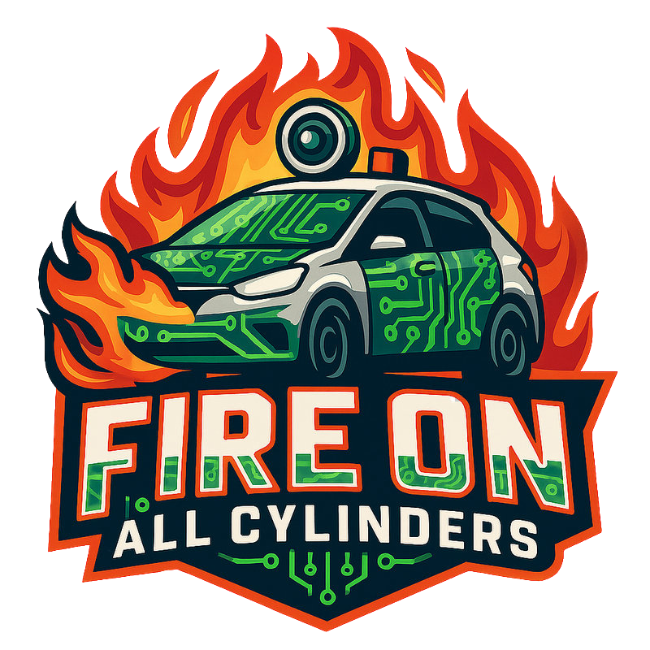
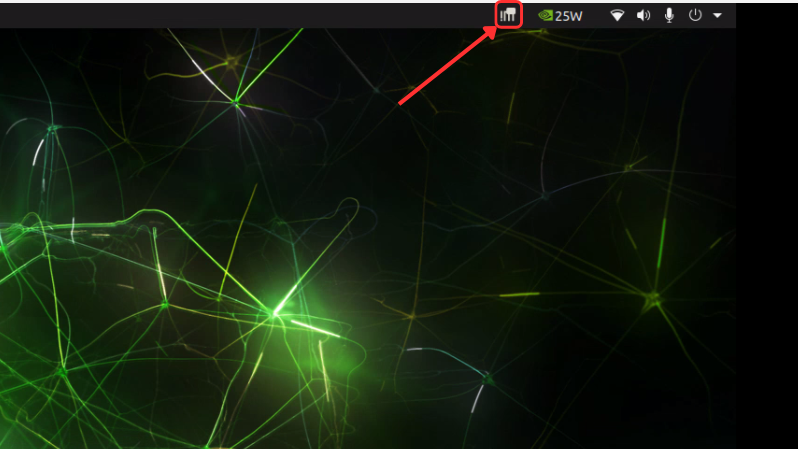
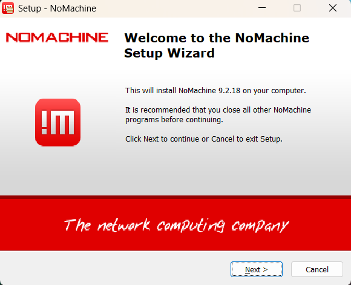
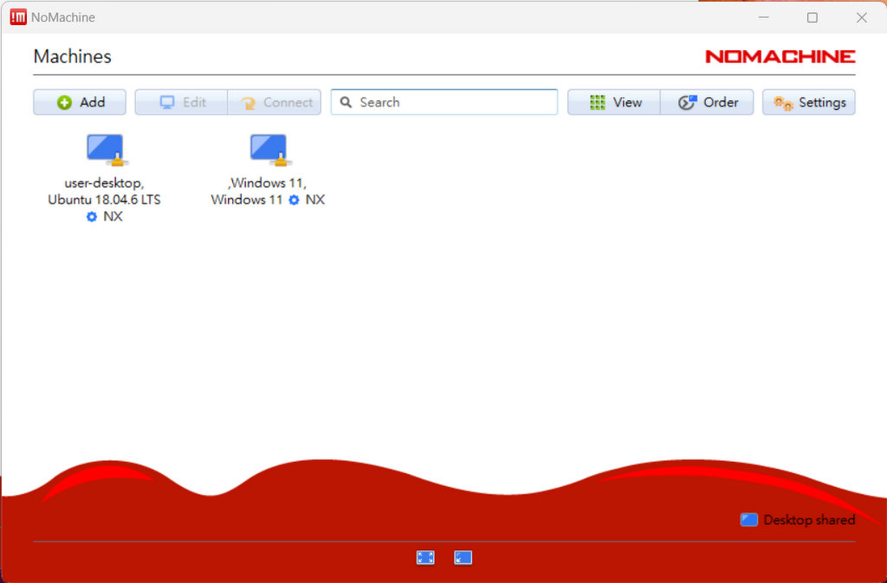
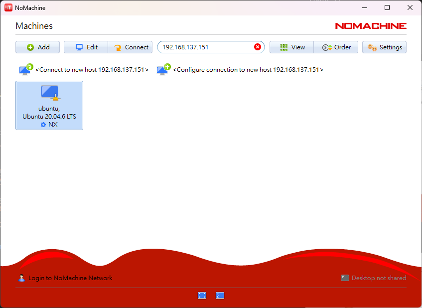
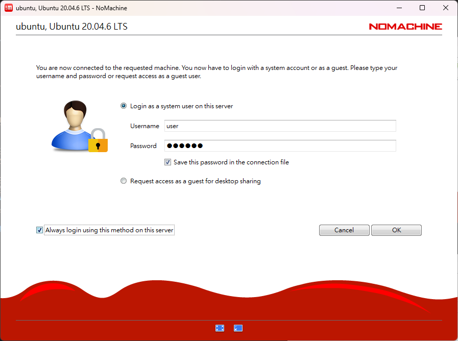
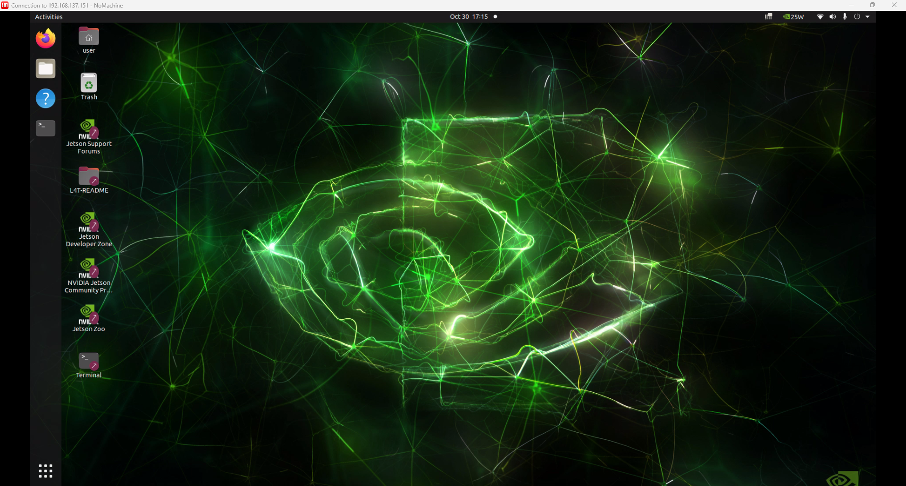

<div align="center"></div>

## <div align="center">NoMachine software Introduction</div> 


- NoMachine is a high-performance remote desktop access software that offers cross-platform support, allowing users to remotely connect to another computer anytime, anywhere. Its main features include a fast and smooth remote operation experience, compatible with various operating systems such as Windows, macOS, Linux, iOS, and Android.
- NoMachine uses advanced image compression technology to ensure high-quality graphics and audio transmission, even in low-bandwidth network environments. Additionally, NoMachine supports remote printing, file sharing, USB transfer, and other functions, making it ideal for remote work, technical support, and multi-device management. 
- Especially for development platforms like the NVIDIA® Jetson Orin Nano, NoMachine provides a convenient solution for wireless remote control, greatly enhancing device operational flexibility and application possibilities.

- ### Installing NoMachine software
    - #### NVIDIA® Jetson Orin Nano System Configuration
         
      To install NoMachine on an NVIDIA® Jetson Orin Nano, follow these steps:

      __Download NoMachine for Linux ARM:__

        - In the control interface of the Jetson Orin Nano, open a browser and navigate to the <a href="https://download.nomachine.com/download/?id=30&platform=linux&distro=arm" target="_blank">NoMachine download page</a>. Look for and select the NoMachine for Linux ARM (64-bit) software package compatible with the Jetson Orin Nano.     

        
        - After the download is complete, open the terminal and enter cd Downloads to navigate to the download folder.
        ```
        cd Documents
        ```
        - Next, the user needs to execute the corresponding command-line instruction to complete the software package installation. The software packages for this system all use the Debian package format (.deb).
        ```
        sudo dpkg -i nomachine_9.2.18_3_armhf.deb
        ```
       
        If you see this icon, the installation is complete.
        
        

    - #### Computer Configuration for Windows Systems 

      To install NoMachine on Windows System, follow these steps:
      
      __Download NoMachine for Windows (64-bit)__

        - In a Windows computer, open a browser and go to the <a href="https://download.nomachine.com/download/?id=3&platform=windows" target="_blank">NoMachine download page</a>. Find and select the NoMachine for Windows (64-bit) software package to download the version compatible with Windows.
        - After downloading, run the installation file. You will need to __restart__ the computer afterward.
        


    - #### Connecting to Jetson Orin Nano-連接到 Jetson Orin Nano
         在 Windows 上開啟 NoMachine。
         Open NoMachine on Windows.

         

        輸入 Jetson Orin Nano 的 IP 位址。

        尋找 IP 位址。

        Enter the Jetson Orin Nano IP address.

        Find the IP address.
        ```
        ifconfig  
        ```
        尋找用戶名。

        Find the username.
        ```
        hostname 
        ```
        

        連線後，輸入使用者名稱和密碼。

        After connecting, enter the username and password. 
        

        完成後，您就可以連線了。

        Once done, you’ll be able to connect.
        

    - #### Reference link:-參考連結：
    - <a href="https://www.waveshare.net/wiki/JetRacer_ROS_AI_Kit_%E6%95%99%E7%A8%8B%E4%BA%8C%E3%80%81%E5%AE%89%E8%A3%85Jetson_nano_%E9%95%9C%E5%83%8F?fbclid=IwZXh0bgNhZW0CMTEAAR0V-M05bMx0xIQx-QcMI9sqtP8dBWXZpjhOegNngVdwizYW9Frqc738AiA_aem_wfqPbQnY9yv5tcLjEwcHYw#Jetson_Nano.E4.B8.8A.E5.AE.89.E8.A3.85" target="_blank">Waveshare Wiki</a>
    - <a href="https://www.nomachine.com/" target="_blank">NoMachine Website</a>
    - <a href="https://en.wikipedia.org/wiki/NX_technology" target="_blank">Wikipedia</a>

# <div align="center">[Return Home](../../)</div> 
