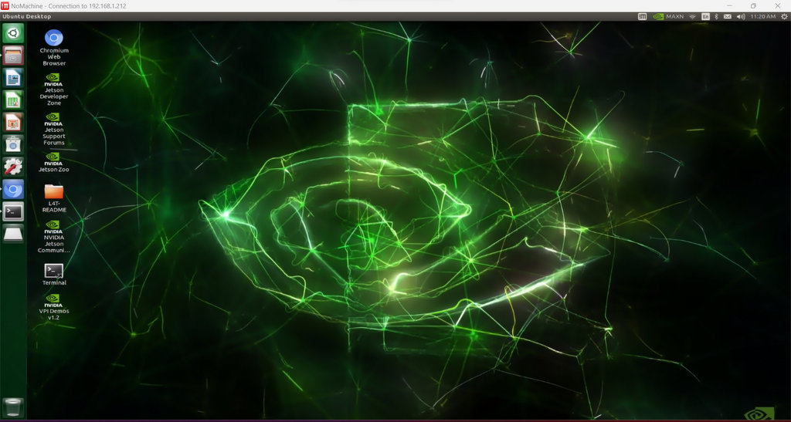

<div align="center"></div>

## <div align="center">NoMachine Introduction-NoMachine簡介</div> 
### 中文
- NoMachine 是一款高效能的跨平台遠端桌面存取軟體，可讓使用者隨時隨地遠端連線到另一台電腦。其主要特點包括快速流暢的遠端操作體驗，並相容於 Windows、macOS、Linux、iOS 和 Android 等各種作業系統。
- NoMachine 採用先進的影像壓縮技術，即使在低頻寬網路環境下也能確保高品質的圖形和音訊傳輸。此外，NoMachine 還支援遠端列印、檔案共享、USB 傳輸等功能，使其成為遠端辦公、技術支援和多裝置管理的理想選擇。
- 特別針對 NVIDIA® Jetson Nano 等開發平台，NoMachine 提供了便利的無線遠端控制解決方案，大幅提升了裝置操作的靈活性和應用可能性。
### 英文 
- NoMachine is a high-performance remote desktop access software that offers cross-platform support, allowing users to remotely connect to another computer anytime, anywhere. Its main features include a fast and smooth remote operation experience, compatible with various operating systems such as Windows, macOS, Linux, iOS, and Android.
- NoMachine uses advanced image compression technology to ensure high-quality graphics and audio transmission, even in low-bandwidth network environments. Additionally, NoMachine supports remote printing, file sharing, USB transfer, and other functions, making it ideal for remote work, technical support, and multi-device management. 
- Especially for development platforms like the NVIDIA® Jetson Nano, NoMachine provides a convenient solution for wireless remote control, greatly enhancing device operational flexibility and application possibilities.

- ### Installing NoMachine-安裝NoMachine
    - #### On the NVIDIA® Jetson Nano-在 NVIDIA® Jetson Nano 上
      若要在 NVIDIA® Jetson Nano 上安裝 NoMachine，請依照下列步驟操作：
      
      To install NoMachine on an NVIDIA® Jetson Nano, follow these steps:

      __Download NoMachine for Linux ARM:-下載適用於 Linux ARM 的 NoMachine：__
      ### 中文
        - 在 Jetson Nano 的控制器介面中，開啟瀏覽器並導航至 <a href="https://downloads.nomachine.com/download/?id=1" target="_blank">NoMachine 下載頁面</a>。尋找並選擇與 Jetson Nano 相容的 NoMachine for Linux ARM（64 位元）軟體套件。
        - 下載完成後，打開終端機並輸入 cd Downloads 導航至下載資料夾。
        ### 英文
        - In the Jetson Nano’s controller interface, open a browser and navigate to the <a href="https://downloads.nomachine.com/download/?id=1" target="_blank">NoMachine download page</a>. Locate and select the NoMachine for Linux ARM (64-bit) software package, which is compatible with the Jetson Nano.      
        - After downloading, open the terminal and enter cd Downloads to navigate to the folder.-下載後，打開終端機並輸入 cd Downloads 導航到該資料夾。
        ```
        cd Downloads
        ```
        - Then, enter unzip Nomachine_7.10.1_1_arm64.zip to unzip the file.
        ```
        sudo dpkg -i Nomachine_7.10.1_1_arm64.zip
        ```
       
        If you see this icon, the installation is complete.
        
        <td></td>

    - #### On the Windows System  of Computer-在電腦Windows系統上       
      若要在 Windows 上安裝 NoMachine，請依照下列步驟操作：

      To install NoMachine on Windows, follow these steps:
      
      __Download NoMachine for Windows (64-bit)-下載適用於 Windows（64 位元）的 NoMachine__
       ### 中文
        - 在 Windows 電腦上，開啟瀏覽器並造訪 <a href="https://downloads.nomachine.com/windows/?id=3" target="_blank">NoMachine 下載頁面</a>。尋找並選擇適用於 Windows（64 位元）的 NoMachine 軟體包，下載與 Windows 相容的版本。
        - 下載完成後，執行安裝檔。安裝完成後，您需要__重新啟動__電腦。
        ### 英文
        - In a Windows computer, open a browser and go to the <a href="https://downloads.nomachine.com/windows/?id=3" target="_blank">NoMachine download page</a>. Find and select the NoMachine for Windows (64-bit) software package to download the version compatible with Windows.
        - After downloading, run the installation file. You will need to __restart__ the computer afterward.
        <td></td>


    - #### Connecting to Jetson Nano-連接到 Jetson Nano
         在 Windows 上開啟 NoMachine。
         Open NoMachine on Windows.

         
        輸入 Jetson Nano 的 IP 位址。

        尋找 IP 位址。

        Enter the Jetson Nano IP address.

        Find the IP address.
        ```
        ifconfig  
        ```
        尋找用戶名。

        Find the username.
        ```
        hostname 
        ```
        <td></td>
        連線後，輸入使用者名稱和密碼。

        After connecting, enter the username and password. 
        <td></td>
        完成後，您就可以連線了。

        Once done, you’ll be able to connect.
        <td></td>

    - #### Reference link:-參考連結：
    - <a href="https://www.waveshare.net/wiki/JetRacer_ROS_AI_Kit_%E6%95%99%E7%A8%8B%E4%BA%8C%E3%80%81%E5%AE%89%E8%A3%85Jetson_nano_%E9%95%9C%E5%83%8F?fbclid=IwZXh0bgNhZW0CMTEAAR0V-M05bMx0xIQx-QcMI9sqtP8dBWXZpjhOegNngVdwizYW9Frqc738AiA_aem_wfqPbQnY9yv5tcLjEwcHYw#Jetson_Nano.E4.B8.8A.E5.AE.89.E8.A3.85" target="_blank">Waveshare Wiki</a>
    - <a href="https://www.nomachine.com/" target="_blank">NoMachine Website</a>
    - <a href="https://en.wikipedia.org/wiki/NX_technology" target="_blank">Wikipedia</a>

# <div align="center">[Return Home](../../)</div> 
