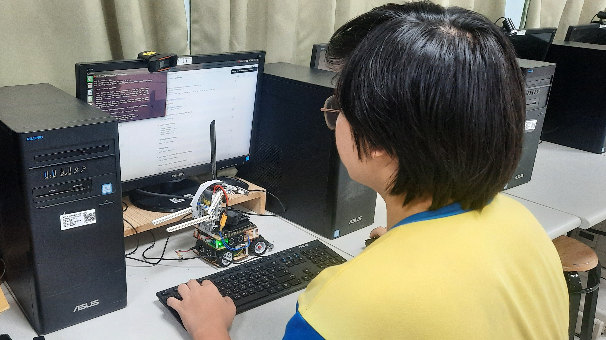

# 
Work Diary-工作日記

以下是本次自動駕駛汽車模型設計與任務解決的開發記錄，涵蓋了機械設計與製造、電路設計與實現、電子裝置選型、程式設計與測試以及整體的解題過程。

The following is a development record of the self-driving car model design and task-solving, covering mechanical design and manufacturing, circuit design and implementation, electronic device selection, programming and testing, and the overall problem-solving process.
## 2025/2/28 ~ 2025/3/30  

**成員:** 胡賢邑、林展榮、張奕崴 

**內容:**  

 - 我的搭檔隊友是胡賢邑過去幾年曾多次參與「未來工程師大賽」，在機械結構設計與程式控制優化方面累積了扎實的實戰經驗。然而，由於該競賽每年皆會更新主題與挑戰規則，我們經過深入討論後，決定對今年的參賽模型進行輕量化改良——將整體機構縮小，如此不僅能提升場地穿梭的靈活性，避免與障礙方塊發生碰撞，還能更好停車避免撞到牆，進一步強化競賽表現。

<table>
<tr align="center">
<th colspan="2">Last year's senior's model</th>
</tr>
<tr align="center">
<td></td> 
    <td></td> 
</tr>
</table>

<table>
<tr align="center">
<th >Refer to the seniors GitHub reports(參考學長姐們的Github報告)</th>
</tr>
<tr align="center">
<td> </td>
</tr>
</table>

## 2025/03/1 ~ 2025/03/7
**成員:** 胡賢邑、林展榮、張奕崴

**內容:**

 - 我們在這一周進行了主控制器系統安裝及測試，同時也開始了避障程序的撰寫和反覆測試穩定性、修改程序中的問題以求在避賽中取得亮眼的成績。

    

        <table>
            <tr align=center>
                <th width=50% style="text-align: center;">系統安裝</th>
                <th width=50% style="text-align: center;">避障程序撰寫</th>
            </tr>
            <tr>
                <td></td>
                <td></td>
            </tr>
        </table>
    

## 2025/03/11 ~ 2025/03/17

**成員:** 胡賢邑、林展榮、張奕崴

**內容:**  

 - 我們為了要讓電路板變得更整齊我使用洗電路板方式這樣的方式，開發第一代電路板，由於是初次接觸電路板設計，我們未能注意到設計軟體中提供的標準範例圖。當時我們自行測量了排針與排針之間的間距，結果在電路板製作完成後才發現間距設計過小，導致元件無法順利插接。這個寶貴的經驗促使我們立即著手改進，並很快做了第二代優化版本。

<table >
<tr align="center">
<th>第一代正面</th>
<th>第一代背面</th>
<tr align="center">
<td>
</td>
<td>
</td>
</tr>
</table>

## 2025/4/3 ~ 2025/4/14

**成員:** 胡賢邑、林展榮、張奕崴

**內容:**  

 - 在第二代版本開發過程中，我們基於第一代的反饋，透過內建範例圖重新校準排針間距，成功優化了原始設計。然而，因作業疏忽導致 PCB 佈局時誤將背面視圖當作正面設計，致使電路板輸出後極性顛倒。此問題於組裝測試階段立即被發現，並於第三代版本中修正佈局方向，同時複查所有層面對齊規範，確保設計與實體成品的一致性。

<table >
<tr align="center">
<th>第二代正面</th>
<th>第二代背面</th>
<tr align="center">
<td>
</td>
<td>
</td>
</tr>
</table>

## 2025/06/03 ~ 2025/06/08  
**成員:** 胡賢邑、林展榮、張奕崴

**內容:** 

- 經修正前兩代的設計問題後，第三代版本已成功通過功能測試。實際運行測試顯示，排針接點與電路佈局無異常，系統可穩定運作。

<table >
<tr align="center">
<th>第三代正面</th>
<th>第三代背面</th>
<tr align="center">
<td>
</td>
<td>
</td>
</tr>
</table>

## 2025/08/25 ~ 2025/08/31
**成員:** 胡賢邑、林展榮、張奕崴

**內容:**
- 有了這次全國賽的經驗之後，發現了Jetson Nano在運算方面的不足，所以我們決定將主控制器改為運算效率更高的Jetson Orin Nano，並且著手研究使用Web Sucks搭建Jetson Orin Nano和Raspberry Pico之間的通訊，因為搭建Web Sucks通訊需要雙方都能連線到網路，因此我們將原先的Raspberry Pi Pico換成Raspberry Pi Pico2 WH，以應對需要WIFI的需求。

 

     <table>
        <tr>
            <th width=50% style=text-align:center;>本次全國賽機型</th>
            <th width=50% style=text-align:center;>本次國際賽機型</th>
        </tr>
        <tr>
            <td align=center></td>
            <td align=center></td>
        </tr>
        <tr>
            <td style=text-align:center;>一代轉向結構</td>
            <td style=text-align:center;>二代轉向結構</td>
        </tr>
        <tr>
            <td align=center></td>
            <td align=center></td>
        </tr>
        <tr>
            <td style=text-align:center;>Raspberry Pi Pico</td>
            <td style=text-align:center;>Raspberry Pi Pico2 WH</td>
        </tr>
        <tr>
            <td align=center></td>
            <td align=center></td>
        </tr>
     </table>
 

# 
[Return Home](../../)
