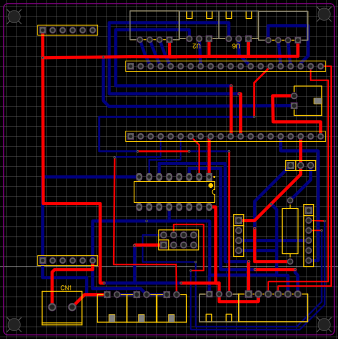
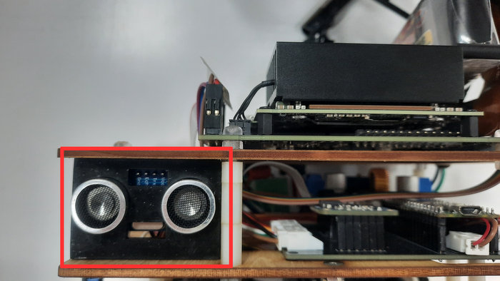

<div align="center"></div>

# <div align="center">Work Diary-工作日記</div>
以下是本次自動駕駛汽車模型設計與任務解決的開發記錄，涵蓋了機械設計與製造、電路設計與實現、電子裝置選型、程式設計與測試以及整體的解題過程。

 ### 自動駕駛汽車設計：關鍵升級與迭代
  這款自動駕駛汽車設計建立在從前輩團隊（Shinan-Fire-On-All-Cylinders ）繼承的豐富經驗之上，並融入了我去年參加世界大賽的實踐經驗。
  我們不僅借鑒了上一年冠軍隊伍的成功要素，還實施了關鍵的技術迭代：
  * **控制器升級：**主控制器已從標準的 Jetson Orin Nano 升級為性能更優越的 Nvidia Jetson Orin Nano。
* **機械大修：**我們對車輛的機械部件進行了重組和優化，特別是轉向系統和底盤。
* **視覺增強：**影像處理能力得到了顯著提升，效率和準確性更高。

  所有這些升級和創新設計元素的整合，其目的就是要全面提升車輛的整體性能和競爭力。

- The following is a development record of the self-driving car model design and task-solving, covering mechanical design and manufacturing, circuit design and implementation, electronic device selection, programming and testing, and the overall problem-solving process.

- ### Autonomous Vehicle Design: Key Upgrades and Iterations
  This autonomous vehicle design **builds upon** the rich experience inherited from the senior team (**Shinan-Fire-On-All-Cylinders**) and integrates my practical insights from last year's World Competition.

  We didn't just reference the successful elements of the previous year's winning teams; we implemented **key technological iterations**:

  * **Controller Upgrade:** The main controller has been upgraded from the standard Jetson Orin Nano to the **superior-performing Nvidia Jetson Orin Nano**.
  * **Mechanical Overhaul:** We have **restructured and optimized** the vehicle's mechanical components, specifically the steering and chassis.
  * **Vision Enhancement:** Image processing has been **significantly enhanced** for greater efficiency and accuracy.

  The integration of all these upgrades and innovative design elements is squarely aimed at **comprehensively strengthening** the vehicle's overall performance and competitiveness.
## 2025/02/28 ~ 2025/03/30  

**Member:** HU,SIAN-YI, LIN ZHAN-RONG, ZHANG YI-WEI

**Content:**  

### **團隊經驗傳承與模型輕量化策略** 

我們的隊友**胡賢邑**憑藉多年參與「未來工程競賽」（Future Engineers）的豐富經驗，在**機構設計**與**程式控制優化**領域累積了深厚的**實戰基礎**。

考量到每年賽事主題與規則的變動，並**吸收了去年世界冠軍隊伍在影像辨識技術上的卓越成果**，我們團隊經深入研討後，決定針對今年的參賽模型實施**關鍵的輕量化設計**。

透過整體結構的精簡化，我們達成了多重效益：
* **優化了機器進出停車區的流暢性**；
* **顯著提升了場地移動的靈活性**；
* 使其能**更精準地規避障礙物**；
* 從而**全面穩固了車輛的運行表現**。
<div align="center">
<table width="100%">
<tr>
<th>Team photo </th>
<th>Funny photo </th>
</tr>
<tr>
<td>
</td>
<td>
</td>
</tr>
</table>
</div>


### **Team Experience and Model Weight Reduction Strategy** 

Our teammate, **Hu Xianyi**, has accumulated a profound **practical foundation** in the fields of **mechanical design** and **program control optimization**, drawing upon his years of experience participating in the "Future Engineers Competition".

Considering the annual changes in competition themes and rules, and having **assimilated the excellent achievements of last year's world champion team in image recognition technology**, our team conducted in-depth discussions and decided to implement a **critical weight reduction design** for this year's competition model.

By simplifying the overall structure, we achieved multiple benefits:
* We **optimized the fluidity of the robot's entry and exit from the parking area**;
* **Significantly enhanced its mobility and agility** on the field;
* Enabled it to **more precisely avoid obstacles**;
* Thereby **comprehensively stabilizing the vehicle's operational performance**.

<div align="center">
<table>
<tr align="center">
<th>2024 World Championship Vehicle Model</th>
<th>2025 National Competition Vehicle Model</th>
<th>Team Research and Data Review Process Documentation - 團隊研究與資料查閱過程記錄</th>
</tr>
<tr align="center">
<td></td> 
    <td></td> 
    <td> </td>
</tr>
</table>
</div>

**設計參考、技術發現與修正方向**
- 為了奠定本專案的設計基礎與優化方向，我們進行了以下參考與分析：
設計參考來源： 我們查閱了學校歷屆團隊的工程文件，並對去年世界冠軍隊伍的技術文件進行了深入分析 。
- 技術發現與修正方向：
   - 影像辨識： 我們發現去年世界優勝隊伍在影像辨識技術上處理得極為正確且高效，這是一個值得我們深度學習的領域。因此，我們確立將此技術方向作為我們的主要修正與提升方向。
   - 機型體積與避障： 此外，我們觀察到有部分隊伍的機型體積遠小於我們的機型。在避開障礙物的能力上，這些小型機型展現出更優越的性能。

**Design Reference, Technical Findings, and Correction Strategy**
- To establish the design foundation and optimization direction for this project, we conducted the following referencing and analysis:
Design Reference Sources: We reviewed the engineering documentation from our school's past teams and conducted a deep analysis of the technical files from last year's world champion team.

- Technical Findings and Correction Strategy:

   - Image Recognition: We found that last year's world champion team executed image recognition technology in an extremely correct and highly efficient manner, marking this as an area worthy of deep study and emulation. Consequently, we established this technical direction as our primary strategy for correction and enhancement.

    - Model Size and Obstacle Avoidance: Furthermore, we observed that some teams' vehicle models were significantly smaller than ours. These smaller models demonstrated superior performance in their ability to avoid obstacles.


## 2025/03/01 ~ 2025/03/07
**Member:** HU,SIAN-YI, LIN ZHAN-RONG, ZHANG YI-WEI

**Content:**

### **系統部署與遠端開發環境建置** 

本週的工作重點在於**系統安裝**與**驅動程式下載**。

考量到直接透過小型螢幕操作 **Jetson Nano** 存在**介面操作不便**以及**連接埠潛在損壞**的風險，我們決定採用更高效的開發模式：在 Jetson Nano 上部署了 **NoMachine 遠端桌面軟體**。此舉旨在為後續的**自動駕駛程式編寫**與**系統除錯**工作提供一個**高效且穩定**的遠端操作環境。

**佐證資料：**

下方附有系統安裝、驅動程式下載及遠端桌面功能測試的照片作為佐證。


### **System Deployment and Remote Development Environment Setup** 

This week's work focused on **system installation** and **driver downloads**.

Considering the risks associated with directly operating the **Jetson Nano** via a small screen, specifically **inconvenient interface operation** and the potential for **damage to the connection ports**, we decided to adopt a more efficient development approach: we deployed **NoMachine remote desktop software** on the Jetson Nano. This action aims to provide an **efficient and stable** remote operational environment for the subsequent tasks of **autonomous driving program writing** and **system debugging**.

**Supporting Documentation:**
Photos of the system installation, driver downloads, and remote desktop functionality test are attached below as evidence.


<div align="center">
    <table>
        <tr align=center>
            <th width=50% style="text-align: center;">Jetson  Nano Software Environment Installation</th>
            <th width=50% style="text-align: center;">Jetson  Nano Software Environment Testing</th>
        </tr>
        <tr>
            <td></td>
            <td></td>
        </tr>
    </table>
</div>

## 2025/03/11 ~ 2025/03/17

**Member:** HU,SIAN-YI, LIN ZHAN-RONG, ZHANG YI-WEI

**Content:** 

### **第二代電路設計與初次 PCB 實戰經驗** 
#### **設計動機與製程轉換**
為了**避免使用電木板焊接時可能導致的控制器短路損毀**，並追求**更整潔、更易於配置**的電路板佈局，我們決定採用 **EasyEDA 軟體繪製印刷電路板（PCB）**。隨後，我們透過**化學蝕刻（洗印）製程**完成了**第二代電路板**的製作。

#### **設計失誤與實戰學習**
由於這是團隊**首次**進行 PCB 設計，我們初期**忽略了設計軟體（EasyEDA）內建的標準元件排版範例**。我們轉而依賴**手動測量排針間距**作為設計依據。然而，由於**經驗尚淺**，在第二代電路板製作完成後，我們發現**間距設定過小**，最終導致電子元件**無法順利插裝**。

#### **經驗總結與後續行動**
儘管遭遇了這次失誤，它卻提供了**寶貴的實戰經驗**。這促使我們立即啟動**設計修正與優化流程**，並隨即將修正後的設計送廠製作了**第三代版本**。

### **Second Generation Circuit Design and Initial PCB Practical Experience** 

#### **Design Motivation and Process Transition**
To **prevent potential short-circuit damage to the controllers caused by soldering on pegboards** and to achieve a **cleaner, more configurable** board layout, we decided to use **EasyEDA software to draw the Printed Circuit Board (PCB)**. Subsequently, we produced the **Second Generation circuit board** using the **chemical etching process**.

#### **Design Error and Practical Learning**
As this was the team's **first time** designing a PCB, we initially **overlooked the standard component layout templates built into the design software (EasyEDA)**. Instead, we relied on **manual measurement of the pin header pitch** as the design basis. However, due to our **limited experience**, after the second-generation board was fabricated, we discovered that the **pitch setting was too small**, ultimately preventing the electronic components from being properly inserted.

#### **Experience Summary and Subsequent Action**
Despite this setback, this failure provided **invaluable hands-on experience**. It prompted us to immediately launch the **design correction and optimization process**, and the revised design was subsequently sent to the factory for the **Third Generation Version**.

<div align="center">
    <table>
        <tr align=center>
            <th width=50% style="text-align: center;">Initial Design V1.0 (Pegboard) - Front View</th>
            <th width=50% style="text-align: center;">Initial Design V1.0 (Pegboard) - Back View</th>
        </tr>
        <tr>
            <td></td>
            <td></td>
        </tr>
    </table>
</div>

<div align="center" >
    <table >
        <tr align="center">
            <th>Second-Generation Design V2.0 (PCB) - Front View</th>
            <th>Second-Generation Design V2.0 (PCB) - Back View</th>
        </tr>
        <tr align="center">
            <td></td>
            <td></td>
        </tr>
    </table>
</div>

## 2025/03/18 ~ 2025/03/24
**Member:** HU,SIAN-YI, LIN ZHAN-RONG, ZHANG YI-WEI

**Content:** 

### 自駕車程式啟動與通訊協議研究** 

本週，我們正式啟動了**自駕車核心程式的編寫工作**。為了確保**主控單元（Nvidia Jetson Nano）** 與 **輔助單元（Raspberry Pi Pico）** 之間能順利實現**高效的協同運作**，我們投入時間深入研究了關鍵的**通訊協議與技術環節**。

具體研究方向包括：
* **主輔單元通訊機制：** 探討 **Nvidia Jetson Nano 與 Raspberry Pi Pico 之間的穩定通訊機制**。
* **編碼器精準控制：** 研究如何利用 **Raspberry Pi Pico 精準控制直流馬達的編碼器（Encoder）**，以實現精確的速度與位置控制。
* **感測器數據獲取：** 實施**超音波感測器**的**數值讀取與數據處理**等技術環節。

### **Autonomous Car Program Commencement and Communication Protocol Study**

This week, we officially initiated the **coding of the autonomous car's core program**. To ensure the **Main Control Unit (Nvidia Jetson Nano)** and the **Auxiliary Unit (Raspberry Pi Pico)** can achieve **efficient coordinated operation**, we dedicated time to deeply research key **communication protocols and technical aspects**.

The specific research areas included:
* **Main-Auxiliary Unit Communication:** Investigating the **stable communication mechanism between the Nvidia Jetson Nano and the Raspberry Pi Pico**.
* **Precise Encoder Control:** Studying how to utilize the **Raspberry Pi Pico to precisely control the DC motor's encoder**, enabling accurate speed and position management.
* **Sensor Data Acquisition:** Implementing technical steps such as **value reading and data processing** for the **ultrasonic sensor**.

 <div align=center>
    <table>
        <tr>
            <th align=center>Search for relevant materials.查找相關資料</th>
            <th align=center>Write a self-driving car program.撰寫自駕車程序</th>
        </tr>
        <tr>
            <td></td>
            <td></td>
        </tr>
    </table>
 </div>

## 2025/03/25 ~ 2025/03/31
**Member:** HU,SIAN-YI, LIN ZHAN-RONG, ZHANG YI-WEI

**Content:** 
### **Jetson Nano 系統建置與 UART 通訊實作**

本週，隊友 **HU,SIAN-YI** 已順利完成 **Nvidia Jetson Nano 的作業系統安裝**，並配置了所有必要的硬體驅動與軟體套件。

#### **系統配置重點：**
* **硬體驅動：** 成功安裝了 **TP-Link T3U Plus (AC1300)** 無線網卡、**IMX477 鏡頭模組**以及 **BNO055 陀螺儀感測器**的驅動程式。
* **軟體環境：** 安裝了用於影像辨識的 **OPENCV** 套件、用於效能加速的 **Cython**，以及 **UART、I2C 等通訊工具套件軟體**。

#### **程式開發與通訊實作：**
* 在此基礎上，我們已**成功撰寫出自駕車的基礎程序架構**。
* 更重要的是，我們**成功採用 UART（通用非同步收發傳輸器）協議**，搭建並驗證了 **Raspberry Pi Pico 與 Nvidia Jetson Nano 之間的穩定通訊機制**。
* 這項關鍵成果使得我們能夠順利地將由 **Nvidia Jetson Nano（主控單元）** 所生成的**控制指令（如速度、轉向等）**，準確、可靠地傳輸到 **Raspberry Pi Pico（輔助控制單元）** 進行底層執行。

---

### **Jetson Nano System Setup and UART Communication Implementation**

This week, team member **HU,SIAN-YI** successfully completed the **operating system installation for the Nvidia Jetson Nano**, configuring all necessary hardware drivers and software packages.

#### **System Configuration Highlights:**
* **Hardware Drivers:** Successfully installed drivers for the **TP-Link T3U Plus (AC1300)** wireless adapter, the **IMX477 camera module**, and the **BNO055 gyroscope sensor**.
* **Software Environment:** Installed the **OPENCV** package for image recognition, **Cython** for performance acceleration, and software utility packages for **UART and I2C communication tools**.

#### **Program Development and Communication Implementation:**
* Building on this foundation, we have **successfully written the basic program architecture for the autonomous car**.
* Crucially, we **successfully implemented the UART (Universal Asynchronous Receiver-Transmitter) protocol**, establishing and verifying a **stable communication mechanism between the Raspberry Pi Pico and the Nvidia Jetson Nano**.
* This key achievement allows us to smoothly and reliably transmit **control commands (such as speed and steering)** generated by the **Nvidia Jetson Nano (Main Control Unit)** to the **Raspberry Pi Pico (Auxiliary Control Unit)** for low-level execution.

#### The UART Program is Shown Below

  **Nvidia Jetson Nano**
   ```python
    import serial as AC
    import struct
    combined_control_signal = 30
    turn_side = 0
    PWM = 80
    try:
        ser = AC.Serial('/dev/ttyTHS1', 115200, timeout=1)
    except AC.SerialException as e:
        print(f"Error: Could not open serial port: {e}")
        exit()
    data_to_send = (int(combined_control_signal), int(turn_side),int(PWM))
    header = b"A"
    send_data_value = struct.pack('3i', *data_to_send)
    send_data_value = header + send_data_value
    ser.write(send_data_value)
   ```
   **Raspberry Pi Pico端**
   
   ```python
    from machine import UART, Pin
    import struct
    uart = UART(0, baudrate=115200, tx=Pin(16), rx=Pin(17))
    def jetson_nano_return(number):
        global data_value
        HEADER = b"A"
        HEADER_SIZE = len(HEADER)
        DATA_SIZE = 12
        TOTAL_SIZE = HEADER_SIZE + DATA_SIZE
        if uart.any():
            data = uart.read(TOTAL_SIZE)
            if len(data) == TOTAL_SIZE:
                header_index = data.find(HEADER)
                if header_index != -1:
                    start_index = header_index + HEADER_SIZE
                    data = data[start_index:] + data[:start_index]
                    data_value = struct.unpack('3i', data[:DATA_SIZE])
                    return data_value[number]
                else:
                    print("Error: Incorrect header received.")
            else:
                print("Error: Incomplete data received.")
        return data_value[number]

   ```
## 2025/04/03 ~ 2025/04/14

**Member:** HU,SIAN-YI, LIN ZHAN-RONG, ZHANG YI-WEI

**Content:**  

### **PCB 佈局失誤修正與 UART 傳輸優化** 

#### **1. PCB 佈局失誤與版本修正 (V3.0/V4.0)**
* **間距修正：** 在**第二代版本**的開發過程中，我們根據前一代的回饋，利用設計軟體內建的**標準範例圖**重新校準了排針間距，成功改善了原始設計的錯誤。
* **極性顛倒：** 然而，由於**作業上的疏忽**，我們在進行 PCB 佈局時**誤將背面視圖當作正面設計**，導致電路板輸出後發生了**極性顛倒**的重大問題。
* **錯誤修正：** 所幸，此錯誤在組裝與測試階段便被立即發現。我們隨即在**後續版本**中修正了佈局方向，並**全面複查了各層的對齊規範**，以確保設計檔案與最終的實體成品能夠**完全一致**。

#### **2. UART 傳輸問題與持續優化**
在測試 **UART 數據傳輸**時，我們發現會出現**掉資料（Data Loss / Dropping）的情況**。為確保控制指令的傳輸可靠性，我們正在**持續撰寫程式碼**，專注於修正這個錯誤問題，以**提升通訊的穩定度**。

### ** PCB Layout Error Correction and UART Transmission Optimization** 

#### **1. PCB Layout Error and Version Correction (V3.0/V4.0)**
* **Pitch Correction:** During the development of the **Second Generation Version**, based on feedback from the prior generation, we used the design software's built-in **standard example diagrams** to recalibrate the pin header pitch, successfully correcting the original design error.
* **Polarity Reversal:** However, due to an **operational oversight**, when implementing the PCB layout, we **mistakenly treated the back view as the front design**, which resulted in a major issue of **reversed polarity** upon board fabrication.
* **Error Fix:** Fortunately, this error was discovered immediately during the assembly and testing phase. We promptly corrected the layout orientation in the **subsequent version** and **comprehensively reviewed the alignment specifications of all layers** to ensure the design file and the final physical product were **completely consistent**.

#### **2. UART Transmission Issue and Ongoing Optimization**
While testing **UART data transmission**, we discovered **instances of data loss (dropping data)**. To ensure the reliability of control command transmission, we are **continuously developing and debugging the code**, focusing on correcting this error to **enhance communication stability**.

<div align="center" >
    <table>
        <tr>
            <th>Third-Generation Design V3.0 (PCB) - Front View</th>
            <th>Third-Generation Design V3.0 (PCB) - Back View</th>
        </tr>
        <tr align="center">
            <td>
                
            </td>
            <td>
                
            </td>
        </tr>
    </table>
</div>


## 2025/04/15 ~ 2025/04/21
**Member:** HU,SIAN-YI, LIN ZHAN-RONG, ZHANG YI-WEI

**Content:**

### **資格挑戰賽程式應用與任務挑戰賽避障策略優化**

#### **1. 資格挑戰賽（Open Challenge）程式應用**
由於**資格挑戰賽（Open Challenge rounds）** 的競賽規則與往年保持一致，我們決定直接**採用去年的成熟程式進行初步的性能測試**。

#### **2. 任務挑戰賽（Obstacle Challenge rounds）避障程式修改與優化**
鑑於今年的競賽規則在**任務挑戰賽（Obstacle Challenge rounds）** 中**新增了從停車區出發**以及**平行停入停車區**兩項關鍵任務，我們必須針對去年的自駕車**避障程式進行修改與深度優化**。

#### **3. 避障策略與邏輯**
我們採用的避障策略與邏輯如下：
* **路徑參考：** 在影像畫面中**繪製兩條具有特定斜率的路徑線**，作為車輛行進時的**參考方向**。
* **目標物體中心計算：** 透過 `function.py` 檔案中的 `detect_color_final` 副程式，系統會**計算畫面中目標物體的中心座標**。
* **轉彎角度計算：** 自駕車隨後**根據目標物體中心座標與路徑線之間的座標差**，計算出**所需的轉彎角度**，進而完成**精準的避障動作**。
- 自駕車在執行任務時的實際運作畫面

### **Open Challenge Program Application and Obstacle Challenge Strategy Optimization** 

#### **1. Open Challenge Program Application**
Since the competition rules for the **Open Challenge rounds** remain consistent with previous years, we decided to **utilize last year's established program for initial performance testing**.

#### **2. Obstacle Challenge Rounds Program Modification and Optimization**
Given that this year's competition rules **added the task of starting from the parking lot** and **parallel parking into the parking zone** within the **Obstacle Challenge rounds**, we were required to **modify and deeply optimize** last year's autonomous car **obstacle avoidance program**.

#### **3. Obstacle Avoidance Strategy and Logic**
Our implemented obstacle avoidance strategy and logic are as follows:
* **Path Reference:** **Two path lines with specific slopes are drawn** on the image screen, serving as the vehicle's **reference direction** for travel.
* **Target Center Calculation:** Through the `detect_color_final` subroutine located in the `function.py` file, the system **calculates the center coordinates of the target object** on the screen.
* **Turning Angle Calculation:** The autonomous car subsequently **calculates the required turning angle based on the coordinate difference between the object's center coordinates and the path lines**, thereby executing **precise obstacle avoidance maneuvers**.

- The image below displays the autonomous car's actual operational screen during mission execution.
 <div align=center>
    <table>
        <tr>
            <th colspan=3 >Screenshot of the Image Feed During Jetson Nano Program Execution - Jetson Nano 程式執行時的影像畫面截圖</th>
        </tr>
        <tr>
            <td></td>
            <td></td>
            <td></td>
        </tr>
    </table>
 </div>


## 2025/04/22 ~ 2025/04/30
**Member:** HU,SIAN-YI, LIN ZHAN-RONG, ZHANG YI-WEI

**Content:**

好的，這是對您提供的關於任務賽程式優化、轉向模式判斷機制，以及避障策略新增邏輯的內容所進行的文詞修飾與專業翻譯。

---

### **任務賽程式優化與複合式轉向判斷邏輯** 

#### **1. 轉向模式與遶行計數機制**
本週，我們持續優化任務挑戰賽（Obstacle Challenge）程式，並加入了**轉向開始與結束的判斷機制**。此機制用於**判斷車輛是否還在轉向區內**，以利**準確計數是否完成遶行場地三圈的任務**。

* **模式切換：** 當影像畫面中**偵測到轉向區的特定線條時**，系統會自動切換至**「轉向模式」**。
* **離開轉向區判斷邏輯：** 程式必須同時滿足以下**三項條件判定**，才能確認車輛已離開轉向區並將轉向次數加一：
    * **航向角變化（Heading Angle Change）**
    * **HSV 顏色辨識**
    * **時間條件**

#### **2. 轉向過程中的複合式避障優化**
* 經過實際測試後，我們發現原有的轉向邏輯有時會導致車輛與**障礙物方塊發生碰撞**。
* 為了解決這個問題，我們在轉向機制中**新增了複合式的障礙物偵測邏輯**：
    1.  當自駕車在**轉向過程中識別到方塊時**，會**優先執行避障**。
    2.  若偵測到車體**即將接近牆面**，則會**優先執行遠離邊牆的動作**。
    3.  **最後**，再判斷是否已離開轉向區。

下方為判斷是否離開轉向區的邏輯程式。


### **Obstacle Challenge Program Optimization and Compound Steering Logic**

#### **1. Steering Mode and Lap Counting Mechanism**
This week, we continued optimizing the Obstacle Challenge program by adding a **detection mechanism for the start and end of steering**. This mechanism is used to **determine if the vehicle is still within the turning zone**, facilitating the **accurate counting of completed laps** around the field.

* **Mode Switching:** When the image screen **detects the specific lines marking the turning zone**, the system automatically switches to the **"Steering Mode"**.
* **Exit Turning Zone Logic:** The program requires the simultaneous satisfaction of **three conditions** to confirm the vehicle has left the turning zone and increment the steering count:
    * **Heading Angle Change**
    * **HSV Color Recognition**
    * **Time Condition**

#### **2. Compound Obstacle Avoidance Optimization During Steering**
* Following practical testing, we found that the original steering logic occasionally led to the vehicle **colliding with the obstacle blocks**.
* To resolve this issue, we **added a compound obstacle detection logic** within the steering mechanism:
    1.  When the autonomous car **identifies an obstacle block during the turning process**, it **prioritizes obstacle avoidance**.
    2.  If it detects the vehicle body is **approaching a wall**, it **prioritizes moving away from the wall**.
    3.  **Finally**, it determines whether the vehicle has exited the turning zone.

**The logic code for determining the exit from the turning zone is shown below.**

```python
if elapsed_time >= 0.7 and color_y_positions[0] ==0 and color_y_positions[1] == 0 and heading < target_heading[count+1] + 35 and heading > target_heading[count+1] - 35:
    turn_side = 2
    if count >= 3:
        count = 0
        round_number +=1
        if round_number == 2:
            turn_side = 3
            time_count = 0
            start_time = time.time()
    else:
        count += 1
        combined_control_signal = 0
```


## 2025/05/01 ~ 2025/05/07
**Member:** HU,SIAN-YI, LIN ZHAN-RONG, ZHANG YI-WEI

**Content:** 

### **程式自動啟動機制與 Pico 訊號偵測** 

#### **自動啟動機制需求與實作**
為了解決每次運作前都需**手動啟動主程式**的效率問題，我們在 **Jetson Nano** 上設計並實作了**自動化啟動機制**。

* **服務腳本撰寫：** 我們撰寫了一個**啟動腳本（`open-mode.sh`）**，並透過 **Linux 的 Systemctl 服務（`open-mode.service`）** 進行配置，讓系統能在**每次開機時自動執行該腳本**。
* **啟動訊號偵測：** 該啟動腳本（運行 `open-mode.py`）運行後，會持續透過 **UART 協定偵測 Raspberry Pi Pico 是否發出「程式啟動」的特定訊號**，一旦接收到有效訊號，便會開始執行自駕車的主控制迴圈。

下方為 `open-mode.service`、`open-mode.sh`、以及 `open-mode.py` 的程式碼。

---

### **Program Auto-Startup Mechanism and Pico Signal Detection**

#### **Need and Implementation of Auto-Startup Mechanism**
To address the efficiency issue of manually starting the main program before every operation, we designed and implemented an **automated startup mechanism** on the **Jetson Nano**.

* **Service Script Writing:** We authored a **startup script (`open-mode.sh`)** and configured it using the **Linux Systemctl service (`open-mode.service`)**, enabling the system to **automatically execute this script upon every boot**.
* **Startup Signal Detection:** After execution, the startup script (running `open-mode.py`) continuously **monitors the Raspberry Pi Pico via the UART protocol for a specific "Program Start" signal**. Once a valid signal is received, the main control loop of the autonomous car commences execution.

The code for `open-mode.service`, `open-mode.sh`, and `open-mode.py` is provided below.

* **open-mode.service Code**
 ```bash
[Unit]
Description=Open Terminal with Python Script on Boot
After=graphical.target network.target
Wants=graphical.target

[Service]
Type=simple
User=user
Environment="DISPLAY=:0"
Environment="XAUTHORITY=/home/user/.Xauthority"
Environment="DBUS_SESSION_BUS_ADDRESS=unix:path=/run/user/1000/bus"
WorkingDirectory=/home/user/code
ExecStart=/bin/bash -c "/home/user/code/open-mode.sh"
Restart=on-failure
RestartSec=5s

[Install]
WantedBy=default.target
 ```

* **open-mode.sh Code**
 ```bash
#!/bin/bash
while [ ! -e /tmp/.X11-unix/X0 ]; do
    sleep 1
done
until xhost >/dev/null 2>&1; do
    sleep 1
done
export DISPLAY=:0
export XAUTHORITY=/home/user/.Xauthority
export DBUS_SESSION_BUS_ADDRESS=unix:path=/run/user/1000/bus

/usr/bin/gnome-terminal --title='start code' -- bash -c '/home/user/code/open-mode.py; exec bash'
 ```

* **open-mode.py Code**
 ```python
#!/usr/bin/python3
import Jetson.GPIO as GPIO
import time
import subprocess
import os

GPIO.setmode(GPIO.BOARD) 
input_pin = 7
output_pin = 40
GPIO.setup(output_pin, GPIO.OUT)
GPIO.setup(input_pin, GPIO.IN)

process = None
GPIO.output(output_pin, GPIO.LOW)
try:
    command = "xrandr --fb 1900x1240"
    subprocess.run(command, shell=True)
    GPIO.output(output_pin, GPIO.LOW)
    while True:
 
        if GPIO.input(input_pin) == GPIO.HIGH:
            print("A high level was detected, so another program was executed.")        
            if process is not None and process.poll() is None: 
                time.sleep(1)  
                continue
            command = "echo '0000' | sudo -S chmod 777 /dev/ttyTHS1"
            subprocess.run(command, shell=True)
            folder_path = "/home/user/code/"  
            os.chdir(folder_path)          
            
            process = subprocess.Popen(
                ["xterm", "-e", "/usr/bin/python3", "/home/user/code/jetson_nano_main_final.py"]
            ) 

        else:
            if process is not None and process.poll() is None: 
                print("Terminate the previously running program.")
                process.terminate()  
                process.wait()      
            GPIO.output(output_pin, GPIO.LOW)
            print("LOW，Turn Light")

        time.sleep(1)

except KeyboardInterrupt:
    GPIO.cleanup()
 ```

## 2025/05/08 ~ 2025/05/14
**Member:** HU,SIAN-YI, LIN ZHAN-RONG, ZHANG YI-WEI

**Content:**
### **任務賽停車程序設計與策略** 

本週，我們將重點投入於解決**任務挑戰賽（Obstacle Challenge rounds）中的停車區停車程式設計**。

* **停車策略：** 我們採用**直角倒車入庫**的方式作為主要的停車策略，旨在確保車輛能夠**精準、有效地停入指定的停車區域**。
* **流程說明：** 下圖展示了**停車程序（Parking Procedure）的詳細執行流程示意圖**。

### **Obstacle Challenge Parking Procedure Design and Strategy**

This week, our focus is dedicated to finalizing the **parking procedure programming for the Obstacle Challenge rounds**.

* **Parking Strategy:** We adopted the method of **Perpendicular Reverse Parking** (or **Right-Angle Back-in Parking**) as our primary strategy, ensuring the vehicle can **precisely and efficiently enter the designated parking area**.
* **Flow Description:** The image below illustrates the **detailed execution flow diagram for the parking procedure**.


 <div align=center>
    <table>
        <tr>
            <th>2025 National Competition: Parallel Reverse Parking Procedure Diagram - 2025 年全國賽：平行倒車入庫程序示意圖</th>
        </tr>
        <tr>
            <td></td>
        </tr>
    </table>
 </div>


## 2025/05/15 ~ 2025/05/21
**Member:** HU,SIAN-YI, LIN ZHAN-RONG, ZHANG YI-WEI

**Content:** 

### 停車程序穩定性優化與超音波感測器導入** 

* 經過反覆測試，我們發現自駕車的**停車參數調整過程過於繁瑣**，主要問題在於**程式設定的容許誤差範圍太小**，容易導致車輛在執行程序時**碰撞到停車區的牆面**。
* 為了解決這個問題，我們**啟用了先前在底盤上預留的超音波感測器孔位**，並**利用超音波感測數值來輔助**自駕車完成精準的停車動作。
* 這樣的設計**大幅提升了停車程序的穩定性與成功率**，有效解決了容錯率過低的問題。

### **Parking Procedure Stability Optimization and Ultrasonic Sensor Integration** 

* After repeated testing, we found that the autonomous car's **parking parameter tuning process was overly cumbersome**. The main reason was that the **tolerance range set in the program was too small**, often causing the vehicle to **collide with the parking zone walls** during execution.
* To resolve this issue, we **activated the ultrasonic sensor mounting holes previously reserved on the chassis** and **utilized the ultrasonic sensor readings to assist** the autonomous car in completing the parking maneuver.
* This design **significantly enhanced the stability and success rate of the parking procedure**, effectively addressing the low tolerance problem.

The code for reading the ultrasonic sensor values is shown below.

 ```python
def measure_distance(trig, echo):
    # Send trigger pulse
    trig.value(0)
    time.sleep_us(2)
    trig.value(1)
    time.sleep_us(10)
    trig.value(0)

    # Read Echo pulse width
    duration = time_pulse_us(echo, 1)

    # Calculate distance (speed of sound is approximately 343 m/s)
    distance = (duration / 2) * 0.0343

    return distance
 ```

## 2025/05/22 ~ 2025/05/28
**Member:** HU,SIAN-YI, LIN ZHAN-RONG, ZHANG YI-WEI

**Content:** 

### ：停車優化成果與停車區出發程序開發** 

#### **1. 停車功能優化成果**
有了上週**導入的超音波輔助停車功能**後，自駕車在停車時所需的**參數調整次數明顯減少**，這驗證了新設計的有效性。

#### **2. 停車區出發程序開發**
本週，我們開始撰寫**任務挑戰賽（Obstacle Challenge）** 的**「停車區出發程序」**。此程序設計的關鍵如下：
* **控制單元：** 出發程序由 **Jetson Nano 主控制器**負責控制。
* **方向判斷邏輯：** 系統透過偵測影像畫面中**左右側的 ROI（感興趣區域）數值**，來**判斷競賽起始階段應該採取的順時針或逆時針行進方向**。
* **模式切換：** 當自駕車**成功出發並離開停車區後**，系統會自動將模式切換為**「避障模式」**，並持續依據避障邏輯前進。

以下為自駕車的**出發程序程式碼**。


### **Parking Optimization Results and Parking Zone Exit Procedure Development**

#### **1. Parking Feature Optimization Results**
With the **integration of the ultrasonic sensor-assisted parking function** last week, the number of required **parameter adjustments during parking significantly decreased**, validating the effectiveness of the new design.

#### **2. Parking Zone Exit Procedure Development**
This week, we began coding the **"Parking Zone Exit Procedure"** for the **Obstacle Challenge rounds**. The key design aspects of this procedure are:
* **Control Unit:** The exit procedure is controlled by the **Jetson Nano main controller**.
* **Direction Determination Logic:** The system determines the required **clockwise or counterclockwise travel direction** at the start of the competition by **detecting the Region of Interest (ROI) values on the left and right sides of the image frame**.
* **Mode Switching:** Once the autonomous car **successfully exits the parking zone**, the system automatically switches the mode to **"Obstacle Avoidance Mode"** and continues to proceed based on the avoidance logic.

The **autonomous car's exit procedure code** is shown below.

 ```python
if turn_side == 8:
    PWM = -45
    if  roi_values[0]> roi_values[1] and start_0:
        ROI_0 = True
        start_1 = True
        start_0 = False
    elif  roi_values[0]< roi_values[1]and start_0:
        ROI_1 = True
        start_1 = True
        start_0 = False
    if  abs(heading) < 60 and start_1 or abs(heading) > 80 and start_1:
        if ROI_1:
            combined_control_signal = 180
        elif ROI_0:
            combined_control_signal = -180
    if abs(heading) > 60 and abs(heading) < 80 and start_1:
        start_2 = True
        start_1 = False
    if start_2:
        PWM = 40
        combined_control_signal = 0
    if start_2 and roi_values[2] > 4000:
        start_2 = False
        start_3 = True
    if abs(heading) > 10 and abs(heading) < 170 and start_3:
        if ROI_1:
            combined_control_signal = -180
        elif ROI_0:
            combined_control_signal = 180
    if abs(heading) < 10 and start_3  or abs(heading) > 170 and start_3:
        start_2 = False
        start_1 = False
        turn_side = 0
 ```

## 2025/05/29 ~ 2025/06/03
**Member:** HU,SIAN-YI, LIN ZHAN-RONG, ZHANG YI-WEI

**Content:**
### **轉向角度限制與機構保護** 

由於自駕車**伺服馬達驅動的前輪轉向機構**所能轉動的**角度有限**。若轉動角度設定**過大**，可能導致**轉向結構被扭斷**，或造成**伺服馬達燒壞**。

因此，為了**防止伺服馬達驅動的前輪轉向機構損毀或轉向結構被扭斷**，我們在程式碼的控制邏輯**結尾加入了嚴格的角度限制**，以確保轉向動作始終維持在機構的安全工作範圍內。

以下為**限制轉向角度的程式碼**。

### **Steering Angle Limitation and Mechanism Protection**

The **servo motor-driven front-wheel steering mechanism** of the autonomous car has **limited rotation angle capacity**. If the rotation angle is set **too wide**, it could potentially lead to the **steering structure being twisted and broken**, or cause the **servo motor to burn out**.

Therefore, to **prevent damage to the servo motor-driven front-wheel steering mechanism or the steering structure from being twisted**, we **added a strict angle limitation** at the end of the code's control logic, ensuring that steering maneuvers always remain within the safe operating range of the mechanism.

The code for **limiting the steering angle** is shown below.

 ```python
if combined_control_signal > 180:
    combined_control_signal=160
if combined_control_signal < -180:
    combined_control_signal=-160
 ```

## 2025/06/04 ~ 2025/06/08  
**Member:** HU,SIAN-YI, LIN ZHAN-RONG, ZHANG YI-WEI

**Content:** 

### **主電路板第四代版本功能測試成果** 
在成功修正前兩代設計版本（V2.0 和 V3.0）的諸多問題後，**主電路板的第四代版本（V4.0）已成功通過功能測試**。實際運行測試的結果顯示，**排針接點與電路佈局均無異常**，且**系統可穩定運作**。

值得注意的是，V4.0 版本因其穩定的性能，**成為全國賽期間主要採用的電路版本**。


### **Main Circuit Board Fourth Generation Functional Test Results** 

Following the successful correction of design issues found in the previous two versions (V2.0 and V3.0), the **Main Circuit Board's Fourth Generation Version (V4.0) has successfully passed functional testing**. The results from actual operational tests indicate that there are **no anomalies in the pin header connections or the circuit layout**, and the **system operates stably**.

Notably, due to its stable performance, the V4.0 version **became the primary circuit board used during the National Competition**.


<div align="center" >
    <table >
        <tr align="center">
            <th>Fourth-Generation Design V4.0 (PCB) - Front View</th>
            <th>Fourth-Generation Design V4.0 (PCB) - Back View</th>
        </tr>
        <tr align="center">
            <td></td>
            <td></td>
        </tr>
    </table>
</div>

## 2025/07/02 ~ 2025/07/21
**Member:** HU,SIAN-YI, LIN ZHAN-RONG, ZHANG YI-WEI

**Content:** 

### **底盤摩擦力問題修正與轉向流暢度優化** 

在進行避障程式測試時，我們注意到自駕車在**過彎時會出現些許卡頓**。經檢查後發現問題源自**底盤結構**：由於**轉向節與底盤直接接觸**，產生了**過大的摩擦力**，導致傳動結構**卡滯**。

為了解決此問題，我們對底盤進行了以下優化：
* 將**原本用於固定轉向節的孔洞擴大**。
* **改為放置軸承（Bearing）** 以**降低摩擦**。

經過實際測試，採用軸承的**新底盤結構有效改善了轉向的流暢度**，使自駕車在過彎時**更加平順**。


### **英文翻譯：Chassis Friction Correction and Steering Smoothness Optimization** 

While testing the obstacle avoidance program, we observed that the autonomous car experienced **slight stuttering during cornering**. Inspection revealed the problem originated from the **chassis structure**: as the **steering knuckle was in direct contact with the chassis**, the resulting **excessive friction** caused the drivetrain to **jam**.

To resolve this issue, we implemented the following chassis optimization:
* **Enlarged the holes originally used to fix the steering knuckle**.
* **Switched to placing bearings** within the enlarged holes to **reduce friction**.

Following testing, the **new chassis structure incorporating bearings effectively improved steering smoothness**, allowing the autonomous car to navigate corners **more smoothly**.

 <div align=center>
    <table>
        <tr>
            <th colspan=2>Before and After Modification</th>
        </tr>
        <tr>
            <td></td>
            <td></td>
        </tr>
    </table>
 </div>

## 2025/08/11 ~ 2025/08/17
**Member:** HU,SIAN-YI, LIN ZHAN-RONG, ZHANG YI-WEI

**Content:** 

* 下方展示了**目前已修正並最終定版的電路板**的 **3D 檢視圖**、**原理圖**，以及 **PCB 分布圖**。
* 本週將**持續進行任務挑戰賽（Obstacle Challenge rounds）的程式與功能測試**。

* Below are the **3D View**, **Schematic Diagram**, and **PCB Layout** of the **currently corrected and finalized circuit board**.
* We are **continuing to conduct program and functional testing for the Obstacle Challenge rounds** this week.

  <div align=center>
    <table>
    <tr>
    <th>3D view</th>
    <th>Circuit schematic</th>
    <th>PCB layout drawing</th>
       </tr>
       <tr>
    <td align=center ></td>
    <td align=center ></td>
    <td align=center ></td>
       </tr>
    </table>
  </div>
 

## 2025/08/18 ~ 2025/08/24
**Member:** HU,SIAN-YI, LIN ZHAN-RONG, ZHANG YI-WEI

**Content:** 
### **全國賽歷程、挑戰與晉級成果** 🏆

我們的全國賽於 **8 月 23 日**舉行。儘管過程充滿挑戰，我們仍成功晉級。

#### **上午資格挑戰賽 (Qualifying Rounds)**
* **第一局：** 比賽一開始便因車輛**撞到內側邊牆**而**提前終止**。
* **第二局：** 我們成功**完成了繞場三圈**的任務，但在**最後的停車環節**，自駕車**超出了指定的停車區塊**，因此未能獲取完整分數。
* **結果：** 儘管未能滿分完成，但憑藉優異的表現，我們**成功晉級到下午的決賽**。

#### **下午任務挑戰賽 (Final Rounds)**
* **決賽挑戰：** 在下午的決賽中，我們**依舊未能達成滿分解**。
    * **避障問題：** 在第一場比賽中，自駕車**移動到了障礙物（方塊）**，導致未能獲得完整的躲避障礙物分數。
    * **停車問題：** 在最後的停車環節，車輛在**經過最後障礙物之後又離開了停車區（出發區）**，因此無法完成停車任務。

#### **最終成就與展望**
就算比賽過程**坎坷不順**，但我們最終成功地以**第一名的排名**脫穎而出，獲得了**代表台灣參加 WRO 未來工程師世界賽**的資格。我們將**充分吸收這次全國賽的實戰經驗與教訓**，以**更好的狀態**去參加世界賽，並以**獲取優異的成績榮耀回國**為目標。

### **英National Competition Journey, Challenges, and Qualification**

Our National Competition took place on **August 23rd**. Despite a challenging process, we successfully qualified.

#### **Morning Qualifying Rounds**
* **First Attempt:** The round ended prematurely as the vehicle **collided with the inner side wall**.
* **Second Attempt:** We successfully **completed the three-lap circuit task**, but during the **final parking maneuver**, the autonomous car **exceeded the designated parking zone**, preventing us from earning full points.
* **Result:** Even without achieving a perfect score, our strong performance allowed us to **successfully advance to the afternoon final rounds**.

#### **Afternoon Final Rounds (Obstacle Challenge)**
* **Final Challenges:** In the afternoon finals, we **still failed to achieve a perfect solution**.
    * **Obstacle Avoidance:** In the first round, the autonomous car **moved an obstacle block**, resulting in an incomplete score for the obstacle avoidance task.
    * **Parking Issue:** During the final parking sequence, the vehicle **left the parking/starting zone after passing the final obstacle**, thus failing to complete the parking task.

#### **Final Achievement and Outlook**
Despite a **difficult and challenging competition process**, we successfully secured the **first-place ranking**, earning the qualification to **represent Taiwan in the WRO Future Engineers World Final**. We plan to **fully absorb the practical experience and lessons learned from this National Competition** and aim to participate in the World Final **in better condition**, striving to achieve **outstanding results and bring honor back home**.

 <div align=center>
    <table>
        <tr>
            <th>Awaiting Testing</th>
            <th>Competition Action Photo</th>
            <th>Award Ceremony Photo</th>
        </tr>
        <tr>
            <td></td>
            <td></td>
            <td></td>
        </tr>
    </table>
 </div>


## 2025/08/25 ~ 2025/08/31
**Member:** HU,SIAN-YI, LIN ZHAN-RONG, ZHANG YI-WEI

**Content:**

### **主控制器升級 Jetson Orin Nano 與通訊方案優化** 

#### **1. 主控制器升級決策與原因**
在參與全國賽的過程中，我們發現 **Jetson Nano 在運算效能上存在不足**，難以應對複雜的競賽程式需求。同時，考量到**運算效能更佳的 Nvidia Jetson Orin Nano 控制器近期降價**，加上 **Nvidia Jetson Nano 已停售**，造成未來備用控制器取得不易的問題。基於效能與備用策略的雙重考量，我們決定將主控制器**升級為運算效率顯著更高的 Jetson Orin Nano**。

#### **2. 通訊協議與輔助控制器更換**
隨著主控器的升級，我們也開始研究如何利用 **WebSockets 協議**建立 **Jetson Orin Nano 與 Raspberry Pi Pico 之間的通訊**。由於 WebSockets 通訊需要**雙方皆能穩定連線至網路**，我們將原本的 Raspberry Pi Pico 更換為**內建 WiFi 功能的 Raspberry Pi Pico W**，以滿足無線連線的需求，為未來的系統架構奠定基礎。

---

### **Main Controller Upgrade to Jetson Orin Nano and Communication Optimization** 

#### **1. Main Controller Upgrade Decision and Rationale**
During our participation in the National Competition, we identified that the **Jetson Nano lacked sufficient computational performance** to handle the complexity of the required competition programs. Concurrently, considering that the **more efficient Nvidia Jetson Orin Nano controller had seen a price reduction**, and the **Nvidia Jetson Nano is now discontinued**—making the procurement of backup controllers challenging—we decided to upgrade the main controller to the **significantly more computationally efficient Jetson Orin Nano**.

#### **2. Communication Protocol and Auxiliary Controller Swap**
Following the main controller upgrade, we began investigating the use of the **WebSockets protocol** to establish **communication between the Jetson Orin Nano and the Raspberry Pi Pico**. As WebSockets communication necessitates **stable network connectivity for both ends**, we replaced the original Raspberry Pi Pico with the **WiFi-enabled Raspberry Pi Pico W**, meeting the requirement for wireless communication and setting the foundation for the future system architecture.


<div align=center>
    <table>
       <tr>
           <th width=50%>2025 National Competition Vehicle Model 2025年國賽機型
           <th width=50%>2025 National Competition Model: Latest Version Under Ongoing Optimization - 2025 年全國賽機型：持續優化中的最新版本
       </tr>
       <tr>
           <td align=center></td>
           <td align=center></td>
       </tr>
       <tr>
           <th>Second Generation Steering Structure (V2.0) </th>
           <th>Third Generation Steering Structure (V3.0) </th>
       </tr>
       <tr>
           <td align=center></td>
           <td align=center></td>
       </tr>
       <tr>
           <th colspan=2>Onshape 3D Model Structure Sketch -Onshape 設計畫面</th>
       </tr>
       <tr>
           <td align=center></td>
           <td align=center></td>
       </tr>
       <tr>
           <th>Raspberry Pi Pico</th>
           <th>Raspberry Pi Pico W</th>
       </tr>
       <tr>
           <td align=center></td>
           <td align=center></td>
       </tr>
    </table>
</div>

## 2025/09/01 ~ 2025/09/06
**Member:** HU,SIAN-YI, LIN ZHAN-RONG, ZHANG YI-WEI

**Content:**

### **轉向結構優化、停車流程複雜化與組裝經驗** 

#### **1. 第三版轉向結構力矩問題修正**
在發現第三版轉向結構存在**力矩（Torque）結構問題** 後，我們進行了關鍵修正：
* **元件棄用與調整：** 我們**棄用了原先的球型十字元件**。
* **優化目標：** 將**圓頭設計改到連桿上**，目標是確保當**轉向角度為 0 度**時，**舵盤和拉桿可以精確地呈現 90 度**（垂直關係），以優化力學傳輸效率。

#### **2. 新版複雜化停車程序流程**
* **程序複雜化：** 我們開始**重新撰寫新的自駕車停車程序流程**。
* **設計目標：** 新版的停車流程將**較全國賽採用的流程更為複雜**，以應對國際賽可能出現的更嚴苛要求。

下方為兩種流程的示意圖比較。

#### **3. 3D 列印零件組裝經驗分享**
* **組裝挑戰：** 我們在**安裝轉向結構的球形接頭部分**時，因為零件已**經過紫外線（UV）固化**，導致組裝過程**十分困難**。
* **解決方案與流程：** 我們的解決方法是：
    1.  在**進行紫外線固化前**，先使用**砂紙對零件進行細磨**。
    2.  將零件**組裝起來後**，再整體放進 **UV 固化機**。
    3.  在固化完畢之後，給**活動元件的連接處上油**。
* **成果：** 這一連串步驟**成功解決了安裝困難及轉動不順滑等問題**。

---

### **Steering Optimization, Complex Parking Flow, and Assembly Experience**

#### **1. Correction of Third-Generation Steering Torque Issue**
After identifying a **torque structure problem** in the third-generation steering mechanism, we implemented a critical correction:
* **Component Replacement:** We **deprecated the original spherical cross joint component**.
* **Optimization Goal:** The **rounded end was moved to the linkage rod**, ensuring that when the **steering angle is 0 degrees**, the **steering rack and the linkage rod are precisely aligned at 90 degrees**, thus optimizing mechanical transmission efficiency.

#### **2. New Complexified Parking Procedure Flow**
* **Procedure Refinement:** We began **rewriting a new autonomous car parking procedure flow**.
* **Design Objective:** The new parking flow is designed to be **more complex than the procedure used in the National Competition**, anticipating stricter requirements in the World Final.

A comparison diagram of the two procedures is shown below.

#### **3. Experience Sharing on 3D Printed Parts Assembly**
* **Assembly Challenge:** We faced **significant difficulties** when **installing the spherical joint section of the steering structure** because the parts had already **undergone UV curing**.
* **Solution and Process:** Our solution involved the following steps:
    1.  Prior to **UV curing**, we first **finely sanded the parts with sandpaper**.
    2.  The parts were then **assembled** and placed into the **UV curing machine as an assembled unit**.
    3.  After curing was complete, **oil was applied to the connection points of the movable components**.
* **Result:** This sequence of steps **successfully resolved issues related to difficult assembly and rough rotation**.


 <div align=center>
    <table>
        <tr>
            <th>Fourth Generation Steering Structure (V4.0) - 第四代轉向結構 (V4.0)</th>
            <th>Photo of Teammate Coding the Forward Parking Program - 隊友正在撰寫順向停車程式碼的照片</th></th>
        </tr>
        <tr>
            <td></td>
            <td></td>
        </tr>
    </table>
 </div>

 <div align=center>
    <table>
        <tr>
            <th>2025 National Competition: Parallel Reverse Parking Procedure Diagram - 2025 年全國賽：平行倒車入庫程序示意圖</th>
            <th>2025 WRO World Final: Diagram of the Parallel Reverse Parking Procedure - 2025 年世界賽：平行倒車入庫程序示意圖</th>
        </tr>
        <tr>
            <td></td>
            <td></td>
        </tr>
    </table>
 </div>

 <div align=center>
    <table>
        <tr>
            <th>Fine Sanding the Ball Joints of the Steering Mechanism - 使用砂紙細磨轉向結構的球形接頭</th>
            <th>Assembly of the Steering Mechanism - 轉向機構的組裝作業</th>
        </tr>
        <tr>
            <td></td>
            <td></td>
        </tr>
        <tr>
            <th>Ultraviolet (UV) Post-Curing of 3D Printed Parts - 對 3D 列印零件進行紫外線（UV）後固化處理</th>
            <th>Applying Silicone Oil to the Ball Joints - 對球形接頭塗抹矽油</th>
        </tr>
        <tr>
            <td></td>
            <td></td>
        </tr>
    </table>
 </div>

## 2025/09/07 ~ 2025/09/13
**Member:** HU,SIAN-YI, LIN ZHAN-RONG, ZHANG YI-WEI

**Content:**

### **Jetson Nano 系統降級與專用工作站建置** 

由於我們**最新購買的 Nvidia Jetson Nano** 搭載了最新的**作業系統版本（JetPack 6.2.1）**，經過測試發現**並不支援**我們競賽中**重要的設備——IMX477 鏡頭模組**。

為了解決這個關鍵問題，我們決定**降級作業系統至 JetPack 5.1.2 版本**，才能確保鏡頭模組獲得支援並正常運作。

在這個過程中，我們向指導教練學習了**如何進行 JetPack 系統的升級和降級操作流程**。但由於 **Nvidia SDK Manager** 必須在**實體的 Ubuntu 主機上**才能正常操作，指導教練特地在社團教室後方**架設了一台 Ubuntu 系統的主機**，專門用於操作 SDK Manager。

以下是如何使用 SDK Manager 進行 JetPack 升級和降級的操作流程。


### **Jetson Nano System Downgrade and Dedicated Workstation Setup** 

As the **newly purchased Nvidia Jetson Nano** was equipped with the **latest operating system version (JetPack 6.2.1)**, testing revealed that it **did not support** the **IMX477 camera module**, a crucial piece of equipment for our competition.

To resolve this critical issue, we decided to **downgrade the operating system to JetPack version 5.1.2**, which ensures that the camera module is supported and fully operational.

During this process, we learned the procedures for **upgrading and downgrading the JetPack system** from our instructor. However, since the **Nvidia SDK Manager** requires a **physical Ubuntu host machine** to function correctly, our instructor specially **set up an Ubuntu system host machine** at the back of the club room, dedicated solely to operating the SDK Manager.

The procedure for using the SDK Manager to perform JetPack upgrades and downgrades is as follows.

 <div align=center>
    <table>
        <tr>
            <th colspan=2>Learning the Operational Procedures for JetPack Operating System Upgrades and Downgrades - 學習 JetPack 作業系統升級與降級的操作程序</th>
        </tr>
        <tr>
            <td></td>
            <td></td>
        </tr>
    </table>
 </div>

- ### Installation Commands 安裝指令

 ```bash
wget https://developer.download.nvidia.com/compute/cuda/repos/ubuntu2204/x86_64/cuda-keyring_1.1-1_all.deb
sudo dpkg -i cuda-keyring_1.1-1_all.deb
sudo apt-get update
sudo apt-get -y install sdkmanager
 ```

  - ### NVIDIA SDK Manager: Operational Procedure for JetPack OS Upgrades and Downgrades - NVIDIA SDK Manager：JetPack 作業系統升級與降級的操作程序
<div align=center>
<table>
<tr>
<th>Connect Host - Connect the Jetson Orin Nano controller to the Ubuntu host machine via a USB cable. - 連線主機-將 Jetson Orin Nano 控制器透過 USB 線連接到 Ubuntu 主機。.</th>
<th>Confirm Connection - Verify that the Jetson Orin Nano is successfully connected and recognized by the SDK Manager. - 確認連線-確認 Jetson Orin Nano 是否成功連線並被 SDK Manager 識別。.</th>
<th>Select Dev Kit - Select the target Developer Kit in the interface. - 選擇套件-在介面中選擇目標開發者套件（Developer Kit）。</th>
</tr>
<tr>
<td></td>
<td></td>
<td></td>
</tr>
<tr>
<th>Choose Version - Select the desired JetPack version from the menu for installation or downgrade. -  選擇版本 - 在選單中選中所需的 JetPack 版本進行安裝或降級。</th>
<th>Check Options - Check the required software components on the left side (such as OS, SDKs), and click "Next". - 勾選選項-勾選左側所需的軟體組件選項（如作業系統、SDKs），然後點擊**「下一步」（Next）**。</th>
<th>Enter Password - Enter the administrator password as prompted. - 輸入密碼-依照提示輸入管理者密碼。</th>
</tr>
<tr>
<td></td>
<td></td>
<td></td>
</tr>
<tr>
<th>Fill Info - Fill in the relevant information for the target board. - 填寫資訊-填入目標主機板的相關資訊。</th>
<th>Finish Install - After installation is complete, click "Finish" to exit. - 完成安裝-安裝完畢後，點擊 "Finish" 結束操作。</th>
<th>System Interface - The Jetson Orin Nano system interface after installation is complete (Result presentation). - 系統介面-安裝完畢後的 Jetson Orin Nano 系統介面（此為結果呈現）。</th>
</tr>
<tr>
<td></td>
<td></td>
<td></td>
</tr>
</table>
</div>

## 2025/09/14 ~ 2025/09/20
**Member:** HU,SIAN-YI, LIN ZHAN-RONG, ZHANG YI-WEI

**Content:**

### **V5.0 PCB 設計動機與 3D 列印精度修正** 

#### **1. 第五代 PCB 設計需求與動機**
由於我們將原本的 I/O 控制器 **Raspberry Pi Pico 更換為 Raspberry Pi Pico W**，在嘗試將**超音波感測器改為紅外線感測器**時，我們遇到了**腳位無法使用**的問題。加上我們需要在電路板上**新增插拔式接線端子** 來為 **Jetson Orin Nano 連接供電線**，因此我們啟動了**第五代 PCB 電路板**的設計工作。

#### **2. 轉向節內八問題：8K 與 14K 列印精度的影響**
在本週，我們發現組裝後的**轉向節**存在**內八（Toe-in）** 的問題。此問題與 3D 列印機的精度升級有關：
* **舊版列印：** 我們的第一、二代轉向結構是使用 **Stereolithography (SLA) 3D Printer 8K 打印機**列印的。
* **新版列印與問題：** 第三、四代轉向結構升級使用了 **Stereolithography (SLA) 3D Printer 14K 打印機**。然而，14K 打印機在列印特定角度元件時，**列印出來的原件角度比實際設計的角度還要大**，導致組裝後車輛前兩輪出現**內八**的情況。
* **解決方案：** 我們針對**轉向節的設計又做了修改**，確保車輛前兩輪能夠**平行**，從而解決了轉向不順的困擾。


### **V5.0 PCB Design Motivation and 3D Printing Precision Correction** 

#### **1. Fifth Generation PCB Design Requirement and Motivation**
Because we replaced the original I/O controller, the **Raspberry Pi Pico, with the Raspberry Pi Pico W**, we encountered an issue with **unavailable pins** when attempting to **switch the ultrasonic sensors to infrared sensors**. Furthermore, we needed to **add plug-in terminal blocks** to the circuit board for connecting the **power supply lines for the Jetson Orin Nano**. Consequently, we initiated the design process for the **Fifth Generation PCB**.

#### **2. Steering Knuckle Toe-in Issue: The Impact of 8K vs. 14K Print Precision**
This week, we discovered that the assembled **steering knuckles** exhibited a **toe-in** problem. This issue was related to the upgrade in 3D printer precision:
* **Older Prints:** Our first and second-generation steering structures were printed using a **Stereolithography (SLA) 3D Printer 8K**.
* **New Print and Issue:** The third and fourth-generation steering structures were upgraded to use a **Stereolithography (SLA) 3D Printer 14K**. However, the 14K printer, due to its precision characteristics, printed the component's angles **larger than the original design angle** in specific areas. This resulted in the vehicle's two front wheels exhibiting a **toe-in** issue after the steering structure was assembled.
* **Solution:** We made **further modifications to the steering knuckle design** to ensure the vehicle's two front wheels are **parallel**, thereby resolving the steering difficulty.

 <div align=center>
    <table>
        <tr>
            <th colspan=2>Design Evolution of the Fifth GenerationPCB (V5.0) - 設計第五代PCB電路板</th>
        </tr>
        <tr>
            <td></td>
            <td></td>
        </tr>
        <tr>
            <th>Circuit schematic</th>
            <th>PCB layout drawing</th>
        </tr>
        <tr>
            <td></td>
            <td></td>
        </tr>
        <tr>
        <th>Overhead view of the main circuit board(電路板頂視圖)	</th>
         <th>Bottom View of the Main Circuit Board(電路板底視圖)</th>
        </tr>
        <tr>
            <td align=center width="25%" ></td>
            <td align=center width="25%"></td>
        <tr>
        <th  colspan = 2>SLA 3D Printer 8K 14K 比較</th>
        </tr>
        <tr>
            <th> Stereolithography (SLA) 3D Printer 8K - 使用 8K 3D打印機</th>
            <th> Stereolithography (SLA) 3D Printer 14K 使用 14K 3D打印機</th>
        </tr>
        <tr>
            <td align=center></td>
            <td align=center></td>
        </tr>
        <tr>
            <th colspan=2>The Steering Structure Exhibits a Toe-in Phenomenon(This condition is visible as the two front wheels noticeably converge inwards)轉向結構呈現內八(可由兩輪子向內可看出)</th>
        </tr>
        <tr>
            <td colspan=2 align=center></td>
        </tr>
    </table>
 </div>

 ## 2025/09/21 ~ 2025/09/27
 **Member:** HU,SIAN-YI, LIN ZHAN-RONG, ZHANG YI-WEI

 **Content:**

### **停車定位感測器優化與 BNO055 供電修正** 

#### **1. 停車定位感測器硬體調整**
* **超音波感測器位置修正：** 原先我們自駕車的超音波感測器安裝在**車身的中尾部兩側**，很容易因為**沒有偵測到停車場方塊**而導致**整個車身離開出發區**。因此，我們設計了**新的木板及支架**，讓超音波感測器可以安裝在自駕車的**前方兩側**。
* **新增紅外線感測器：** 鑑於僅使用超音波感測器仍**無法實現精準的停車定位**，我們決定**再增加紅外線感測器**，安裝在自駕車的**前、後方**，用於**偵測邊牆及停車場牆面**。為此，我們**重新設計了新的車輛底板和紅外線 L 型支架**。

#### **2. BNO055 陀螺儀感測器異常的電子修正**
在取得新版印刷電路板（V5.0）後，測試中發現 **BNO055 陀螺儀感測器**的角度讀取會偶發性地出現**數值為 0 的異常現象**。
* **問題根源：** 此問題源於感測器的電源正負極由 **Raspberry Pi Pico W** 供應，而訊號線卻連接至 **Jetson Orin Nano 主控制器**。這種**電源與信號源不在同一電路迴路（即電位基準不統一）**的配置，導致感測器產生**誤動作**。
* **修正方案：** 我們隨即修正設計方案，確保 **BNO055 陀螺儀感測器的電源和訊號源皆由 Jetson Orin Nano 主控制器統一提供**，從而**建立了穩定的電位基準**。

### **Parking Positioning Sensor Optimization and BNO055 Power Correction**

#### **1. Hardware Adjustment for Parking Positioning Sensors**
* **Ultrasonic Sensor Repositioning:** Initially, our autonomous car's ultrasonic sensors were mounted on the **mid-rear sides of the vehicle body**, making it easy for the **entire vehicle body to leave the starting zone** without detecting the parking block. We therefore designed **new wooden plates and brackets** to mount the ultrasonic sensors on the **front sides of the autonomous car**.
* **Infrared Sensor Integration:** Since relying solely on ultrasonic sensors **could not achieve precise positioning for parking**, we decided to **add infrared sensors**, installing them on the **front and rear** of the car to **detect side walls and parking lot walls**. Consequently, we **redesigned the new vehicle chassis plate and L-shaped infrared brackets**.

#### **2. Electronic Correction of BNO055 Gyroscope Sensor Anomaly**
Upon receiving the new PCB (V5.0), testing revealed an intermittent issue where the **BNO055 gyroscope sensor** would return an angle reading of **zero**.
* **Root Cause:** This anomaly occurred because the sensor's VCC/GND was supplied by the **Raspberry Pi Pico W**, while its signal lines were connected to the **Jetson Orin Nano main controller**. This configuration, where the **power and signal sources were on different circuits (i.e., lacking a common ground reference)**, caused the sensor to **malfunction**.
* **Correction:** We revised the design to ensure that **both the power and signal sources for the BNO055 gyroscope sensor are uniformly supplied by the Jetson Orin Nano controller**, thereby **establishing a stable electrical potential reference**.

 <div align=center>
    <table>
        <tr>
            <th>Central Wooden Layer with Added Mounting Holes for the Ultrasonic Sensor Bracket - 增設超音波感測器支架鎖孔的中央層木板</th>
            <th>Additionally, the Central Wooden Layer After Modification to Include Infrared Sensor Bracket Mounting Holes - 修正並增設紅外線感測器支架鎖孔的中央層木板</th>
            <th>Synchronizing and Optimizing the Top Wooden Layer Based on the Revised Specifications of the Central Plate - 根據中央層木板的修正規格，同步調整並優化頂層木板</th>
        </tr>
        <tr>
            <td></td>
            <td></td>
            <td></td>
        </tr>
    </table>
 </div>

 <div align=center>
    <table>
        <tr>
            <th>Ultrasonic Sensor stent</th>
            <th>Infrared Sensor bracket</th>
        </tr>
        <tr>
            <td></td>
            <td></td>
        </tr>
    </table>
 </div>

 <div align=center>
    <table width=100%>
        <tr>
            <th colspan=2>Photo of the Actual Installation Location of the Ultrasonic Sensor - 超音波感測器（Ultrasonic Sensor）的實際安裝位置照片</th>
        </tr>
        <tr>
            <td colspan=2></td>
        </tr>
        <tr>
            <th colspan=2>Photo of the Final Actual Installation Location of the Infrared Sensor - 紅外線感測器的實際安裝位置照片</th>
        </tr>
        <tr align=center>
            <td width=50% ></td>
            <td width=50% ></td>
        </tr>
    </table>
 </div>

 <div align=center>
    <table>
         <tr>
        <th colspan = 2 >Final Version(PCB)</th>
        </tr>
        <tr>
            <th>Circuit Schematic</th>
            <th>PBC Layout Drawing</th>
        </tr>
        <tr>
            <td align=center ></td>
            <td align=center ></td>
        </tr>
        <tr>
            <th>Overhead view of the main circuit board(電路板頂視圖)</th>
            <th>Bottom View of the Main Circuit Board(電路板底視圖)</th>
        </tr>
        <tr align=center>
            <td></td>
            <td></td>
        </tr>
    </table>
 </div>

 ## 2025/09/28 ~ 2025/10/06
 **Member:** HU,SIAN-YI, LIN ZHAN-RONG, ZHANG YI-WEI

 **Content:**

### **全國賽後機型優化與系統穩定性提升** 

#### **1. 機構與感測器保護優化**
* **縮短軸距與轉向修正：** 在撰寫出發程序時，我們發現自駕車容易觸碰停車場方塊。為此，我們首先**嘗試修改整體機器人的軸距**，通過**刪除底板上的空位來縮短軸距**。問題雖有減緩，但容許誤差仍小。因此，我們進一步修改了轉向結構中**拉桿的極限方塊**，將方塊**縮小**以賦予轉向結構**更多轉動空間**。
* **紅外線感測器保護：** 在測試中發現，自駕車出現誤判導致**撞牆或撞方塊時，紅外線感測器會先受到波及**。因此，我們在設計上**將前方的紅外線固定區塊縮短**，並在**底板上延伸出 19 mm 的區塊**，以防止紅外線感測器因撞擊而損壞。

#### **2. 通訊硬體更換與優化**
* **網路接收器更換：** 由於自駕車採用 **WebSocket 進行數據傳輸**，網路天線至關重要。但原使用的 **TP-Link AC1300 接收器長度約 18 CM 左右**，體積過大。我們在網路上找到體積只有 $2 \text{CM} \times 1.5 \text{CM}$ 的 **ASUS AC1200 接收器**，並將其替換。

#### **3. 鏡頭支架客製化設計**
* **設計需求：** 原先使用的鏡頭支架是**樂高零件組裝**而成，容易意外被拆開。
* **客製化實作：** 我們使用 **Onshape 繪製了鏡頭支架模組**，該模組分為**鏡頭固定板**與**鏡頭支架主體**兩個元件。
* **功能優化：** 為了預留未來調整鏡頭可視角度的需求，我們在鏡頭支架模組上繪製了**可調整角度的滑軌**。

#### **4. Jetson Orin Nano 網路 AP 模式設定**
* **問題發現：** 在測試中，我們發現最初**未將 Jetson Orin Nano 網路設置為 AP（Access Point）模式**，一直都是使用手機作為網路傳輸媒介。
* **AP 模式設置：** 透過網路查找，我們成功啟動了 **Jetson Orin Nano 的 AP 模式**，並設置了讓 AP 自行啟動的行為。

下方是手動設置及使用自動腳本的指令。


### **Post-National Competition Model Optimization and System Stability Enhancement** 

#### **1. Mechanism and Sensor Protection Optimization**
* **Shortening Wheelbase and Steering Correction:** While coding the exit procedure, we noticed the car was prone to colliding with parking blocks. We initially attempted to **modify the robot's overall wheelbase** by **removing empty space on the base plate to shorten the wheel distance**. Although the issue was mitigated, the tolerance remained too small. Thus, we further modified the **limit block of the steering linkage**, **reducing its size** to give the steering mechanism **more rotation space**.
* **Infrared Sensor Protection:** During testing, we found that if the autonomous car malfunctioned and **collided with a wall or block, the infrared sensors were usually the first to be damaged**. To protect them, we **shortened the front infrared mounting block** and **extended the base plate by 19 mm**, preventing the infrared sensors from sustaining impact damage due to erroneous judgment.

#### **2. Communication Hardware Replacement and Optimization**
* **Network Receiver Swap:** Since the autonomous car uses **WebSocket for data transmission**, the network antenna is critical. However, the original **TP-Link AC1300 receiver was about 18 CM long**, making it bulky. We found an alternative, the **ASUS AC1200 receiver**, which is only $2 \text{CM} \times 1.5 \text{CM}$ in size, and **replaced the original receiver with the ASUS AC1200**.

#### **3. Customized Camera Bracket Design**
* **Design Requirement:** The original camera bracket was **assembled using LEGO parts**, making it prone to accidental disassembly.
* **Custom Implementation:** We used **Onshape to design a custom camera bracket module**, consisting of two components: the **lens mounting plate** and the **main bracket body**.
* **Functional Enhancement:** To allow for future adjustments to the camera's viewing angle, we designed **angle-adjustable sliding rails** into the bracket module.

#### **4. Jetson Orin Nano Network AP Mode Setup**
* **Issue Discovered:** During testing, we realized the **Jetson Orin Nano's network had not been set to AP (Access Point) mode**; we were instead using a mobile phone as the network transmission medium.
* **AP Mode Setup:** By searching online, we successfully found the commands to enable the **Jetson Orin Nano's AP mode** and configured it for **automatic startup**.

The commands for manual setup and using the auto-script are provided below.

 <div align=center>
    <table>
        <tr>
            <th>The Optimized and Revised Vehicle Bottom Wooden Layer - 經優化修正後的車輛底層木板</th>
            <th>The Revised Vehicle Mid-Layer Wooden Plate - 經修正優化後的車輛中央層木板</th>
        </tr>
        <tr>
            <td align=center></td>
            <td align=center></td>
        </tr>
    </table>
 </div>

 <div align=center>
    <table>
        <tr>
            <th>Lens Mount with Integrated Light Shielding Functionality 鏡頭支架（Lens Mount）：整合遮光罩功能設計</th>
            <th>Lens Module Fine-Tuning Mechanism 鏡頭模組微調機構</th>
        </tr>
        <tr>
            <td align=center></td>
            <td align=center></td>
        </tr>
    </table>
 </div>

 <div align=center>
    <table>
        <tr>
            <th>TP-Link AC1300 Wi-Fi Wireless Adapter</th>
            <th>ASUS AC1200  Wi-F  Wireless Adapter</th>
        </tr>
        <tr>
            <td align=center ></td>
            <td align=center ></td>
        </tr>
    </table>
 </div>

 - #### Setting Up Access Point (AP) Mode: Manual Command Operation - 設置AP - 手動下指令

    ```bash
    sudo nmcli dev wifi hotspot ifname wlan0 ssid "snjh_jetson" password "1234567890" 

    sudo nmcli connection modify Hotspot connection.autoconnect yes
    sudo systemctl enable NetworkManager.service
    sudo systemctl status NetworkManager

    ```

 - #### Setting Up Access Point (AP) Mode: Using Automated Script Execution[Set_AP.sh](../../src/System_Platform_Software/code/Set_AP.sh)

    ```bash
    sudo bash ./Set_AP.sh 
    ```

 ## 2025/10/07 ~ 2025/10/13
 **Member:** HU,SIAN-YI, LIN ZHAN-RONG, ZHANG YI-WEI

 **Content:**

### **系統穩定性、啟動機制與硬體優化** 

#### **1. 影像辨識穩定性修正**
* **問題根源：** 我們在進行 **LAB 數值調試**時發現，數值在調整階段正常，但在程式實際運行時卻**無法準確辨識到物件**。經測試確認，問題在於**環境光線的干擾**和**數值抓得太緊繃**。
* **解決方案：** 我們採取了兩項修正措施：
    1.  在**鏡頭支架上方新增遮光罩**。
    2.  在調整 LAB 數值時，對單一物件的數值調整完畢後，**拉大一些容許誤差範圍**。

#### **2. WebSockets 阻塞問題與啟動電路獨立**
* **通訊阻塞問題：** 在測試過程中，我們發現 **WebSockets 在成功連線之前會將連線前的所有動作堵住**，並在連線成功後才一次性執行。這導致程式啟動時會出現**機器向前行走但舵機沒有運作、底盤沒有任何反應**等異常情況。
* **啟動控制轉移：** 為了解決此問題，我們決定將**程序的啟動控制由 Jetson Orin Nano 來負責**。
* **電路修正：** 因此，我們必須更改程式啟動按鈕的電路。在更改過程中，我們遇到**程式按鈕按下狀態沒有更新**的問題。透過網路資料查詢，我們發現需要使用**上拉電阻（Pull-up Resistor）** 的方式進行電路連接。
* **獨立電路板設計：** 最終，我們使用 **EasyEDA 另外繪製了一塊獨立電路板**，專門用於**程式啟動按鈕的電路**。

#### **3. 鏡頭支架結構優化**
* **新增遮光板：** 由於需要新增遮光板，我們在鏡頭支架上面**新增樂高插銷孔洞**，用於安裝**樂高的 $5 \times 11$ 科技面板零件**。
* **新增螺絲孔位：** 後來因為設計了**第二塊按鈕 LED 獨立電路板**，我們在鏡頭支架上方設計了**螺絲孔位**，用於安裝這塊獨立電路板。

---

### **獨立開關控制電路板（第二塊電路板）功能總結**

此獨立電路板的設計目的為：
* **啟動按鈕整合：** 將啟動按鈕電路**獨立連接至 Jetson Orin Nano 的 GPIO 接口**，確保主控制器能依規程偵測發車指令。
* **除錯與狀態顯示：** 為了優化除錯流程，在電路板上**新增了 RGB 燈珠**。
* **功能目的：** 該燈珠用於**即時顯示車輛偵測到的最近物件顏色**，以便於快速診斷與狀態監控。
* **定位：** 這塊電路板專門用於自駕車的**啟動按鈕控制與狀態顯示**。

### **System Stability, Startup Mechanism, and Hardware Optimization** 

#### **1. Image Recognition Stability Correction**
* **Root Cause:** While conducting **LAB value tuning**, we found that although the values were normal during the adjustment phase, the program **failed to accurately identify objects** during actual operation. Testing confirmed the issue stemmed from **environmental light interference** and **overly strict value tolerances**.
* **Solution:** We implemented two corrective measures:
    1.  **Adding a light shield (hood) above the lens mount**.
    2.  **Allowing a larger margin of error** after tuning the LAB values for a specific object.

#### **2. WebSockets Blocking Issue and Isolated Startup Circuit**
* **Communication Blockage:** During testing, we found that **WebSockets would block all previous actions until a connection was successfully established**, executing them simultaneously afterward. This caused anomalies upon program startup, such as the **robot moving forward while the servo motor was inactive, or the chassis being unresponsive**.
* **Startup Control Transfer:** To resolve this, we decided to assign **program startup control to the Jetson Orin Nano**.
* **Circuit Correction:** We needed to modify the program start button circuit. During this change, we encountered a problem where the **button's pressed state was not updating**. Consulting online resources revealed the necessity of connecting the circuit using a **pull-up resistor**.
* **Isolated PCB Design:** Consequently, we used **EasyEDA to custom-design a separate circuit board** dedicated solely to the **program startup button circuit**.

#### **3. Lens Mount Structure Optimization**
* **Adding Light Shield:** Since a light shield was required, we **added LEGO pinholes** to the lens mount for mounting a **LEGO $5 \times 11$ Technic panel**.
* **Adding Screw Holes:** Later, because we designed the **second independent button/LED circuit board**, we designed **screw holes** above the lens mount for installing this secondary board.

---

### **Independent Switch Control Board (Secondary PCB) Summary**

The purpose of this independent board is:
* **Start Button Integration:** The start button circuit is **independently connected to the Jetson Orin Nano's GPIO interface**, ensuring the main controller detects the start command as per regulations.
* **Debugging and Status Display:** An **RGB LED was added** to the board to optimize the debugging process.
* **Function:** The LED is used to **display the color of the nearest object detected by the vehicle in real-time**, facilitating quick diagnostics and status monitoring.
* **Role:** **This board is dedicated to the autonomous car's start button control and status indication**.

 <div align=center>
 <table>
    <tr>
      <th colspan=3>Switch Control Circuit Board (Secondary PCB) - 開關控制電路板</th>
      </tr>
      <tr>
      <th>3D view</th>
      <th>circuit schematic</th>
      <th>PBC layout drawing</th>
      </tr>
      <tr>
      <td align=center ></td>
         <td align=center ></td>
         <td align=center ></td>
      </tr>
      <tr>
      <th align=center colspan=3>	Overall circuit schematic  </th> 
      </tr>
      <tr>
    <td align=center colspan=3>
   </td>
   </tr>
      </tr>
      </table>
      </div>


<div align=center>
    <table>
        <tr>
            <th colspan=2>Lens Mount with Integrated Light Shielding Functionality</th>
        </tr>
        <tr>	
            <th>Lens Mount鏡頭支架</th>
            <th>Lens Module Fine-Tuning Mechanism 鏡頭模組微調機構</th>
        </tr>
        <tr>
            <td align=center width=500></td>
            <td align=center width=500></td>
        </tr>
        <tr>	
            <th>Lens Mount Physical Side View - 鏡頭支架側視圖</th>
            <th>Lens Mount Physical Front View - 鏡頭支架實體正面視圖</th>
        </tr>        
        <td align=center width=500></td>
        <td align=center width=500></td>
        </tr>
    </table>
</div>


 ## 2025/10/14 ~ 2025/10/20
 **Member:** HU,SIAN-YI, LIN ZHAN-RONG, ZHANG YI-WEI

 **Content:**

### **紅外線感測器輔助停車與訊號讀取** 

本週，我們實施了**利用安裝在機器人前後方的紅外線感測器進行停車流程**。

下方展示了**紅外線感測器的類比訊號讀取程序**。

### **Infrared Sensor-Assisted Parking and Signal Reading** 

This week, we implemented the **parking procedure using the infrared sensors installed on the front and rear of the robot**.

The **analog signal reading procedure for the infrared sensors** is shown below.

    ```python
    class TCRT5000:
        def __init__(self, adc_pin):
            try:
                self.adc = ADC(Pin(adc_pin))
            except:
                self.adc = None

        def read_raw(self):
            try:
                return self.adc.read_u16()
            except:
                return -1

        def read_percentage(self):
            try:
                raw = self.read_raw()
                if raw == -1:
                    return -1
                percentage = (raw / 65535) * 100
                return round(percentage, 1)
            except:
                return -1

    ```

 ## 2025/10/21 ~ 2025/10/26
 **Member:** HU,SIAN-YI, LIN ZHAN-RONG, ZHANG YI-WEI

 **Content:**

### **最終程式架構完成與影片拍攝** 

* **最終架構與流程：** 本週，我們已**完成了最終的程式架構**。根據先前的硬體和邏輯更動，我們的**停車流程也進行了些微的調整與優化**。下方展示了**最終版的停車流程順序示意圖**。
* **影片製作：** 在完成程式架構和流程的定案後，我們也**開始進行介紹影片的拍攝工作**。
* **[5-1 Open Challenge rounds](video/Open_Challenge/video.md)**
* **[5-2 Obstacle Challenge rounds](video/Obstacle_Challenge/video.md)**

### **Final Program Architecture Completion and Video Production** 

* **Final Architecture and Flow:** This week, we have **completed the final program architecture**. Following previous hardware and logic modifications, our **parking procedure flow has also undergone slight adjustments and optimization**. The diagram below illustrates the **sequential flow of the final version of the parking procedure**.
* **Video Production:** After finalizing the program architecture and procedures, we also **commenced the filming of the introduction video**.


 <div align=center>
    <table>
        <tr>
            <th>Final Version Parking Procedure Flow Diagram - 最終版停車程序流程示意圖</th>
        </tr>
        <tr>
            <td width=1000 align=center></td>
        </tr>
    </table>
 </div>


 ## 2025/10/27 ~ 2025/11/01
 **Member:** HU,SIAN-YI, LIN ZHAN-RONG, ZHANG YI-WEI

 **Content:**
 
**全體成員已依據先前分配的工作職責，正挑燈夜戰全力衝刺，持續將已修改的工程文件資料上傳至 GitHub 專案儲存庫**。


**All team members, working diligently overnight in accordance with their previously allocated responsibilities, are urgently continuing to upload the modified engineering documentation to the GitHub project repository**.


 ## 2025/10/27 ~ 2025/11/01
 **Member:** HU,SIAN-YI, LIN ZHAN-RONG, ZHANG YI-WEI

 **Content:**


### **通訊協議調整與工程文件持續更新** 

#### **1. 通訊協議調整決策與新挑戰**
前幾天經向**世界賽裁判**確認，上下位控制器（**Jetson Orin Nano** 與 **Raspberry Pi Pico W**）之間**不得使用 WebSocket 等穩定傳輸的無線通訊協議**。

鑑於此項規則限制，我們決定**捨棄原先研究的 WebSocket 方案**，並**改回使用先前已驗證的 UART（通用非同步收發傳輸器）通訊協議** 進行數據傳輸。

然而，由於主控制器已升級為 **Jetson Orin Nano**，而我們**尚未在其上進行過 UART 通訊的實作**，這對團隊來說是一個**新的技術挑戰**。

#### **2. 工程文件進度**
**持續在 GitHub 專案儲存庫上修改工程文件資料**。


### **英文翻譯：Communication Protocol Adjustment and Ongoing Engineering Document Updates**

#### **1. Communication Protocol Adjustment Decision and New Challenge**
Following confirmation with the **World Final judges** a few days ago, the communication between the main and auxiliary controllers (**Jetson Orin Nano** and **Raspberry Pi Pico W**) **is prohibited from using stable wireless communication protocols such as WebSocket**.

Given this rule restriction, we decided to **abandon the previously investigated WebSocket solution** and **revert to the established UART (Universal Asynchronous Receiver-Transmitter) communication protocol** for data transmission.

However, since the main controller has been upgraded to the **Jetson Orin Nano**, and we **have not yet implemented UART communication on this specific controller**, this presents a **new technical challenge** for the team.

#### **2. Engineering Document Progress**
**Continuing to modify engineering documentation on the GitHub project repository**.


 # <div align="center">[Return Home](../../)</div>


