<div align="center"></div>

# <div align="center">Work Diary-工作日記</div>
以下是本次自動駕駛汽車模型設計與任務解決的開發記錄，涵蓋了機械設計與製造、電路設計與實現、電子裝置選型、程式設計與測試以及整體的解題過程。

The following is a development record of the self-driving car model design and task-solving, covering mechanical design and manufacturing, circuit design and implementation, electronic device selection, programming and testing, and the overall problem-solving process.
## 2025/02/28 ~ 2025/03/30  

**Member:** HU XIAN-YI, LIN ZHAN-RONG, ZHANG YI-WEI

**Content:**  

 - 我們的隊友胡賢邑在過去幾年多次參加「未來工程競賽」，在機構設計和程式控制優化方面累積了豐富的實戰經驗。不過，由於每年比賽的主題與挑戰規則都會有所調整，我們深入討論後，決定針對今年的參賽模型進行輕量化設計。我們縮小了整體結構，這不僅有助於機器進出停車區時更順利，也讓它在場地中移動更靈活，能更有效避開障礙方塊，整體表現也因此更穩定。

 - Our teammate, Hu Xianyi, has participated in the “Future Engineering Competition” multiple times over the past few years, gaining valuable hands-on experience in mechanical design and programming optimization. Since the competition’s themes and challenge rules change every year, we had an in-depth discussion and decided to redesign this year’s model with a focus on weight reduction. By downsizing the overall structure, the robot can now navigate in and out of the parking zone more smoothly, move more flexibly around the field, and avoid obstacle blocks more effectively — all of which contribute to more consistent and improved performance during the competition.

<div align="center">
<table>
<tr align="center">
<th>Last year's senior's model</th>
<th>This year's senior's model</th>
</tr>
<tr align="center">
<td></td> 
    <td></td> 
</tr>
</table>
</div>
<div align="center">
<table>
<tr align="center">
<th >Refer to the seniors GitHub reports(參考學長姐們的Github報告)</th>
</tr>
<tr align="center">
<td> </td>
</tr>
</table>
</div>

## 2025/03/01 ~ 2025/03/07
**Member:** HU XIAN-YI, LIN ZHAN-RONG, ZHANG YI-WEI

**Content:**

 - 本周我們進行了系統安裝及驅動下載，由於使用小螢幕連接Jetson Nano進行系統操作過於麻煩還有接口損傷的風險，因此我們在Jetson Nano上安裝了NoMachine遠端桌面軟體以便後續編寫自駕車程序，以下是安裝及測試系統和軟體功能的照片。

<div align="center">
    <table>
        <tr align=center>
            <th width=50% style="text-align: center;">System Installation</th>
            <th width=50% style="text-align: center;">系統功能測試</th>
        </tr>
        <tr>
            <td></td>
            <td></td>
        </tr>
    </table>
</div>

## 2025/03/11 ~ 2025/03/17

**Member:** HU XIAN-YI, LIN ZHAN-RONG, ZHANG YI-WEI

**Content:**  

 - 為了讓電路板配置更整齊，我們採用 EasyEDA 繪製電路板，並將設計完成的圖稿透過洗印方式製作出第一代電路板。由於這是我們首次接觸電路板設計，當時未能注意到設計軟體中其實已提供標準的元件排版範例。我們改以自行測量排針與排針之間的間距，但因經驗不足，最終在電路板製作完成後才發現設計的間距過小，導致元件無法順利插入。這次失誤讓我們獲得了寶貴的學習經驗，也立即推動我們對設計進行修正與優化。經過快速調整後，我們完成了第二代電路板，成功解決了間距問題，使元件安裝更為順利，整體佈線也更加合理。

 - To achieve a more organized circuit board layout, we used EasyEDA to design the PCB and then fabricated the first-generation board using a printed-etching process. Since this was our first experience with PCB design, we failed to notice that the software already provided standard component layout templates. Instead, we manually measured the spacing between pin headers. Due to our lack of experience, we only discovered after fabrication that the spacing was too narrow, which prevented the components from being properly inserted. This mistake provided us with valuable hands-on experience and immediately motivated us to revise and optimize our design. After a quick round of adjustments, we successfully developed the second-generation PCB, which resolved the spacing issue, improved component installation, and made the overall wiring layout more efficient.
<div align="center" >
<table >
<tr align="center">
<th>First-Generation Front View</th>
<th>First-Generation Back View</th>
<tr align="center">
<td>
</td>
<td>
</td>
</tr>
</table>
</div>

## 2025/03/18 ~ 2025/03/24
**Member:** HU XIAN-YI, LIN ZHAN-RONG, ZHANG YI-WEI

**Content:** 

 - 本周我們開始撰寫我們的自駕車程序，我們為了能夠順利撰寫自駕車程序在網路上查詢了相關資料，例如：Raspberry Pi Pico和Jetson Nano之間要如何進行通訊、要如何使用Raspberry Pi Pico控制直流馬達上的Encoder、讀取超音波數值等。

 <div align=center>
    <table>
        <tr>
            <th align=center>查找相關資料</th>
            <th align=center>撰寫自駕車程序</th>
        </tr>
        <tr>
            <td></td>
            <td></td>
        </tr>
    </table>
 </div>

## 2025/03/25 ~ 2025/03/31
**Member:** HU XIAN-YI, LIN ZHAN-RONG, ZHANG YI-WEI

**Content:** 

 - 本周我們撰寫出了基本的程序架構，並且成功使用**UART**的方式搭建了Raspberry Pi Pico和Jetson Nano之間的通訊，將Jetson Nano上的控制指令傳輸到Raspberry Pi Pico。
    
    **Jetson Nano端**
    ```python
    import serial as AC
    import struct

    combined_control_signal = 30
    turn_side = 0
    PWM = 80

    try:
        ser = AC.Serial('/dev/ttyTHS1', 115200, timeout=1)
    except AC.SerialException as e:
        print(f"Error: Could not open serial port: {e}")
        exit()

    data_to_send = (int(combined_control_signal), int(turn_side),int(PWM))
    header = b"A"
    send_data_value = struct.pack('3i', *data_to_send)
    send_data_value = header + send_data_value
    ser.write(send_data_value)
    ```

    **Raspberry Pi Pico端**
    ```python
    from machine import UART, Pin
    import struct

    uart = UART(0, baudrate=115200, tx=Pin(16), rx=Pin(17))

    def jetson_nano_return(number):
        global data_value
        HEADER = b"A"
        HEADER_SIZE = len(HEADER)
        DATA_SIZE = 12
        TOTAL_SIZE = HEADER_SIZE + DATA_SIZE

        if uart.any():
            data = uart.read(TOTAL_SIZE)
            if len(data) == TOTAL_SIZE:
                header_index = data.find(HEADER)
                if header_index != -1:
                    start_index = header_index + HEADER_SIZE
                    data = data[start_index:] + data[:start_index]
                    data_value = struct.unpack('3i', data[:DATA_SIZE])
                    return data_value[number]
                else:
                    print("Error: Incorrect header received.")
            else:
                print("Error: Incomplete data received.")
        return data_value[number]
    ```

## 2025/04/03 ~ 2025/04/14

**Member:** HU XIAN-YI, LIN ZHAN-RONG, ZHANG YI-WEI

**Content:**  
 - 在第二代版本的開發過程中，我們根據第一代的回饋，利用設計軟體內建的範例圖重新校準了排針間距，成功改善了原始設計。然而，由於作業上的疏忽，我們在進行 PCB 佈局時誤將背面視圖當作正面設計，導致電路板輸出後發生極性顛倒的問題。所幸在組裝與測試階段便立即發現此錯誤，並在第三代版本中修正了佈局方向。同時，我們也全面複查了各層的對齊規範，以確保設計檔與實體成品能夠完全一致。

 - During the development of the second-generation version, we incorporated feedback from the first generation and recalibrated the pin header spacing using the built-in reference templates in the design software, successfully improving the original layout. However, due to an operational oversight, we mistakenly treated the back view as the front view during the PCB layout process, which resulted in polarity reversal after fabrication. Fortunately, this issue was identified immediately during the assembly and testing stage. In the third-generation version, we corrected the layout orientation and also conducted a thorough review of alignment rules across all layers to ensure full consistency between the design files and the physical product.

<div align="center" >
    <table >
        <tr align="center">
            <th>Second-Generation Front View</th>
            <th>Second-Generation Back View</th>
        </tr>
        <tr align="center">
            <td>
                
            </td>
            <td>
                
            </td>
        </tr>
    </table>
</div>

## 2025/04/15 ~ 2025/04/21
**Member:** HU XIAN-YI, LIN ZHAN-RONG, ZHANG YI-WEI

**Content:**

 - 本週我們完成了自駕車的停車程序流程，我們使用 **直角倒車入庫** 的方式完成我們的停車流程，下圖為停車程序流程的示意圖。

 <div align=center>
    <table>
        <tr>
            <th>停車流程示意圖</th>
        </tr>
        <tr>
            <td></td>
        </tr>
    </table>
 </div>

## 2025/04/22 ~ 2025/04/30
**Member:** HU XIAN-YI, LIN ZHAN-RONG, ZHANG YI-WEI

**Content:**

 - 本週，我們開始撰寫自駕車的避障程式。我們的避障方式是：在畫面中繪製兩條斜率路徑線。在 function.py
 文件中的 detect_color_final 副程式會計算物體的中心座標。自駕車利用物體中心座標與物體與路徑線之間的座標差來計算轉彎角度，從而完成避障流程。下方為自駕車的實際畫面。
 <div align=center>
    <table>
        <tr>
            <th>Jetson Nano程序執行畫面</th>
        </tr>
        <tr>
            <td></td>
        </tr>
    </table>
 </div>

## 2025/05/01 ~ 2025/05/07
**Member:** HU XIAN-YI, LIN ZHAN-RONG, ZHANG YI-WEI

**Content:**

 - 本週我們在程式中加入了轉向開始與結束的判斷機制。當畫面中識別到轉向區的線條時，程序會切換至轉向模式。判斷是否離開轉向區時，需同時滿足航向角、HSV偵測與時間條件，才會將轉向次數加一。

   經過實際運作測試後，我們發現此方法容易導致車輛碰撞障礙物方塊。為此，我們在轉向機制中新增了障礙物偵測：在轉向過程中若識別到方塊，程序會優先執行避障，如果偵測到即將與牆體接觸也會先執行遠離邊牆，最後再判斷是否離開轉向區。下面是判斷是否離開轉向區邏輯程序。

    ```python
    if elapsed_time >= 0.7 and color_y_positions[0] ==0 and color_y_positions[1] == 0 and heading < target_heading[count+1] + 35 and heading > target_heading[count+1] - 35:
        turn_side = 2
        if count >= 3:
            count = 0
            round_number +=1
            if round_number == 2:
                turn_side = 3
                time_count = 0
                start_time = time.time()
        else:
            count += 1
            combined_control_signal = 0
    ```

## 2025/05/08 ~ 2025/05/14
**Member:** HU XIAN-YI, LIN ZHAN-RONG, ZHANG YI-WEI

**Content:** 

 - 


## 2025/06/03 ~ 2025/06/08  
**Member:** HU XIAN-YI, LIN ZHAN-RONG, ZHANG YI-WEI

**Content:** 


- 經修正前兩代的設計問題後，第四代版本已成功通過功能測試。實際運行測試顯示，排針接點與電路佈局無異常，系統可穩定運作。
<div align="center" >
<table >
<tr align="center">
<th>Third-Generation Front View</th>
<th>Third-Generation Back View</th>
<tr align="center">
<td>
</td>
<td>
</td>
</tr>
</table>
</div>

## 2025/07/02 ~ 2025/07/21
**Member:** HU XIAN-YI, LIN ZHAN-RONG, ZHANG YI-WEI

**Content:** 

 - 在進行避障程式測試時，我們注意到自駕車在過彎時會出現些許卡頓。經檢查後發現問題源自底盤結構，因為轉向節與底盤直接接觸，過大的摩擦力導致傳動結構卡滯。為了解決此問題，我們將原本用來固定轉向節的孔洞擴大，並改為放置軸承以降低摩擦。經過測試後，採用軸承的新底盤結構有效改善了轉向的流暢度，使自駕車在過彎時更加平順。

 - During obstacle-avoidance testing, we noticed that the autonomous car experienced slight stuttering when making turns. Upon inspection, we identified the issue in the chassis design: the steering knuckle was in direct contact with the chassis, and the resulting friction caused binding in the transmission structure. To address this, we enlarged the original holes used for mounting the steering knuckle and replaced them with bearings to reduce friction. Testing confirmed that the updated chassis with the bearing structure significantly improved turning smoothness, allowing the car to navigate corners more fluidly.

 <div align=center>
    <table>
        <tr>
            <th colspan=2>Before and After Modification</th>
        </tr>
        <tr>
            <td></td>
            <td></td>
        </tr>
    </table>
 </div>

## 2025/08/18 ~ 2025/08/24
**Member:** HU XIAN-YI, LIN ZHAN-RONG, ZHANG YI-WEI

**Content:** 
 - 我們的比賽是在8月23日，在早上的資格賽中第一局因為撞到內側邊牆直接結束比賽，而第二局時我們完成了繞場三圈的任務但是在最後的停車節自駕車超出了指定區塊而無法獲取完整分數，但就算如此我們也成功進入到了下午的決賽中。

 - 到了下午的決賽中，我們依舊未能完成滿解，第一場自駕車移動到障礙物因此未能完成躲避障礙物的分數，在最後停車環節因為經過了最後障礙物後又離開了出發區因此無法完成停車任務。

 - 就算比賽過程坎坷但我們也成功的以第一名的排名代表台灣出賽WRO未來工程師世界賽，我們將吸收這次全國賽的經驗，以更好的狀態去參加世界賽並且獲取優異的成績榮耀回國。


 <div align=center>
    <table>
        <tr>
            <th>Waiting for test</th>
            <th>Competition photo</th>
            <th>Award-winning photo</th>
        </tr>
        <tr>
            <td></td>
            <td></td>
            <td></td>
        </tr>
    </table>
 </div>


## 2025/08/25 ~ 2025/08/31
**Member:** HU XIAN-YI, LIN ZHAN-RONG, ZHANG YI-WEI

**Content:**
- 在參加全國賽的過程中，我們發現 Jetson Nano 在運算效能上存在不足，因此決定將主控制器升級為運算效率更高的 Jetson Orin Nano。同時，我們開始研究如何利用 WebSockets 建立 Jetson Orin Nano 與 Raspberry Pi Pico 之間的通訊。由於 WebSockets 通訊需要雙方皆能連線至網路，我們將原本的 Raspberry Pi Pico 更換為具備 WiFi 功能的 Raspberry Pi Pico2 WH，以滿足無線連線的需求。

- From our experience in the national competition, we realized that the Jetson Nano had limitations in terms of computing performance. To address this, we decided to upgrade the main controller to the more powerful Jetson Orin Nano. At the same time, we began exploring the use of WebSockets to establish communication between the Jetson Orin Nano and the Raspberry Pi Pico. Since WebSocket communication requires both devices to have network connectivity, we replaced the original Raspberry Pi Pico with the Raspberry Pi Pico2 WH, which comes with built-in WiFi capability to meet this requirement.

<div align=center>
    <table>
       <tr>
           <th width=50%>Model Used in the National Competition</th>
           <th width=50%>Model Used in the International Competition</th>
       </tr>
       <tr>
           <td align=center></td>
           <td align=center></td>
       </tr>
       <tr>
           <th>First-Generation Steering Structure</th>
           <th>Second-Generation Steering Structure</th>
       </tr>
       <tr>
           <td align=center></td>
           <td align=center></td>
       </tr>
       <tr>
           <th colspan=2>Onshape 設計畫面</th>
       </tr>
       <tr>
           <td align=center></td>
           <td align=center></td>
       </tr>
       <tr>
           <th>Raspberry Pi Pico</th>
           <th>Raspberry Pi Pico2 WH</th>
       </tr>
       <tr>
           <td align=center></td>
           <td align=center></td>
       </tr>
    </table>
</div>

## 2025/09/01 ~ 2025/09/06
**Member:** HU XIAN-YI, LIN ZHAN-RONG, ZHANG YI-WEI

**Content:**
 - 我們在本週發現了第三版轉向結構上存在力矩結構問題，我們將原先的

 - 同時我們開始重新撰寫新的自駕車停車程序流程，**表二**是停車流程的示意圖比較。

 - 我們在安裝轉向結構的球形接頭部分時因為已經經過紫外線固化的原因而導致安裝困難，解決方法是在進行紫外線固化前先使用砂紙細磨，組裝起來後放進UV固化機，在固化完畢之後再給活動元件連接處上油，這樣一來就解決了安裝困難及轉動不順滑等問題了。

 <div align=center>
    <table>
        <tr>
            <th>第四版轉向結構</th>
            <th>撰寫順向停車</th>
        </tr>
        <tr>
            <td></td>
            <td>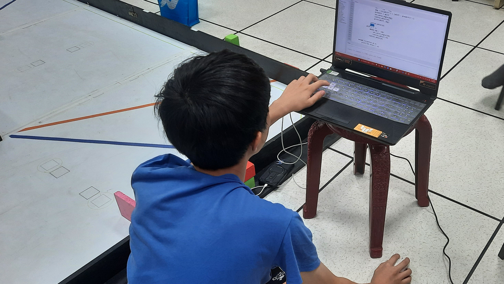</td>
        </tr>
    </table>
 </div>

 <div align=center>
    <table>
        <tr>
            <th>全國賽停車流程</th>
            <th>國際賽停車流程</th>
        </tr>
        <tr>
            <td></td>
            <td>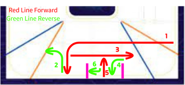</td>
        </tr>
    </table>
 </div>

 <div align=center>
    <table>
        <tr>
            <th>細磨球接頭</th>
            <th>組裝轉向結構</th>
        </tr>
        <tr>
            <td>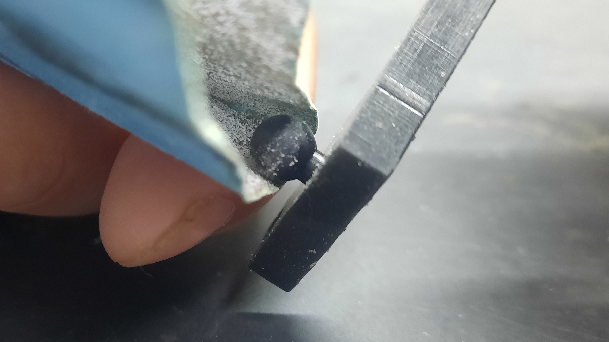</td>
            <td>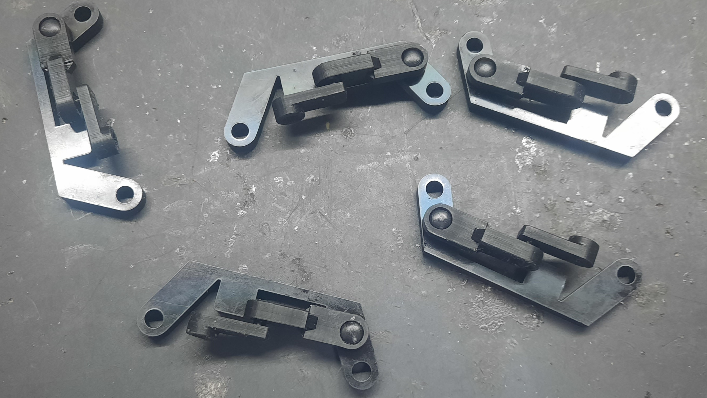</td>
        </tr>
        <tr>
            <th>紫外線固化</th>
            <th>球形接頭上油</th>
        </tr>
        <tr>
            <td>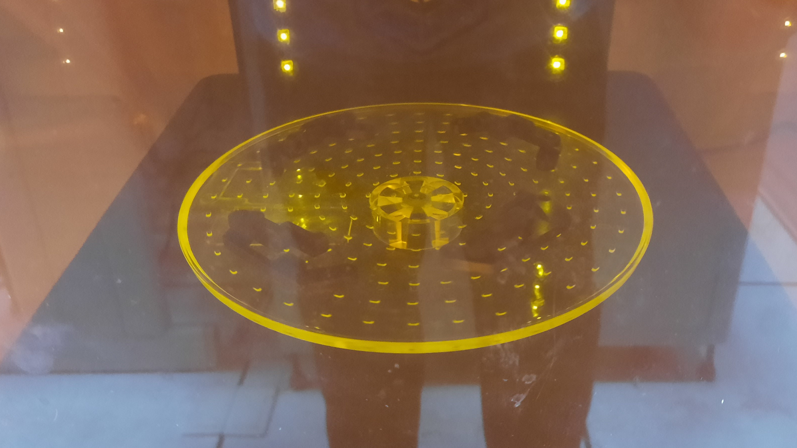</td>
            <td>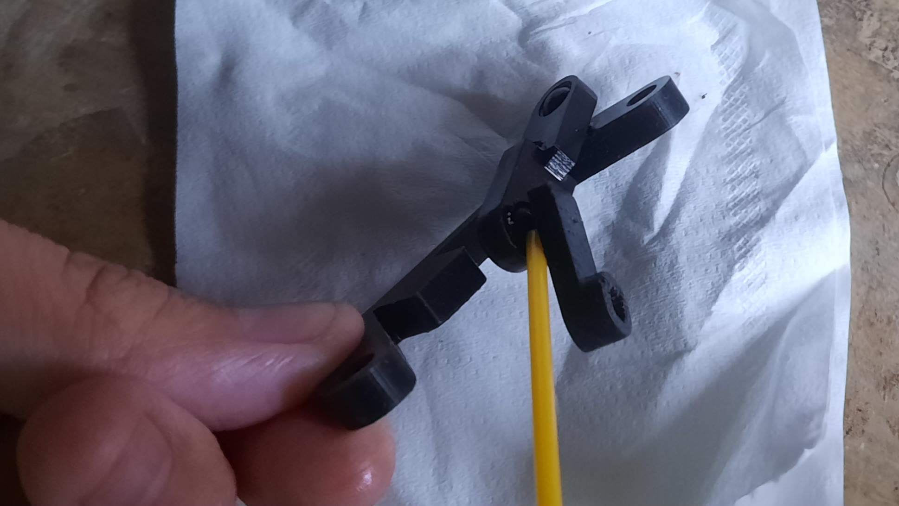</td>
        </tr>
    </table>
 </div>

## 2025/09/07 ~ 2025/09/13
**Member:** HU XIAN-YI, LIN ZHAN-RONG, ZHANG YI-WEI

**Content:**

 - 本週我們向指導教練學習到了如何進行JetPack的升級和降級，不過因為Nvidia SDK Manager必須在實體的Ubuntu主機上才有辦法正常操作，因此老師在社團教室後方架設了一台Ubuntu系統的主機用於操作SDK Manager，以下是如何使用SDK Manager進行JetPack升降級操作流程。

 <div align=center>
    <table>
        <tr>
            <th colspan=2>學習如何進行JetPack升降級</th>
        </tr>
        <tr>
            <td></td>
            <td></td>
        </tr>
    </table>
 </div>

 安裝指令

 ```bash
wget https://developer.download.nvidia.com/compute/cuda/repos/ubuntu2204/x86_64/cuda-keyring_1.1-1_all.deb
sudo dpkg -i cuda-keyring_1.1-1_all.deb
sudo apt-get update
sudo apt-get -y install sdkmanager
 ```

 - ## 介面操作
   <div align=center>
    <table>
        <tr>
            <th>將Jetson Orin Nano連接上電腦</th>
            <th>確認是否連接成功</th>
            <th>選擇開發者套件</th>
        </tr>
        <tr>
            <td></td>
            <td></td>
            <td></td>
        </tr>
        <tr>
            <th>在選單中選中所需的JetPack版本</th>
            <th>勾選左側選項，點擊下一步</th>
            <th>輸入管理者密碼</th>
        </tr>
        <tr>
            <td></td>
            <td></td>
            <td></td>
        </tr>
        <tr>
            <th>填入主機板的相關資訊</th>
            <th>安裝完畢後點擊"Finish"結束</th>
            <th>安裝完畢後的Jetson Orin Nano系統介面</th>
        </tr>
        <tr>
            <td></td>
            <td></td>
            <td></td>
        </tr>
    </table>
 </div>

## 2025/09/14 ~ 2025/09/20
**Member:** HU XIAN-YI, LIN ZHAN-RONG, ZHANG YI-WEI

**Content:**

 - 由於我們將原本的I/O控制器Raspberry Pi Pico更換為Raspberry Pi Pico WH，因此我們在嘗試將超音波感測器改為紅外線感測器時遇到了腳位無法使用的問題，加上我們要在電路板上新增 **插拔式接線端子** 用來給Jetson Orin Nano連接供電線，所以我們開始進行第五代PCB電路板的設計。

 - 在本週我們發現了 **轉向節** 存在外八的問題，由於第一、二代轉向結構是使用 **8K** 3D打印機打印的，而我們的第三、四代轉向結構是使用 **14K** 3D打印機，因此在列印上會因精度問題而導致列印出來的原件與我們實際設計的還要大一些，也因使用了14K 3D打印機之後 **轉向節** 出現了元件的角度上面比原先設計的角度還要大，因此轉向結構組裝完畢後機器人會出現內八的情況。

 <div align=center>
    <table>
        <tr>
            <th colspan=2>設計第五代PCB電路板</th>
        </tr>
        <tr>
            <td>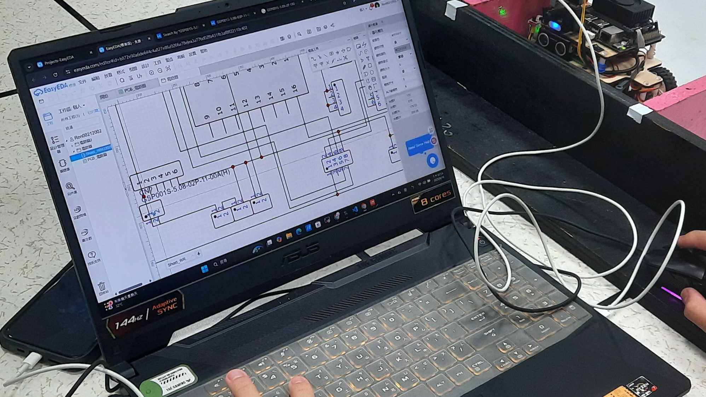</td>
            <td>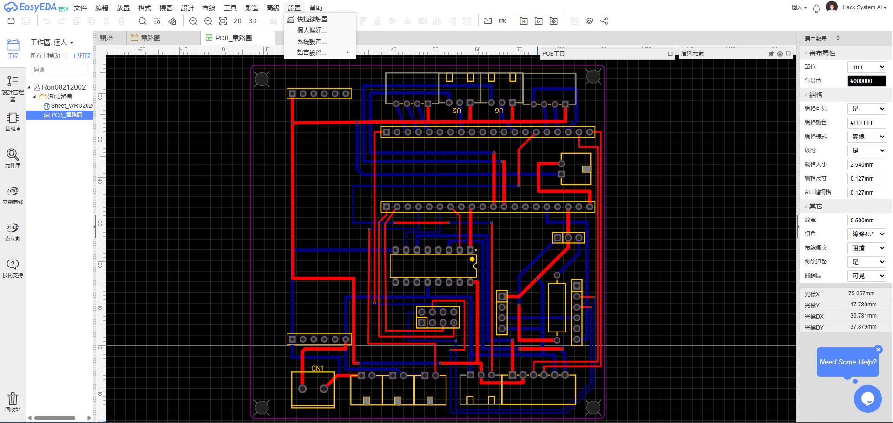</td>
        </tr>
        <tr>
            <th>使用 8K 3D打印機</th>
            <th>使用 14K 3D打印機</th>
        </tr>
        <tr>
            <td align=center>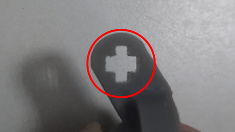</td>
            <td align=center>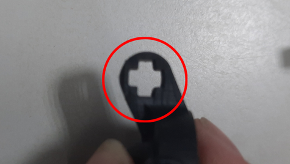</td>
        </tr>
        <tr>
            <th colspan=2>轉向結構呈現內八</th>
        </tr>
        <tr>
            <td colspan=2 align=center>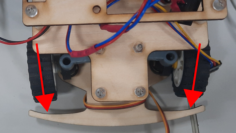</td>
        </tr>
    </table>
 </div>

 # 2025/09/21 ~ 2025/09/27
 **Member:** HU XIAN-YI, LIN ZHAN-RONG, ZHANG YI-WEI

 **Content:**

 - 由於未來工程世界賽規則更新中提到 **"自駕車再進行停車時車身僅部分可以離開出發區，若是車身完全離開出發區將會時間終止以當下情況計分"** ，原先我們自駕車的超音波感測器是安裝在車身的中尾部，很容易因為沒有偵測到停車場方塊而整個車身離開出發區，因此我們設計了新的木板及支架讓超音波可以安裝在自駕車的前方。

 - 本週我們決定將紅外線感測器安裝在自駕車的前後用於偵測邊牆及停車場方塊，於是我們設計了新的木板和紅外線L型支架用於安裝紅外線感測器。

 - 我們在本週測試第五代電路板時發現了一個會導致陀螺儀不被Jetson Orin Nano偵測到的問題，由於我們在主控制器從Jetson Nano改為Jetson Orin Nano時將排線的VCC、GND...等Pin腳取消只剩下陀螺儀的SDA和SCL腳位，結果因為GND沒有接地的關係導致連接時沒有產生迴路而沒有辦法被Jetson Orin Nano偵測到，因此我們改出了第五代電路板將排線的GND腳位重新接上以解決GND沒有接地的問題。

 <div align=center>
    <table>
        <tr>
            <th>新版超音波支架</th>
            <th>新版中木板</th>
            <th>新版上木板</th>
        </tr>
        <tr>
            <td>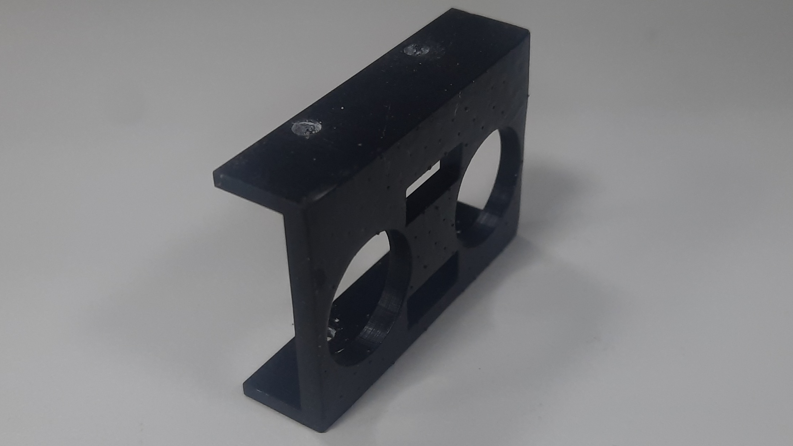</td>
            <td>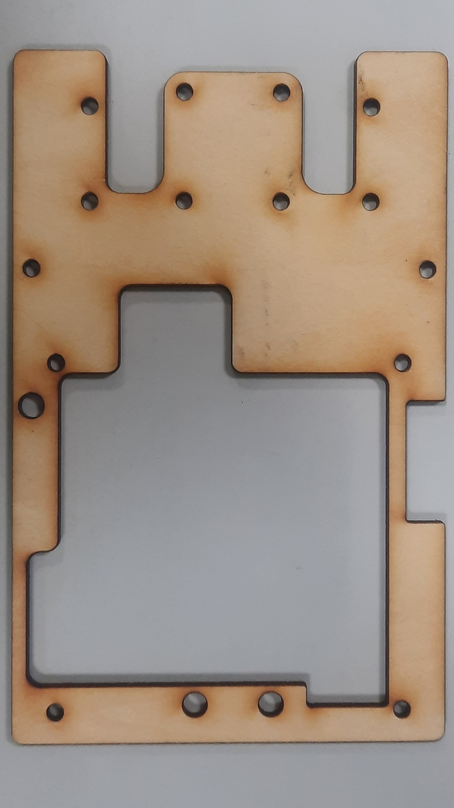</td>
            <td>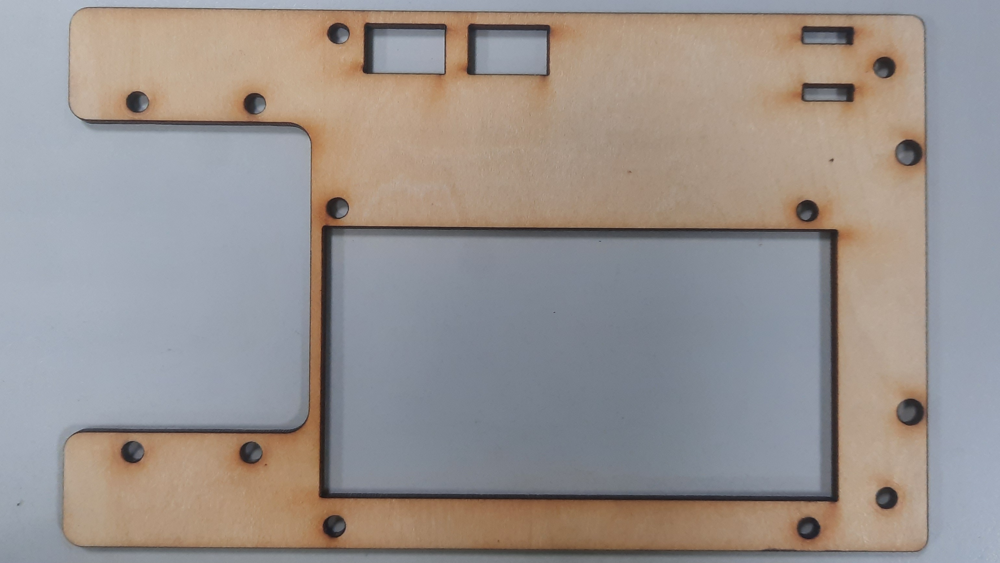</td>
        </tr>
    </table>
 </div>

 <div align=center>
    <table>
        <tr>
            <th>新版中木板</th>
            <th>紅外線感測器L型支架</th>
        </tr>
        <tr>
            <td>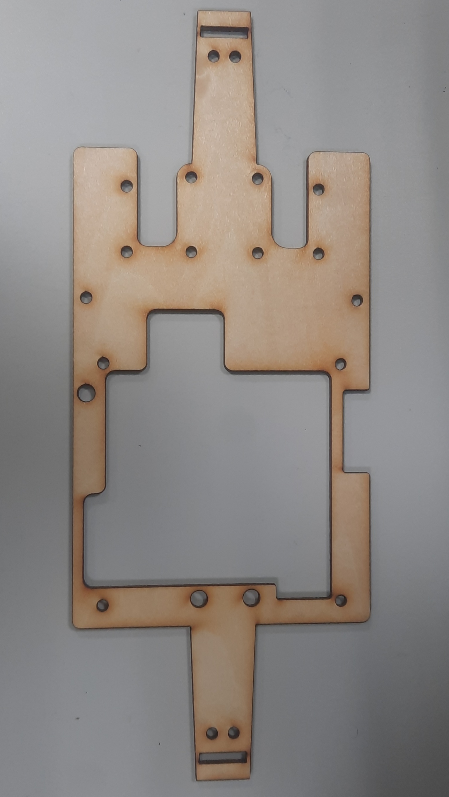</td>
            <td>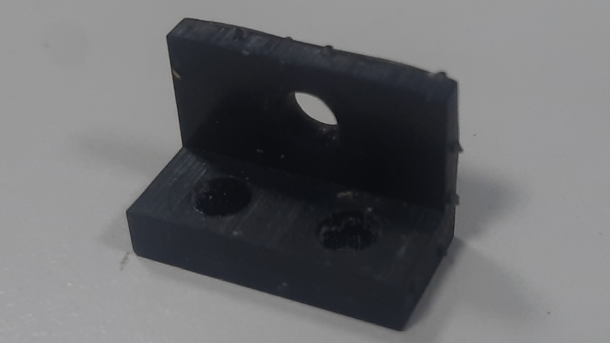</td>
        </tr>
    </table>
 </div>

 <div align=center>
    <table>
        <tr>
            <th>第六代電路板(原理圖)</th>
            <th>第六代電路板(PBC分布圖)</th>
        </tr>
        <tr>
            <td align=center >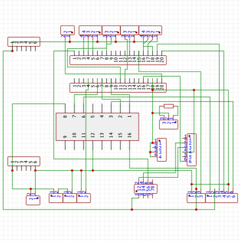</td>
            <td align=center >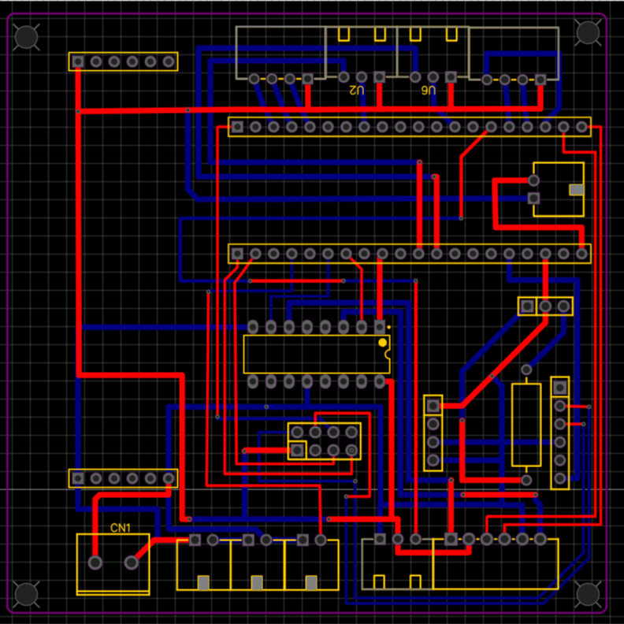</td>
        </tr>
    </table>
 </div>

 # 2025/09/28 ~ 2025/10/06
 **Member:** HU XIAN-YI, LIN ZHAN-RONG, ZHANG YI-WEI

 **Content:**

 - 我們再進行出發程序撰寫時發現自駕車會有出發時容易觸碰停車場方塊的情況，因此我們先嘗試修改整體機器人的軸距，將底板上的空位刪除以縮短軸距。經過測試之後問題有減緩但是容許誤差還是太小，因此我們修改的轉向結構中拉桿的極限方塊，將方塊縮小讓轉向結構有更多空間可以轉動。與此同時我們在測試中發現一個問題，如果自駕車出現誤判導致撞牆、方塊時都是紅外線感測器先波及到，因此我們在設計上將前方的紅外線固定區塊縮短並且在底板上延伸出19mm的區塊讓紅外線不會因為誤判而導致撞擊損壞。

 - 本週我們發現機器人在讀取BNO055的角度數據時遇到數值為0的情況，經過檢查及討論，發現問題有可能在PCB電路板上，因此我們嘗試將BNO055沒有用到的腳位線路斷開。後來經過網路資料查詢得知原因可能是出在電路迴路上，由於我們的BNO055的正極是由Raspberry Pi Pico W供應，而負極和Jetson Orin Nano進行接地並沒有形成正確迴路，因此我們會在下一代電路板上做出改動，BNO055的電路就會完全是跟Jetson Orin Nano連接，不會有其他腳位去連接PCB上的任一元件。

 - 由於我們的自駕車已經採用WebSocket進行數據傳輸，因此網路天線對我們的自駕車來說就非常重要，但是目前使用的網路接收器是使用TPLink的AC1300，其長度就有約18CM左右，所以我們在網路上找到了另外一種網路接收器，ASUS的AC1200，其大小只有2CM*1.5CM，因此我們將網路接收器更換為ASUS的AC1200。

 - 我們原本是使用手機作為WIFI媒介，但是我們發現了有傳輸延遲的情況，因此我們在網路上尋找到方法可以將Jetson Orin Nano變為AP來運作，減去了手機轉接訊號時會導致的延遲。

 <div align=center>
    <table>
        <tr>
            <th colspan=2 >第三代底盤照片</th>
        </tr>
        <tr>
            <td colspan=2 align=center >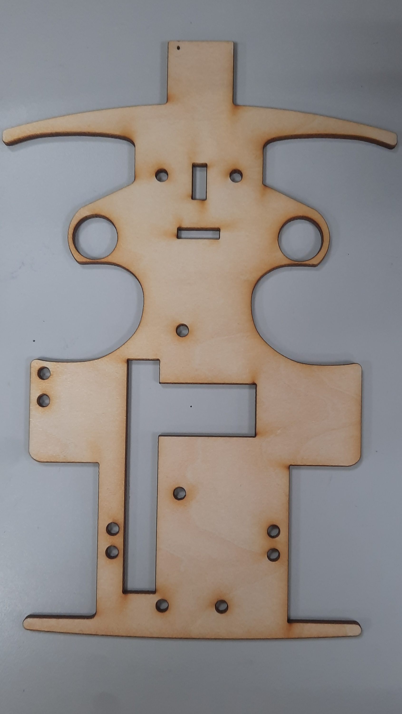</td>
        </tr>
        <tr>
            <th colspan=2 >第三代中板照片</th>
        </tr>
        <tr>
            <td colspan=2 align=center ></td>
        </tr>
        <tr>
            <th>TPLink AC1300 接收器</th>
            <th>ASUS AC1200 接收器</th>
        </tr>
        <tr>
            <td align=center >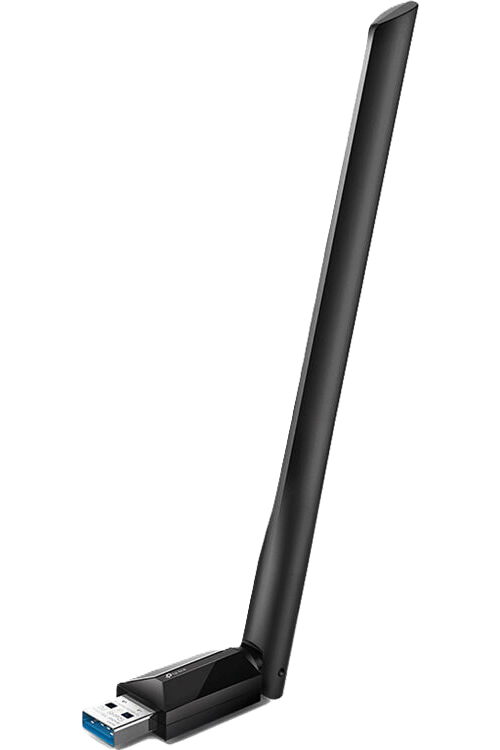</td>
            <td align=center >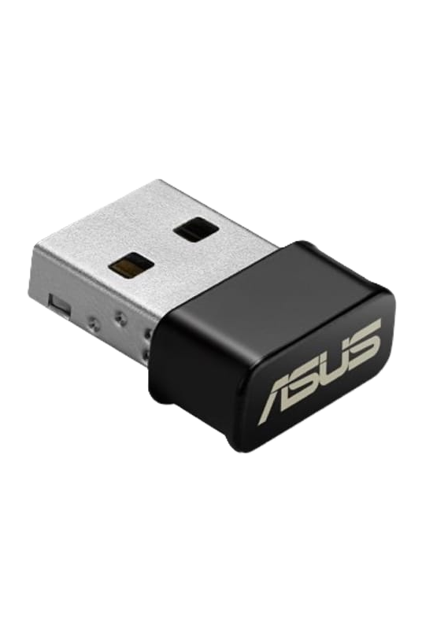</td>
        </tr>
    </table>
 </div>

# <div align="center">[Return Home](../../)</div>