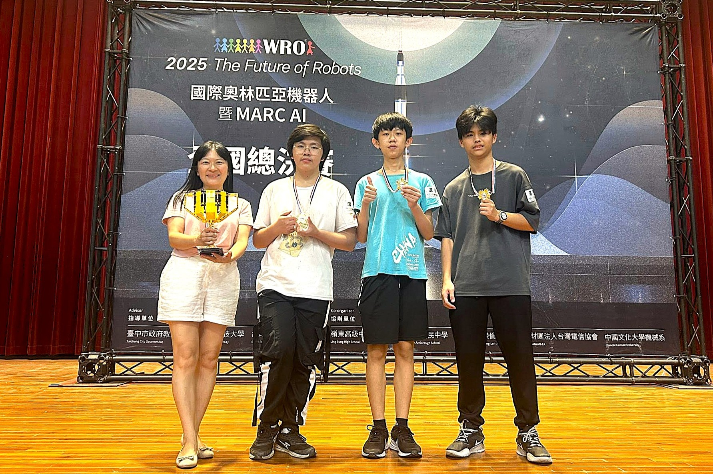
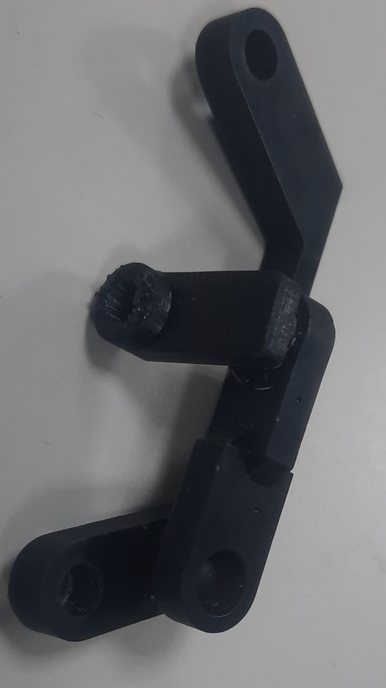

# 
Work Diary-工作日記

以下是本次自動駕駛汽車模型設計與任務解決的開發記錄，涵蓋了機械設計與製造、電路設計與實現、電子裝置選型、程式設計與測試以及整體的解題過程。

The following is a development record of the self-driving car model design and task-solving, covering mechanical design and manufacturing, circuit design and implementation, electronic device selection, programming and testing, and the overall problem-solving process.
## 2025/02/28 ~ 2025/03/30  

**Member:** HU XIAN-YI, LIN ZHAN-RONG, ZHANG YI-WEI

**Content:**  

 - 我們的隊友胡賢邑在過去幾年多次參加「未來工程競賽」，在機構設計和程式控制優化方面累積了豐富的實戰經驗。不過，由於每年比賽的主題與挑戰規則都會有所調整，我們深入討論後，決定針對今年的參賽模型進行輕量化設計。我們縮小了整體結構，這不僅有助於機器進出停車區時更順利，也讓它在場地中移動更靈活，能更有效避開障礙方塊，整體表現也因此更穩定。

 - Our teammate, Hu Xianyi, has participated in the “Future Engineering Competition” multiple times over the past few years, gaining valuable hands-on experience in mechanical design and programming optimization. Since the competition’s themes and challenge rules change every year, we had an in-depth discussion and decided to redesign this year’s model with a focus on weight reduction. By downsizing the overall structure, the robot can now navigate in and out of the parking zone more smoothly, move more flexibly around the field, and avoid obstacle blocks more effectively — all of which contribute to more consistent and improved performance during the competition.

<table>
<tr align="center">
<th>Last year's senior's model</th>
<th>This year's senior's model</th>
</tr>
<tr align="center">
<td></td> 
    <td></td> 
</tr>
</table>

<table>
<tr align="center">
<th >Refer to the seniors GitHub reports(參考學長姐們的Github報告)</th>
</tr>
<tr align="center">
<td> </td>
</tr>
</table>

## 2025/03/01 ~ 2025/03/07
**Member:** HU XIAN-YI, LIN ZHAN-RONG, ZHANG YI-WEI

**Content:**

 - 我們在這一周進行了主控制器系統安裝及測試，同時也開始了避障程序的撰寫和反覆測試穩定性、修改程序中的問題以求在避賽中取得亮眼的成績。

    <table>
        <tr align=center>
            <th width=50% style="text-align: center;">System Installation</th>
            <th width=50% style="text-align: center;">Obstacle-Avoidance Program Development</th>
        </tr>
        <tr>
            <td></td>
            <td></td>
        </tr>
    </table>

## 2025/

## 2025/03/11 ~ 2025/03/17

**Member:** HU XIAN-YI, LIN ZHAN-RONG, ZHANG YI-WEI

**Content:**  

 - 為了讓電路板配置更整齊，我們採用 EasyEDA 繪製電路板，並將設計完成的圖稿透過洗印方式製作出第一代電路板。由於這是我們首次接觸電路板設計，當時未能注意到設計軟體中其實已提供標準的元件排版範例。我們改以自行測量排針與排針之間的間距，但因經驗不足，最終在電路板製作完成後才發現設計的間距過小，導致元件無法順利插入。這次失誤讓我們獲得了寶貴的學習經驗，也立即推動我們對設計進行修正與優化。經過快速調整後，我們完成了第二代電路板，成功解決了間距問題，使元件安裝更為順利，整體佈線也更加合理。

 - To achieve a more organized circuit board layout, we used EasyEDA to design the PCB and then fabricated the first-generation board using a printed-etching process. Since this was our first experience with PCB design, we failed to notice that the software already provided standard component layout templates. Instead, we manually measured the spacing between pin headers. Due to our lack of experience, we only discovered after fabrication that the spacing was too narrow, which prevented the components from being properly inserted. This mistake provided us with valuable hands-on experience and immediately motivated us to revise and optimize our design. After a quick round of adjustments, we successfully developed the second-generation PCB, which resolved the spacing issue, improved component installation, and made the overall wiring layout more efficient.

<table >
<tr align="center">
<th>First-Generation Front View</th>
<th>First-Generation Back View</th>
<tr align="center">
<td>
</td>
<td>
</td>
</tr>
</table>

## 2025/04/03 ~ 2025/04/14

**Member:** HU XIAN-YI, LIN ZHAN-RONG, ZHANG YI-WEI

**Content:**  
 - 在第二代版本的開發過程中，我們根據第一代的回饋，利用設計軟體內建的範例圖重新校準了排針間距，成功改善了原始設計。然而，由於作業上的疏忽，我們在進行 PCB 佈局時誤將背面視圖當作正面設計，導致電路板輸出後發生極性顛倒的問題。所幸在組裝與測試階段便立即發現此錯誤，並在第三代版本中修正了佈局方向。同時，我們也全面複查了各層的對齊規範，以確保設計檔與實體成品能夠完全一致。

 - During the development of the second-generation version, we incorporated feedback from the first generation and recalibrated the pin header spacing using the built-in reference templates in the design software, successfully improving the original layout. However, due to an operational oversight, we mistakenly treated the back view as the front view during the PCB layout process, which resulted in polarity reversal after fabrication. Fortunately, this issue was identified immediately during the assembly and testing stage. In the third-generation version, we corrected the layout orientation and also conducted a thorough review of alignment rules across all layers to ensure full consistency between the design files and the physical product.

    <table >
        <tr align="center">
            <th>Second-Generation Front View</th>
            <th>Second-Generation Back View</th>
        </tr>
        <tr align="center">
            <td>
                
            </td>
            <td>
                
            </td>
        </tr>
    </table>

## 2025/06/03 ~ 2025/06/08  
**Member:** HU XIAN-YI, LIN ZHAN-RONG, ZHANG YI-WEI

**Content:** 

- 經修正前兩代的設計問題後，第三代版本已成功通過功能測試。實際運行測試顯示，排針接點與電路佈局無異常，系統可穩定運作。

<table >
<tr align="center">
<th>Third-Generation Front View</th>
<th>Third-Generation Back View</th>
<tr align="center">
<td>
</td>
<td>
</td>
</tr>
</table>

## 2025/07/02 ~ 2025/07/21
**Member:** HU XIAN-YI, LIN ZHAN-RONG, ZHANG YI-WEI

**Content:** 

 - 在進行避障程式測試時，我們注意到自駕車在過彎時會出現些許卡頓。經檢查後發現問題源自底盤結構，因為轉向節與底盤直接接觸，過大的摩擦力導致傳動結構卡滯。為了解決此問題，我們將原本用來固定轉向節的孔洞擴大，並改為放置軸承以降低摩擦。經過測試後，採用軸承的新底盤結構有效改善了轉向的流暢度，使自駕車在過彎時更加平順。

 - During obstacle-avoidance testing, we noticed that the autonomous car experienced slight stuttering when making turns. Upon inspection, we identified the issue in the chassis design: the steering knuckle was in direct contact with the chassis, and the resulting friction caused binding in the transmission structure. To address this, we enlarged the original holes used for mounting the steering knuckle and replaced them with bearings to reduce friction. Testing confirmed that the updated chassis with the bearing structure significantly improved turning smoothness, allowing the car to navigate corners more fluidly.

 

    <table>
        <tr>
            <th colspan=2>Before and After Modification</th>
        </tr>
        <tr>
            <td></td>
            <td></td>
        </tr>
    </table>
 

## 2025/08/18 ~ 2025/08/24
**Member:** HU XIAN-YI, LIN ZHAN-RONG, ZHANG YI-WEI

**Content:** 
 - 我們的比賽是在8月23日，在早上的資格賽中第一局因為撞到內側邊牆直接結束比賽，而第二局時我們完成了繞場三圈的任務但是在最後的停車節自駕車超出了指定區塊而無法獲取完整分數，但就算如此我們也成功進入到了下午的決賽中。

 - 到了下午的決賽中，我們未能完成滿解，第一場自駕車因為移動到障礙物所以未能完成躲避障礙物的分數，在最後停車環節因為經過了最後障礙物後又離開了出發區因此無法完成停車任務。

 - 就算比賽過程坎坷但我們也成功的以第一名的排名代表台灣出賽WRO未來工程師世界賽，我們將吸收這次全國賽的經驗，以更好的狀態去參加世界賽並且獲取優異的成績榮耀回國。

 

    <table>
        <tr>
            <th>Waiting for test</th>
            <th>Competition photo</th>
            <th>Award-winning photo</th>
        </tr>
        <tr>
            <td></td>
            <td></td>
            <td></td>
        </tr>
    </table>
 

## 2025/08/25 ~ 2025/08/31
**Member:** HU XIAN-YI, LIN ZHAN-RONG, ZHANG YI-WEI

**Content:**
- 在參加全國賽的過程中，我們發現 Jetson Nano 在運算效能上存在不足，因此決定將主控制器升級為運算效率更高的 Jetson Orin Nano。同時，我們開始研究如何利用 WebSockets 建立 Jetson Orin Nano 與 Raspberry Pi Pico 之間的通訊。由於 WebSockets 通訊需要雙方皆能連線至網路，我們將原本的 Raspberry Pi Pico 更換為具備 WiFi 功能的 Raspberry Pi Pico2 WH，以滿足無線連線的需求。

- From our experience in the national competition, we realized that the Jetson Nano had limitations in terms of computing performance. To address this, we decided to upgrade the main controller to the more powerful Jetson Orin Nano. At the same time, we began exploring the use of WebSockets to establish communication between the Jetson Orin Nano and the Raspberry Pi Pico. Since WebSocket communication requires both devices to have network connectivity, we replaced the original Raspberry Pi Pico with the Raspberry Pi Pico2 WH, which comes with built-in WiFi capability to meet this requirement.

    <table>
       <tr>
           <th width=50%>Model Used in the National Competition</th>
           <th width=50%>Model Used in the International Competition</th>
       </tr>
       <tr>
           <td align=center></td>
           <td align=center></td>
       </tr>
       <tr>
           <th>First-Generation Steering Structure</th>
           <th>Second-Generation Steering Structure</th>
       </tr>
       <tr>
           <td align=center></td>
           <td align=center></td>
       </tr>
       <tr>
           <th>Raspberry Pi Pico</th>
           <th>Raspberry Pi Pico2 WH</th>
       </tr>
       <tr>
           <td align=center></td>
           <td align=center></td>
       </tr>
    </table>

## 2025/09/01 ~ 2025/09/07
**Member:** HU XIAN-YI, LIN ZHAN-RONG, ZHANG YI-WEI

**Content:**
 - 我們在本周發現了第三版轉向結構存在力矩上的問題，因此我們將轉向結構中拉桿和連桿之間的球形結構改到連桿之上，以改正轉向結構中的力矩，得到了第四版轉向結構。

 - 同時本周我們也在進行自駕車的停車程式撰寫。

 - 我們在安裝轉向結構的球形接頭部分時因為已經經過紫外線固化的原因而導致安裝困難，解決方法是在進行紫外線固化前先使用砂紙進行細磨，然後再接觸位置抹上潤滑油使球型結構可以更加順滑，完成之後安裝起來再進行紫外線固化，這樣就解決了組裝困難及轉動不順滑等問題。

 

    <table>
        <tr>
            <th align=center>第四版轉向結構</th>
            <th align=center>修改停車程序</th>
        </tr>
        <tr>
            <td></td>
            <td></td>
        </tr>
    </table>
 

 

    <table>
        <tr>
            <th align=center>進行砂紙細磨</th>
            <th align=center>結構抹潤滑油</th>
            <th align=center>組裝後放進UV固化機</th>
        </tr>
        <tr>
            <td></td>
            <td></td>
            <td></td>
        </tr>
    </table>
 

# 
[Return Home](../../)
