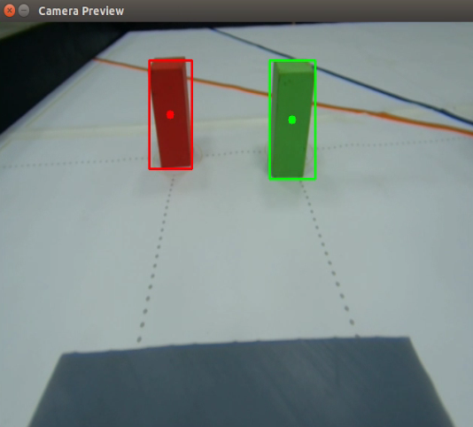
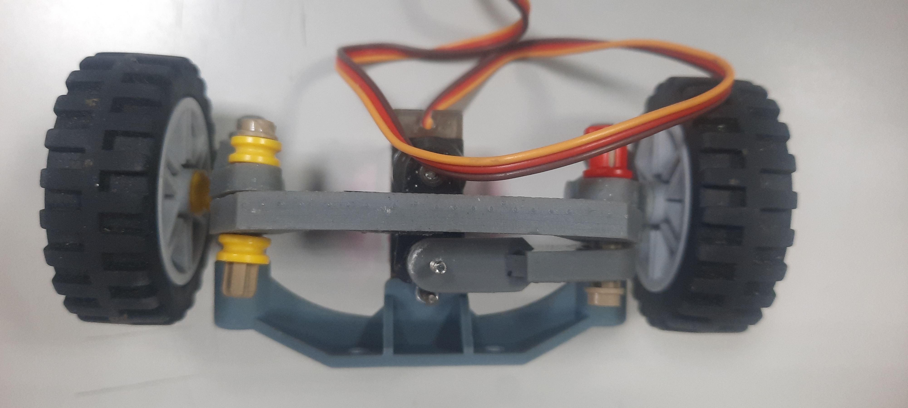

<div align="center"></div>

# <div align="center">Work Diary-工作日記</div>
- The following is a development record of the self-driving car model design and task-solving, covering mechanical design and manufacturing, circuit design and implementation, electronic device selection, programming and testing, and the overall problem-solving process.

- ### Autonomous Vehicle Design: Key Upgrades and Iterations
  This autonomous vehicle design **builds upon** the rich experience inherited from the senior team (**Shinan-Fire-On-All-Cylinders**) and integrates my practical insights from last year's World Competition.

  We didn't just reference the successful elements of the previous year's winning teams; we implemented **key technological iterations**:

  * **Controller Upgrade:** The main controller has been upgraded from the standard Jetson Orin Nano to the **superior-performing Nvidia Jetson Orin Nano**.
  * **Mechanical Overhaul:** We have **restructured and optimized** the vehicle's mechanical components, specifically the steering and chassis.
  * **Vision Enhancement:** Image processing has been **significantly enhanced** for greater efficiency and accuracy.

  The integration of all these upgrades and innovative design elements is squarely aimed at **comprehensively strengthening** the vehicle's overall performance and competitiveness.
## 2025/02/28 ~ 2025/03/30  

**Member:** HU XIAN-YI, LIN ZHAN-RONG, ZHANG YI-WEI

**Content:**  
 - Our teammate, HU,SIAN-YI, has accumulated solid hands-on experience in mechanical design and programming optimization through years of participation in the "Future Engineering Competition."
- Considering the annual changes in competition themes and rules—and drawing inspiration from the world champion team’s outstanding achievements in image recognition technology last year—our team conducted in-depth discussions and decided to implement a key lightweight design for this year’s competition model.
- By streamlining the overall structure, we achieved multiple benefits: improved the vehicle’s smooth entry and exit from parking zones, significantly enhanced maneuverability on the field, and enabled more precise obstacle avoidance, thereby comprehensively reinforcing the vehicle’s operational performance.

<div align="center">
<table>
<tr align="center">
<th>Last year's competition vehicle model</th>
<th>This year's competition vehicle model</th>
</tr>
<tr align="center">
<td></td> 
    <td></td> 
</tr>
</table>
</div>
<div align="center">
<table>
<tr align="center">
<th >For the design reference of this project, we consulted the engineering documents from our school's past teams and conducted a deep dive analysis of the technical files from last year's world champion team.)</th>
</tr>
<tr align="center">
<td> </td>
</tr>
</table>
</div>

## 2025/03/01 ~ 2025/03/07
**Member:** HU XIAN-YI, LIN ZHAN-RONG, ZHANG YI-WEI

**Content:**

 - This week's focus was on system installation and driver download. Considering the inconvenience and the risk of physical port damage associated with operating the Jetson Nano directly via a small monitor, we opted for a more efficient approach: deploying the NoMachine remote desktop software onto the Jetson Nano. This enables smooth coding and debugging of the autonomous driving programs going forward. 
 - Attached are supporting photos documenting the system installation, driver download, and remote desktop functionality testing.


<div align="center">
    <table>
        <tr align=center>
            <th width=50% style="text-align: center;">Jetson  Nano Software Environment Installation</th>
            <th width=50% style="text-align: center;">Jetson  Nano Software Environment Testing</th>
        </tr>
        <tr>
            <td></td>
            <td></td>
        </tr>
    </table>
</div>

## 2025/03/11 ~ 2025/03/17

**Member:** HU XIAN-YI, LIN ZHAN-RONG, ZHANG YI-WEI

**Content:**  

 - 為了讓電路板配置更整齊，我們採用 EasyEDA 繪製電路板，並將設計完成的圖稿透過洗印方式製作出第一代電路板。由於這是我們首次接觸電路板設計，當時未能注意到設計軟體中其實已提供標準的元件排版範例。我們改以自行測量排針與排針之間的間距，但因經驗不足，最終在電路板製作完成後才發現設計的間距過小，導致元件無法順利插入。這次失誤讓我們獲得了寶貴的學習經驗，也立即推動我們對設計進行修正與優化。經過快速調整後，我們完成了第二代電路板，成功解決了間距問題，使元件安裝更為順利，整體佈線也更加合理。

 - To achieve a more organized circuit board layout, we used EasyEDA to design the PCB and then fabricated the first-generation board using a printed-etching process. Since this was our first experience with PCB design, we failed to notice that the software already provided standard component layout templates. Instead, we manually measured the spacing between pin headers. Due to our lack of experience, we only discovered after fabrication that the spacing was too narrow, which prevented the components from being properly inserted. This mistake provided us with valuable hands-on experience and immediately motivated us to revise and optimize our design. After a quick round of adjustments, we successfully developed the second-generation PCB, which resolved the spacing issue, improved component installation, and made the overall wiring layout more efficient.
<div align="center" >
<table >
<tr align="center">
<th>First-Generation Front View</th>
<th>First-Generation Back View</th>
<tr align="center">
<td>
</td>
<td>
</td>
</tr>
</table>
</div>

## 2025/03/18 ~ 2025/03/24
**Member:** HU XIAN-YI, LIN ZHAN-RONG, ZHANG YI-WEI

**Content:** 

 - 本周我們開始撰寫我們的自駕車程序，我們為了能夠順利撰寫自駕車程序在網路上查詢了相關資料，例如：Raspberry Pi Pico和Jetson Nano之間要如何進行通訊、要如何使用Raspberry Pi Pico控制直流馬達上的Encoder、讀取超音波數值等。

 <div align=center>
    <table>
        <tr>
            <th align=center>查找相關資料</th>
            <th align=center>撰寫自駕車程序</th>
        </tr>
        <tr>
            <td></td>
            <td></td>
        </tr>
    </table>
 </div>

## 2025/03/25 ~ 2025/03/31
**Member:** HU XIAN-YI, LIN ZHAN-RONG, ZHANG YI-WEI

**Content:** 

 - 本周我們撰寫出了基本的程序架構，並且成功使用**UART**的方式搭建了Raspberry Pi Pico和Jetson Nano之間的通訊，將Jetson Nano上的控制指令傳輸到Raspberry Pi Pico。
    
    **Jetson Nano端**
    ```python
    import serial as AC
    import struct

    combined_control_signal = 30
    turn_side = 0
    PWM = 80

    try:
        ser = AC.Serial('/dev/ttyTHS1', 115200, timeout=1)
    except AC.SerialException as e:
        print(f"Error: Could not open serial port: {e}")
        exit()

    data_to_send = (int(combined_control_signal), int(turn_side),int(PWM))
    header = b"A"
    send_data_value = struct.pack('3i', *data_to_send)
    send_data_value = header + send_data_value
    ser.write(send_data_value)
    ```

    **Raspberry Pi Pico端**
    ```python
    from machine import UART, Pin
    import struct

    uart = UART(0, baudrate=115200, tx=Pin(16), rx=Pin(17))

    def jetson_nano_return(number):
        global data_value
        HEADER = b"A"
        HEADER_SIZE = len(HEADER)
        DATA_SIZE = 12
        TOTAL_SIZE = HEADER_SIZE + DATA_SIZE

        if uart.any():
            data = uart.read(TOTAL_SIZE)
            if len(data) == TOTAL_SIZE:
                header_index = data.find(HEADER)
                if header_index != -1:
                    start_index = header_index + HEADER_SIZE
                    data = data[start_index:] + data[:start_index]
                    data_value = struct.unpack('3i', data[:DATA_SIZE])
                    return data_value[number]
                else:
                    print("Error: Incorrect header received.")
            else:
                print("Error: Incomplete data received.")
        return data_value[number]
    ```

## 2025/04/03 ~ 2025/04/14

**Member:** HU XIAN-YI, LIN ZHAN-RONG, ZHANG YI-WEI

**Content:**  
 - 在第二代版本的開發過程中，我們根據第一代的回饋，利用設計軟體內建的範例圖重新校準了排針間距，成功改善了原始設計。然而，由於作業上的疏忽，我們在進行 PCB 佈局時誤將背面視圖當作正面設計，導致電路板輸出後發生極性顛倒的問題。所幸在組裝與測試階段便立即發現此錯誤，並在第三代版本中修正了佈局方向。同時，我們也全面複查了各層的對齊規範，以確保設計檔與實體成品能夠完全一致。

 - During the development of the second-generation version, we incorporated feedback from the first generation and recalibrated the pin header spacing using the built-in reference templates in the design software, successfully improving the original layout. However, due to an operational oversight, we mistakenly treated the back view as the front view during the PCB layout process, which resulted in polarity reversal after fabrication. Fortunately, this issue was identified immediately during the assembly and testing stage. In the third-generation version, we corrected the layout orientation and also conducted a thorough review of alignment rules across all layers to ensure full consistency between the design files and the physical product.

<div align="center" >
    <table >
        <tr align="center">
            <th>Second-Generation Front View</th>
            <th>Second-Generation Back View</th>
        </tr>
        <tr align="center">
            <td>
                
            </td>
            <td>
                
            </td>
        </tr>
    </table>
</div>

## 2025/04/15 ~ 2025/04/21
**Member:** HU XIAN-YI, LIN ZHAN-RONG, ZHANG YI-WEI

**Content:**

 - 本週我們完成了自駕車的停車程序設計。

 - 在本次實作中，我們採用 直角倒車入庫 的方式作為主要停車策略，使車輛能精準地進入指定停車區域。

 - 下圖為停車程序流程的示意圖。

 <div align=center>
    <table>
        <tr>
            <th>停車流程示意圖</th>
        </tr>
        <tr>
            <td></td>
        </tr>
    </table>
 </div>

## 2025/04/22 ~ 2025/04/30
**Member:** HU XIAN-YI, LIN ZHAN-RONG, ZHANG YI-WEI

**Content:**

 - 本週，我們開始撰寫自駕車的避障程式。我們的避障方式是：在影像畫面中繪製兩條具有斜率的路徑線，作為車輛行進的參考方向。在 function.py 檔案中的 detect_color_final 副程式中，系統會計算畫面中目標物體的中心座標。自駕車再根據物體中心座標與路徑線之間的座標差，計算出所需的轉彎角度，進而完成避障動作。

 - 下方為自駕車的實際運作畫面。
 <div align=center>
    <table>
        <tr>
            <th colspan=3 >Jetson Nano程序執行畫面</th>
        </tr>
        <tr>
            <td></td>
            <td></td>
            <td></td>
        </tr>
    </table>
 </div>

## 2025/05/01 ~ 2025/05/07
**Member:** HU XIAN-YI, LIN ZHAN-RONG, ZHANG YI-WEI

**Content:**

 - 本週我們在程式中加入了轉向開始與結束的判斷機制。

 - 當畫面中偵測到轉向區的線條時，系統會自動切換至「轉向模式」。
 - 在判斷是否離開轉向區時，程式需要同時滿足 航向角變化、HSV 顏色辨識、以及 時間條件 三項判定，才能將轉向次數加一。

 - 經過實際測試後，我們發現這種方式有時會導致車輛與障礙物方塊發生碰撞。
 - 為了解決這個問題，我們在轉向機制中新增了障礙物偵測邏輯：
 - 當自駕車在轉向過程中識別到方塊時，會優先執行避障；
 - 若偵測到車體即將接近牆面，則會先執行遠離邊牆的動作，
 - 最後再判斷是否已離開轉向區。

下方為判斷是否離開轉向區的邏輯程式。

```python
if elapsed_time >= 0.7 and color_y_positions[0] ==0 and color_y_positions[1] == 0 and heading < target_heading[count+1] + 35 and heading > target_heading[count+1] - 35:
    turn_side = 2
    if count >= 3:
        count = 0
        round_number +=1
        if round_number == 2:
            turn_side = 3
            time_count = 0
            start_time = time.time()
    else:
        count += 1
        combined_control_signal = 0
```

## 2025/05/08 ~ 2025/05/14
**Member:** HU XIAN-YI, LIN ZHAN-RONG, ZHANG YI-WEI

**Content:** 

 - 我們的程式在每次運作前，都需要手動啟動主程式。為了讓系統能自動啟動，我們在 Jetson Nano 上撰寫了一個啟動腳本，並透過 Linux 的 Systemctl 服務 讓系統在每次開機時自動執行該腳本。腳本運行後，會持續偵測 Raspberry Pi Pico 是否發出「程式啟動」的訊號。

 - 以下為 open-mode.service、open-mode.sh、以及 open-mode.py 的程式碼。
 
 open-mode.service
 ```bash
[Unit]
Description=Open Terminal with Python Script on Boot
After=graphical.target network.target
Wants=graphical.target

[Service]
Type=simple
User=user
Environment="DISPLAY=:0"
Environment="XAUTHORITY=/home/user/.Xauthority"
Environment="DBUS_SESSION_BUS_ADDRESS=unix:path=/run/user/1000/bus"
WorkingDirectory=/home/user/code
ExecStart=/bin/bash -c "/home/user/code/open-mode.sh"
Restart=on-failure
RestartSec=5s

[Install]
WantedBy=default.target
 ```

 open-mode.sh
 ```bash
#!/bin/bash

# 等待X伺服器準備好
while [ ! -e /tmp/.X11-unix/X0 ]; do
    sleep 1
done

# 等待使用者會話完全啟動
until xhost >/dev/null 2>&1; do
    sleep 1
done

# 設置必要的環境變量
export DISPLAY=:0
export XAUTHORITY=/home/user/.Xauthority
export DBUS_SESSION_BUS_ADDRESS=unix:path=/run/user/1000/bus

# 啟動終端並保持打開
/usr/bin/gnome-terminal --title='start code' -- bash -c '/home/user/code/open-mode.py; exec bash'
 ```

 open-mode.py
 ```python
#!/usr/bin/python3
import Jetson.GPIO as GPIO
import time
import subprocess
import os


# 设置 GPIO 模式
GPIO.setmode(GPIO.BOARD)  # 使用引脚编号方式

# 设置 GPIO 12 为输入模式
input_pin = 7
output_pin = 40
GPIO.setup(output_pin, GPIO.OUT)
GPIO.setup(input_pin, GPIO.IN)

# 保存进程信息的变量
process = None
GPIO.output(output_pin, GPIO.LOW)
try:
    command = "xrandr --fb 1900x1240"
    subprocess.run(command, shell=True)
    GPIO.output(output_pin, GPIO.LOW)
    while True:
        # 检测引脚电平状态
        if GPIO.input(input_pin) == GPIO.HIGH:
            print("检测到高电平，执行另一个程序")
            # 执行另一个程序（例如运行一个脚本）并避免阻塞主程序
            if process is not None and process.poll() is None:  # 检查进程是否仍在运行
                time.sleep(1)  # 每隔1秒检测一次
                continue
            command = "echo '0000' | sudo -S chmod 777 /dev/ttyTHS1"
            subprocess.run(command, shell=True)
            folder_path = "/home/user/code/"  # 替换为你要进入的目录路径
            os.chdir(folder_path)
            
            #process = subprocess.Popen(
            #    ["xterm", "-e", "/usr/bin/python3", "/home/user/code/jetson_nano_main.py"]
            #) # 資格賽
            process = subprocess.Popen(
                ["xterm", "-e", "/usr/bin/python3", "/home/user/code/jetson_nano_main_final.py"]
            ) # 決賽

        else:
            if process is not None and process.poll() is None:  # 检查进程是否仍在运行
                print("终止先前运行的程序")
                process.terminate()  # 可以用 kill() 强制关闭
                process.wait()       # 等待进程完全结束
            GPIO.output(output_pin, GPIO.LOW)
            print("低电平，熄燈")

        time.sleep(1)  # 每隔1秒检测一次

except KeyboardInterrupt:
    # 清理 GPIO 设置
    GPIO.cleanup()
 ```

## 2025/05/15 ~ 2025/05/21
**Member:** HU XIAN-YI, LIN ZHAN-RONG, ZHANG YI-WEI

**Content:** 

 - 本週我們發現，自駕車的停車參數調整過於繁瑣，主要原因是程式設定的容許誤差範圍太小。

 - 為了解決這個問題，我們啟用了先前預留的 超音波感測器孔位，並利用超音波感測數值來輔助自駕車完成停車動作。

 - 這樣的設計大幅提升了停車程序的穩定性與成功率。

 - 下方為超音波數值的讀取程式。

 ```python
def measure_distance(trig, echo):
    # Send trigger pulse
    trig.value(0)
    time.sleep_us(2)
    trig.value(1)
    time.sleep_us(10)
    trig.value(0)

    # Read Echo pulse width
    duration = time_pulse_us(echo, 1)

    # Calculate distance (speed of sound is approximately 343 m/s)
    distance = (duration / 2) * 0.0343

    return distance
 ```

## 2025/05/22 ~ 2025/05/28
**Member:** HU XIAN-YI, LIN ZHAN-RONG, ZHANG YI-WEI

**Content:** 

 - 有了上週加入的超音波輔助停車功能後，自駕車在停車時所需的調整次數明顯減少。

 - 本週我們開始著手撰寫「出發程序」。
 - 出發程序由 Jetson Nano 負責控制，透過偵測畫面中左右側的 ROI（感興趣區域）數值，判斷比賽起始階段應該採取順時針或逆時針的行進方向。

 - 當自駕車成功出發後，系統會自動將模式切換為「避障模式」，並持續前進。

 - 以下為自駕車的出發程序。

 ```python
if turn_side == 8:
    PWM = -45
    if  roi_values[0]> roi_values[1] and start_0:
        ROI_0 = True
        start_1 = True
        start_0 = False
    elif  roi_values[0]< roi_values[1]and start_0:
        ROI_1 = True
        start_1 = True
        start_0 = False
    if  abs(heading) < 60 and start_1 or abs(heading) > 80 and start_1:
        if ROI_1:
            combined_control_signal = 180
        elif ROI_0:
            combined_control_signal = -180
    if abs(heading) > 60 and abs(heading) < 80 and start_1:
        start_2 = True
        start_1 = False
    if start_2:
        PWM = 40
        combined_control_signal = 0
    if start_2 and roi_values[2] > 4000:
        start_2 = False
        start_3 = True
    if abs(heading) > 10 and abs(heading) < 170 and start_3:
        if ROI_1:
            combined_control_signal = -180
        elif ROI_0:
            combined_control_signal = 180
    if abs(heading) < 10 and start_3  or abs(heading) > 170 and start_3:
        start_2 = False
        start_1 = False
        turn_side = 0
 ```

## 2025/05/29 ~ 2025/06/03
**Member:** HU XIAN-YI, LIN ZHAN-RONG, ZHANG YI-WEI

**Content:**

 - 由於轉向結構可以轉動的角度有限，如果角度太大可能會使轉向結構扭斷，因此我們在程式碼結尾加入了角度限制，以防止Servo燒壞或轉向結構被扭斷。以下為限制轉向角度的程式碼。

 ```python
if combined_control_signal > 180:
    combined_control_signal=160
if combined_control_signal < -180:
    combined_control_signal=-160
 ```

## 2025/06/04 ~ 2025/06/08  
**Member:** HU XIAN-YI, LIN ZHAN-RONG, ZHANG YI-WEI

**Content:** 

- 經修正前兩代的設計問題後，第四代版本已成功通過功能測試。實際運行測試顯示，排針接點與電路佈局無異常，系統可穩定運作。
<div align="center" >
<table >
<tr align="center">
<th>Third-Generation Front View</th>
<th>Third-Generation Back View</th>
<tr align="center">
<td>
</td>
<td>
</td>
</tr>
</table>
</div>

## 2025/07/02 ~ 2025/07/21
**Member:** HU XIAN-YI, LIN ZHAN-RONG, ZHANG YI-WEI

**Content:** 

 - 在進行避障程式測試時，我們注意到自駕車在過彎時會出現些許卡頓。經檢查後發現問題源自底盤結構，因為轉向節與底盤直接接觸，過大的摩擦力導致傳動結構卡滯。為了解決此問題，我們將原本用來固定轉向節的孔洞擴大，並改為放置軸承以降低摩擦。經過測試後，採用軸承的新底盤結構有效改善了轉向的流暢度，使自駕車在過彎時更加平順。

 - During obstacle-avoidance testing, we noticed that the autonomous car experienced slight stuttering when making turns. Upon inspection, we identified the issue in the chassis design: the steering knuckle was in direct contact with the chassis, and the resulting friction caused binding in the transmission structure. To address this, we enlarged the original holes used for mounting the steering knuckle and replaced them with bearings to reduce friction. Testing confirmed that the updated chassis with the bearing structure significantly improved turning smoothness, allowing the car to navigate corners more fluidly.

 <div align=center>
    <table>
        <tr>
            <th colspan=2>Before and After Modification</th>
        </tr>
        <tr>
            <td></td>
            <td></td>
        </tr>
    </table>
 </div>

## 2025/08/18 ~ 2025/08/24
**Member:** HU XIAN-YI, LIN ZHAN-RONG, ZHANG YI-WEI

**Content:** 
 - 我們的比賽是在8月23日，在早上的資格賽中第一局因為撞到內側邊牆直接結束比賽，而第二局時我們完成了繞場三圈的任務但是在最後的停車節自駕車超出了指定區塊而無法獲取完整分數，但就算如此我們也成功進入到了下午的決賽中。

 - 到了下午的決賽中，我們依舊未能完成滿解，第一場自駕車移動到障礙物因此未能完成躲避障礙物的分數，在最後停車環節因為經過了最後障礙物後又離開了出發區因此無法完成停車任務。

 - 就算比賽過程坎坷但我們也成功的以第一名的排名代表台灣出賽WRO未來工程師世界賽，我們將吸收這次全國賽的經驗，以更好的狀態去參加世界賽並且獲取優異的成績榮耀回國。


 <div align=center>
    <table>
        <tr>
            <th>Waiting for test</th>
            <th>Competition photo</th>
            <th>Award-winning photo</th>
        </tr>
        <tr>
            <td></td>
            <td></td>
            <td></td>
        </tr>
    </table>
 </div>


## 2025/08/25 ~ 2025/08/31
**Member:** HU XIAN-YI, LIN ZHAN-RONG, ZHANG YI-WEI

**Content:**
- 在參加全國賽的過程中，我們發現 Jetson Nano 在運算效能上存在不足，因此決定將主控制器升級為運算效率更高的 Jetson Orin Nano。同時，我們開始研究如何利用 WebSockets 建立 Jetson Orin Nano 與 Raspberry Pi Pico 之間的通訊。由於 WebSockets 通訊需要雙方皆能連線至網路，我們將原本的 Raspberry Pi Pico 更換為具備 WiFi 功能的 Raspberry Pi Pico W，以滿足無線連線的需求。

- From our experience in the national competition, we realized that the Jetson Nano had limitations in terms of computing performance. To address this, we decided to upgrade the main controller to the more powerful Jetson Orin Nano. At the same time, we began exploring the use of WebSockets to establish communication between the Jetson Orin Nano and the Raspberry Pi Pico. Since WebSocket communication requires both devices to have network connectivity, we replaced the original Raspberry Pi Pico with the Raspberry Pi Pico W, which comes with built-in WiFi capability to meet this requirement.

<div align=center>
    <table>
       <tr>
           <th width=50%>Model Used in the National Competition</th>
           <th width=50%>Model Used in the International Competition</th>
       </tr>
       <tr>
           <td align=center></td>
           <td align=center></td>
       </tr>
       <tr>
           <th>First-Generation Steering Structure</th>
           <th>Second-Generation Steering Structure</th>
       </tr>
       <tr>
           <td align=center></td>
           <td align=center></td>
       </tr>
       <tr>
           <th colspan=2>Onshape 設計畫面</th>
       </tr>
       <tr>
           <td align=center></td>
           <td align=center></td>
       </tr>
       <tr>
           <th>Raspberry Pi Pico</th>
           <th>Raspberry Pi Pico W</th>
       </tr>
       <tr>
           <td align=center></td>
           <td align=center></td>
       </tr>
    </table>
</div>

## 2025/09/01 ~ 2025/09/06
**Member:** HU XIAN-YI, LIN ZHAN-RONG, ZHANG YI-WEI

**Content:**
 - 我們在本週發現了第三版轉向結構上存在力矩結構問題，我們將原先的球型十字元件棄用，將圓頭改到連桿上，使其角度為0度時可以使舵盤和拉桿呈現90度。

 - 同時我們開始重新撰寫新的自駕車停車程序流程，新版的停車流程會較於全國賽的流程複雜。下面為兩種流程的示意圖比較。

 - 我們在安裝轉向結構的球形接頭部分時因為已經經過紫外線固化的原因而導致安裝困難，解決方法是在進行紫外線固化前先使用砂紙細磨，組裝起來後放進UV固化機，在固化完畢之後再給活動元件連接處上油，這樣一來就解決了安裝困難及轉動不順滑等問題了。

 <div align=center>
    <table>
        <tr>
            <th>第四版轉向結構</th>
            <th>撰寫順向停車</th>
        </tr>
        <tr>
            <td></td>
            <td></td>
        </tr>
    </table>
 </div>

 <div align=center>
    <table>
        <tr>
            <th>全國賽停車流程</th>
            <th>國際賽停車流程</th>
        </tr>
        <tr>
            <td></td>
            <td></td>
        </tr>
    </table>
 </div>

 <div align=center>
    <table>
        <tr>
            <th>細磨球接頭</th>
            <th>組裝轉向結構</th>
        </tr>
        <tr>
            <td></td>
            <td></td>
        </tr>
        <tr>
            <th>紫外線固化</th>
            <th>球形接頭上油</th>
        </tr>
        <tr>
            <td></td>
            <td></td>
        </tr>
    </table>
 </div>

## 2025/09/07 ~ 2025/09/13
**Member:** HU XIAN-YI, LIN ZHAN-RONG, ZHANG YI-WEI

**Content:**

 - 本週我們向指導教練學習到了如何進行JetPack的升級和降級，不過因為Nvidia SDK Manager必須在實體的Ubuntu主機上才有辦法正常操作，因此老師在社團教室後方架設了一台Ubuntu系統的主機用於操作SDK Manager，以下是如何使用SDK Manager進行JetPack升降級操作流程。

 <div align=center>
    <table>
        <tr>
            <th colspan=2>學習如何進行JetPack升降級</th>
        </tr>
        <tr>
            <td></td>
            <td></td>
        </tr>
    </table>
 </div>

  - ### 安裝指令

 ```bash
wget https://developer.download.nvidia.com/compute/cuda/repos/ubuntu2204/x86_64/cuda-keyring_1.1-1_all.deb
sudo dpkg -i cuda-keyring_1.1-1_all.deb
sudo apt-get update
sudo apt-get -y install sdkmanager
 ```

  - ### 介面操作
    <div align=center>
    <table>
        <tr>
            <th>將Jetson Orin Nano連接上電腦</th>
            <th>確認是否連接成功</th>
            <th>選擇開發者套件</th>
        </tr>
        <tr>
            <td></td>
            <td></td>
            <td></td>
        </tr>
        <tr>
            <th>在選單中選中所需的JetPack版本</th>
            <th>勾選左側選項，點擊下一步</th>
            <th>輸入管理者密碼</th>
        </tr>
        <tr>
            <td></td>
            <td></td>
            <td></td>
        </tr>
        <tr>
            <th>填入主機板的相關資訊</th>
            <th>安裝完畢後點擊"Finish"結束</th>
            <th>安裝完畢後的Jetson Orin Nano系統介面</th>
        </tr>
        <tr>
            <td></td>
            <td></td>
            <td></td>
        </tr>
    </table>
 </div>

## 2025/09/14 ~ 2025/09/20
**Member:** HU XIAN-YI, LIN ZHAN-RONG, ZHANG YI-WEI

**Content:**

 - 由於我們將原本的I/O控制器Raspberry Pi Pico更換為Raspberry Pi Pico WH，因此我們在嘗試將超音波感測器改為紅外線感測器時遇到了腳位無法使用的問題，加上我們要在電路板上新增 **插拔式接線端子** 用來給Jetson Orin Nano連接供電線，所以我們開始進行第五代PCB電路板的設計。

 - 在本週我們發現了 **轉向節** 存在外八的問題，由於第一、二代轉向結構是使用 **8K** 3D打印機打印的，而我們的第三、四代轉向結構是使用 **14K** 3D打印機，因此在列印上會因精度問題而導致列印出來的原件與我們實際設計的還要大一些，也因使用了14K 3D打印機之後 **轉向節** 出現了元件的角度上面比原先設計的角度還要大，因此轉向結構組裝完畢後機器人會出現內八的情況。

 <div align=center>
    <table>
        <tr>
            <th colspan=2>設計第五代PCB電路板</th>
        </tr>
        <tr>
            <td></td>
            <td></td>
        </tr>
        <tr>
            <th>使用 8K 3D打印機</th>
            <th>使用 14K 3D打印機</th>
        </tr>
        <tr>
            <td align=center></td>
            <td align=center></td>
        </tr>
        <tr>
            <th colspan=2>轉向結構呈現內八</th>
        </tr>
        <tr>
            <td colspan=2 align=center></td>
        </tr>
    </table>
 </div>

 ## 2025/09/21 ~ 2025/09/27
 **Member:** HU XIAN-YI, LIN ZHAN-RONG, ZHANG YI-WEI

 **Content:**

 - 由於未來工程世界賽規則更新中提到 __"自駕車再進行停車時車身僅部分可以離開出發區，若是車身完全離開出發區將會時間終止以當下情況計分"__ ，原先我們自駕車的超音波感測器是安裝在車身的中尾部，很容易因為沒有偵測到停車場方塊而整個車身離開出發區，因此我們設計了新的木板及支架讓超音波可以安裝在自駕車的前方。

 - 本週我們決定將紅外線感測器安裝在自駕車的前後用於偵測邊牆及停車場方塊，於是我們設計了新的木板和紅外線L型支架用於安裝紅外線感測器。

 - 我們在本週測試第五代電路板時發現了一個會導致陀螺儀不被Jetson Orin Nano偵測到的問題，由於我們在主控制器從Jetson Nano改為Jetson Orin Nano時將排線的VCC、GND...等Pin腳取消只剩下陀螺儀的SDA和SCL腳位，結果因為GND沒有接地的關係導致連接時沒有產生迴路而沒有辦法被Jetson Orin Nano偵測到，因此我們改出了第五代電路板將排線的GND腳位重新接上以解決GND沒有接地的問題。

 <div align=center>
    <table>
        <tr>
            <th>新版超音波支架</th>
            <th>新版中木板</th>
            <th>新版上木板</th>
        </tr>
        <tr>
            <td></td>
            <td></td>
            <td></td>
        </tr>
    </table>
 </div>

 <div align=center>
    <table>
        <tr>
            <th>新版中木板</th>
            <th>紅外線感測器L型支架</th>
        </tr>
        <tr>
            <td></td>
            <td></td>
        </tr>
    </table>
 </div>

 <div align=center>
    <table>
        <tr>
            <th>第六代電路板(原理圖)</th>
            <th>第六代電路板(PBC分布圖)</th>
        </tr>
        <tr>
            <td align=center ></td>
            <td align=center ></td>
        </tr>
    </table>
 </div>

 ## 2025/09/28 ~ 2025/10/06
 **Member:** HU XIAN-YI, LIN ZHAN-RONG, ZHANG YI-WEI

 **Content:**

 - 我們再進行出發程序撰寫時發現自駕車會有出發時容易觸碰停車場方塊的情況，因此我們先嘗試修改整體機器人的軸距，將底板上的空位刪除以縮短軸距。經過測試之後問題有減緩但是容許誤差還是太小，因此我們修改的轉向結構中拉桿的極限方塊，將方塊縮小讓轉向結構有更多空間可以轉動。與此同時我們在測試中發現一個問題，如果自駕車出現誤判導致撞牆、方塊時都是紅外線感測器先波及到，因此我們在設計上將前方的紅外線固定區塊縮短並且在底板上延伸出19mm的區塊讓紅外線不會因為誤判而導致撞擊損壞。

 - 本週我們再進行程式測試時，遇到陀螺儀數值讀取一直為0的狀態，經過相關技術文件查詢和實際電路測試後發現，BNO055的電路未形成正確的迴路。我們的電路是BNO055的VIN腳位由Raspberry Pi Pico W提供、GND和PCB上的原件共地，這樣的電路並未形成正確迴路。因此我們會再新一代電路板上將BNO055的電路使用排線腳位獨立連接到Jetson Orin Nano上的GPIO腳位上。

 - 由於我們的自駕車已經採用WebSocket進行數據傳輸，因此網路天線對我們的自駕車來說就非常重要，但是目前使用的網路接收器是使用TPLink的AC1300，其長度就有約18CM左右，所以我們在網路上找到了另外一種網路接收器，ASUS的AC1200，其大小只有2CM*1.5CM，因此我們將網路接收器更換為ASUS的AC1200。

 - 由於我們的鏡頭支架是使用樂高零件進行組裝，這樣我們的鏡頭支架會有意外被拆開的情況，因此我們使用Onshape繪畫鏡頭支架模組，總共分為兩個元件：鏡頭固定板、鏡頭支架主體。我們為了之後如果需要調整鏡頭可視角度的需求，在鏡頭支架模組上繪畫可調整角度的滑軌。

 - 我們再進行測試時發現，我們當初未進行Jetson Orin Nano網路設置為AP模式，一直都是使用手機作為網路傳輸媒介，後來我們透過網路查找到Jetson Orin Nano要如何切換到AP模式的指令，成功啟動AP之後也設置了讓AP自行啟動的行為。下面是手動設置及使用自動腳本的指令。

 <div align=center>
    <table>
        <tr>
            <th>第三代底盤</th>
            <th>第三代中板</th>
        </tr>
        <tr>
            <td align=center></td>
            <td align=center></td>
        </tr>
    </table>
 </div>

 <div align=center>
    <table>
        <tr>
            <th>鏡頭支架主體</th>
            <th>鏡頭固定板</th>
        </tr>
        <tr>
            <td align=center></td>
            <td align=center></td>
        </tr>
    </table>
 </div>

 <div align=center>
    <table>
        <tr>
            <th>TPLink AC1300 接收器</th>
            <th>ASUS AC1200 接收器</th>
        </tr>
        <tr>
            <td align=center ></td>
            <td align=center ></td>
        </tr>
    </table>
 </div>

 - ## 設置AP - 手動下指令

    ```bash
    sudo nmcli dev wifi hotspot ifname wlan0 ssid "snjh_jetson" password "1234567890" # 創建AP設置

    # 設置AP模式自啟動
    sudo nmcli connection modify Hotspot connection.autoconnect yes
    sudo systemctl enable NetworkManager.service
    sudo systemctl status NetworkManager

    ```

 - ## 設置AP - 使用自動腳本

    ```bash
    curl -fsSL -u "if0_39931049:microhack188" -o "Set_AP.sh" "ftp://ftpupload.net/htdocs/UserData/WRO2025-Orin/Set_Orin_AP_AutoStart.sh" # 獲取配置腳本

    sudo bash ./Set_AP.sh # 執行腳本進行配置及啟用動作
    ```

 ## 2025/10/07 ~ 2025/10/13
 **Member:** HU XIAN-YI, LIN ZHAN-RONG, ZHANG YI-WEI

 **Content:**

 - 本周我們再進行LAB數值調試時，遇到了數值調整時正常但程式運行時卻無法準確辨識到物件的問題，經過測試發現問題在於環境光線的干擾和數值抓得太緊繃導致。解決問題的方法是：1.在鏡頭支架上方新增遮光罩、2.在調整LAB時一個物件的數值調整完畢後拉一些容許誤差。

 - 我們在測試的過程中因為Web Sockets在成功連線之前會將成功前的所有動作堵住，並在連線成功後一次性執行，這樣會造成我們程式啟動時會有機器再向前行走但是舵機沒有運作、底盤沒有任何反應等...。所以我們決定將程序的啟動控制由Jetson Orin Nano來控制，因此我們須將程式啟動按鈕的電路更改，再更改過程中我們遇到程式按鈕按下狀態沒有更新，經過網路資料查詢發現我們需要使用上拉電阻的方式進行電路連接，所以我們使用EasyEDA另外繪畫了一塊電路板將程式啟動按鈕的電路獨立。

 - 由於我們需要新增遮光板因此我們在鏡頭支架上面新增樂高插銷孔洞用於安裝樂高的5x11科技面板零件，後來又因為設計了第二塊按鈕Led獨立電路，因此我們在鏡頭支架上方設計螺絲孔位用於安裝第二塊按鈕Led獨立電路板。

<div align=center>
    <table>
        <tr>
            <th colspan=2>新增遮光板</th>
        </tr>
        <tr>
            <td colspan=2 align=center></td>
        </tr>
        <tr>
            <th>獨立按鈕電路 - 原理圖</th>
            <th>獨立按鈕電路 - PCB原理圖</th>
        </tr>
        <tr>
            <td align=center width=500></td>
            <td align=center width=500></td>
        </tr>
        <tr>
            <th>鏡頭支架主體 - Onshape</th>
            <th>鏡頭支架主體 - 照片</th>
        </tr>
        <tr>
            <td align=center width=500></td>
            <td align=center width=500></td>
        </tr>
    </table>
</div>


 ## 2025/10/14 ~ 2025/10/20
 **Member:** HU XIAN-YI, LIN ZHAN-RONG, ZHANG YI-WEI

 **Content:**

 - 本周我們使用安裝在機器前後的紅外線感測器進行停車流程。下方為紅外線感測器的類比訊號讀取程序。

 ```python


 ```

 ## 2025/10/21 ~ 2025/10/26
 **Member:** HU XIAN-YI, LIN ZHAN-RONG, ZHANG YI-WEI

 **Content:**

 - 本周我們完成了最終的程式架構，經過先前的更動我們的停車流程也做了些微的更動。下面為最終版的停車流程順序示意圖。

 - 在完成程式架構和流程後我們也開始進行介紹影片的拍攝。

 <div align=center>
    <table>
        <tr>
            <th>最終停車程序示意圖</th>
        </tr>
        <tr>
            <td width=1000 align=center></td>
        </tr>
    </table>
 </div>

# <div align="center">[Return Home](../../)</div>