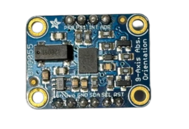

## 
Hardware Assembly Instructions & Wiring diagram-硬體組裝說明和接線圖

- ### Hardware Configuration of Electronic Equipment 
-電子設備的硬體配置
  - 下圖顯示了電子設備在自走車中的安裝位置。
  - The diagram below shows the placement of electronic equipment in the autonomous vehicle.
  
    

- ### System Operation Process -系統操作流程
    
 

#### 中文:
- Nvidia Jetson orin Nano 主控制器透過攝影模組擷取影像，並使用 OpenCV 進行處理，以偵測障礙物與邊界牆。同時，透過 I2C 通訊協定 從 BNO055 陀螺儀方位感測器 收集方向資料，計算行進方向以避開障礙物與邊界牆。
- 計算後的路徑資料會透過 UART 通訊 傳送至 Raspberry Pi Pico I/O 控制器進行控制。

- 在停車過程中，作為 I/O 控制器的 Raspberry Pi Pico 不僅接收來自 Jetson Nano 主控制器的資料，還同時從三個方向的 HC-SR04 超音波距離感測器 收集距離資料，並根據這些資料進行計算，以控制自動停車的移動路徑。

- 作為 I/O 控制器的 Raspberry Pi Pico 接收來自 Jetson Nano 主控制器的車輛移動控制值，並在 Pico 內部進行進一步計算，再將結果傳送至 前輪伺服馬達（MG90S），以控制行駛方向，完成避障任務。

- 同時，作為 I/O 控制器的 Raspberry Pi Pico 處理來自主控制器 Jetson Nano 的車輛移動控制值，並將結果傳送至 馬達控制器（L293D），以控制直流馬達的正反轉與轉速。
#### 英文:
- The Nvidia Jetson orin Nano main controller captures images using a camera module and processes them with OpenCV to detect obstacles and boundary walls. It simultaneously collects directional data from the BNO055 gyroscope orientation sensor via the I2C communication protocol to calculate the travel direction to avoid obstacles and boundary walls. The calculated path data is then transmitted via UART communication to the Raspberry Pi Pico I/O controller for control.
- During parking, the Raspberry Pi Pico, acting as an I/O controller, not only receives data from the Nvidia Jetson Nano main controller but also simultaneously collects distance data from HC-SR04 ultrasonic distance sensors in three directions. Based on this data, it performs calculations to control the movement path for automated parking.
- As an I/O controller, the Raspberry Pi Pico receives vehicle movement control values from the Nvidia Jetson Nano main controller and performs further calculations within the Pico. It then sends the results to the front-wheel servo motor (MG90S) to control the driving direction, thereby completing the obstacle avoidance task.
- At the same time, acting as an I/O controller, the Raspberry Pi Pico processes vehicle movement control values received from the Nvidia Jetson Nano main controller and sends the results to the motor controller (L293D) to control the DC motor’s forward and reverse rotation and speed.

- ### Vehicle Body Structure Display Diagram-車體結構展示圖

<table>
  <tr>
      <th>Top View of the Overall Apparatus(整體裝置頂視圖)</th>
      <th>Middle Layer Structure Top View</th>
      <th>Top View of Vehicle Chassis(中層結構頂視圖)</th>
      <th>Bottom View of Vehicle Chassis(車體底盤底視圖)</th>
  </tr>
  <tr align="center">
     <td> </td>
     <td></td>
     <td></td>
     <td></td>
  </tr>
</table>

- ### Circuit Board 

<table>
  <tr align="center">
      <th> Circuit Board of Top View(電路板頂視圖) </th><th>Circuit Board of Button View(電路板底視圖)</th>
  </tr>
  <tr align="center">
     <td>  </td><td></td>
  </tr>
</table>

- ### Overview of Important Parts List-重要零件清單總覽
  - #### NVIDIA® Jetson Nano™ developer-B01 Controller-NVIDIA®- Jetson Nano™ 開發板 – B01 控制器
    <table border=0 width="100%" >
      <tr>
      <td >

  __Specification:__ 
    - Processor: Hexa-core Arm Cortex-A78AE v8.2 64-bit CPU
    - GPU: 128-core NVIDIA Maxwell GPU
    - Memory: 8 GB 128-bit LPDDR5, 102 GB/s
    - Connectivity: Type A: 4 USB 3.2 Gen2. Type C: 1 for debug and device mode
    - GPIO: 40-pin Header (UART, SPI, I2S, I2C, GPIO)12-pin button header
    - Dimensions: 100 mm x 79 mm x 21 mm
    - Weight: 771 grams

  __Uses in Competition:__ 
    - Responsible for receiving image data from the camera module, performing image recognition via OpenCV, and sending the recognition results to the Raspberry Pi Pico for further processing.
      

   __產品規格：__
    - 處理器：	6 核 Arm Cortex-A78AE v8.2 64 位元 CPU
      1.5 MB L2 / 4 MB L3
    - 圖形處理器： 	具有 1024 個 NVIDIA CUDA 核心和32 個 Tensor 核心的NVIDIA Ampere 架構
    - 記憶體：8 GB 128 位元 LPDDR5，102 GB/秒
    - 連接性：A 型：4 個 USB 3.2 Gen2。C 型：1 個，用於 debug 與裝置模式
    - GPIO： 40-pin Header (UART, SPI, I2S, I2C, GPIO)12-pin button     header
    - 尺寸： 100 mm x 79 mm x 21 mm
    - 重量： 771 公克
  __競賽中之應用：__
  - 負責接收來自攝影機模組的影像資料，透過 OpenCV 進行影像辨識，並將辨識結果傳送給 Raspberry Pi Pico 進行後續處理。
 
      
    __Purchase URL:<a href="https://robotkingdom.com.tw/product/nvidia-jetson-orin-nano-super-developer-set-1/" target="_blank">NVIDIA® Jetson Nano™ developer-b01</a>__
    </td>
    <td>
       
    </td>
    </tr>
    </table>

  - #### MG513 Rear-Drive DC Motor-MG513 後驅直流馬達
    <table border=0 width="100%" >
      <tr>
      <td> 

  __Specifications:__  
    - No-load Speed: 366 rpm
    - Reduction Ratio: 1:30
    - Operating Voltage: 6 - 12V

  __Uses in Competition：__
    - Responsible for receiving control signals from the motor driver controller L293D to adjust the vehicle's forward and reverse movements and control the rear wheel speed.
      

    __產品規格：__
    - 空載轉速： 366 轉/分鐘（rpm）
    - 減速比： 1:30
    - 工作電壓： 6 – 12V

    __競賽中之應用：__
    - 負責接收來自馬達驅動控制器 L293D 的控制訊號，以調整車輛的前進與後退動作，並控制後輪的轉速。
    ### 英文:
    
      
    __Purchase URL:[MG513-P30 336RPM DC reduction motor](https://www.amazon.com/-/zh_TW/MG513-12V-%E6%B8%9B%E9%80%9F%E9%BD%92%E8%BC%AA%E9%A6%AC%E9%81%94%E7%B7%A8%E7%A2%BC%E5%99%A8%E4%BB%A3%E7%A2%BC%E9%80%9F%E5%BA%A6%E6%B8%AC%E9%87%8F-DIY-%E8%87%AA%E5%B9%B3%E8%A1%A1%E6%B1%BD%E8%BB%8A%E5%80%92%E7%BD%AE%E6%93%BA/dp/B0B3LXV4PL)__
    </td>
       <td >
       
      </td>
      </tr>
    </table>

  - ### MG90S Front Steering Mechanism by Servo Motor -MG90S 前輪轉向伺服馬達機構
      <table border=0 width="100%" >
      <tr>
      <td> 
  ### 中文:    
  
  ### 英文:  
  __Specifications:__
    - Controllable Rotation Angle: 0-180°  
    - Maximum Torque: 2.0 kg/cm (at 4.8V)  
    - Fastest Rotation Speed: 0.11 seconds (at 4.8V)  
    - Operating Voltage: 4.8V - 7.2V  

    __Uses in Competition：__
    - Responsible for receiving control values from the Raspberry Pi Pico to adjust the front wheel steering angle, enabling precise steering during driving.
      

  __產品規格：__
    - 可控制旋轉角度： 0–180°
    - 最大扭力： 2.0 公斤·公分（於 4.8V）
    - 最快旋轉速度： 0.11 秒/60°（於 4.8V）
    - 工作電壓： 4.8V – 7.2V

  __競賽中之應用：__
    - 負責接收來自 Raspberry Pi Pico 的控制數值，調整前輪的轉向角度，實現行駛中的精準轉向控制。
      

    __Purchase URL:<a href="https://www.amazon.com/-/zh_TW/dp/B0BFQLNDPM" target="_blank">MG90s servo motor</a>__
    </td>
       <td >
      
       </td>
      </tr>
    </table>

  - #### Dual H-bridge DC motor driver IC - L293D-雙 H 橋直流馬達驅動晶片 – L293D

    <table border=0 width="100%" >
      <tr>
      <td>  

    __Specifications:__ 
    - 293D is a dual H-bridge DC motor driver IC that can be used to control two DC motors.
    - Wide operating voltage range: 4.5V to 36V.
    - Output current: 600 mA (continuous) and 1.2 A (peak) per channel.
    - Output voltage range: 3 V to 36 V.

    __Uses in Competition：__  
    - Primarily responsible for driving the MG513 geared DC motor to control the vehicle’s forward and reverse movement, as well as the motor’s speed.
      

    __產品規格：__
      - L293D 是一款雙 H 橋直流馬達驅動 IC，可用來控制兩顆直流馬達。
      - 寬廣的工作電壓範圍：4.5V 至 36V。
      - 輸出電流：每個通道持續 600 mA，峰值 1.2 A。
      - 輸出電壓範圍：3V 至 36V。
    __競賽中之應用：__
      - 主要負責驅動 MG513 減速直流馬達，以控制車輛的前進與後退運動，以及調整馬達的轉速。
      
    __Purchase URL:<a href="https://atceiling.blogspot.com/2019/08/arduino54l293d.html" target="_blank">L293D</a>__
    </td>
      <td>
      
      </td>
      </tr>
    </table>

  - #### Li-Polymer 3S Battery-鋰聚合物 3S 電池
    <table border=0 width="100%" >
      <tr>
      <td> 

    __Specifications:__
    - Maximum Current: 45.5A  
    - Net Weight: Approximately 107g  
    - Rated Voltage: 11.1V
    __Uses in Competition：__  
    - Supply power to the vehicle for use.  
      

     __產品規格：__
      - 最大電流： 45.5A
      - 淨重： 約 107 公克
      - 額定電壓： 11.1V

    __競賽中之應用：__
      - 為車輛提供電力使用。
   
      
    __Purchase URL:<a href="https://shopee.tw/product/17393576/2036942264?gclid=Cj0KCQjw6KunBhDxARIsAKFUGs9xoiZB_LrSF3X4XfnN1sxM-tjzbX4T2Sw9XD0c0Rfc_tkPkczAbBcaApCXEALw_wcB" target="_blank">Li-Polymer 3S Battery</a>__
    </td>
    <td>
      
    </td>
    </tr>
    </table>

  - #### Micro switch (TACK-SW)-微動開關（TACK-SW）

    <table border=0 width=100% >
      <tr>
      <td>
   
    __Specifications:__ 
    - Operating Voltage: 3.3V - 5.0V  
    - Number of Pins: 3  
    - Output Signal: Digital  

    __Uses in Competition：__
    - Control the vehicle's start and drive switch.
      

     __產品規格：__
      - 工作電壓： 3.3V – 5.0V
      - 引腳數量： 3 支
      - 輸出訊號： 數位訊號

    __競賽中之應用：__
      - 控制車輛的啟動與行駛開關。

      
    __Purchase URL:<a href="https://www.amazon.com/-/zh_TW/PLKXSEYUJ/dp/B0D4HZFM6S" target="_blank">Micro switch</a>__
    </td>
      <td>
       
      </td>
      </tr>
    </table>

  - #### High Current 5A Constant Voltage Constant Current Buck Power Supply Module ADIO-DC36V5A-高電流 5A 降壓穩壓穩流電源模組 ADIO-DC36V5A

    <table border=0 width=100% >
      <tr>
      <td> 

  __Specifications:__ 
    - Input Voltage Range: 4 - 38V
    - Output Voltage Range: 1.25 - 36V, continuously adjustable
    - Output Current Range: Adjustable, maximum of 5A

  __Uses in Competition：__  
    - Primarily responsible for stepping down the battery voltage from 11.1V to 5V to provide various stable voltages needed for vehicle operation.
      

  __產品規格：__
      - 輸入電壓範圍： 4 – 38V
      - 輸出電壓範圍： 1.25 – 36V，可連續調整
      - 輸出電流範圍： 可調，最大為 5A
  __競賽中之應用：__
      - 主要負責將電池電壓從 11.1V 降壓至 5V，以提供車輛運作所需的各種穩定電壓。  
  
      
    __Purchase URL:<a href="https://shop.cpu.com.tw/product/57434/info/" target="_blank">ADIO-DC36V5A</a>__
    </td>
      <td>
       
      </td>
      </tr>
    </table>

 
  - #### SONY IMX477 Camera Module-SONY IMX477 鏡頭模組

    <table border=0 width="100%" >
      <tr>
      <td>

  __Specifications:__
    - Viewing Angle: 160 degrees
    - pixels: 4056 x 3040
    - Maximum aperture: F2.0
    - Focal length: 7.9mm
    - Interface: CSI (Camera Serial Interface)
    - Operating Voltag：3.3V

  __Uses in Competition：__  
    - Responsible for capturing images and transmitting them to the Jetson Nano for image recognition to detect the presence of obstacles or boundary walls.
      
  __產品規格：__
    - 視角： 160 度
    - 像素： 4056 × 3040
    - 最大光圈： F2.0
    - 焦距： 7.9 mm
    - 介面： CSI（Camera Serial Interface）
    - 工作電壓： 3.3V
  __競賽中之應用：__
    - 負責擷取影像並傳送至 Jetson Nano 進行影像辨識，以偵測障礙物或邊界牆的存在。

    
      
    __Purchase URL:<a href="https://shopee.tw/%E7%8F%BE%E8%B2%A8-SONY-IMX477-%E6%94%9D%E5%BD%B1%E9%8F%A1%E9%A0%AD%E6%A8%A1%E7%B5%84-1230%E8%90%AC%E5%83%8F%E7%B4%A0-160%C2%B0%E5%BB%A3%E8%A7%92-%E6%94%AF%E6%8F%B4%E6%A8%B9%E8%8E%93%E6%B4%BECM3-4%E3%80%81Jetson-Nano-i.10207300.8215149686?srsltid=AfmBOor9HmpX2guySAnFvW5drNG4qJtdwx98_e6muraV4LUtXM50YR5Q" target="_blank">SONY IMX477</a>__
    </td>
       <td >
        
       </td>
      </tr>
    </table>

  - #### BNO055 Gyroscope orientation sensor-BNO055 陀螺儀方向感測器
    <table border=0 width="100%" >
      <tr>
      <td> 

  __Specifications:__
    - 9-Axis Sensing: Includes accelerometer, gyroscope, and magnetometer for motion and orientation detection
    - Operating Voltage: 3.6V - 5V
    - Interface: Supports both I²C and UART, making it compatible with various devices
    - Orientation Data: Provides direct angle data for accurate positioning
  __Uses in Competition：__  
    - Responsible for detecting the vehicle's current orientation values, which are provided to the  Jetson Nano controller for processing and decision-making.
      

   __產品規格：__

    - 9 軸感測：包含加速度計、陀螺儀與磁力計，用於動作與方向檢測
    - 工作電壓：3.6V – 5V
    - 介面：支援 I²C 與 UART，兼容多種裝置
    - 方向數據：提供直接的角度數據以實現精確定位

  __競賽中之應用：__
    - 負責偵測車輛目前的方向數值，並提供給 Jetson Nano 控制器進行運算與決策。 
      
    __Purchase URL:<a href="https://www.remisys.com.tw/product-page/bno055-absolute-orientation-sensor" target="_blank">BNO055</a>__
    </td>
       <td >
        
       </td>
      </tr>
    </table>

  - #### HC-SR04 ultrasonic distance sensor-HC-SR04 超音波距離感測器
    <table border=0 width="100%" >
      <tr>
      <td> 

    __Specifications:__
    - Measuring Range: 2 cm to 400 cm, capable of detecting objects within a distance of 2 cm to 4 meters.
    - Measurement Accuracy: Approximately 3 mm, with a margin of error around ±3 mm.
    - Operating Voltage: 5V, powered by direct current.
    - Ultrasonic Frequency: 40kHz, measuring distance by emitting a 40kHz ultrasonic signal.
    - Transmission Interface: Includes Trig and Echo pins, where Trig sends out the ultrasonic signal and Echo receives the reflected signal to calculate the distance.

    __Uses in Competition：__  
    - Primarily responsible for collecting distance data from HC-SR04 ultrasonic distance sensors in three directions and providing it to the Raspberry Pi Pico controller for calculations to control the vehicle's direction.
      
  __產品規格：__
    - 測量範圍： 2 公分至 400 公分，可偵測 2 公分至 4 公尺內的物體。
    - 測量精度： 約 ±3 毫米，誤差範圍大約為 ±3 毫米。
    - 工作電壓： 5V，採用直流供電。
    - 超音波頻率： 40kHz，透過發射 40kHz 的超音波訊號來進行距離測量。
    - 傳輸介面： 包含 Trig 與 Echo 腳位，Trig 負責發射超音波訊號，Echo 負責接收反射回來的訊號並計算距離。
      
    __Purchase URL:<a href="https://robotkingdom.com.tw/product/hc-sr04p-ultrasonic-ranger/" target="_blank">HC-SR04</a>__
    </td>
       <td >
        
       </td>
      </tr>
    </table>

# 
[Return Home](../../)
 
