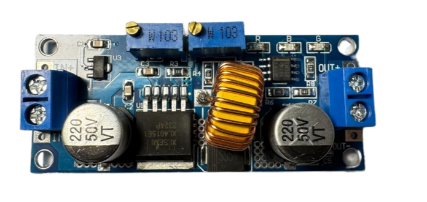

## 
Hardware Assembly Instructions & Wiring diagram-硬體組裝說明和接線圖

- ### Hardware Configuration of Electronic Equipment 
- 電子設備的硬體配置
  - 下圖顯示了電子設備在自走車中的安裝位置。
  - The diagram below shows the placement of electronic equipment in the  Self-Driving-Cars.
  
    

- ### System Operation Process -系統操作流程
    
 

#### 中文:
- 本系統以 NVIDIA Jetson Orin Nano 作為核心控制器，整合攝影模組擷取即時影像。影像資料經由 OpenCV 函式庫進行高效能處理，用以精準識別賽道上的關鍵元素，包括紅色與綠色障礙柱、黑色邊界牆、洋紅色停車場邊界，以及地面上的藍色與橘色標線。此外，系統透過 I2C 通訊協定，從 BNO055 慣性量測單元 (IMU) 收集方向數據，進而計算出精確的行進方向，以實現動態避開障礙物與邊界、並準確計算賽道圈數的自動化控制目標。

- NVIDIA Jetson Orin Nano 作為上位控制器，在完成影像與感測資料處理後，將產生的最終控制訊號透過 WebSocket 通訊協定進行即時（Low-Latency）傳輸。該訊號被Raspberry Pi Pico W I/O 控制器接收，由其負責執行底層的運算調校與實體運動控制。

- 在自動停車階段，Raspberry Pi Pico W I/O 控制器升級為決策核心。它不僅接收來自 Jetson Orin Nano 主控制器的上位指令，還需同步融合多源感測數據進行即時計算：包括來自兩側 HC-SR04 超聲波測距感測器的距離資訊，以及前後 TCRT5000 紅外線循線感測器的邊界數據，最終依此精確控制車輛的移動路徑。

- 作為底層的 I/O 控制器，Raspberry Pi Pico W 接收來自 Jetson Orin Nano 主控制器的車輛運動控制參數。Pico W 隨即在內部進行輔助運算與訊號轉換，最終將校準後的控制訊號傳輸至前輪伺服馬達（MG90S），從而精確調整轉向角度，以確保避障任務的順利執行。

- 同時，身為 I/O 控制器的 Raspberry Pi Pico W 負責解譯並處理來自 Jetson Orin Nano 主控制器的車輛移動指令。隨後，Pico W 透過生成 脈衝寬度調變 (PWM) 訊號，將資料傳送給 L293D 馬達驅動晶片，以實現對直流馬達的轉速調節及正反轉控制。

- This system utilizes the NVIDIA Jetson Orin Nano as its core controller, integrating a camera module to capture real-time imagery. The image data is processed efficiently using the **OpenCV library** to precisely identify critical elements on the race track, including **red and green obstacle pylons, the black boundary wall, the magenta parking boundary, and the blue and orange ground lines**. Furthermore, the system collects orientation data via the **I2C communication protocol** from a BNO055 Inertial Measurement Unit (IMU). This directional data is then used to calculate the precise heading, enabling the automated control objective of dynamically avoiding obstacles and boundaries, as well as accurately counting the number of laps completed.
- The NVIDIA Jetson Orin Nano, acting as the primary controller, generates final control signals after processing visual and sensor data. These signals are transmitted in real-time via the **WebSocket communication protocol** to the Raspberry Pi Pico W I/O Controller, which is tasked with executing the subsequent low-level computation and physical actuation control.
- During the automated parking sequence, the Raspberry Pi Pico W I/O Controller functions as a crucial decision-making node. It not only receives high-level commands from the Jetson Orin Nano Master Controller but also simultaneously fuses data from various sensors for real-time calculation. This input includes distance measurements from dual HC-SR04 ultrasonic rangefinders located on both sides, as well as line-detection data from front and rear TCRT5000 infrared line sensors, all used to precisely govern the vehicle's maneuvering path.
- Serving as the I/O controller, the Raspberry Pi Pico W receives the vehicle motion control values transmitted from the Jetson Orin Nano master controller. The Pico W then performs further internal computation and signal conditioning before sending the resulting commands to the **front wheel servo motor (MG90S)**, thereby precisely controlling the steering angle to successfully complete the obstacle avoidance task.
- Concurrently, the Raspberry Pi Pico W, acting as the I/O controller, processes the vehicle movement control values received from the Jetson Orin Nano master controller. It then transmits this data to the **L293D Motor Driver** using **Pulse Width Modulation (PWM)** signals, which is necessary to control both the direction (forward/reverse) and the speed of the DC motor.

- ### Vehicle Body Structure Display Diagram-車體結構展示圖

<table>
  <tr>
      <th>Top View of the Overall Apparatus(整體裝置頂視圖)</th>
      <th>Top-Down View of the Vehicle's Mid-Level Structure</th>
      <th>Top View of Vehicle Chassis</th>
      <th>Bottom View of Vehicle Chassis(車體底盤底視圖)</th>
  </tr>
  <tr align="center">
     <td> </td>
     <td></td>
     <td></td>
     <td></td>
  </tr>
</table>

- ### Circuit Board 

<table>
  <tr align="center">
      <th> Overhead view of the main circuit board(電路板頂視圖) </th><th>Bottom View of the Main Circuit Board(電路板底視圖)</th>
  </tr>
  <tr align="center">
     <td>  </td><td></td>
  </tr>
  <tr align="center">
      <th> Overhead view of the switch circuit board(電路板頂視圖) </th><th>Bottom view of the switch circuit board(電路板底視圖)</th>
  </tr>
  <tr align=center>
    <td></td>
    <td></td>
</table>

- ### Overview of Important Parts List-重要零件清單總覽
  
  - #### NVIDIA® Jetson Orin Nano
    <table border=0 width="100%" >
      <tr>
      <td >
  __Specification:__ 

    - **AI Performance**  Up to **40 TOPS** (Sparse) or **20 TOPS** (Dense) 
    - **GPU**  **1024** NVIDIA **Ampere** Architecture **CUDA Cores** + - - **32** **Tensor Cores** 
    - **CPU**  **6-core** Arm Cortex-A78AE v8.2 64-bit CPU (up to **1.5 GHz**) 
    - **Memory (RAM)**  **8GB** 128-bit **LPDDR5** (Memory bandwidth up to **68 GB/s**) 
    - **Video Encoder**  1x 4K @ 30fps, 2x 4K @ 30fps, 5x 1080p @ 60fps, etc. (H.265) 
    - **Video Decoder**  1x 4K @ 60fps, 2x 4K @ 30fps, 5x 1080p @ 60fps, etc. (H.265) 
    - **Camera Interface**  **8-lane MIPI CSI-2** D-PHY 2.1 (Supports up to 4 physical cameras) 
    - **PCIe**  1x x4 + 3x x1 (PCIe Gen3) 
    - **Ports**  4x USB 3.2 Gen2, 1x USB Type-C (Power/Debug), Gigabit Ethernet 
    - **Display Output**  1x DP 1.2 (+MST) or eDP 1.4/HDMI 1.4 
    - **Storage**  Supports external NVMe SSD (on Developer Kit) and MicroSD card 
    - **Input Voltage**  DC **9V-20V** 

  __Uses in Competition:__ 
    - Responsible for receiving image data from the camera module, performing image recognition via OpenCV, and sending the recognition results to the Raspberry Pi Pico W for further processing.
      

   __產品規格：__
    - **AI 效能：**  高達 **40 TOPS** (Sparse) 或 **20 TOPS** (Dense) 
    - **GPU：**  **1024** 個 NVIDIA **Ampere** 架構 **CUDA 核心** + **32** 個 **Tensor 核心** 
    - **CPU：**  **6 核心** Arm Cortex-A78AE v8.2 64 位元 CPU (最高 1.5 GHz) 
    - **記憶體 (RAM)：**  **8GB** 128 位元 **LPDDR5** (記憶體頻寬高達 **68 GB/s**) 
    - **視訊編碼器：**  1x 4K @ 30fps, 2x 4K @ 30fps, 5x 1080p @ 60fps 等 (H.265) 
    - **視訊解碼器：**  1x 4K @ 60fps, 2x 4K @ 30fps, 5x 1080p @ 60fps 等 (H.265) 
    - **相機介面：**  **8 通道 MIPI CSI-2** D-PHY 2.1 (支援最多 4 個實體相機) 
    - **PCIe：**  1 個 x4 + 3 個 x1 (PCIe Gen3) 
    - **連接埠：**  4 個 USB 3.2 Gen2, 1 個 USB Type-C (供電/Debug), Gigabit Ethernet 
    - **顯示輸出：**  1 個 DP 1.2 (+MST) 或 eDP 1.4/HDMI 1.4 
    - **儲存：**  支援外部 NVMe SSD (在開發套件上) 及 MicroSD 卡 
    - **輸入電壓：** 9V-20V

  __競賽中之應用：__
  - 本系統負責接收來自攝影機模組的原始影像資料，隨後利用 OpenCV 函式庫執行影像辨識與運算。同步地，整合 BNO055 慣性量測單元 (IMU) 所採集的方向數據，進行數據融合與姿態運算。最終，將處理後的控制指令傳輸至 Raspberry Pi Pico W，以驅動其進行後續的決策與執行。
 
      
    __Purchase URL:<a href="https://developer.download.nvidia.com/assets/embedded/secure/jetson/orin_nano/docs/Jetson-Orin-Nano-DevKit-Carrier-Board-Specification_SP-11324-001_v1.3.pdf?__token__=exp=1762055025~hmac=44deefcad3991bd2cb50e865d48d7e757ec2b7de324168816ccc7a624fe85ce0&t=eyJscyI6ImdzZW8iLCJsc2QiOiJodHRwczovL3d3dy5nb29nbGUuY29tLyJ9" target="_blank">NVIDIA® Jetson Orin Nano</a>__
    </td>
    <td>
       
    </td>
    </tr>
    </table>

  - #### Raspberry Pi Pico w
    <table border=0 width="100%" >
      <tr>
      <td> 

  __Specifications:__  

  * **Processor (CPU):** Raspberry Pi RP2040 chip (dual-core ARM Cortex-M0+)
  * **Clock Speed:** Up to 133 MHz
  * **Memory (SRAM):** 264 KB
  * **Flash Storage:** 2 MB external QSPI Flash
  * **Wireless Connectivity:** 2.4GHz Wi-Fi (802.11 b/g/n) – powered by Infineon CYW43439 chip
  * **Bluetooth:** Not supported (the CYW43439 includes Bluetooth hardware, but it is not enabled on the Pico W)
  * **GPIO Pins:** 26 usable GPIO pins (3.3V logic)
  * **ADC Analog Inputs:** 3 channels (12-bit resolution)
  * **PWM Output:** Multiple channels available
  * **Communication Interfaces:** I²C, SPI, UART, USB 1.1 (Device/Host)
  * **Power Supply:** 1.8–5.5V (via USB or external power input)

  __Uses in Competition：__
  - This Low-Level Controller (LLC) is responsible for data acquisition, integration, and control execution. Its functions include:
    - Real-time acquisition of environmental distance data from all ultrasonic distance sensors and the TCRT5000 Infrared Sensor.
    - Receiving decisional control commands transmitted from the High-Level Controller (HLC), the NVIDIA® Jetson Orin Nano.
    - Integrating and computing the acquired sensor data and control commands to generate precise actuation signals.
    - Driving and controlling the front-wheel steering servo motor and the rear-drive DC motor to achieve precise vehicle steering and locomotion control.

      

    __產品規格：__
    - 處理器 (CPU)：	Raspberry Pi RP2040 晶片（雙核心 ARM Cortex-M0+）
    - 主頻：	最高 133 MHz
    - 記憶體 (SRAM)：	264 KB
    - 快閃記憶體 (Flash)：	2 MB 外掛 QSPI Flash
    - 無線連線：	2.4GHz Wi-Fi (802.11 b/g/n) – 透過 Infineon CYW43439 晶片
    - 藍牙：	不支援（CYW43439 具備藍牙，但 Pico W 暫未開放）
    - GPIO 腳位：	26 個可用 GPIO（3.3V 邏輯）
    - ADC 類比輸入：	3 組 (12-bit)
    - PWM 輸出：	多通道可用
    - 通訊介面：	I²C、SPI、UART、USB 1.1（Device/Host）
    - 電源供應：	1.8–5.5V（可由 USB 或外部電源供應）

    __競賽中之應用：__
    - 作為下位控制器（Low-Level Controller） 專責資料收集、整合與執行控制任務。它負責：
      - 即時採集所有超音波距離感測器與 TCRT5000 紅外線感測器所提供的環境距離數據。
      - 接收來自上位控制器（High-Level Controller） NVIDIA® Jetson Orin Nano 傳送的決策控制指令。
      - 整合運算上述感測數據與控制指令，生成精確的致動訊號。
      - 驅動並控制前輪轉向伺服馬達（Steering Servo Motor）及後驅直流馬達（DC Motor），以實現車輛的精準轉向與行駛控制。

    
      
      __Purchase URL:[Raspberry Pi Pico w](https://piepie.com.tw/product/raspberry-pi-pico-w)__
    </td>
       <td >
       
      </td>
      </tr>
    </table>
- #### MG513-P30 Rear-Drive DC Motor-MG513-P30 後驅直流馬達
    <table border=0 width="100%" >
      <tr>
      <td> 

  __Specifications:__  
    - No-load Speed: 366 rpm
    - Reduction Ratio: 1:30
    - Operating Voltage: 6 - 12V

  __Uses in Competition：__
    - Responsible for receiving control signals from the motor driver controller L293D to adjust the vehicle's forward and reverse movements and control the rear wheel speed.
      

    __產品規格：__
    - 空載轉速： 366 轉/分鐘（rpm）
    - 減速比： 1:30
    - 工作電壓： 6 – 12V

    __競賽中之應用：__
    - 負責接收來自馬達驅動控制器 L293D 的控制訊號，以調整車輛的前進與後退動作，並控制後輪的轉速。
    
    ### 英文:
    
      
      __Purchase URL:[MG513-P30 336RPM DC reduction motor](https://www.amazon.com/-/zh_TW/MG513-12V-%E6%B8%9B%E9%80%9F%E9%BD%92%E8%BC%AA%E9%A6%AC%E9%81%94%E7%B7%A8%E7%A2%BC%E5%99%A8%E4%BB%A3%E7%A2%BC%E9%80%9F%E5%BA%A6%E6%B8%AC%E9%87%8F-DIY-%E8%87%AA%E5%B9%B3%E8%A1%A1%E6%B1%BD%E8%BB%8A%E5%80%92%E7%BD%AE%E6%93%BA/dp/B0B3LXV4PL)__
    </td>
       <td >
       
      </td>
      </tr>
    </table>

  - #### MG90S Front Steering Mechanism by Servo Motor -MG90S 前輪轉向伺服馬達機構
      <table border=0 width="100%" >
      <tr>
      <td> 
  ### 中文:    
  
  ### 英文:  
  __Specifications:__
    - Controllable Rotation Angle: 0-180°  
    - Maximum Torque: 2.0 kg/cm (at 4.8V)  
    - Fastest Rotation Speed: 0.11 seconds (at 4.8V)  
    - Operating Voltage: 4.8V - 7.2V  

  __Uses in Competition：__
    - Responsible for receiving control values from the Raspberry Pi Pico to adjust the front wheel steering angle, enabling precise steering during driving.
      

  __產品規格：__
    - 可控制旋轉角度： 0–180°
    - 最大扭力： 2.0 公斤·公分（於 4.8V）
    - 最快旋轉速度： 0.11 秒/60°（於 4.8V）
    - 工作電壓： 4.8V – 7.2V

  __競賽中之應用：__
    - 負責接收來自 Raspberry Pi Pico 的控制數值，調整前輪的轉向角度，實現行駛中的精準轉向控制。
      

    __Purchase URL:<a href="https://www.amazon.com/-/zh_TW/dp/B0BFQLNDPM" target="_blank">MG90s servo motor</a>__
    </td>
       <td >
      
       </td>
      </tr>
    </table>

  - #### Dual H-bridge DC motor driver IC - L293D-雙 H 橋直流馬達驅動晶片 – L293D

    <table border=0 width="100%" >
      <tr>
      <td>  

    __Specifications:__ 
    - 293D is a dual H-bridge DC motor driver IC that can be used to control two DC motors.
    - Wide operating voltage range: 4.5V to 36V.
    - Output current: 600 mA (continuous) and 1.2 A (peak) per channel.
    - Output voltage range: 3 V to 36 V.

    __Uses in Competition：__  
    - Primarily responsible for driving the MG513 geared DC motor to control the vehicle’s forward and reverse movement, as well as the motor’s speed.
      

    __產品規格：__
      - L293D 是一款雙 H 橋直流馬達驅動 IC，可用來控制兩顆直流馬達。
      - 寬廣的工作電壓範圍：4.5V 至 36V。
      - 輸出電流：每個通道持續 600 mA，峰值 1.2 A。
      - 輸出電壓範圍：3V 至 36V。
    __競賽中之應用：__
      - 主要負責驅動 MG513 減速直流馬達，以控制車輛的前進與後退運動，以及調整馬達的轉速。
      
    __Purchase URL:<a href="https://atceiling.blogspot.com/2019/08/arduino54l293d.html" target="_blank">L293D</a>__
    </td>
      <td>
      
      </td>
      </tr>
    </table>

  - #### Li-Polymer 3S Battery-鋰聚合物 3S 電池
    <table border=0 width="100%" >
      <tr>
      <td> 

    __Specifications:__
    - Maximum Current: 45.5A  
    - Net Weight: Approximately 107g  
    - Rated Voltage: 11.1V
    __Uses in Competition：__  
    - Supply power to the vehicle for use.  
      

     __產品規格：__
      - 最大電流： 45.5A
      - 淨重： 約 107 公克
      - 額定電壓： 11.1V

    __競賽中之應用：__
      - 為車輛提供電力使用。
   
      
    __Purchase URL:<a href="https://shopee.tw/product/17393576/2036942264?gclid=Cj0KCQjw6KunBhDxARIsAKFUGs9xoiZB_LrSF3X4XfnN1sxM-tjzbX4T2Sw9XD0c0Rfc_tkPkczAbBcaApCXEALw_wcB" target="_blank">Li-Polymer 3S Battery</a>__
    </td>
    <td>
      
    </td>
    </tr>
    </table>

  - #### Micro switch (TACK-SW)-微動開關（TACK-SW）

    <table border=0 width=100% >
      <tr>
      <td>
   
    __Specifications:__ 
    - Operating Voltage: 3.3V - 5.0V  
    - Number of Pins: 3  
    - Output Signal: Digital  

    __Uses in Competition：__
    - Control the vehicle's start and drive switch.
      

     __產品規格：__
      - 工作電壓： 3.3V – 5.0V
      - 引腳數量： 3 支
      - 輸出訊號： 數位訊號

    __競賽中之應用：__
      - 控制車輛的啟動與行駛開關。

      
    __Purchase URL:<a href="https://www.amazon.com/-/zh_TW/PLKXSEYUJ/dp/B0D4HZFM6S" target="_blank">Micro switch</a>__
    </td>
      <td>
       
      </td>
      </tr>
    </table>

  - #### High Current 5A Constant Voltage Constant Current Buck Power Supply Module ADIO-DC36V5A-高電流 5A 降壓穩壓穩流電源模組 ADIO-DC36V5A

    <table border=0 width=100% >
      <tr>
      <td> 

  __Specifications:__ 
    - Input Voltage Range: 4 - 38V
    - Output Voltage Range: 1.25 - 36V, continuously adjustable
    - Output Current Range: Adjustable, maximum of 5A

  __Uses in Competition：__  
    - Primarily responsible for stepping down the battery voltage from 11.1V to 5V to provide various stable voltages needed for vehicle operation.
      

  __產品規格：__
     - 輸入電壓範圍： 4 – 38V
     - 輸出電壓範圍： 1.25 – 36V，可連續調整
     - 輸出電流範圍： 可調，最大為 5A
  __競賽中之應用：__
     - 主要負責將電池電壓從 11.1V 降壓至 5V，以提供車輛運作所需的各種穩定電壓。  
  
      
    __Purchase URL:<a href="https://shop.cpu.com.tw/product/57434/info/" target="_blank">ADIO-DC36V5A</a>__
    </td>
      <td>
       
      </td>
      </tr>
    </table>

 
  - #### SONY IMX477 Camera Module-SONY IMX477 鏡頭模組

    <table border=0 width="100%" >
      <tr>
      <td>

  __Specifications:__
    - Viewing Angle: 160 degrees
    - pixels: 4056 x 3040
    - Maximum aperture: F2.0
    - Focal length: 7.9mm
    - Interface: CSI (Camera Serial Interface)
    - Operating Voltag：3.3V

  __Uses in Competition：__  
    - Responsible for capturing images and transmitting them to the Jetson Nano for image recognition to detect the presence of obstacles or boundary walls.
      
  __產品規格：__
    - 視角： 160 度
    - 像素： 4056 × 3040
    - 最大光圈： F2.0
    - 焦距： 7.9 mm
    - 介面： CSI（Camera Serial Interface）
    - 工作電壓： 3.3V
  __競賽中之應用：__
    - 負責擷取影像並傳送至 Jetson Nano 進行影像辨識，以偵測障礙物或邊界牆的存在。

    
      
    __Purchase URL:<a href="https://shopee.tw/%E7%8F%BE%E8%B2%A8-SONY-IMX477-%E6%94%9D%E5%BD%B1%E9%8F%A1%E9%A0%AD%E6%A8%A1%E7%B5%84-1230%E8%90%AC%E5%83%8F%E7%B4%A0-160%C2%B0%E5%BB%A3%E8%A7%92-%E6%94%AF%E6%8F%B4%E6%A8%B9%E8%8E%93%E6%B4%BECM3-4%E3%80%81Jetson-Nano-i.10207300.8215149686?srsltid=AfmBOor9HmpX2guySAnFvW5drNG4qJtdwx98_e6muraV4LUtXM50YR5Q" target="_blank">SONY IMX477</a>__
    </td>
       <td >
        
       </td>
      </tr>
    </table>

  - #### BNO055 Gyroscope orientation sensor-BNO055 陀螺儀方向感測器
    <table border=0 width="100%" >
      <tr>
      <td> 

  __Specifications:__
    - 9-Axis Sensing: Includes accelerometer, gyroscope, and magnetometer for motion and orientation detection
    - Operating Voltage: 3.6V - 5V
    - Interface: Supports both I²C and UART, making it compatible with various devices
    - Orientation Data: Provides direct angle data for accurate positioning
  __Uses in Competition：__  
    - Responsible for detecting the vehicle's current orientation values, which are provided to the  Jetson Nano controller for processing and decision-making.
      

   __產品規格：__

    - 9 軸感測：包含加速度計、陀螺儀與磁力計，用於動作與方向檢測
    - 工作電壓：3.6V – 5V
    - 介面：支援 I²C 與 UART，兼容多種裝置
    - 方向數據：提供直接的角度數據以實現精確定位

  __競賽中之應用：__
    - 負責偵測車輛目前的方向數值，並提供給 Jetson Nano 控制器進行運算與決策。 
      
    __Purchase URL:<a href="https://www.remisys.com.tw/product-page/bno055-absolute-orientation-sensor" target="_blank">BNO055</a>__
    </td>
       <td >
        
       </td>
      </tr>
    </table>

  - #### HC-SR04 ultrasonic distance sensor-HC-SR04 超音波距離感測器
    <table border=0 width="100%" >
      <tr>
      <td> 

    __Specifications:__
    - Measuring Range: 2 cm to 400 cm, capable of detecting objects within a distance of 2 cm to 4 meters.
    - Measurement Accuracy: Approximately 3 mm, with a margin of error around ±3 mm.
    - Operating Voltage: 5V, powered by direct current.
    - Ultrasonic Frequency: 40kHz, measuring distance by emitting a 40kHz ultrasonic signal.
    - Transmission Interface: Includes Trig and Echo pins, where Trig sends out the ultrasonic signal and Echo receives the reflected signal to calculate the distance.

    __Uses in Competition：__  
    - The core function of this system is to acquire real-time measurement data from two sets of HC-SR04 ultrasonic distance sensors. Subsequently, this distance data is transmitted to the Raspberry Pi Pico W microcontroller for computational and decision-making processes, with the ultimate goal of achieving precise control over the vehicle's driving direction.
      

    __產品規格：__
    - 測量範圍： 2 公分至 400 公分，可偵測 2 公分至 4 公尺內的物體。
    - 測量精度： 約 ±3 毫米，誤差範圍大約為 ±3 毫米。
    - 工作電壓： 5V，採用直流供電。
    - 超音波頻率： 40kHz，透過發射 40kHz 的超音波訊號來進行距離測量。
    - 傳輸介面： 包含 Trig 與 Echo 腳位，Trig 負責發射超音波訊號，Echo 負責接收反射回來的訊號並計算距離。

    __競賽中之應用：__
    - 本本系統的核心功能在於實時獲取兩組 HC-SR04 超音波距離感測器所量測之數據。隨後，這些距離數據將傳輸至 Raspberry Pi Pico W 微控制器進行運算與決策處理，其最終目的為實現對車輛行駛方向的精確控制。

      
    __Purchase URL:<a href="https://robotkingdom.com.tw/product/hc-sr04p-ultrasonic-ranger/" target="_blank">HC-SR04</a>__
    </td>
       <td >
        
       </td>
      </tr>
    </table>

  - #### TCRT5000 Infrared Sensor
    

    <table>
      <tr>
      <td>

    __Specifications:__
 
      - Measuring Range: 0 to 1.5 centimeters (cm)
      - Operating Voltage: 3.3 Volts (V) to 5 Volts (V)
      
     __Uses in Competition：__  
      - The primary function of this system is to accurately measure the distance between the vehicle and the field boundary (or surrounding walls). The acquired data is then transmitted to the Raspberry Pi Pico W for efficient computation and decision-making processing, with the ultimate goal of achieving precise navigation and control over the vehicle's direction of travel.

     
      

    __產品規格__

      - 測量範圍：0 ~ 1.5cm
      - 操作電壓：3.3V ~ 5V

    __競賽中之應用：__
      - 本系統主要功能為精準量測車輛與場域邊界（或外牆）的距離，並將所獲取的數據傳輸至 Raspberry Pi Pico W 進行高效的運算及決策處理，以達成對車輛行駛路徑的精確導航與控制。
  
      __Purchase URL:<a href="https://www.icshop.com.tw/products/368030501146" target="_blank">TCRT5000</a>__
        </td>
        <td>
          
        </td>
      </tr>
    </table>
   

# 
[Return Home](../../)
 
