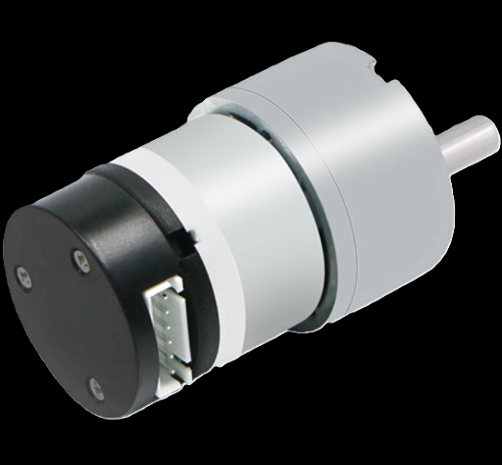
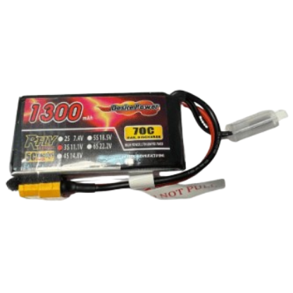

## 
Hardware Assembly Instructions & Wiring diagram-硬體組裝說明和接線圖

- ### Hardware Configuration of Electronic Equipment 
-電子設備的硬體配置
  - 下圖顯示了電子設備在自走車中的安裝位置。
  - The diagram below shows the placement of electronic equipment in the autonomous vehicle.
  
    

- ### System Operation Process -系統操作流程
    
 

#### 中文:
- Nvidia Jetson orin Nano 主控制器透過攝影模組擷取影像，並使用 OpenCV 進行處理，以偵測障礙物與邊界牆。同時，透過 I2C 通訊協定 從 BNO055 陀螺儀方位感測器 收集方向資料，計算行進方向以避開障礙物與邊界牆。
- 計算後的路徑資料會透過 UART 通訊 傳送至 Raspberry Pi Pico I/O 控制器進行控制。

- 在停車過程中，作為 I/O 控制器的 Raspberry Pi Pico 不僅接收來自 Jetson Nano 主控制器的資料，還同時從三個方向的 HC-SR04 超音波距離感測器 收集距離資料，並根據這些資料進行計算，以控制自動停車的移動路徑。

- 作為 I/O 控制器的 Raspberry Pi Pico 接收來自 Jetson Nano 主控制器的車輛移動控制值，並在 Pico 內部進行進一步計算，再將結果傳送至 前輪伺服馬達（MG90S），以控制行駛方向，完成避障任務。

- 同時，作為 I/O 控制器的 Raspberry Pi Pico 處理來自主控制器 Jetson Nano 的車輛移動控制值，並將結果傳送至 馬達控制器（L293D），以控制直流馬達的正反轉與轉速。
#### 英文:
- The Nvidia Jetson orin Nano main controller captures images using a camera module and processes them with OpenCV to detect obstacles and boundary walls. It simultaneously collects directional data from the BNO055 gyroscope orientation sensor via the I2C communication protocol to calculate the travel direction to avoid obstacles and boundary walls. The calculated path data is then transmitted via UART communication to the Raspberry Pi Pico I/O controller for control.
- During parking, the Raspberry Pi Pico, acting as an I/O controller, not only receives data from the Nvidia Jetson Nano main controller but also simultaneously collects distance data from HC-SR04 ultrasonic distance sensors in three directions. Based on this data, it performs calculations to control the movement path for automated parking.
- As an I/O controller, the Raspberry Pi Pico receives vehicle movement control values from the Nvidia Jetson Nano main controller and performs further calculations within the Pico. It then sends the results to the front-wheel servo motor (MG90S) to control the driving direction, thereby completing the obstacle avoidance task.
- At the same time, acting as an I/O controller, the Raspberry Pi Pico processes vehicle movement control values received from the Nvidia Jetson Nano main controller and sends the results to the motor controller (L293D) to control the DC motor’s forward and reverse rotation and speed.

- ### Vehicle Body Structure Display Diagram-車體結構展示圖

<table>
  <tr>
      <th>Top View of the Overall Apparatus(整體裝置頂視圖)</th>
      <th>Middle Layer Structure Top View</th>
      <th>Top View of Vehicle Chassis(中層結構頂視圖)</th>
      <th>Bottom View of Vehicle Chassis(車體底盤底視圖)</th>
  </tr>
  <tr align="center">
     <td> </td>
     <td></td>
     <td></td>
     <td></td>
  </tr>
</table>

- ### Circuit Board 

<table>
  <tr align="center">
      <th> Circuit Board of Top View(電路板頂視圖) </th><th>Circuit Board of Button View(電路板底視圖)</th>
  </tr>
  <tr align="center">
     <td>  </td><td></td>
  </tr>
</table>

### Overview of Important Parts List

- #### NVIDIA® Jetson Orin Nano™ Developer Kit – B01 Controller
  <table border=0 width="100%">
    <tr>
      <td>

**Specifications:**  
- Processor: 6-core Arm Cortex-A78AE v8.2 64-bit CPU, 1.5 MB L2 + 4 MB L3  
- GPU: 1024-core NVIDIA Ampere architecture GPU with 32 Tensor Cores  
- Memory: 8 GB 128-bit LPDDR5 @ 102 GB/s  
- Connectivity: 4× USB 3.2 Gen2 Type-A, 1× USB Type-C (for debug and device mode)  
- GPIO: 40-pin Header (UART, SPI, I2S, I2C, GPIO), 12-pin Button Header  
- Dimensions: 100 mm × 79 mm × 21 mm  
- Weight: 771 grams  

**Uses in Competition:**  
- Receives image data from the camera module, performs image recognition via OpenCV, and sends recognition results to the Raspberry Pi Pico for further processing.  

**Purchase URL:**  
<a href="https://robotkingdom.com.tw/product/nvidia-jetson-orin-nano-super-developer-set-1/" target="_blank">NVIDIA® Jetson Orin Nano™ Developer Kit – B01</a>

      </td>
      <td>
   
      </td>
    </tr>
  </table>

- #### MG513 Rear-Drive DC Motor
  <table border=0 width="100%">
    <tr>
      <td>

**Specifications:**  
- No-load Speed: 366 rpm  
- Reduction Ratio: 1:30  
- Operating Voltage: 6 - 12V  

**Uses in Competition:**  
- Receives control signals from the motor driver controller L293D to adjust the vehicle's forward and reverse movements and control the rear wheel speed.  

**Purchase URL:**  
[MG513-P30 336RPM DC reduction motor](https://www.amazon.com/-/zh_TW/MG513-12V-%E6%B8%9B%E9%80%9F%E9%BD%92%E8%BC%AA%E9%A6%AC%E9%81%94%E7%B7%A8%E7%A2%BC%E5%99%A8%E4%BB%A3%E7%A2%BC%E9%80%9F%E5%BA%A6%E6%B8%AC%E9%87%8F-DIY-%E8%87%AA%E5%B9%B3%E8%A1%A1%E6%B1%BD%E8%BB%8A%E5%80%92%E7%BD%AE%E6%93%BA/dp/B0B3LXV4PL)

      </td>
      <td>
   
      </td>
    </tr>
  </table>

- #### MG90S Front Steering Mechanism by Servo Motor
  <table border=0 width="100%">
    <tr>
      <td>

**Specifications:**  
- Controllable Rotation Angle: 0-180°  
- Maximum Torque: 2.0 kg/cm (at 4.8V)  
- Fastest Rotation Speed: 0.11 seconds (at 4.8V)  
- Operating Voltage: 4.8V - 7.2V  

**Uses in Competition:**  
- Receives control values from the Raspberry Pi Pico to adjust the front wheel steering angle, enabling precise steering during driving.  

**Purchase URL:**  
<a href="https://www.amazon.com/-/zh_TW/dp/B0BFQLNDPM" target="_blank">MG90s servo motor</a>

      </td>
      <td>
  
      </td>
    </tr>
  </table>

- #### Dual H-bridge DC motor driver IC - L293D
  <table border=0 width="100%">
    <tr>
      <td>

**Specifications:**  
- L293D is a dual H-bridge DC motor driver IC that can be used to control two DC motors.  
- Wide operating voltage range: 4.5V to 36V.  
- Output current: 600 mA (continuous) and 1.2 A (peak) per channel.  
- Output voltage range: 3 V to 36 V.  

**Uses in Competition:**  
- Drives the MG513 geared DC motor to control the vehicle’s forward and reverse movement, as well as the motor’s speed.  

**Purchase URL:**  
<a href="https://atceiling.blogspot.com/2019/08/arduino54l293d.html" target="_blank">L293D</a>

      </td>
      <td>
  
      </td>
    </tr>
  </table>

- #### Li-Polymer 3S Battery
  <table border=0 width="100%">
    <tr>
      <td>

**Specifications:**  
- Maximum Current: 45.5A  
- Net Weight: Approximately 107g  
- Rated Voltage: 11.1V  

**Uses in Competition:**  
- Supplies power to the vehicle.  

**Purchase URL:**  
<a href="https://shopee.tw/product/17393576/2036942264?gclid=Cj0KCQjw6KunBhDxARIsAKFUGs9xoiZB_LrSF3X4XfnN1sxM-tjzbX4T2Sw9XD0c0Rfc_tkPkczAbBcaApCXEALw_wcB" target="_blank">Li-Polymer 3S Battery</a>

      </td>
      <td>
  
      </td>
    </tr>
  </table>

- #### Micro switch (TACK-SW)
  <table border=0 width="100%">
    <tr>
      <td>

**Specifications:**  
- Operating Voltage: 3.3V - 5.0V  
- Number of Pins: 3  
- Output Signal: Digital  

**Uses in Competition:**  
- Controls the vehicle's start and drive switch.  

**Purchase URL:**  
<a href="https://www.amazon.com/-/zh_TW/PLKXSEYUJ/dp/B0D4HZFM6S" target="_blank">Micro switch</a>

      </td>
      <td>
   
      </td>
    </tr>
  </table>

- #### High Current 5A Constant Voltage Constant Current Buck Power Supply Module ADIO-DC36V5A
  <table border=0 width="100%">
    <tr>
      <td>

**Specifications:**  
- Input Voltage Range: 4 - 38V  
- Output Voltage Range: 1.25 - 36V, continuously adjustable  
- Output Current Range: Adjustable, maximum of 5A  

**Uses in Competition:**  
- Steps down the battery voltage from 11.1V to 5V to provide various stable voltages needed for vehicle operation.  

**Purchase URL:**  
<a href="https://shop.cpu.com.tw/product/57434/info/" target="_blank">ADIO-DC36V5A</a>

      </td>
      <td>
   
      </td>
    </tr>
  </table>

- #### SONY IMX477 Camera Module
  <table border=0 width="100%">
    <tr>
      <td>

**Specifications:**  
- Viewing Angle: 160 degrees  
- Pixels: 4056 x 3040  
- Maximum aperture: F2.0  
- Focal length: 7.9mm  
- Interface: CSI (Camera Serial Interface)  
- Operating Voltage: 3.3V  

**Uses in Competition:**  
- Captures images and transmits them to the Jetson Orin Nano for image recognition to detect obstacles or boundary walls.  

**Purchase URL:**  
<a href="https://shopee.tw/%E7%8F%BE%E8%B2%A8-SONY-IMX477-%E6%94%9D%E5%BD%B1%E9%8F%A1%E9%A0%AD%E6%A8%A1%E7%B5%84-1230%E8%90%AC%E5%83%8F%E7%B4%A0-160%C2%B0%E5%BB%A3%E8%A7%92-%E6%

# 
[Return Home](../../)
 
