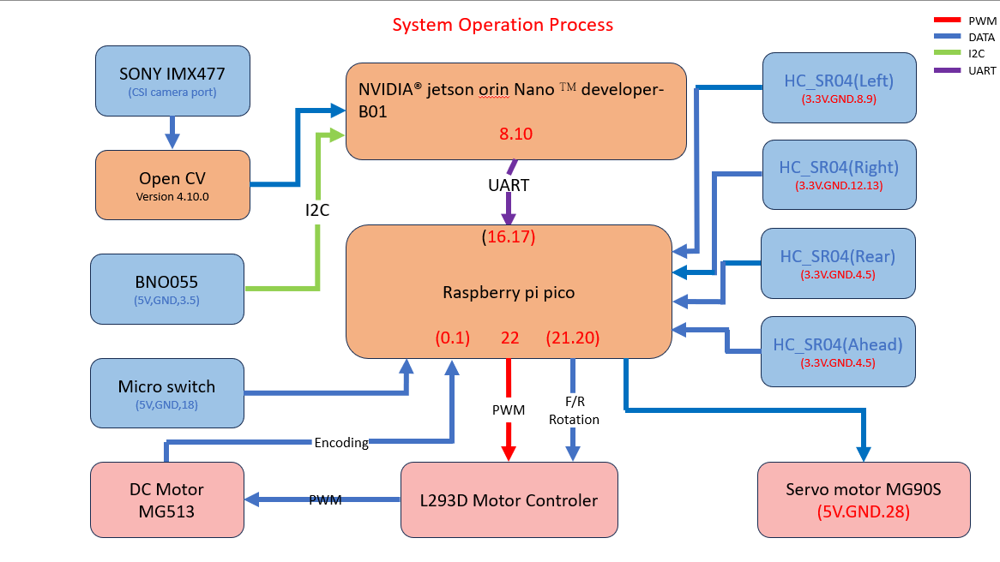

## 
Hardware Assembly Instructions & Wiring diagram

- ### Hardware Configuration of Electronic Equipment
  - The diagram below shows the placement of electronic equipment in the autonomous vehicle.
    

- ### System Operation Process
    
 

- The Nvidia Jetson Orin Nano main controller captures images using a camera module and processes them with OpenCV to detect obstacles and boundary walls. It also receives orientation data from the BNO055 gyroscope sensor via the I2C interface. Based on the image and orientation data, it calculates the desired travel direction and path, which is then transmitted to the Raspberry Pi Pico I/O controller via UART for low-level actuation.
- During automated parking, the Raspberry Pi Pico acts as the I/O controller. It receives the path and movement commands from the Jetson Orin Nano while simultaneously reading distance data from HC-SR04 ultrasonic sensors positioned in three directions. Based on this information, the Pico performs real-time calculations to control the movement of the vehicle for safe parking.
- As the I/O controller, the Raspberry Pi Pico receives target steering angles from the Nvidia Jetson Orin Nano. The Pico converts these target angles into PWM signals to control the MG90S front-wheel servo motor, enabling precise obstacle avoidance and directional control during driving.
- Simultaneously, the Raspberry Pi Pico processes movement control commands received from the Nvidia Jetson Orin Nano and generates appropriate PWM and GPIO signals to drive the L293D motor controller. This controls the forward and reverse rotation as well as the speed of the DC motors, allowing the vehicle to follow the calculated path accurately.

- ### Vehicle Body Structure Display Diagram
    

        <table>
            <tr>
                <th>Top View of the Overall Apparatus</th>
                <th>Middle Layer Structure Top View</th>
                <th>Top View of Vehicle Chassis</th>
                <th>Bottom View of Vehicle Chassis</th>
            </tr>
            <tr align=center>
                <td></td>
                <td></td>
                <td></td>
                <td></td>
            </tr>
        </table>
    

- ### Circuit Board
    

        <table>
            <tr>
                <th>Circuit Board of Top View</th>
                <th>Circuit Board of Buttom View</th>
            </tr>
            <tr>
                <td></td>
                <td></td>
            </tr>
            <tr>
                <td></td>
                <td></td>
            </tr>
        </table>
    

- ### Overview of Important Parts List
    - ### NVIDIA® Jetson Orin Nano™ developer-B01 Controller
        

            <table>
                <tr>
                    <td>
  __Specification:__ 
    - Processor: Hexa-core Arm Cortex-A78AE v8.2 64-bit CPU
    - GPU: 128-core NVIDIA Maxwell GPU
    - Memory: 8 GB 128-bit LPDDR5, 102 GB/s
    - Connectivity: Type A: 4 USB 3.2 Gen2. Type C: 1 for debug and device mode
    - GPIO: 40-pin Header (UART, SPI, I2S, I2C, GPIO)12-pin button header
    - Dimensions: 100 mm x 79 mm x 21 mm
    - Weight: 771 grams

  __Uses in Competition:__ 
    - Responsible for receiving image data from the camera module, performing image recognition via OpenCV, and sending the recognition results to the Raspberry Pi Pico for further processing.
                    </td>
                </tr>
            </table>
        
