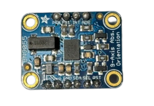
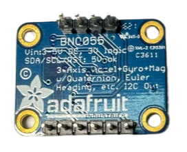

，<div align="center"></div>

## <div align="center">Gyroscope orientation sensor Introduction-陀螺儀方向感測器簡介：</div> 

- ### __Instruction to BNO055 Gyroscope orientation sensor-BNO055 陀螺儀方向感測器使用說明：__
    ### 中文:
    1. BNO055 陀螺儀方向感測器是由 Bosch Sensortec 開發的高精度九軸絕對方向感測器。它整合了加速度計、陀螺儀與磁力計，並內建用於感測器融合的微處理器，可提供即時的姿態與方向資訊。其主要特點是具備自動校準功能，能夠直接輸出三維空間中的絕對方向數據。
  
    2. BNO055 陀螺儀方向感測器能提供方位角、傾斜角、加速度、角速度與磁場強度等數據，非常適用於需要高精度姿態與方向感測的應用場景，例如自動駕駛、機器人導航、虛擬實境（VR）裝置及各類工業控制系統。由於其內建的感測器融合技術，可大幅簡化系統設計，讓開發者無需自行處理複雜的數據融合工作。
    3. 此感測器支援多種通訊介面（如 I2C、UART），便於整合至各種嵌入式系統中。BNO055 陀螺儀方向感測器的內建演算法會自動調整參數，能在不同環境中穩定輸出數據，因此特別適用於對穩定性與精準度要求極高的應用場景。
   
    ### 英文
    1. The BNO055 gyroscope orientation sensor is a high-precision nine-axis absolute orientation sensor developed by Bosch Sensortec. It integrates an accelerometer, gyroscope, and magnetometer and has a built-in microprocessor for sensor fusion algorithms, providing real-time attitude and orientation information. Its primary feature is automatic sensor calibration, enabling it to directly output absolute orientation data in three-dimensional space.

    2. The BNO055 gyroscope orientation sensor can provide data on azimuth, tilt angle, acceleration, angular velocity, and magnetic field strength, making it ideal for applications that require precise attitude and orientation sensing, such as autonomous driving, robotic navigation, virtual reality (VR) devices, and various industrial control systems. With its built-in sensor fusion technology, the BNO055 gyroscope orientation sensor simplifies system design, relieving developers from handling complex data fusion.
    
    3. This sensor supports multiple interfaces (e.g., I2C, UART), allowing for easy integration into different embedded systems. The BNO055 gyroscope orientation sensor’s built-in algorithm automatically adjusts to provide stable readings across different environments, making it suitable for applications requiring high stability and accuracy.

    <div align="center">
    <table width="100%">
    <tr>  
    <th>Top View
    </th>
    <th>Bottom View
    </th>
    </tr>
    
    <tr>
    <td align="center">  </td>
    <td align="center">  </td>
    </tr>
    
    </table>
    </div>

    ### 中文:
    - 為實現精準轉向控制，我們將 BNO055 慣性測量單元（IMU）/ 陀螺儀方向感測器穩固地安裝在自駕車上。
    - 該感測器透過 I²C 通訊協定與 NVIDIA Jetson Orin Nano 控制器進行訊號傳輸，即時獲取車輛的行進方向數據。
    - 這些數據會被傳送至主程式進行高效運算與分析，從而為車輛的自主轉向決策提供關鍵依據。
    ### 英文:
    - To achieve precise steering control, the BNO055 Inertial Measurement Unit (IMU) / gyroscope orientation sensor was securely mounted onto the autonomous vehicle. - This sensor communicates with the NVIDIA Jetson Orin Nano controller via the I²C protocol, acquiring the vehicle's real-time directional data. 
    - This data is then transmitted to the main program for efficient computation and analysis, serving as a critical basis for the vehicle's autonomous steering decisions.

   - ####  BNO055 陀螺儀與 NVIDIA Jetson Orin Nano 主控制器之間詳細的接線步驟：
    * **VCC (電源)**：將 BNO055 的 VCC 引腳連接至 NVIDIA Jetson Orin Nano 的 **3.3V**（PIN 1）。此連接為陀螺儀提供**穩定的正極電源**。
    * **GND (接地)**：將 BNO055 的 GND 引腳連接至 NVIDIA Jetson Orin Nano 的 **GND**（PIN 6）。此連接**確保兩者共用接地**，形成完整的電路迴路。
    * **SDA (資料線)**：將 BNO055 的 SDA 引腳連接至 NVIDIA Jetson Orin Nano 的 **SDA**（PIN 3）。此線路用於 **I²C 協議的資料傳輸**。
    * **SCL (時脈線)**：將 BNO055 的 SCL 引腳連接至 NVIDIA Jetson Orin Nano 的 **SCL**（PIN 5）。此線路用於 **I²C 協議的時脈訊號同步**。


   - ### Connection Guide for Gyroscope (BNO055) and Main Controller (NVIDIA Jetson Orin Nano)

    * **VCC (Power)**: Connect the VCC pin of the BNO055 to the **3.3V** pin (PIN 1) on the NVIDIA Jetson Orin Nano. This connection **provides the stable positive power supply** for the gyroscope.
    * **GND (Ground)**: Connect the GND pin of the BNO055 to the **GND** pin (PIN 6) on the NVIDIA Jetson Orin Nano. This connection **ensures a shared ground** between the two devices, completing the circuit loop.
    * **SDA (Data Line)**: Connect the SDA pin of the BNO055 to the **SDA** pin (PIN 3) on the NVIDIA Jetson Orin Nano. This line is used for **data transmission in the $I^2C$ protocol**.
    * **SCL (Clock Line)**: Connect the SCL pin of the BNO055 to the **SCL** pin (PIN 5) on the NVIDIA Jetson Orin Nano. This line is used for **clock signal synchronization in the $I^2C$ protocol**.


  - 以下是使用**物件導向程式設計** (類別方式) 實現，並部署於 **NVIDIA Jetson Orin Nano** 開發板上的 **Python 程式碼**。該程式碼旨在從 **BNO055 慣性測量單元 (IMU) 陀螺儀感測器**讀取數據，進而精確地實作**車輛**的**方向角偵測功能**。

  - Here is the **Python code**, implemented using an **Object-Oriented Programming (OOP) approach (class-based)**, and deployed on an **NVIDIA Jetson Orin Nano** development board. This code is designed to read data from a **BNO055 Inertial Measurement Unit (IMU) gyroscope sensor** to accurately implement the **heading/orientation detection function** for a **vehicle**.

- ####  Python code
```python
     

            import time
            from Adafruit_BNO055 import BNO055
            class BNO055Sensor:
                def __init__(self, i2c_address=0x28):
                    # Initialize BNO055 sensor with the specified I2C address
                    self.bno = BNO055.BNO055(i2c_address=i2c_address)
                    
                    # Check if the sensor was initialized successfully
                    if not self.bno.begin():
                        raise RuntimeError("Failed to initialize BNO055. Please check the connection.")
                    else:
                        print("BNO055 initialized successfully.")

                def get_orientation(self):
                    # Read orientation (Heading, Roll, Pitch) from the sensor
                    heading, roll, pitch = self.bno.read_euler()
                    return {
                        "heading": heading,
                        "roll": roll,
                        "pitch": pitch
                    }

                def get_calibration_status(self):
                    # Retrieve calibration status for the system, gyroscope, accelerometer, and magnetometer
                    sys, gyro, accel, mag = self.bno.get_calibration_status()
                    return {
                        "system": sys,
                        "gyroscope": gyro,
                        "accelerometer": accel,
                        "magnetometer": mag
                    }

```

- #### Example usage
```python
            sensor = BNO055Sensor()
            while True:
                # Get orientation data
                orientation = sensor.get_orientation()
                print("Orientation - Heading: {heading}°, Roll: {roll}°, Pitch: {pitch}°".format(**orientation))

                # Get calibration status
                calibration_status = sensor.get_calibration_status()
                print("Calibration Status:", calibration_status)

                time.sleep(1)
```

- #### Explanation      
 * **init method:** Initializes the BNO055 Gyroscope orientation Sensor class, setting the I2C address and verifying the sensor connection. If the connection fails, it raises an error.
* **get_orientation method:** Retrieves orientation data from the sensor (Heading, Roll, and Pitch) and returns them in a dictionary.
* **get_calibration_status method:** Returns the calibration status for the system, gyroscope, accelerometer, and magnetometer, which is useful for ensuring accurate measurements.

__This code reads and prints the BNO055 Gyroscope orientation sensor's orientation data and calibration status every second.__

# <div align="center">[Return Home](../../)</div>  
