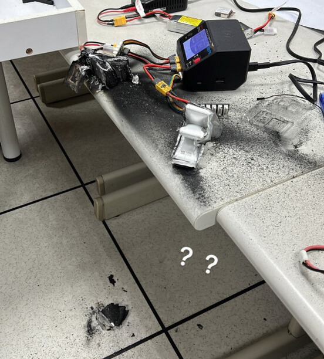
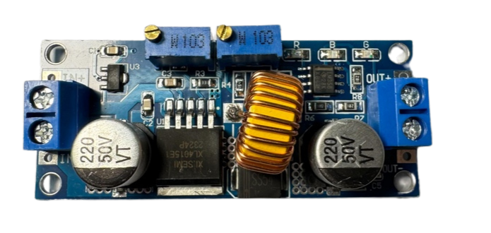
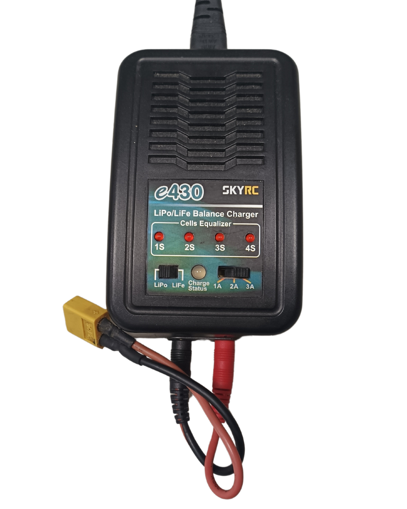

## 
Battery choice for self-driving cars-自動駕駛汽車的電池選擇
 
### 中文:
- 為配合本年度的系統升級，我們已將主控制器正式更換為 NVIDIA Jetson Orin Nano 平台。鑑於該模組的輸入電壓要求為 **9V至20V DC**，本次技術評估的核心在於比較 **3S 鋰聚合物電池（LiPo）**與 **18650** 鋰離子電池組對整體車輛效能（如續航力、瞬時功率輸出與穩定性）的具體影響，以期選定最契合今年競賽規格的電源解決方案。
### 英文:
 -In alignment with this year's system upgrade, we have officially replaced the main controller with the NVIDIA Jetson Orin Nano platform. Given the module's input voltage requirement of 9V to 20V DC, the core of this technical evaluation is to **compare the specific impact of 3S Lithium Polymer (LiPo) batteries versus 18650 Lithium-ion battery packs** on the overall vehicle performance (such as endurance, instantaneous power output, and stability), in order to select the power solution that is most suitable for this year's competition specifications.

### Comparison between 3S Li-Polymer and 18650 - Li-ion batteries-3S 鋰聚合物電池與 18650 鋰離子電池比較
### 中文:
  - 以下是相同電壓(12V)配置的3S鋰聚合物電池和18650鋰離子電池的優缺點比較。
### 英文:  
  - The following is a comparison of the advantages and disadvantages of 3S Li-Polymer batteries and 18650 Li-ion batteries with the same voltage(12V) configuration.
  <table border="1">
    <thead>
      <tr>
      <th>Item(項目)</th>
      <th>3S Li-Polymer Battery(3S 鋰聚合物電池)</th>
      <th>18650 Battery(18650 電池)</th>
      </tr>
    </thead>
    <tbody>
      <tr>
      <th>photo</th>
      <td></td>
      <td></td>
      </tr>
      <tr>
      <th>Voltage Range</th>
      <td>11.1V (nominal), up to 12.6V (fully charged)
          (標稱電壓為 11.1V，充滿電可達 12.6V)</td>
      <td>11.1V (nominal), up to 12.6V (fully charged)
          (標稱電壓 11.1V，最高充電電壓 12.6V)</td>
      </tr>
      <tr>
      <th>Energy Density(能量密度)</th>
      <td>Higher energy density compared to the same weight(與相同重量相比，能量密度較高)</td>
      <td>Higher capacity per unit volume compared to LiPo(與鋰聚合物電池相比，每單位體積容量較高)</td>
      </tr>
      <tr>
      <th>Weight(重量)</th>
      <td>Lighter, good for reducing load(較輕，有助於減輕負載)</td>
      <td>Relatively heavier(相對較重)</td>
      </tr>
      <tr>
      <th>Output Current(輸出電流)</th>
      <td>Supports high discharge rates (C-Rate), can provide high current instantaneously(支援高放電倍率（C值），可瞬間提供高電流)</td>
      <td>Lower discharge rates, suitable for stable power output(放電倍率較低，適合穩定輸出電力)</td>
      </tr>
      <tr>
      <th>Charging Time(充電時間)</th>
      <td>Supports fast charging but requires a dedicated charger(支援快速充電，但需專用充電器)</td>
      <td>Relatively slower charging time(充電時間相對較長)</td>
      </tr>
      <tr>
      <th>Safety(安全性)</th>
      <td>More susceptible to physical damage or overcharging, risk of fire(較易受到物理損壞或過充影響，存在起火風險)</td>
      <td>Relatively safer, resistant to overcharge and overdischarge(相對較安全，耐過充及過放電)</td>
      </tr>
      <tr>
      <th>Shape and Flexibility(形狀與柔韌性)</th>
      <td>Can be made in various shapes and sizes, high flexibility in fitting space(可製成多種形狀與尺寸，具有高度空間適應性)</td>
      <td>Fixed cylindrical shape, less adaptable to different spaces(固定圓柱形狀，較不適合不同空間)</td>
      </tr>
      <tr>
      <th>Internal Resistance and Efficiency(內阻與效率)</th>
      <td>Lower internal resistance, suitable for high current discharge, high efficiency(內阻較低，適合高電流放電，效率高)</td>
      <td>Relatively higher internal resistance, slightly lower efficiency(相對較高的內阻，效率略低)</td>
      </tr>
      <tr>
      <th>Lifecycle(使用壽命)</th>
      <td>Shorter lifespan, fewer charge cycles (typically 300-500 cycles)（壽命較短，充電循環次數較少通常為 300–500 次循環）</td>
      <td>Longer lifespan, more charge cycles (typically 500-1000 cycles)（壽命較長，充電循環次數較多（通常為 500–1000 次循環））</td>
      </tr>
      <tr>
      <th>Application Scenarios（應用情境）</th>
      <td>Used in drones, RC vehicles, and applications requiring high output（用於無人機、遙控車輛及需高電流輸出的應用）</td>
      <td>Used in laptops, power banks, and applications needing stable power supply（用於筆記型電腦、行動電源及需穩定供電的應用）</td>
      </tr>
      <tr>
      <th>Cost（成本）</th>
      <td>Relatively more expensive, requires dedicated charging equipment（相對較貴，需要專用充電設備）</td>
      <td>Relatively cheaper（相對便宜）</td>
      </tr>
    </tbody>
  </table>
  
  ### 中文:

  - 依據上表數據，3S鋰聚合物電池（LiPo） 憑藉其高C值放電能力、高能量密度與極輕的重量，成為滿足高瞬時電流需求的理想選擇，特別適用於高性能競賽車輛。因此，我們最終決定採用 3S LiPo 電池作為本次自駕車的電源，主要目的在於在確保足夠動力的前提下，實現車體質量最小化，以維持最佳的運動表現和反應速度。
  - 我們使用 3S Li-Po 電池的經驗顯示，其安全性是一大考量。不當的充電操作曾導致電池起火，錯誤的存放也造成電池損壞，這些事件突顯了嚴格遵守電池操作規範的重要性。
  
  ### 英文:
   - According to the data in the table above, the **3S Lithium Polymer (LiPo) battery** is the ideal choice for meeting high instantaneous current demands, especially for high-performance racing vehicles, due to its **high C-rate discharge capability, high energy density, and extremely low weight**. Therefore, we have ultimately decided to adopt the 3S LiPo battery as the power source for this autonomous vehicle competition. The primary objective is to **minimize the vehicle's mass while ensuring sufficient power delivery, thereby maintaining optimal dynamic performance and response speed**.

   - Our experience with 3S Li-Po batteries has shown that their safety is a significant concern. Improper charging practices have led to battery fires, and incorrect storage has resulted in battery damage. These incidents underscore the importance of following strict guidelines for handling these batteries.
  

  <table>
  <tr>
  
  <th>This is a photo of a 3S Li-Polymer (LiPo) battery burnout during charging from last year.(這是去年3S 鋰聚合物電池（LiPo）充電過程中燒毀的照片)</th>
  </tr><tr>
  <td></td>
  </tr>
  </table>
  

 ### Step-Down power supply Module  Selection-降壓電源模組選擇
  ### 中文：
  - 系統中，Raspberry Pi Pico 等核心控制器要求 5v 供電，這與 3S 鋰聚合物電池的 12V 輸出電壓存在電壓不匹配問題。為此，我們規劃整合一個**12V降至 5V 的降壓模組**，確保電壓的精確調節，從而**保障控制板在安全電壓範圍內運行**。
  - 起初，我們選擇了 LM2596 可調直流降壓模組，因為它能顯示輸出電壓值，便於監控，且能確保整個比賽過程中電壓穩定。然而，該模組的最大輸出電流僅為 3A，無法滿足所有設備的需求。
  - 因此，我們在線上找到了一款 5A 恆壓恆流降壓電源模組，最大輸出電流達 5A，足以支持自動車的正常運作。雖然此模組沒有電壓顯示功能，但可以使用電池低壓報警器來監控電池電壓，確保電力充足。
  ### 英文:
   - There is a voltage mismatch in the system, as core controllers such as the **Raspberry Pi Pico** require 5V power, while the 3S Lithium Polymer battery outputs approximately 12V. Consequently, we plan to integrate a **12V to 5V** step-down module to ensure precise voltage regulation, thereby guaranteeing that **the control board operates within a safe voltage range**.

   - Initially, we chose the LM2596 DC-DC adjustable step-down module because it displays output voltage values, which makes monitoring easier and ensures stable voltage throughout the competition. However, the module’s maximum output current is only 3A, which is insufficient for all devices.

   - As a result, we found the 5A Constant Voltage Constant Current Buck Power Supply Module online, with a maximum output current of 5A, which is sufficient to support the normal operation of the autonomous vehicle. Although this module does not have a voltage display function, a battery low-voltage alarm can be used to monitor the battery voltage, ensuring adequate power levels.
  
- #### Step-Down power supply Module Comparison-降壓電源模組比較
  

  <table with=100%>
  <tr align="center">
  <th rowspan="2">Photo(照片)</th>
  <th> LM2596 DC-DC Adjustable Buck Module LM2596 DC-DC(LM2596 DC-DC可調降壓模組 LM2596 DC-DC) </th>
  <th>5A Constant Voltage Constant Current Buck Power Supply Module ADIO-DC36V5A(5A恆壓恆流降壓電源模組 ADIO-DC36V5A)</th>
  </tr>
  <tr align="center">
  <td>  </td>
  <td> 
  </td>
  </tr>
  <tr >
  <th>Specification(規格)</th>
  <td>
  <ol>
    <li>Module Type: Non-isolated Buck Step-down(模組類型： 非隔離降壓（Step-down）模組)</li>
    <li>Input Voltage Range: 3.2V - 40V(輸入電壓範圍： 3.2V - 40V)</li>
    <li>Output Voltage Range: 1.25V - 35V, with a maximum output current of 3A(輸出電壓範圍： 1.25V - 35V，最大輸出電流為3A)</li>
    <li>Maximum Output Current: 3A(最大輸出電流： 3A)</li>
    <li>Voltage Regulation: Input voltage range of 4V - 40V(電壓調節範圍： 輸入電壓範圍為4V - 40V)</li>
    <li><a href="https://www.amazon.ae/UIOTEC-Converter-Digital-Step-up-Voltage/dp/B074LX3YYT" target="_blank">website</a> </li>
    </ol>
   </td>
   <td>
   <ol>
    <li>Input Voltage Range: 4 - 38V(輸入電壓範圍： 4 - 38V)</li>
    <li>Output Voltage Range: 1.25 - 36V, continuously adjustable(輸出電壓範圍： 1.25 - 36V，連續可調)</li>
    <li>Output Current Range: Adjustable, maximum of 5A(輸出電流範圍： 可調，最大5A)</li>   
    <li><a href="https://shop.cpu.com.tw/product/57434/info/" target="_blank">website</a></li>
    </ol>
    </td>
    </tr>
    </table>
    

 
### Charging/Discharging Equipment and Li-Polymer Battery Low Voltage Alarm.-充放電設備與鋰聚合物電池低壓警報
### 中文:
  - 為了保護 3S 鋰聚合物電池（LiPo）在使用與存放過程中不受損壞，並延長其壽命，我們採取了以下措施：
  - 使用專用充電器： 選擇適用於 LiPo 電池的平衡充電器，確保每個電芯的電壓保持平衡，避免過充或充電不均造成損壞。
  ### 英文:
  - To protect the 3S Li-Polymer (LiPo) battery from damage during use and storage and to extend its lifespan, we implemented the following strategies:
  - __Use a Dedicated Charger:__ Choose a balanced charger suitable for LiPo batteries to ensure each cell’s voltage remains balanced, preventing damage due to overcharging or unbalanced charging.
    

    <table>
    <tr align="center">
    <th colspan="3">Dedicated ChargerCharging/Discharging Equipment-專用充電器充放電設備</th>
    </tr>
    <tr align="center">
    <th>Skyrc E430</th>
    <th>Skyrc Imax B6C2 v2</th>
    <th>HOTA D6 Pro</th>
    </tr>
    <tr>
    <td></td>
    <td></td>
    <td></td> 
     </tr>
     </table>
     
      

     ### 中文:
    - 監控充電過程： 在充電過程中進行監督，避免長時間無人看管，以便能及時發現並解決任何充電異常情況。
    - 控制充電電壓與電流： 將充電電壓保持在每節電池標準的 4.2V 以下，並維持適當的充電電流，以防快速充電造成損壞。
    - 避免過度放電： 在使用過程中，確保每節電池電壓不低於 3.0V，以防過度放電導致電池損壞並縮短壽命。
    - 安全儲存： 不使用時，請將電池存放於防火袋或專用安全容器中，以避免因外部壓力或高溫造成損壞。
    - 儲存電壓： 若需長期儲存，請將電池充至約 50%（每節 3.7V–3.85V），以延長壽命並降低自放電風險。
    - 避免高溫環境： 避免在高溫環境中使用或存放電池，因為高溫會加速老化並增加損壞與起火風險。
    - 定期檢查電池： 定期檢查電池的外觀與電壓，若發現膨脹、裂痕或電壓異常，應立即停止使用並安全處理。
    ### 英文:
    - __Monitor the Charging Process:__ Supervise the battery during charging, avoiding extended periods without monitoring to quickly detect and resolve any charging abnormalities.

    - __Control Charging Voltage and Current:__ Keep the charging voltage below the standard 4.2V per cell and maintain an appropriate charging current to prevent damage from fast charging.

    - __Avoid Over-Discharge:__ During use, ensure each cell’s voltage does not drop below 3.0V to prevent over-discharge, which could damage the battery and reduce its lifespan.

    - __Safe Storage:__ When not in use, store the battery in a fireproof bag or a dedicated safety container to avoid damage from external pressure or high temperatures.

    - __Storage Voltage:__ For long-term storage, charge the battery to around 50% (3.7V-3.85V per cell) to extend its lifespan and reduce the risk of self-discharge.

    - __Keep Away from High Temperatures:__ Avoid using or storing the battery in high-temperature environments, as heat accelerates aging and increases the risk of damage and fire.

    - __Regular Battery Checks:__ Inspect the battery regularly for appearance and voltage. If swelling, cracking, or voltage abnormalities are detected, immediately stop using and dispose of it safely.

  - #### Low Voltage Alarm-低電壓警報       
      
      

       <table>
       <th colspan="2">Li-Polymer Battery Low Voltage Alarm -鋰聚合物電池低電壓警報</th>
       <tr>
       <td>
       
       ### 中文:
       - 在電池上安裝低電壓警報器，當電壓低於設定值時會發出聲響警示，提醒使用者及時監控或更換電池。這可有效防止比賽中因電力不足造成的問題，並保護電池免於過度放電而受損。

       ### 英文:
      - Installing a low-voltage alarm on the battery can emit an audible warning when the voltage falls below a set value, alerting the user to monitor or replace the battery in time. This effectively prevents insufficient power issues during competitions and protects the battery from damage due to over-discharge.
        
        <td></td>
      </tr>
      </table>
      
  
     
 
# 
[Return Home](../../)
 
