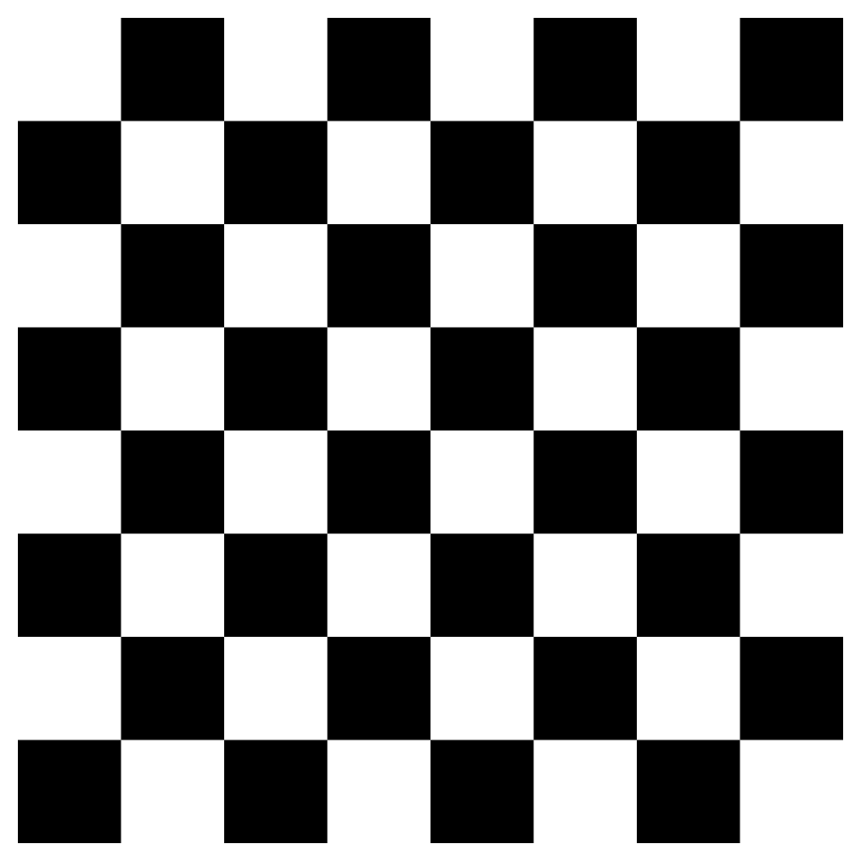
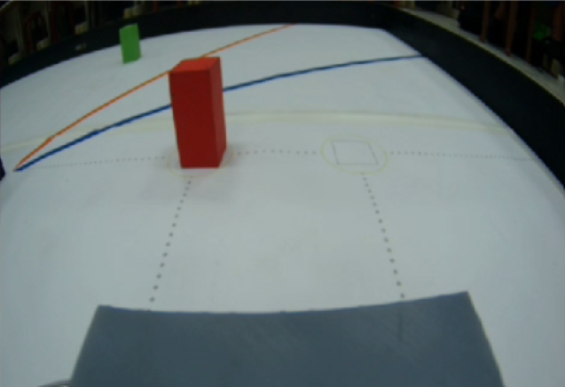
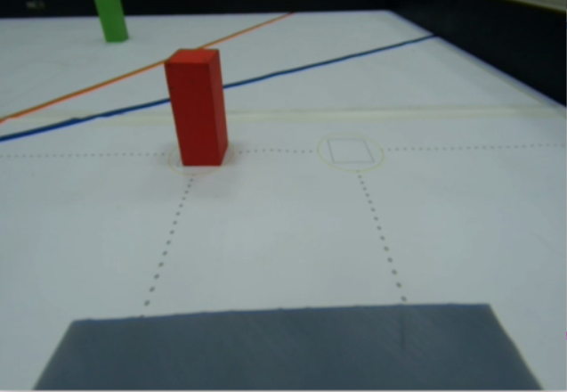

## 
Camera Selection

  ### 中文:
  1. 在自駕車競賽中，為了能準確捕捉與辨識賽道上的各類標的物——包含紅色/綠色柱體、黑色邊界牆、洋紅色停車區，乃至於地面上的藍線與橙線——相機模組的選擇至關重要，可謂影響比賽勝負的核心要素。 我們必須選用具備高解析度、極低延遲與優異高感光性能的相機模組，方能確保影像資訊的即時與清晰，大幅強化車輛對周遭障礙物的識別效能。 這直接優化了後續的避障與導航決策，奠定車輛在賽場上的競爭力。
  2. 我們因為使用 NVIDIA Jetson Orin Nano 作為主控制器，因此必須選擇與 Jetson Nano 相容的相機模組，才能確保功能正常運作。以下為目前台灣常用相機模組的比較說明。
  ### 英文:
  - In autonomous vehicle competitions, the selection of the camera module is crucial—indeed, it is the core element influencing the outcome of the race—to accurately capture and identify the various targets on the track, including the red/green posts, black boundary walls, magenta parking areas, as well as the blue and orange lines on the ground. We must select a camera module featuring high resolution, extremely low latency, and excellent high light sensitivity performance to ensure that image information is both real-time and clear, significantly enhancing the vehicle's recognition capability for surrounding obstacles. This directly optimizes subsequent avoidance and navigation decisions, establishing the vehicle's competitiveness on the track
  - Since we are using the NVIDIA Jetson Orin Nano as the main controller, we must choose a camera module that is compatible with the Jetson Nano to ensure normal functionality. The following is a comparison of camera modules commonly used in Taiwan.

- ### Comparison of Camera Modules
    

    <table>
    <tr align="center" >
    <th rowspan="2">Model</th> 
    <th >SONY IMX219</th>
    <th >SONY IMX477</th>
    </tr>
    <tr align="center">
    <td></td>
    <td></td>
    </tr>
    <tr align="center">
    <td>Sensor</td>
    <td>SONY IMX 219</td>
    <td>SONY IMX 477</td>
    </tr>
    <tr align="center">
    <td>FOV</td>
    <td>160 MAX</td>
    <td>160 MAX</td>
    </tr>
    <tr align="center">
    <td>Resolution</td>
    <td>3280 × 2464 pix</td>
    <td>4056 × 3040 pix</td>
    </tr>
    </tr>
    </table>
    

  
    __Thus, in terms of resolution, the SONY IMX477 is our best choice for the competition environment.__

- ### Wide-angle lens distortion correction
  廣角鏡頭畸變校正的目的是減少或消除使用廣角鏡頭拍攝影像時所產生的變形效果。這些變形通常包括「桶形畸變」或「枕形畸變」，會導致影像中的直線物體看起來彎曲或扭曲。透過校正，影像能恢復接近真實比例與形狀，提升影像的精確度與真實感。此技術特別適用於需要精確測量或細節捕捉的應用，如機器視覺、建築測量及自動駕駛技術等。

  The purpose of wide-angle lens distortion correction is to reduce or eliminate the deformation effects produced when capturing images with a wide-angle lens. These deformations often include "barrel distortion" or "pincushion distortion," which cause straight objects in the image to appear curved or distorted. Through correction, images can be restored to proportions and shapes closer to reality, enhancing the accuracy and realism of the image. This is particularly suitable for applications requiring precise measurement or detailed capture, such as machine vision, architectural surveying, and autonomous driving technology.
  - ### Correction Methods-校正方法
    在 NVIDIA Jetson Orin Nano 上執行廣角鏡頭畸變校正時，通常會使用 OpenCV 函式庫中的校正功能。以下是基本步驟：

      When performing wide-angle lens distortion correction on the NVIDIA Jetson Orin Nano, the calibration functions in the OpenCV library are typically used. The basic steps are as follows:
    <ol>
    <li>
    拍攝校正影像： 將棋盤格或點陣圖置於廣角鏡頭的視野範圍內，並從不同角度拍攝多張影像。這些影像用於計算校正參數。

    <strong>Capture Calibration Images:</strong> Place a checkerboard or dot array within the field of view of the wide-angle lens and capture multiple images from different angles. These images are used to calculate calibration parameters.</li>
        

    <table>
    <tr align="center" >
    <th >Checkerboard Image-棋盤格影像</th> 
    </tr>
    <tr align="center">
    <td></td>
    </tr>  
    </table>
    

    ### 中文:
    1. 偵測棋盤格角點： 使用 OpenCV 的 findChessboardCorners() 函式自動偵測棋盤格的角點位置。對每張校正影像，此步驟會找出計算校正參數所需的角點座標。

    2. 計算校正參數： 使用 calibrateCamera() 函式計算相機的內參數與畸變係數。這些參數包含焦距、光學中心，以及鏡頭的徑向和切向畸變係數。

    3. 套用校正參數： 在實際影像中，使用 undistort() 函式將校正參數應用到每一幀影像。經校正的影像能減少廣角鏡頭產生的畸變，使影像更接近真實比例。

    4. 即時處理（如有需要）： 若在 NVIDIA Jetson Orin Nano 上需進行即時校正，需確保影像處理效率。考量 Jetson Nano 性能有限，可調整影像解析度或優化處理步驟以提升校正速度。
    ### 英文:

    1. <strong>Detect Checkerboard Corners:</strong> Use OpenCV's findChessboardCorners() function to automatically detect the corner positions of the checkerboard. For each calibration image, this step finds the corner coordinates needed for calculating the correction parameters.
    
    2. <strong>Calculate Calibration Parameters:<strong> Use the calibrateCamera() function to calculate the camera's intrinsic parameters and distortion coefficients. These parameters include focal length, optical center, and radial and tangential distortion coefficients of the lens.
   
    3. <strong>Apply Correction Parameters:</strong> In actual images, use the undistort() function to apply the correction parameters to each frame. This corrected image will reduce the distortion caused by the wide-angle lens, making the image closer to true proportions.
    
    4. <strong>Real-Time Processing (If Needed):</strong> If real-time correction is required on the Jetson Nano, ensure efficiency in image processing. Given the limited performance of the NVIDIA Jetson Orin Nano, consider adjusting image resolution or optimizing processing steps to enhance correction speed.
   

    __以下是一個簡單的程式範例：__
    __A simple code example is as follows:__
    - ### python Code-Python 程式碼

          import cv2
          import numpy as np

          # Load calibration images-載入校正影像

          images = ["image1.jpg", "image2.jpg", ...]  # Replace with your image paths
          chessboard_size = (9, 6)  # Chessboard dimensions
          obj_points = []  # Real world coordinates points
          img_points = []  # Image coordinates points

          # Define corner points for the chessboard-定義棋盤格的角點座標

          objp = np.zeros((chessboard_size[0] * chessboard_size[1], 3), np.float32)
          objp[:, :2] = np.mgrid[0:chessboard_size[0], 0:chessboard_size[1]].T.reshape(-1, 2)

          for image in images:
              img = cv2.imread(image)
              gray = cv2.cvtColor(img, cv2.COLOR_BGR2GRAY)
              ret, corners = cv2.findChessboardCorners(gray, chessboard_size, None)
              
              if ret:
                  img_points.append(corners)
                  obj_points.append(objp)

          # Calibrate camera parameters-校正相機參數

          ret, mtx, dist, rvecs, tvecs = cv2.calibrateCamera(obj_points, img_points, gray.shape[::-1], None, None)

          # Read the image to be undistorted-讀取待校正的影像

          img = cv2.imread('test_image.jpg')
          h, w = img.shape[:2]
          newcameramtx, roi = cv2.getOptimalNewCameraMatrix(mtx, dist, (w,h), 1, (w,h))

          # Apply distortion correction-套用畸變校正

          dst = cv2.undistort(img, mtx, dist, None, newcameramtx)

          # Crop the image-裁剪影像

          x, y, w, h = roi
          dst = dst[y:y+h, x:x+w]

          cv2.imshow('Undistorted Image', dst)
          cv2.waitKey(0)
          cv2.destroyAllWindows()

      Experimental results indicate that setting the resolution to __640x480__ optimizes system performance. This configuration effectively reduces the computational load on the Jetson Nano while significantly enhancing the efficiency of image capture and recognition.  
     ### Comparison image of before and after correction-校正前後影像比較圖
    
    

    <table>
    <tr align="center" >
    <th>Item(項目)</th>
    <th >Before(之前)</th>
    <th >After-之後</th>
    </tr>
    <tr align="center">
    <th>Photo(照片)</th>
    <td></td>
    <td></td>
    </tr>
    </table>
    

# 
[Return Home](../../)
  