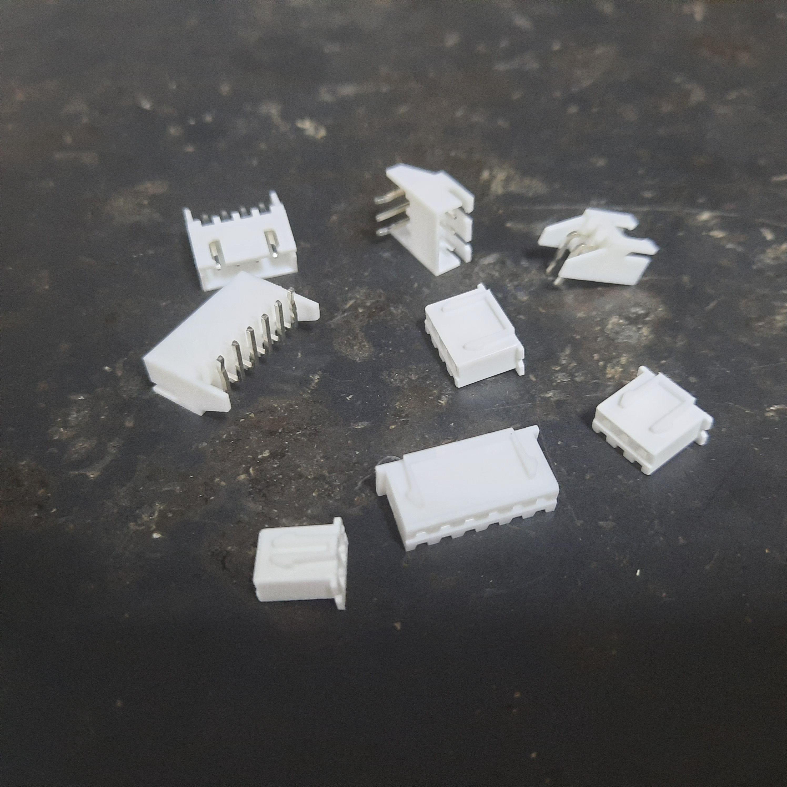
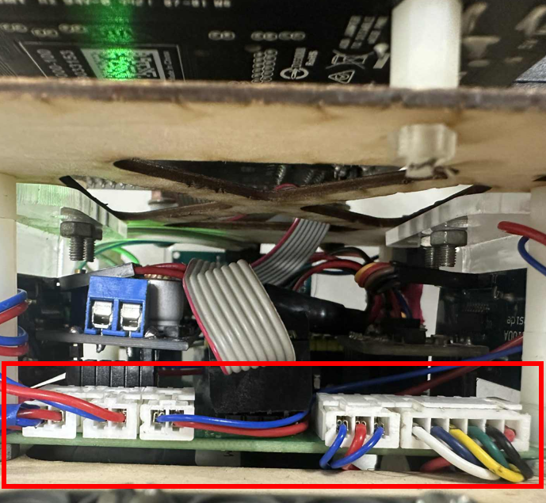

## 
Hardware Fool-Proof Design-硬體防呆設計

### 中文:
在實際的硬體設計過程中，我們經常遇到因電源接錯或資料線接錯導致 Jetson Nano 控制器或 IC 損壞的問題。為了防止這類情況發生，我們採用了公母插頭來連接電源及資料傳輸，並將電路焊接在電木板上，確保接線正確。這項改進有效降低了 Jetson Nano 控制器或 IC 燒毀的風險，提升系統穩定性，並增加產品的可靠度與使用壽命。
### 英文:
In the actual hardware design process, we frequently encountered issues where the Jetson Nano controller or IC would get damaged due to incorrect power connections or data line misplacements. To prevent these occurrences, we implemented male and female connectors for power supply and data transmission and used soldering to secure the circuit on a bakelite board, ensuring correct wiring. This improvement effectively reduced the risk of burnout for the Jetson Nano controller or IC, enhancing system stability and increasing product reliability and lifespan.

<table>
<tr>
<th>2.5mm Connector 2/3 Pin Male/female Adapter Right Angle Pin Header White Socket(2.5毫米接頭 2/3 針公母轉接頭 直角針腳 白色插座)</th>
<th>Circuit real-life photo(電路實際照片)</th>
</tr><tr>
<td></td> 
<td></td> 
</tr>
</table>

 

# 
[Return Home](../../)
  
