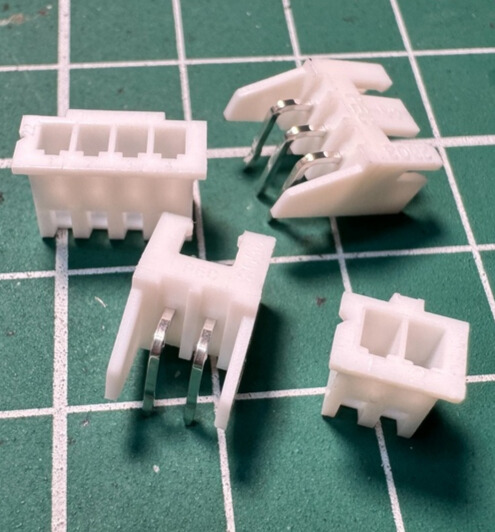

## 
Hardware Fool-Proof Design

- ####  Pin Header / Socket 
    During critical phases of hardware development and integration, we frequently encounter the risk of irreversible damage to high-value modules such as the __NVIDIA Jetson Orin Nano__, __Raspberry Pi Pico W__, and related Integrated Circuits (ICs) due to incorrect wiring of power or data signal lines. To effectively mitigate the severe consequences and __high costs associated__ with such human operational errors, we have proactively implemented key protective mechanisms in our design:

    - **Interface Standardization and Specification (Connectorization):** For power input and data transmission interfaces, we universally adopt standardized male and female connectors(Pin Header/Socket) to forcibly ensure correct orientation and connection, thus eliminating damage caused by incorrect insertion.

    - **Core Circuit Solidification Design:** Critical circuit components are directly soldered onto the Printed Circuit Board (PCB), achieving extremely stable, normatively laid-out management, which eliminates the potential weak points associated with external cable connections.

    This structural design optimization has significantly reduced the probability of failure in the core components of the NVIDIA Jetson Orin Nano and Raspberry Pi Pico W due to wiring mistakes, fundamentally enhancing the overall system's operational stability, long-term reliability, and effectively extending the product's Mean Time Between Failures (MTBF).

- #### pluggable terminal block
    To establish the power input solution for the __Jetson Orin Nano__, we have incorporated a __pluggable terminal block__ onto the main circuit PCB as its dedicated power supply interface.

    The rationale for this design choice is as follows:

    - **Power Path Requirement:** The Jetson Orin Nano relies on 11.1V lithium battery power supplied directly via the power socket and does not support reverse power delivery from its 5V pins.

    - **Connection Stability:** Directly connecting the power cable to a buck converter module carries the inherent risk of contact loosening, which could lead to unstable circuit power delivery and potentially damage the PCB.

    In summary, utilizing a pluggable terminal block as the interface for the power supply cable ensures connection stability and enhances overall system safety, while also facilitating subsequent maintenance and troubleshooting operations.

    <table>
        <tr>
            <th>Pluggable Terminal Block(Power supply Terminal Block)</th>
            <th>Actual Photo of the Circuit(Power supply)</th>
        </tr>
        <tr align=center>
            <td></td>
            <td></td>
        </tr>
    </table>

    <table>
        <tr>
            <th width=500>Top side of the PCB</th>
            <th width=500>Bottom Side of the PCB</th>
        </tr>
        <tr align=center>
            <td></td>
            <td></td>
        </tr>
    </table>

<table>
<tr>
<th>2.5mm Connector 2/3 Pin Male/female Adapter Right Angle Pin Header White Socket</th>
<th>Actual Photo of the Circuit</th>
</tr><tr>
<td width=500 align=center></td> 
<td width=500 align=center></td> 
</tr>
</table>

# 
[Return Home](../../)
  
