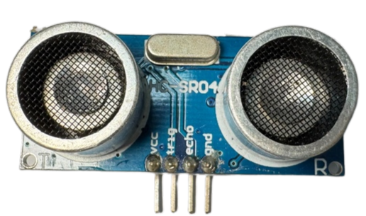
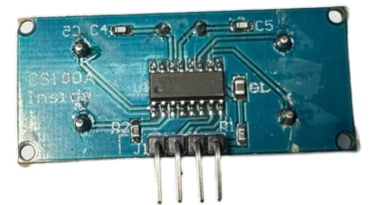
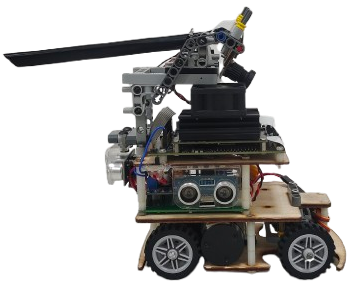

<div align="center"></div>

## <div align="center">Ultrasonic rangefinder Introduction-超聲波測距儀簡介</div> 

- ### __Instruction to HC-SR04 ultrasonic distance sensor-HC-SR04 超聲波距離感測器說明__
    <div align="center">
    <table>
    <tr>  
    <td>
    <ol>

    ### Functional Description of the HC-SR04 Ultrasonic Distance Sensor

    The **HC-SR04 Ultrasonic Distance Sensor** is a **cost-effective and easily integrated** solution for distance measurement. Its operation relies on **emitting an ultrasonic pulse** and precisely measuring the **Time-of-Flight (TOF)** of the sound wave to determine the distance to an object. The sensor provides an effective measurement range from 2cm up to 400 with a high accuracy of 3mm. This capability ensures **highly accurate and reliable** distance data, making it well-suited for various applications such as **obstacle avoidance, autonomous navigation,** and perimeter **object detection**.

    ### Application of the HC-SR04 in the Autonomous Vehicle Mission

    The HC-SR04 ultrasonic distance sensor plays a **critical role** in our autonomous vehicle mission, particularly during the **parking operation**. It is utilized for the **real-time detection of the distance between the vehicle and the side wall or obstacles**, which significantly enhances the ease and precision of parking. By programming **closed-loop control** based on the **precise distance data** returned by the sensor, we can smoothly guide the vehicle at the appropriate angle and velocity into the designated **parking lot**, providing **substantial assistance** toward the successful completion of this mission task.
        
    </ol>
    </td>
    <td width=300 align="center"><p>
    <strong>Supports 3.3V operating voltage-支援3.3伏特操作電壓</strong>
    </p>
        
        
    </td>
    </tr>
    </table>
    </div>
   <ol>

    ### Dual-Sided Ranging and Data Processing

    1.  To ensure precise situational awareness, we installed **HC-SR04 ultrasonic distance sensors** on both the **left side and the right side** of the vehicle, connecting them to the **Raspberry Pi Pico W** sub-controller. The primary role of these sensors is the **real-time detection of the distance between the vehicle and the side walls**.


    ### Critical Voltage Compatibility and Protection

    1.  However, **strict adherence to voltage specifications is required** during system integration: the GPIO pins on the **Raspberry Pi Pico W controller** can safely read a **maximum signal voltage of 3.3V**.
    2.  Given that commercially available **HC-SR04 ultrasonic distance sensors** typically output a signal voltage of up to **5V**, we **must implement voltage matching solutions** when selecting and utilizing this sensor.
    3.  This measure is **essential to prevent signal reading errors, operational issues, or even permanent damage to the controller hardware** that could result from voltage mismatch.

    </ol>
<br>
    <div align="center" width=100%>
    <table >
    <tr align="center">
    <th colspan="2">HC-SR04 Ultrasonic Distance Sensor Placement Diagram on Vehicle

</th>
    </tr>
    <tr align="center">
      <th>Left</th>
      <th>Right</th>
      </tr>
    <tr>
      <td align=center></td>
      <td align=center></td>
      </tr>
    </table>
    </div>

- #### Wiring steps for connecting the HC-SR04 to the Raspberry Pi Pico:

    - VCC (HC-SR04) connects to the 3.3V (pin 36) on the Raspberry Pi Pico W: Provides power to the ultrasonic sensor.
    - GND (HC-SR04) connects to the GND pin on the Raspberry Pi Pico W: Ensures a common ground between both devices.
    - Trig (HC-SR04) connects to the GPIO pins on the Raspberry Pi Pico W:
         - pin 12 (left),
        - pin 13 (right), used for sending ultrasonic pulse signals.
    - Echo (HC-SR04) connects to the GPIO pins on the Raspberry Pi Pico W:
        - pin 8 (left),
        - pin 9 (right), used for receiving the echo signal.

    - Below is the code written in MicroPython, implemented as a class to read the detection distance from the HC-SR04 ultrasonic sensor using the Raspberry Pi Pico W.

   - #### MicroPython code-MicroPython
   ```
            from machine import Pin, time_pulse_us
            import time
            class HCSR04:
                def __init__(self, trigger_pin, echo_pin, echo_timeout_us=30000):
                    self.trigger = Pin(trigger_pin, Pin.OUT)
                    self.echo = Pin(echo_pin, Pin.IN)
                    self.echo_timeout_us = echo_timeout_us
                    self.trigger.low()
                    time.sleep(0.05)  # Stabilize the sensor

                def distance_cm(self):
                    # Send a 10us pulse to trigger the measurement
                    self.trigger.high()
                    time.sleep_us(10)
                    self.trigger.low()

                    # Wait for the echo response and measure its duration
                    try:
                        pulse_time = time_pulse_us(self.echo, 1, self.echo_timeout_us)
                    except OSError as ex:
                        pulse_time = -1

                    # Calculate distance in cm (pulse time in microseconds)
                    if pulse_time > 0:
                        distance = (pulse_time / 2) / 29.1  # Speed of sound ~343 m/s
                    else:
                        distance = -1  # Return -1 if timeout or error

                    return distance
  ```
   - #### Example usage-範例使用方法  
  ```
            sensor = HCSR04(trigger_pin=3, echo_pin=2)  # Assign pins accordingly
            while True:
                distance = sensor.distance_cm()
                if distance == -1:
                    print("Out of range or error")
                else:
                    print("Distance: {:.2f} cm".format(distance))
                time.sleep(1)
  ```

   - #### Explanation-說明  
    This code includes a class named <strong>HC-SR04</strong> that measures distance by defining trigger and echo pins. The distance_cm() method returns the distance in centimeters, and if a measurement error occurs or the distance is out of range, it returns -1.


# <div align="center">[Return Home](../../)</div>  
