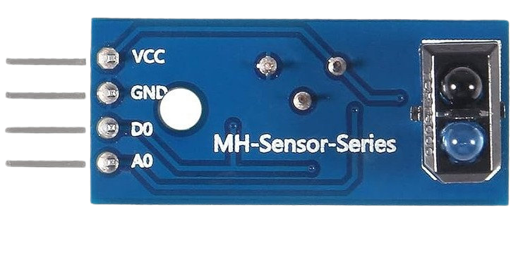
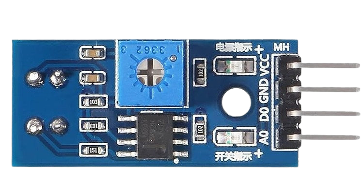
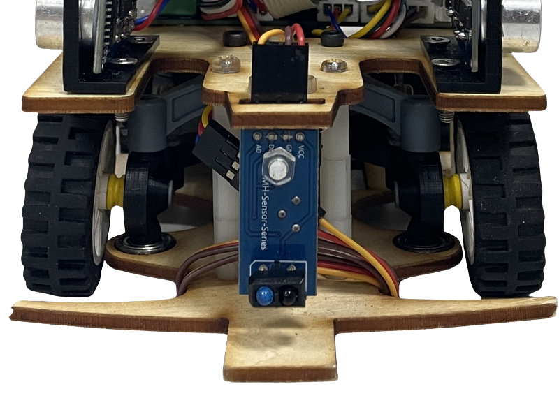
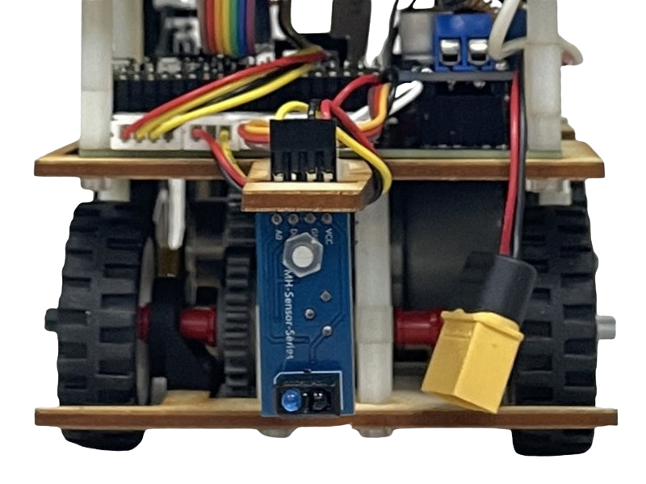

<div align="center"></div>

## <div align="center">Introduction to TCRT5000 Infrared Line Tracking Sensor</div>

The TCRT5000 is a prevalent Infrared Reflective Sensor that integrates an Infrared Emitting Diode (IR LED) and a Phototransistor. Its operation involves the IR LED transmitting invisible light. When this light reflects off a nearby object's surface and is detected by the receiver, the sensor determines the presence of the object.

<div align="center" width=100%>
<table  align="center">
  <tr>
  <TH>Top View
  </TH>
  <TH>Bottom View
  </TH>
  </tr>
  <tr>
  <td align="center">
    
  </td>
  <td align="center" >
  
  </td>
   </tr>
  </table>
</div>

<div align=center width=100%>
    <table  align="center">
        <tr align="center">
            <th colspan=2>TCRT5000 Infrared Sensor Placement Diagram on Vehicle</th>
        </tr>
        <tr align="center">
            <th>Front</th>
            <th>Rear</th>
        </tr>
        <tr>
            <td align="center"></td>
            <td align="center"></td>
        </tr>
    </table>
</div>

- ### Wiring steps for connecting the TCRT5000 to the Raspberry Pi Pico W:

    * The **GND** pin of the TCRT5000 is connected to a **Ground (GND) pin** on the Raspberry Pi Pico W.
    * The **A0** (Analog Output) pin of the TCRT5000 is connected to the following **GPIO pins** on the Raspberry Pi Pico W:
        * **GPIO 26 (Front)**
        * **GPIO 27 (Rear)**

    * The following code is written in **MicroPython** and presented in a **class structure** to allow the Raspberry Pi Pico W to read the **infrared reflection voltage signal** from the TCRT5000 line-following sensor.

- ### MicroPython Code
    ```python
    class TCRT5000:
        def __init__(self, adc_pin):
            try:
                self.adc = ADC(Pin(adc_pin))
            except:
                self.adc = None

        def read_raw(self):
            try:
                return self.adc.read_u16()
            except:
                return -1

        def read_percentage(self):
            try:
                raw = self.read_raw()
                if raw == -1:
                    return -1
                percentage = (raw / 65535) * 100
                return round(percentage, 1)
            except:
                return -1
    ```

- ### Example usage
    ```python
    if __name__ == "__main__":
        sensor = TCRT5000(adc_pin=26)
        while True:
            raw_val = sensor.read_raw()
            percent = sensor.read_percentage()
            print("Raw ADC:", raw_val, " Reflection intensity:", percent, "%")
            time.sleep(0.2)
    ```

- ### Explanation
    This code includes a class named TCRT5000, which is designed to measure infrared reflection intensity by defining the Analog Output (A0) pin. The read_raw() method returns the raw ADC value, while the read_percentage() method returns the reflection intensity as a percentage (0~100%), which can be used to determine a black line or a white line. If an error occurs during the reading process, the method can return -1.

# <div align="center">[Return Home](../../)</div> 
