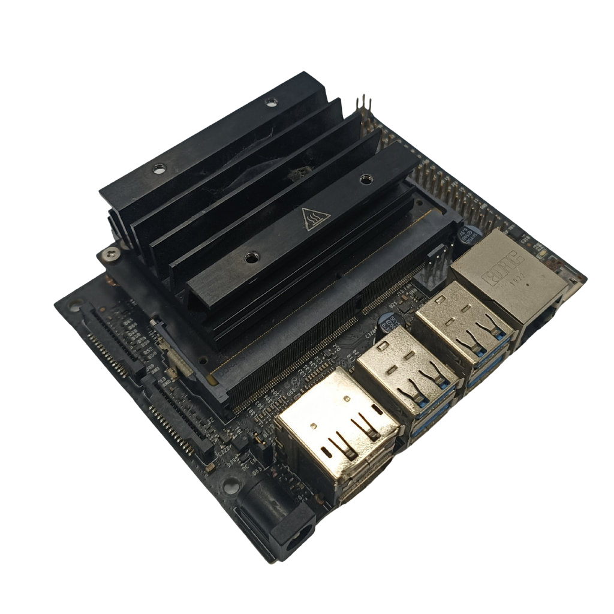
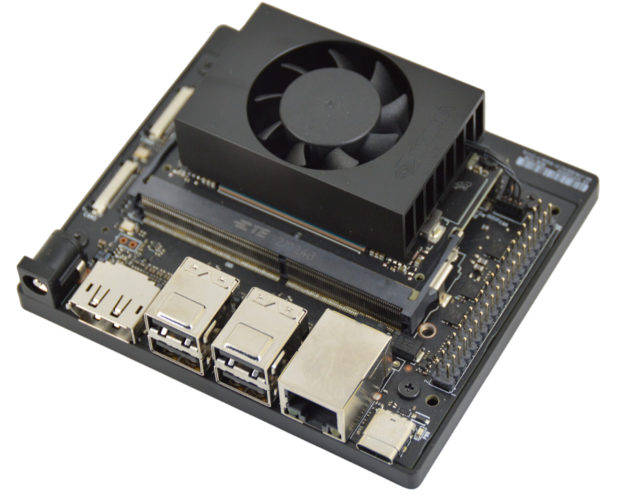

# 
Controller Selection-控制器選擇 
 
Jetson Nano 和 Jetson Orin Nano 作為Nvidia研發的嵌入式邊緣AI產品，都擁有卓越的AI運算能力，因為同時擁有GPIO腳位，因此很適合拿來開發智慧家居、自駕車、DIY專案等...。

## Jetson Nano & Jetson Orin Nano Controller
Jetson Nano 與 Jetson Orin Nano 控制器比較，比較結果如以下表格：

<table> 
<tr> 
<th rowspan="2" width=300>Photo(照片)</th> 
<th>
Nvidia Jetson Nano</th> 
<th>
Nvidia Jetson Orin Nano</th> 
</tr>
<tr> 
<td>

</td> 
<td>

</td> 
</tr>
<tr> 
<th>Number of Pins(腳位數量)</th>
<td>40P</td> 
<td>40P</td>
</tr>
<tr>
<th>CPU</th>
<td>Quad-core ARM® Cortex®-A57 MPCore</td>
<td>6-core Arm® Cortex®-A78AE V8.2 64-bit CPU</td>
</tr>
<tr>
<th>GPU</th>
<td>NVIDIA Maxwell™ architecture with 128 NVIDIA CUDA® cores</td>
<td>NVIDIA Ampere architecture with 1024 NVIDIA CUDA® cores</td>
</tr>
<tr>
<th>Storage Space(儲存空間)</th>
<td>4 GB 64-bit LPDDR4</td>
<td>8 GB 128-bit LPDDR5</td>
</tr>
<tr>
<th>Built-in Bluetooth and Wireless WiFi Connectivity(內建藍牙與無線 WiFi 連接功能)</th>
<td>Requires external Bluetooth and wireless WiFi connectivity</td>
<td>Requires external Bluetooth and wireless WiFi connectivity</td>
</tr>
<tr>
<th>Gflops(每秒千兆次浮點運算)</th>
<td>472</td> <td>40,000 (FP16)</td>
</tr>
<tr>
<th>Price(價格)</th>
<td>Expensive</td>
<td>Very Expensive</td>
</tr>
</table>

  根據去年世界賽和今年全國選拔賽的經驗以及世界冠軍得主的機型，並結合以下控制器優缺點比較。我們發現Jetson Oein Nano在影像處理方面明顯優於 Jetson Nano 及 Raspberry Pi4。因此我們決定在2025年WRO世界錦標賽中使用Jetson Orin Nano作為主要控制器。

  Based on last year’s unsuccessful experience and the world championship-winning model, along with the comparison of advantages and disadvantages of the controllers below, we found that the Jetson Nano significantly outperforms the Raspberry Pi 4 in image recognition. Therefore, we decided to use the Jetson Nano as the main controller in the 2025 WRO World Championship.

 ***
- ### Supplementary Information-補充資訊
#### 這是我們對 Jetson Nano 和 Jetson Orin Nano 的比較。
### 中文:
  ##### 1. Hardware Architecture / 硬體架構
Jetson Nano：配備四核心 ARM Cortex-A57 處理器和 128 核心的 NVIDIA Maxwell GPU，搭載 4GB LPDDR4 記憶體。

Jetson Orin Nano：配備8核心 NVIDIA Carmel ARMv8.2 處理器和 1024核心的 NVIDIA Ampere GPU，搭載 8GB LPDDR5 記憶體。

  ##### 2. Deep Learning Acceleration / 深度學習加速
Jetson Nano：支援 NVIDIA CUDA 和 cuDNN，可加速深度學習工作負載。對於影像分類與物體偵測等任務，Jetson Nano 的 GPU 可顯著提升處理速度。

Jetson Orin Nano：支援最新一代 NVIDIA CUDA、cuDNN 和 TensorRT，可高效加速深度學習推理與訓練工作負載。對於即時影像分割、多感測器融合與複雜的 Transformer 模型等任務，Jetson Orin Nano 的 Ampere 架構 GPU 與專用 Tensor Core 可提供較前代提升 80 倍的 AI 運算性能。

  ##### 3. OpenCV Performance / OpenCV 效能
Jetson Nano：由於支援 CUDA，處理基於深度學習的影像辨識任務表現更佳。OpenCV 可利用 NVIDIA GPU 加速影像處理操作。

Jetson Orin Nano：憑藉新一代 CUDA 核心與專用 Tensor Core，在處理複雜深度學習模型（如 Transformer 和 3D 視覺任務）時表現卓越。OpenCV 可透過 NVIDIA GPU 實現硬體加速，並支援最新的 AI 影像處理演算法。

  ##### 4. Power Consumption / 功耗
Jetson Nano：功耗較高，在一般使用情況下約為 5W 至 10W，若使用 GPU 加速，功耗會更高。

Jetson Orin Nano：搭载新一代Ampere架构，能效比显著提升。在典型AI工作负载下功耗约为7W至15W，支持动态功耗管理，在提供强大算力的同时保持优异的能效表现。

  ##### 5. Performance Comparison in Actual Application Scenarios / 實際應用場景下的效能比較
Jetson Nano：使用 OpenCV 搭配 DNN 模組進行即時物體偵測、影像分類等任務時，其速度明顯優於 Raspberry Pi 4。在 CUDA 加速下，Jetson Nano 可更快處理視訊串流並即時進行推論。

Jetson Orin Nano：搭载新一代GPU架构和Tensor Core，在运行OpenCV DNN模块进行高精度物体检测、语义分割等任务时，性能大幅领先前代产品。借助CUDA和TensorRT加速，可实时处理4K多路视频流，并支持更复杂的AI模型推理。

  ##### 6. Development Ecology / 開發生態系
Jetson Nano 的開發生態系專為 AI 與電腦視覺任務設計，NVIDIA 提供 JetPack SDK，其中包含優化後的 OpenCV，方便開發者快速部署深度學習模型。

Jetson Orin Nano 的開發生態系統全面升級，專為新一代 AI 與自主機器應用設計。NVIDIA 提供 JetPack SDK 5.1+，其中包含深度優化的 OpenCV 與 TensorRT 8.0，支援自動模型量化與硬體級加速，讓開發者能夠高效部署複雜的深度學習模型與多感測器融合應用。
### 英文:
#### Here's our comparison of the jetson nano and the Raspberry Pi
  #### 1. Hardware architecture
   - Jetson Nano: Equipped with a quad-core ARM Cortex-A57 CPU and a 128-core NVIDIA Maxwell GPU, with 4GB LPDDR4 memory.
   - Raspberry Pi 4: Equipped with a quad-core ARM Cortex-A72 CPU, with a maximum memory option of 8GB, but lacks a dedicated GPU.
  #### 2. Deep learning acceleration
   - Jetson Nano: Supports NVIDIA CUDA and cuDNN, which can accelerate deep learning workloads. For tasks like image classification and object detection, the GPU in Jetson Nano significantly enhances processing speed.
   - Raspberry Pi 4: Lacks a dedicated GPU and deep learning acceleration capabilities; image recognition tasks rely entirely on CPU processing, which is far less efficient than the GPU acceleration of Jetson Nano.
  #### 3. OpenCV performance
   - Jetson Nano：Due to its CUDA support, it performs better when processing image recognition tasks based on deep learning. OpenCV can take advantage of NVIDIA GPUs to accelerate image processing operations.
   - Raspberry Pi 4：Processing power relies on the CPU, so it is slower when faced with the same tasks. For simple image processing tasks, the Pi 4's CPU is also capable, but its efficiency will significantly lag behind when handling more complex neural network inference.
  #### 4. Power consumption
   - Jetson Nano：The power consumption is large, about 5W - 10W in typical usage scenarios, especially when using GPU for acceleration, the power consumption will be higher.
   - Raspberry Pi 4：The power consumption is low, usually about 3.5W - 7W, which is suitable for application scenarios that are sensitive to power consumption requirements.
  #### 5. Performance comparison in actual application scenarios
   - Jetson Nano：When using OpenCV and DNN modules for real-time object detection, image classification and other tasks, the speed is significantly better than Raspberry Pi 4. With CUDA acceleration, Jetson Nano can process video streams faster and perform on-the-fly inference.
   - Raspberry Pi 4：It is suitable for processing tasks that do not require high performance, such as simple image processing operations or non-real-time image recognition tasks.
  #### 6. Development ecology
   - Jetson Nano's development ecosystem is specially designed for AI and computer vision tasks. There is JetPack SDK provided by NVIDIA, which includes optimized OpenCV to facilitate developers to quickly deploy deep learning models.
   - Although Raspberry Pi 4 also supports OpenCV, it lacks dedicated hardware acceleration and its support for complex deep learning tasks is not as good as Jetson Nano.

# 
[Return Home](../../)
 
