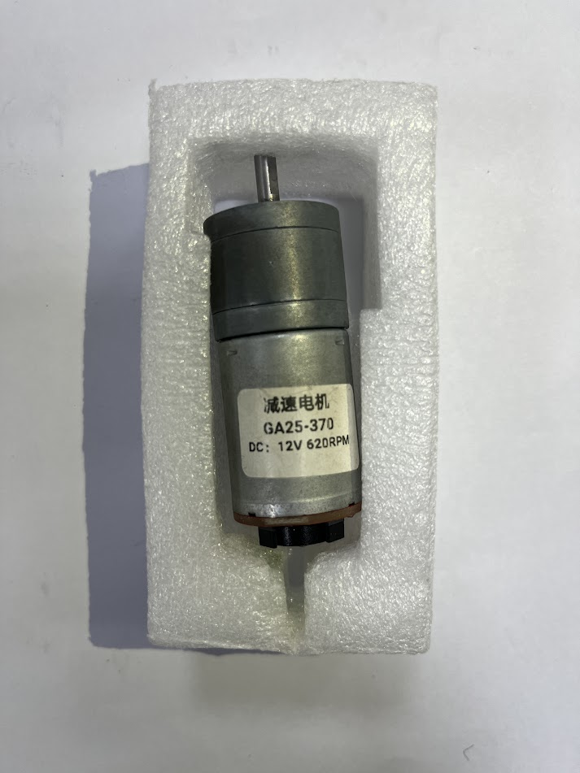

# 
 Motor Selection-馬達選擇
 
為了確保車輛能順利運行，選擇合適的驅動馬達至關重要。
控制車輛移動的馬達包括轉向馬達與後輪驅動直流馬達。
以下是我們在選擇這些馬達時的考量與決策：

To ensure smooth vehicle operation, choosing the right drive motors is essential. The motors responsible for controlling the vehicle’s movement include the steering motor and the rear-drive DC motor. Below are our considerations and decisions in selecting these motors:
### 中文:
- 轉向馬達選擇
在選擇轉向馬達時，我們優先考慮了馬達的精度與扭力。由於轉向系統需要精準地控制轉向角度，因此我們選擇了能提供高精度控制的伺服馬達，以確保轉向操作時的穩定性與靈活性。

- 後驅直流馬達選擇
後驅直流馬達負責提供車輛的驅動動力，因此我們著重其功率與扭力表現，以確保車輛在不同地形與障礙物下都有足夠的驅動力。此外，為了提升行駛效率，我們選擇了高功率密度的直流馬達，確保比賽期間的加速性與行駛穩定性。

- 透過對這兩種馬達的精心選擇，我們有效提升了車輛的整體性能，也改善了去年在動力傳輸與轉向控制方面所遇到的問題。

- 前輪伺服轉向機構
MG90S 與 SG90 是在台灣常見且易於購買的伺服馬達，其重量、旋轉角度與扭力等規格符合我們的需求。

- 考量耐用性，我們選擇了採用金屬齒輪的 MG90S 作為比賽使用的轉向控制馬達，以確保在高強度操作下的穩定性與可靠性。
### 英文:
- Steering Motor Selection
When choosing the steering motor, we prioritized motor precision and torque. Since the steering system requires precise control of the steering angle, we selected a servo motor capable of providing high-precision control, ensuring stable and flexible operation during steering maneuvers.

- Rear-Drive DC Motor Selection
The rear-drive DC motor provides the vehicle’s driving power, so we focused on its power and torque performance to ensure sufficient power for various terrains and obstacles. Additionally, to improve driving efficiency, we chose a high-power-density DC motor, ensuring optimal acceleration and driving stability during the competition.

Through careful selection of these two motors, we enhanced vehicle performance and addressed last year's challenges related to power transmission and steering control.

### Front Steering Mechanism by Servo Motor-使用伺服馬達的前輪轉向機構
### 中文:
- MG90S 與 SG90 是在台灣市面上常見且容易購買的伺服馬達。它們的重量、旋轉角度與扭力等規格均符合我們的需求。
- 考量到耐用性，我們選擇了採用金屬齒輪的 MG90S 作為比賽中的轉向控制馬達，以確保在高強度操作下的穩定性與可靠性。
### 英文:
- The MG90S and SG90 are commonly available and easy-to-purchase servo motors in Taiwan. Their specifications, including weight, rotation angle, and torque, meet our requirements.
- Considering durability, we selected the __MG90S__ with metal gears as the steering control motor for the competition to ensure stability and reliability during high-intensity operation.

<table>
<tr><th colspan="3" width ="100%">Servo Motor Comparison-伺服馬達比較</th></tr>
<tr align="center">
<th rowspan="2"  ">Model-型號</th>
<th >MG90S</th>
<th >SG90</th>
</tr>
<tr align="center">
<td ></td>
<td > </td>
</tr>
<tr align="center">
<td>Rotation Angle(旋轉角度)</td>
<td>90° MAX</td>
<td>360° MAX</td>
</tr>
<tr align="center">
<td>Torque(扭力)</td>
<td>2.0kg/cm</td>
<td>1.4 kg/cm</td>
</tr>
<tr align="center">
<td>Speed(速度)</td>
<td>0.11s</td>
<td>0.1S</td>
</tr>
<tr>
<tr align="center">
<td>Material(材質)</td>
<td>Metal copper gears</td>
<td>Plastic gears</td>
</tr>
</table>

### Rear-Drive DC Motor-後驅直流馬達
在市場上常見的直流馬達中，選擇時考慮了重量、轉速和扭力等因素，我們挑選出以下四款適合的直流馬達。

其中三款 JGA25 系列馬達型號不同，但外觀相似，其差異如下。

- When selecting a DC motor among commonly available options in the market, considering factors such as weight, rotational speed, and torque, we have identified the following four suitable DC motors.
- Among them, the three types of motors, JGA25, have different model numbers but share a similar physical appearance, and their differences are as follows.

<table>
<tr ><th colspan="8">DC Motor Comparison-直流馬達比較</th></tr>
<tr align="center">
<th rowspan="2" >Model</th>
<th >JGA25 370</th>
<th >MG513-P20</th>
<th >MG513-P30</th>
<th >JGB37-520</th>
</tr>
<tr align="center">
<td ></td>
<td colspan="2"></td>
<td ></td>
</tr>
<tr align="center">
<td >Reduction ratio(減速比)</td> 
<td >9.6</td>
<td >20</td>
<td >30</td>
<td >19</td>
</tr>
<tr align="center">
<td >Speed(速度)</td> 
<td >620rpm</td>
<td >549rpm</td>
<td >366rpm</td>
<td >530rpm</td>
</tr>
<tr align="center">
<td>Torque(扭力)</td>
<td>0.22kg.cm</td>
<td>0.66kg.cm</td>
<td>1kg.cm</td>
<td>2.2kg.cm</td>
</tr>
</table>

Reference Link：
[JGA25 370](https://img.alicdn.com/imgextra/i2/1816775355/O1CN01CzcWlm1pQdvWW5V7g_!!1816775355.jpg)
[MG513    ](https://img.alicdn.com/imgextra/i4/723377223/O1CN01KXs4PS23EBmTEHNLS_!!723377223.jpg)
[JGB37-520](https://img.alicdn.com/imgextra/i2/1991552278/O1CN01dCTXFL1ShMoMXovK4_!!1991552278.png)
如上表所示，我們原本計劃使用先前選定的直流馬達 JGA25，但因新設計底盤空間有限，無法容納。因此，我們選擇比較體積較短的 MG513 和 JGB37 馬達，並進行相關實驗。

經過考慮馬達的速度、扭力、與車體結構的相容性以及實際實驗結果後，我們選擇了 MG513-P20 作為車輛的後輪驅動直流馬達。

- As shown in the table above, we initially planned to use the previously selected DC motor, JGA25, but due to space constraints in the newly designed chassis, it could not be accommodated. Therefore, we chose to compare the shorter MG513 and JGB37 motors and conducted relevant experiments.
- After considering the motor’s speed, torque, compatibility with the vehicle structure, and actual experimental results, we selected the __MG513-P20__ as the rear-wheel drive DC motor for the vehicle.

### Motor Drive Controller-馬達驅動控制器
由於直流馬達需要馬達驅動控制器來實現車輛的前進和後退控制，我們針對台灣市場常見的 L293D IC、L298N 模組及 TB6612FNG 模組進行實驗測試，以找出最合適的驅動方案。

如下面表格所示，在滿足條件下，L293D IC 最符合我們的需求，考量了車輛的尺寸與重量。

- Since the DC motor requires a motor driver controller to achieve forward and reverse control of the vehicle, we 
 the commonly available L293D IC, L298N module, and TB6612FNG module on the Taiwan market for experimental testing to find the most suitable driving solution.   
- __As shown in the table below, under the conditions met, the L293D IC best meets our requirements, considering the vehicle’s size and weight..__

<table>
<tr><th colspan="4">Motor Control Comparison-馬達控制器比較</th></tr>
<tr align="center" >
<th rowspan="2">Model(型號)</th>
<th>L293D</th>
<th>L298N</th>
<th>TB6612FNG</th>
</tr>
<tr align="center">
<td> </td>
<td ></td>
<td ></td>
</tr>
<tr align="center">
<td>Occupied Area(mm) (佔用面積（毫米）)</td>
<td>29.5x8</td>
<td>43.5x43.5</td>
<td>20.5x20.4</td>
</tr>
<tr align="center">
<td>Output Voltage(輸出電壓)</td>
<td>4.5V to 36V</td>
<td>5V to 46V</td>
<td>2.5V to 13.5V</td>
</tr>
<tr align="center">
<td>Rated Power(額定功率) </td>
<td>5W</td>
<td>10W</td>
<td>1.36W</td>
</tr>
</table>

***
- ### Supplementary information-補充資訊
### 中文:
  #### 馬達驅動控制器介紹
  1. L293D 驅動晶片
      功能：L293D 是四通道驅動晶片，適合驅動直流馬達與步進馬達。每個通道可獨立控制一個馬達。

      電壓範圍：輸出電壓最高可達36V，最大電流為600mA。

      特點：內建二極體，提供過流與反向電壓保護，適合小型機器人專案。

      優點：性價比高且應用廣泛，適用於驅動較小型馬達。

  2. L298N 驅動模組
      功能：L298N 可同時控制兩個直流馬達或一個步進馬達。模組通常附帶散熱片以協助散熱。

      電壓範圍：最大輸入電壓可達46V，單通道峰值電流可達2A。

      特點：內建反向電壓保護二極體，支持PWM速度控制，適合中型機器人與馬達專案。

      優點：提供較高輸出電流和更寬的工作電壓範圍，適合需要較大功率的馬達。

  3. TB6612FNG 驅動模組
      功能：TB6612FNG 支持驅動兩個直流馬達。此模組效率較高，體
      積較小，且能提供較高輸出電流。

      電壓範圍：支持2.5V到13.5V輸入電壓，單通道最大持續電流為1.2A，峰值電流3.2A。

      特點：功耗低且輸出效率高，支持內建PWM控制功能。

      優點：內阻低且發熱少，適合小型和中型機器人專案及低功耗系統。
### 英文:
  #### Introduction to Motor Driver Controllers
  #### 1.L293D Driver Chip
  - __Function__: The L293D is a quad-channel driver suitable for driving DC motors and stepper motors. Each channel can independently control one motor.
  - __Voltage Range__: The output voltage can reach 36V, and the maximum current is 600mA.
  - __Features__: It has built-in diodes, providing overcurrent and reverse voltage protection, making it suitable for small robot projects.
  - __Advantages__: High cost-performance ratio and widely applicable, suitable for driving smaller motors.

    #### 2.L298N Driver Module
  - __Function__: The L298N is a driver that can simultaneously control two DC motors or one stepper motor. The module usually comes with a heat sink to assist with cooling.
  - __Voltage Range__: The maximum input voltage can reach 46V, and the peak current can reach 2A per channel.
  - __Features__: It includes built-in reverse voltage protection diodes and supports PWM speed control, making it suitable for medium-sized robot and motor projects.
  - __Advantages__: Provides high output current and a wider operating voltage range, suitable for motors requiring higher power.

    #### 3.TB6612FNG Driver Module
  - __Function__: The TB6612FNG is a driver that supports two DC motors. This module is more efficient, smaller in size, and can provide higher output current.
  - __Voltage Range__: It supports input voltages from 2.5V to 13.5V, with a maximum continuous current of 1.2A per channel and a peak current of 3.2A.
  - __Features__: It has lower power consumption and higher output efficiency, and supports built-in PWM control functions.
  - __Advantages__: With low internal resistance and minimal heat generation, it is suitable for small and medium-sized robot projects, as well as systems with low power consumption requirements.

# 
[Return Home](../../)
  
