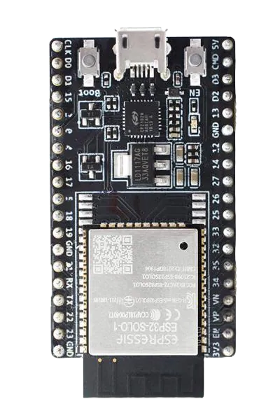

## 
Motor & Sensor Intermediate I/O controller Selection-馬達與感測器中介輸入輸出控制器選擇 
 
### 中文:
- 在審查Jetson Nano的輸入輸出控制能力後，我們發現以下缺點：

__處理限制：__ 雖然Jetson Nano在處理AI和機器學習任務上表現出色，但其CPU相對有限，當同時執行大量I/O控制任務和複雜運算時，可能會遇到性能瓶頸。

__GPIO延遲：__ 與專用微控制器（如Arduino、ESP32等）相比，Jetson Nano使用Python或其他高階語言控制GPIO時延較高，影響對高即時性要求的應用。

__硬體介面數量有限：__ Jetson Nano提供的GPIO腳位數量較少，若需要大量I/O介面，可能需使用擴展板，增加開發成本與複雜度。

__電壓不相容：__ Jetson Nano的GPIO通常為3.3V，可能與部分5V的I/O裝置不相容，需使用電壓轉換器進行電平匹配。

由於Jetson Nano無法同時處理太多感測器，因此我們需要使用額外的微控制器作為擴展板，以便更有效率地在感測器與Jetson Nano主控器間進行訊號通訊。

在台灣常用的Raspberry Pi Pico與ESP32 WiFi這兩款微控制器板，皆具備良好的感測器資料與馬達控制能力。

為方便選擇最適合我們自駕車的中介I/O控制器，我們將針對這兩款裝置的規格與成本進行比較分析。
### 英文:
- After reviewing the I/O control aspects of the Jetson Nano, we identified the following drawbacks:
  - __Processing Limitations:__ While the Jetson Nano excels in handling AI and machine learning tasks, its CPU is relatively limited and may face performance bottlenecks when performing extensive I/O control tasks, especially when handling complex computations and I/O operations simultaneously.
  - __GPIO Latency:__ Compared to dedicated microcontrollers (such as Arduino, ESP32, etc.), the Jetson Nano may have higher latency when using Python or other high-level languages for GPIO control, which affects applications requiring high real-time performance.
  - __Limited Hardware Interfaces:__ The number of GPIO pins provided by the Jetson Nano is relatively limited. If a large number of I/O interfaces are needed, expansion boards may be required, increasing development costs and complexity. 
  - __Voltage Incompatibility:__ The GPIO on the Jetson Nano typically operates at 3.3V, which can be incompatible with some 5V I/O devices, necessitating the use of voltage converters for level matching.

- Due to the Jetson Nano's inability to handle too many sensors simultaneously, we need to use additional microcontrollers as extension boards to facilitate more efficient signal communication between the sensors and the Jetson Nano main controller.
- The Raspberry Pi Pico and ESP32 WiFi, two commonly used microcontroller boards in Taiwan, are well-equipped to handle sensor data and motor control tasks.
- To facilitate the selection of the optimal intermediate I/O controller for our autonomous vehicle, we will conduct a comparative analysis of the specifications and costs of these two options.

### Raspberry Pi Pico & Esp32 wifi Controller -Comparison-Raspberry Pi Pico 與 ESP32 WiFi 控制器比較
以下是兩者的規格比較：

Here is a specification comparison between the two:

<table>
<tr>
<th rowspan="2" width=200>
Photo(照片)</th>
<th width=200>
Raspberry Pi Pico2 WH</th>
<th width=200>
Raspberry Pi Pico</th>
<th width=200>
Esp32 wifi</th>
</tr><tr>
<td>
</td>
<td>
</td>
<td>
</td>
</tr><tr>
<th>CPU</th>
<td>Dual Arm Cortex-M33 or dual RISC-V Hazard3 processors @ 150MHz</td>
<td>Dual-core ARM Cortex-M0+ @ 133 MHz</td>
<td>Dual-core Xtensa LX6 @ 160/240 MHz</td>
</tr>
<tr>
<th>RAM</th>
<td>520 KB SRAM</td>
<td>264 KB SRAM</td>
<td>520 KB SRAM</td>
</tr>
<tr>
<th>WIFI</th>
<td>2.4GHz 802.11n wireless LAN and Bluetooth 5.2</td>
<td>None</td>
<td>Wi-Fi 802.11b/g/n (2.4 GHz), Bluetooth (v4.2)</td>
</tr>
<tr>
<th>Storage</th>
<td>4 MB Flash</td>
<td>2 MB Flash</td>
<td>Supports external Flash (typically 4 MB to 16 MB)</td>
</tr>
<tr>
<th>GPIO</th>
<td>26 GPIO pins</td>
<td>26 GPIO pins</td>
<td>34 GPIO pins</td>
</tr>
<tr>
<th>ADC</th>
<td>1-channel ADC (12-bit).</td>
<td>3-channel ADC (12-bit).</td>
<td>18-channel ADC (12-bit).</td>
</tr>
<tr>
<th>PWM</th>
<td>Configurable PWM output.</td>
<td>Configurable PWM output.</td>
<td>Supports multi-channel PWM</td>
</tr>
<tr>
<th>Data transmission interface</th>
<td>I2C, SPI, UART</td>
<td>I2C, SPI, UART</td>
<td>I2C, SPI, UART, CAN, I2S</td>
</tr>
<tr>
<th>Voltage input</th>
<td>1.8V - 5.5V</td>
<td>1.8V - 5.5V</td>
<td>2.2V - 3.6V</td>
</tr>
<tr>
<th>size</th>
<td>51 x 21 mm</td>
<td>51 x 21 mm</td>
<td>18 x 25 mm</td>
</tr>
<tr>
<th>Price</th>
<td>cheap</td>
<td>cheap</td>
<td>Relatively expensive</td>
</tr>
<tr>
<th>Development environment</th>
<td>MicroPython、C/C++</td>
<td>MicroPython、C/C++</td>
<td>Arduino IDE、MicroPython、ESP-IDF</td>
</tr>
</tbody>
</table>

Raspberry Pi Pico2 WH 提供簡單性、低功耗與經濟實惠，同時因為擁有WIFI模塊可以跟 Jetson Orin Nano 之間建立 Web Sucks 通訊，所以我們選擇 Raspberry Pi Pico2 WH 作為 Nvidia Jetson Orin Nano 的中繼控制器，負責管理馬達及感測器。

The Raspberry Pi Pico  offers simplicity, low power consumption, and affordability, making it ideal for applications with low wireless demands. It also aligns well with the requirements of this competition. Therefore, we have chosen the Raspberry Pi Pico as a relay management controller for the Nvidia Jetson Nano, responsible for managing motors and sensors.

 ***
- ### Supplementary Information-補充資訊
### 中文:
 __Thonny 軟體介紹__
 - 在本次競賽中，我們選擇使用 Thonny 軟體來撰寫 Raspberry Pi Pico2 WH 控制板的程式。

 - 由於 MicroPython 對多種微控制器（如 Raspberry Pi Pico2 WH、Raspberry Pi Pico、ESP8266、ESP32 等）具有專用支援，使得這些板子的開發更加方便。因此，我們選擇 Thonny 作為開發工具。Thonny 不僅支援 MicroPython 開發，還能直接連接微控制器板，使編寫、測試及除錯程式更加簡便。這種組合簡化了開發流程，並能快速在硬體上部署和驗證程式。  
### 英文:
  __Introduction to  Thonny software__
  - In this competition, we chose to use Thonny software to write programs for the Raspberry Pi Pico control board.
  - Due to MicroPython's dedicated features for various microcontrollers (such as the Raspberry Pi Pico, ESP8266, ESP32, etc.), development on these boards becomes more convenient. Therefore, we chose Thonny as our development tool. Thonny not only supports MicroPython development but also allows direct connection to microcontroller boards, making it easier to write, test, and debug code. This combination simplifies the development process and enables quick deployment and verification of programs on the hardware.

  
    

    <table>
    <tr>
    <th>
Thonnry Website-Thonnry 網站</th>
    </tr><tr>
    <td>
</td>
    </tr>
    </table>
       
    <a href="https://thonny.org/">Thonnry Website</a>    
    

# 
[Return Home](../../)
 
