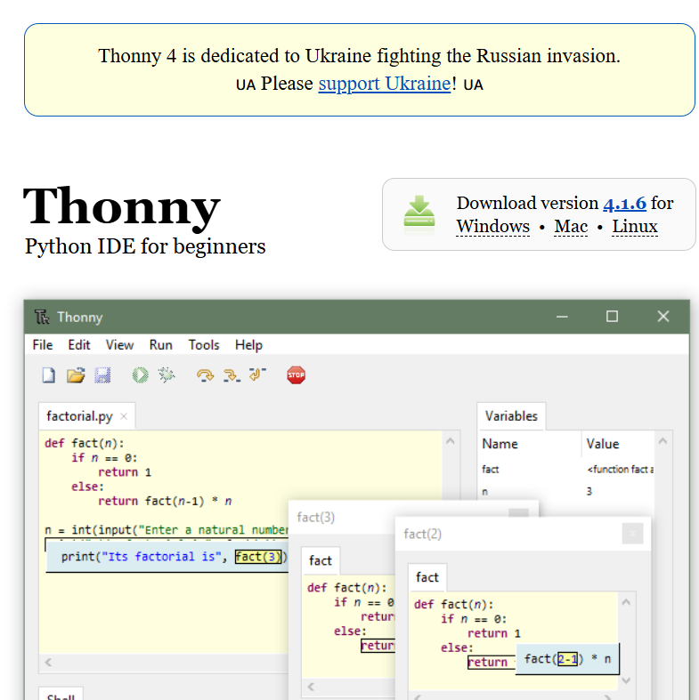

## 
Motor & Sensor Intermediate I/O controller Selection
 
- To maximize the sensing and computing performance of our vehicle in the WRO Future Engineers Self-Driving Car Challenge, we selected the Jetson Orin Nano as the main controller. However, a detailed analysis of its Input/Output (I/O) control capabilities revealed several critical technical bottlenecks:
  - Elevated GPIO Control Latency: Compared to dedicated microcontrollers (such as Arduino, ESP32, etc.), the Jetson Orin Nano exhibits higher time delays when controlling General-Purpose Input/Output (GPIO) via high-level languages like Python. This significantly impacts applications, such as Driving Motor  control, that demand high-level real-time responsiveness.
  - Limited Hardware Interface Resources: The number of GPIO pins provided by the Jetson Orin Nano is relatively scarce. If the project requires interfacing with a large number of sensors  or I/O components, it may necessitate the use of an external expansion board, which invariably increases development costs and the overall complexity of the system.
  - Voltage Incompatibility Challenge: The Jetson Orin Nano's GPIO typically operates under the 3.3V voltage standard. This voltage mismatch with some widely adopted 5V I/O devices requires the implementation of voltage converters for proper signal matching.

- In the Taiwanese market, the Raspberry Pi Pico, Raspberry Pi Pico W, and ESP32 WiFi development boards are popular choices, known for their excellent capabilities in sensor data handling and motor control.

- To select the most suitable intermediate I/O controller (sub-controller) for our vehicle's control program, we will conduct a detailed comparative analysis of the technical specifications and budgetary costs for these three common devices.

### Raspberry Pi Pico, Raspberry Pi Pico W and Esp32 wifi Controller

Here is a specification comparison among the three devices

<table>
<tr>
<th rowspan="2" width=200>
Photo</th>
<th width=200>
Raspberry Pi Pico W</th>
<th width=200>
Raspberry Pi Pico</th>
<th width=200>
Esp32 wifi</th>
</tr><tr>
<td>
</td>
<td>
</td>
<td>
</td>
</tr><tr>
<th>CPU</th>
<td>Dual-core Arm Cortex-M0+ @ 133 MHz</td>
<td>Dual-core ARM Cortex-M0+ @ 133 MHz</td>
<td>Dual-core Xtensa LX6 @ 160/240 MHz</td>
</tr>
<tr>
<th>RAM</th>
<td>520 KB SRAM</td>
<td>264 KB SRAM</td>
<td>520 KB SRAM</td>
</tr>
<tr>
<th>WIFI</th>
<td>2.4GHz 802.11n wireless LAN and Bluetooth 5.2</td>
<td>None</td>
<td>Wi-Fi 802.11b/g/n (2.4 GHz), Bluetooth (v4.2)</td>
</tr>
<tr>
<th>Storage</th>
<td>4 MB Flash</td>
<td>2 MB Flash</td>
<td>Supports external Flash (typically 4 MB to 16 MB)</td>
</tr>
<tr>
<th>GPIO</th>
<td>26 GPIO pins</td>
<td>26 GPIO pins</td>
<td>34 GPIO pins</td>
</tr>
<tr>
<th>ADC</th>
<td>1-channel ADC (12-bit).</td>
<td>3-channel ADC (12-bit).</td>
<td>18-channel ADC (12-bit).</td>
</tr>
<tr>
<th>PWM</th>
<td>Configurable PWM output.</td>
<td>Configurable PWM output.</td>
<td>Supports multi-channel PWM</td>
</tr>
<tr>
<th>Data transmission interface</th>
<td>I2C, SPI, UART</td>
<td>I2C, SPI, UART</td>
<td>I2C, SPI, UART, CAN, I2S</td>
</tr>
<tr>
<th>Voltage input</th>
<td>1.8V - 5.5V</td>
<td>1.8V - 5.5V</td>
<td>2.2V - 3.6V</td>
</tr>
<tr>
<th>size</th>
<td>51 x 21 mm</td>
<td>51 x 21 mm</td>
<td>18 x 25 mm</td>
</tr>
<tr>
<th>Price</th>
<td>cheap</td>
<td>cheap</td>
<td>Relatively expensive</td>
</tr>
<tr>
<th>Development environment</th>
<td>MicroPython、C/C++</td>
<td>MicroPython、C/C++</td>
<td>Arduino IDE、MicroPython、ESP-IDF</td>
</tr>
</tbody>
</table>

  
Based on the preceding analysis, we have ultimately decided to adopt the Raspberry Pi Pico W as the sub-controller (I/O control unit) within our NVIDIA Jetson Orin Nano system. This key technical decision is founded upon the following core advantages:
- **Excellent Cost-Effectiveness and I/O Expansion Capability:** The Pico W offers high cost-performance while providing sufficient and reliable GPIO pins, fully meeting the I/O expansion requirements of this project for integrating diverse sensors and driving motors.
- **Efficient WebSockets Communication Integration:** The Pico W's integrated Wi-Fi chip  perfectly aligns with our required technical architecture, enabling the establishment of a WebSockets data communication bridge between the Jetson Orin Nano (Host/Master) and the I/O Controller (Subordinate/Slave). This setup ensures that the Jetson Orin Nano can transmit control commands instantaneously and efficiently to the sub-controller, guaranteeing the precise execution of the vehicle's driving actions.

 ***
- ### Supplementary Information
### 中文:

  __Introduction to  Thonny software__
  - In this competition, we chose to use Thonny software to write programs for the Raspberry Pi Pico control board.
  - Due to MicroPython's dedicated features for various microcontrollers (such as the Raspberry Pi Pico, ESP8266, ESP32, etc.), development on these boards becomes more convenient. Therefore, we chose Thonny as our development tool. Thonny not only supports MicroPython development but also allows direct connection to microcontroller boards, making it easier to write, test, and debug code. This combination simplifies the development process and enables quick deployment and verification of programs on the hardware.

  
    

    <table>
    <tr>
    <th>
Thonny Website-Thonny 網站</th>
    </tr><tr>
    <td>
</td>
    </tr>
    </table>
       
    <a href="https://thonny.org/">Thonny Website</a>    
    

# 
[Return Home](../../)
 
