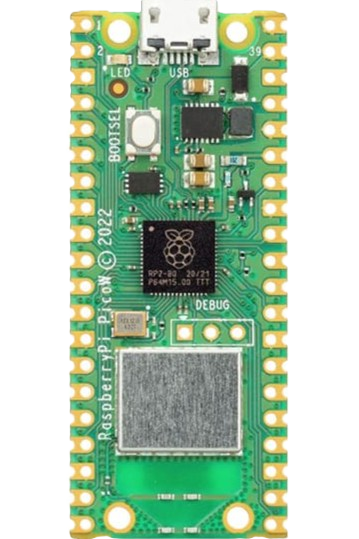

## 
Motor & Sensor Intermediate I/O controller Selection
 

為了在本次 WRO Future Engineers 自駕車挑戰賽中，能最大化車輛的辨識與運算效能，我們選用了 Jetson Orin Nano 作為主要控制器。然而，在深入分析其輸入/輸出（I/O）控制能力後，我們發現了以下幾項亟待解決的技術瓶頸：
- GPIO 控制延遲偏高： 相較於專用微控制器（如 Arduino、ESP32 等），Jetson Orin Nano 在透過 Python 等高階語言操控通用輸入/輸出（GPIO）時，會產生較高的時間延遲。這對於例如驅動馬達 2 控制等需要高度即時性反應的應用，造成明顯影響。
- 硬體介面資源受限： Jetson Orin Nano 提供的 GPIO 腳位數量相對稀少。若專案需要連接大量感測器 3 或 I/O 介面，可能必須額外採用擴展板，這將無可避免地增加開發成本與系統的整體複雜度。
- 電壓不相容挑戰： Jetson Orin Nano 的 GPIO 通常運行在 3V 電壓標準，這與部分廣泛使用的 5V I/O 裝置存在電壓差異，因此必須配置電壓轉換器才能進行信號匹配。鑑於 Jetson Orin Nano 在同步處理多重感測器訊號方面存在效率限制，我們決定引入額外的微控制器，作為專責的 I/O 擴展中介板。此舉旨在建立一個更高效的訊號通訊橋梁，連接感測器與 Jetson Orin Nano 主控制器。

在台灣市場上，Raspberry Pi Pico、Raspberry Pi Pico W 及 ESP32 WiFi 這三款微控制器板，都以其優異的感測器資料處理與馬達控制能力而廣受歡迎。

為了選出最適合我們車輛控制程式的中介 I/O 控制器(下位控制器)，我們將針對這三款常見裝置，進行詳細的技術規格與預算成本比較分析。

### 英文:
- To maximize the sensing and computing performance of our vehicle in the WRO Future Engineers Self-Driving Car Challenge, we selected the Jetson Orin Nano as the main controller. However, a detailed analysis of its Input/Output (I/O) control capabilities revealed several critical technical bottlenecks:
  - Elevated GPIO Control Latency: Compared to dedicated microcontrollers (such as Arduino, ESP32, etc.), the Jetson Orin Nano exhibits higher time delays when controlling General-Purpose Input/Output (GPIO) via high-level languages like Python. This significantly impacts applications, such as Driving Motor  control, that demand high-level real-time responsiveness.
  - Limited Hardware Interface Resources: The number of GPIO pins provided by the Jetson Orin Nano is relatively scarce. If the project requires interfacing with a large number of sensors  or I/O components, it may necessitate the use of an external expansion board, which invariably increases development costs and the overall complexity of the system.
  - Voltage Incompatibility Challenge: The Jetson Orin Nano's GPIO typically operates under the 3.3V voltage standard. This voltage mismatch with some widely adopted 5V I/O devices requires the implementation of voltage converters for proper signal matching.

- In the Taiwanese market, the Raspberry Pi Pico, Raspberry Pi Pico W, and ESP32 WiFi development boards are popular choices, known for their excellent capabilities in sensor data handling and motor control.

- To select the most suitable intermediate I/O controller (sub-controller) for our vehicle's control program, we will conduct a detailed comparative analysis of the technical specifications and budgetary costs for these three common devices.

### Raspberry Pi Pico, Raspberry Pi Pico W and Esp32 wifi Controller

Here is a specification comparison among the three devices

<table>
<tr>
<th rowspan="2" width=200>
Photo</th>
<th width=200>
Raspberry Pi Pico W</th>
<th width=200>
Raspberry Pi Pico</th>
<th width=200>
Esp32 wifi</th>
</tr><tr>
<td>
</td>
<td>
</td>
<td>
</td>
</tr><tr>
<th>CPU</th>
<td>Dual-core Arm Cortex-M0+ @ 133 MHz</td>
<td>Dual-core ARM Cortex-M0+ @ 133 MHz</td>
<td>Dual-core Xtensa LX6 @ 160/240 MHz</td>
</tr>
<tr>
<th>RAM</th>
<td>520 KB SRAM</td>
<td>264 KB SRAM</td>
<td>520 KB SRAM</td>
</tr>
<tr>
<th>WIFI</th>
<td>2.4GHz 802.11n wireless LAN and Bluetooth 5.2</td>
<td>None</td>
<td>Wi-Fi 802.11b/g/n (2.4 GHz), Bluetooth (v4.2)</td>
</tr>
<tr>
<th>Storage</th>
<td>4 MB Flash</td>
<td>2 MB Flash</td>
<td>Supports external Flash (typically 4 MB to 16 MB)</td>
</tr>
<tr>
<th>GPIO</th>
<td>26 GPIO pins</td>
<td>26 GPIO pins</td>
<td>34 GPIO pins</td>
</tr>
<tr>
<th>ADC</th>
<td>1-channel ADC (12-bit).</td>
<td>3-channel ADC (12-bit).</td>
<td>18-channel ADC (12-bit).</td>
</tr>
<tr>
<th>PWM</th>
<td>Configurable PWM output.</td>
<td>Configurable PWM output.</td>
<td>Supports multi-channel PWM</td>
</tr>
<tr>
<th>Data transmission interface</th>
<td>I2C, SPI, UART</td>
<td>I2C, SPI, UART</td>
<td>I2C, SPI, UART, CAN, I2S</td>
</tr>
<tr>
<th>Voltage input</th>
<td>1.8V - 5.5V</td>
<td>1.8V - 5.5V</td>
<td>2.2V - 3.6V</td>
</tr>
<tr>
<th>size</th>
<td>51 x 21 mm</td>
<td>51 x 21 mm</td>
<td>18 x 25 mm</td>
</tr>
<tr>
<th>Price</th>
<td>cheap</td>
<td>cheap</td>
<td>Relatively expensive</td>
</tr>
<tr>
<th>Development environment</th>
<td>MicroPython、C/C++</td>
<td>MicroPython、C/C++</td>
<td>Arduino IDE、MicroPython、ESP-IDF</td>
</tr>
</tbody>
</table>

綜合前述分析，我們最終決定採納 Raspberry Pi Pico W 作為 NVIDIA Jetson Orin Nano 系統中的下位控制器（I/O 控制單元）。此項關鍵技術決策基於以下核心優勢：
- **優異的成本效益與 I/O 擴展能力：** Pico W 不僅具備高性價比，同時提供充足且可靠的 GPIO 腳位 ，充分滿足本專案連接多樣化感測器和驅動馬達的 I/O 擴展需求。
- **高效的 WebSockets 通訊整合：** Pico W 內建的 Wi-Fi 晶片 完美契合我們的技術架構要求，能夠在 Jetson Orin Nano（主控端） 與 I/O 控制器（從屬端） 之間，建立 WebSockets 數據通訊橋梁。這使得 Jetson Orin Nano 能夠即時且高效地傳遞控制指令到下位控制器，確保車輛行進動作的精確執行 。

Based on the preceding analysis, we have ultimately decided to adopt the Raspberry Pi Pico W as the sub-controller (I/O control unit) within our NVIDIA Jetson Orin Nano system. This key technical decision is founded upon the following core advantages:
- **Excellent Cost-Effectiveness and I/O Expansion Capability:** The Pico W offers high cost-performance while providing sufficient and reliable GPIO pins, fully meeting the I/O expansion requirements of this project for integrating diverse sensors and driving motors.
- **Efficient WebSockets Communication Integration:** The Pico W's integrated Wi-Fi chip  perfectly aligns with our required technical architecture, enabling the establishment of a WebSockets data communication bridge between the Jetson Orin Nano (Host/Master) and the I/O Controller (Subordinate/Slave). This setup ensures that the Jetson Orin Nano can transmit control commands instantaneously and efficiently to the sub-controller, guaranteeing the precise execution of the vehicle's driving actions.

 ***
- ### Supplementary Information
### 中文:
 __Thonny 軟體介紹__
 - 在本次競賽中，我們選擇使用 Thonny 軟體撰寫 Raspberry Pi Pico W 控制板的程式。

 - 由於 MicroPython 對多種微控制器（如 Raspberry Pi Pico2 WH、Raspberry Pi Pico、ESP8266、ESP32 等）具有專用支援，使得這些板子的開發更加方便。因此，我們選擇 Thonny 作為開發工具。Thonny 不僅支援 MicroPython 開發，還能直接連接微控制器板，使編寫、測試及除錯程式更加簡便。這種組合簡化了開發流程，並能快速在硬體上部署和驗證程式。

### 英文:
  __Introduction to  Thonny software__
  - In this competition, we chose to use Thonny software to write programs for the Raspberry Pi Pico control board.
  - Due to MicroPython's dedicated features for various microcontrollers (such as the Raspberry Pi Pico, ESP8266, ESP32, etc.), development on these boards becomes more convenient. Therefore, we chose Thonny as our development tool. Thonny not only supports MicroPython development but also allows direct connection to microcontroller boards, making it easier to write, test, and debug code. This combination simplifies the development process and enables quick deployment and verification of programs on the hardware.

  
    

    <table>
    <tr>
    <th>
Thonny Website-Thonny 網站</th>
    </tr><tr>
    <td>
</td>
    </tr>
    </table>
       
    <a href="https://thonny.org/">Thonny Website</a>    
    

# 
[Return Home](../../)
 
