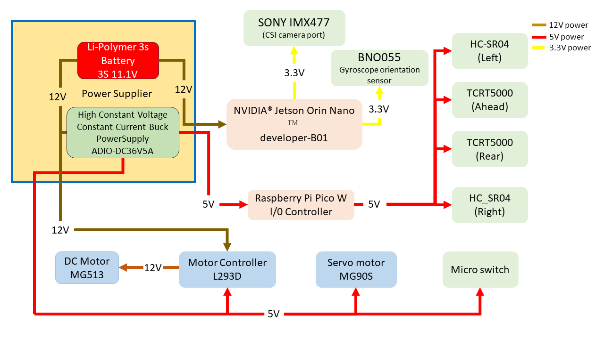

## 
Vehicle Power Supply System Introduction
 
- ###  Power Supply Operation System Overview Diagram
  

- ###  Physical Connection Diagram of Power Supply System
  

- ### Power Supply System Operation Instructions

  #### Detailed Description of System Power Configuration and Voltage Distribution

  The proper functioning of this system relies on supplying each electronic component with its **specific and stable operating voltage**. The overall power architecture is configured as follows:

  * **Main Power Input:** A **3S Lithium Polymer (LiPo) battery** is employed as the primary power source, delivering an output voltage of **12.6V**. This voltage directly powers the step-down module, the **Nvidia Jetson Orin Nano** control board, and the **L293D motor driver IC** for actuating the downstream **12V DC motor**.

  * **Secondary Step-Down and Regulation:** A **5V Constant Voltage/Constant Current (CV/CC) Buck Converter Module** is configured to precisely reduce the 12.6V input to **5V**. This **5V regulated power supply** is dedicated to components requiring this voltage, including:
      * Raspberry Pi Pico W
      * L293D Dual H-Bridge DC Motor Driver IC (for partial power supply or logic levels)
      * Ultrasonic Distance Sensor Module
      * Infrared (IR) Reflective Sensor Module
      * MG90S Front Wheel Servo Motor

  * **Logic Voltage Output:** The integrated voltage regulation mechanism of the **Nvidia Jetson Orin Nano** control board provides both **3V and 5V** outputs, dedicated to driving voltage-sensitive peripherals, such as:
      * BNO055 Gyroscope/Inertial Measurement Unit (IMU) (5V)
      * Camera Module (3.3V)

  **Conclusion:** Through this multi-layered voltage conversion and distribution scheme, the system design ensures that all critical electronic components operate stably and reliably at the **optimal voltage matching their specifications**.

---

# 
[Return Home](../../)
  

