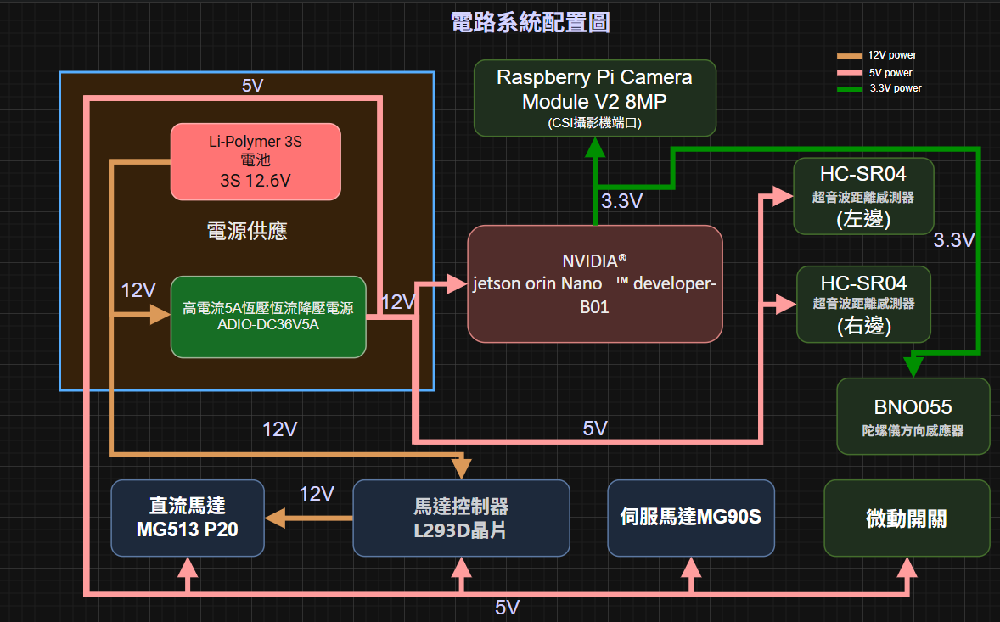

## 
Vehicle Power Supply System Introduction-車輛電源系統介紹
 
- ###  Power Supply Operation System Overview Diagram-電源系統運作概覽圖
  

- ###  Physical Connection Diagram of Power Supply System-電源系統實體連接示意圖
  

- ### Power Supply System Operation Instructions-電源系統操作說明
### 中文:
  每個電子元件皆需特定的工作電壓才能正常運作，配置如下：
    - 3S 鋰聚合物電池提供 11.1V 電壓，供電給降壓模組與 L293D 馬達驅動晶片，用於驅動 12V 直流馬達。
    - 5A 恆壓恆流降壓電源模組將 11.1V 降至 5V，為需要 5V 工作電壓的元件供電，包括 Nvidia Jetson Nano、Raspberry Pi Pico、L293D 雙 H 橋直流馬達驅動 IC、BNO055 陀螺儀方向感測器及 MG90S 前輪伺服馬達。
    - Nvidia Jetson Nano 控制板再提供 3.3V 電壓給攝影機模組。
    - Raspberry Pi Pico 控制板提供 3.3V 電壓給 HC-SR04 超聲波距離感測器。
    - 此配置確保所有元件均以其所需的工作電壓穩定運作。
  ### 英文:
  Each electronic component requires a specific operating voltage to function properly, and the configuration is as follows:
    - The 3S Li-Polymer battery provides 11.1V, which powers the buck converter module and the L293D motor control chip to drive the 12V DC motor.
    - The 5A constant voltage and constant current buck power module steps down the 11.1V to 5V, supplying power to components requiring a 5V operating voltage, including the Nvidia Jetson Nano, Raspberry Pi Pico, L293D dual H-bridge DC motor driver IC, BNO055 gyroscope orientation sensor, and the MG90S front steering servo motor.
    - The Nvidia Jetson Nano control board further supplies 3.3V to the camera module.
    - The Raspberry Pi Pico control board provides 3.3V to the HC-SR04 ultrasonic distance sensor.
  
  This configuration ensures all components operate stably at their required working voltages.

# 
[Return Home](../../)
  

