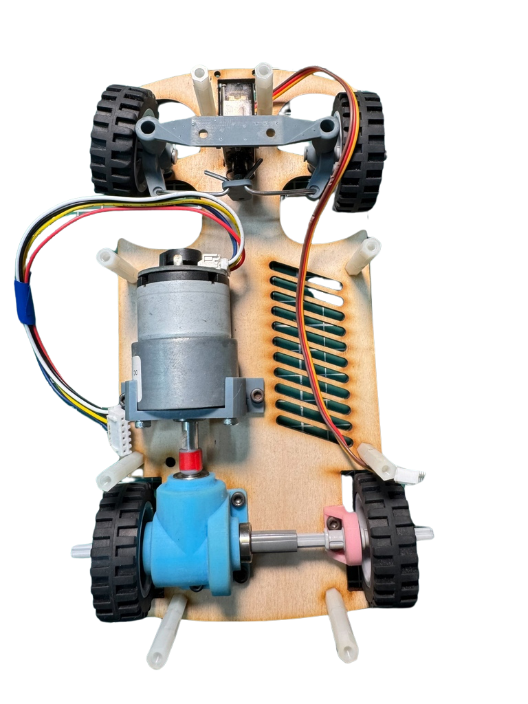
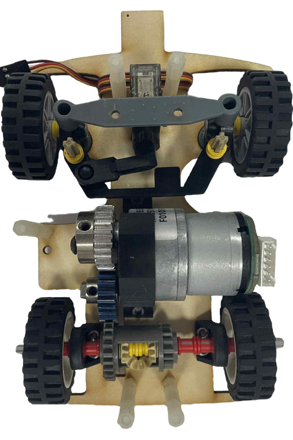
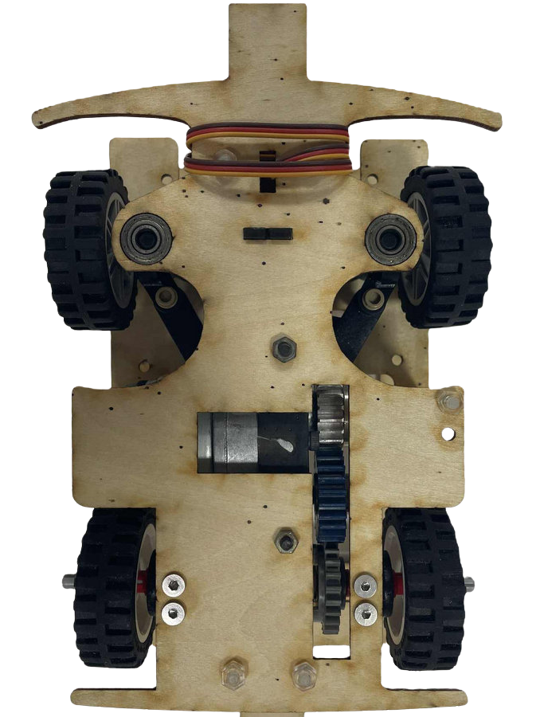
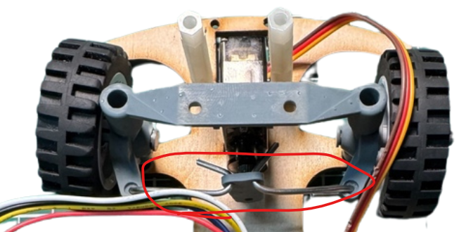
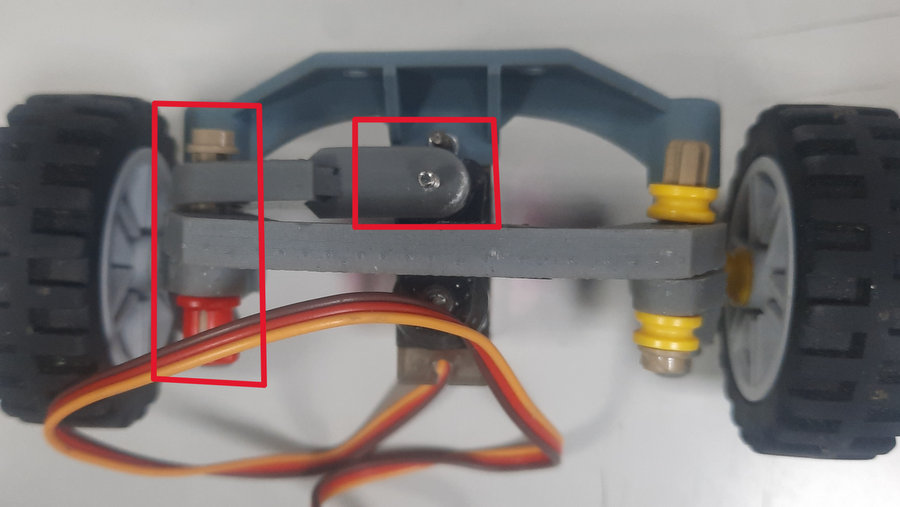
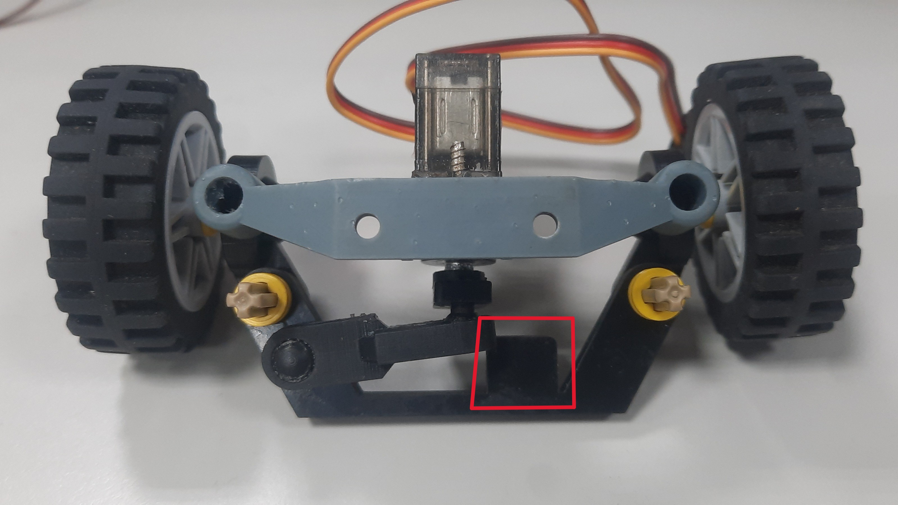
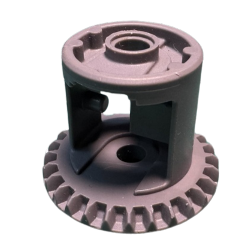
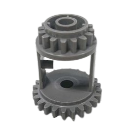
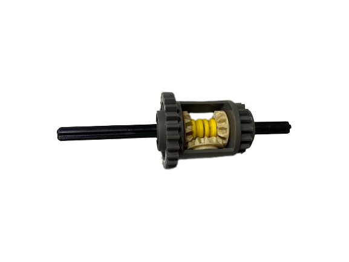

## 
Vehicle Chassis Design Process
 

### Hardware Design Philosophy and Chassis Optimization
  1.  **Design Legacy and Innovation:** The software and hardware design of this **Self-Driving Car** continues the inspiration from last year's model while **drawing upon the strengths of last year's world champion vehicle design**. Building on this foundation, we upgraded the main controller from the **Nvidia Jetson Nano to the Nvidia Jetson Orin Nano**. This move not only significantly enhances the overall computational performance but also provides a robust basis for introducing innovative software designs, making the vehicle more competitive.

  2.  **Steering Geometry Improvement:** The chassis structure utilizes the common engineering principle of **Ackermann Steering Geometry**. Crucially, we implemented **improvements based on the shortcomings of last year's mechanism**, ensuring the vehicle performs **obstacle avoidance** and **turning maneuvers** with greater stability and smoothness.
  
  3.  **Autonomy of Core Components:** The **vehicle chassis** used in this competition was **independently designed and developed** by our team.
  
- ### Vehicle Chassis Improvement Record

  

  <table>
  <tr>
  <th >2024 Season Competition Self-Driving Car Prototype</th>
  <th  colspan=2 >2025 WRO World Final Competition Prototype</th>
  </tr>
  <tr align=center>
  <td width="33%"></td>
  <td width="34%"></td>
  <td width="33%"></td>
  </tr>
  <tr>
  <th colspan=3>Description</th>
  </tr>
  <tr>
  <td colspan="3">

#### **Major Changes in Model and Functionality**

From the previous year's version to this year's international competition version, our model design underwent several key optimizations:

* **Model Size Optimization:** Since the vehicle model was too long, it frequently **moved the field pillars/blocks during obstacle avoidance**. We **shortened the overall length of the model** to enhance obstacle clearance stability.
* **Main Controller Upgrade:** During the National Competition, we found that the **Jetson Nano's computing efficiency** was insufficient for our needs. Consequently, we replaced the main controller with the **higher-computing-efficiency Jetson Orin Nano**.
* **Steering Structure Redesign (I):** Last year's international model used **metal wires** to link the two steering knuckles, which **occupied a large area** and was inefficient. We therefore **redesigned the entire steering structure using 3D printed components**.
* **Steering Structure Redesign (II):** The autonomous vehicle's **steering angle was insufficient**, preventing it from navigating certain **sharp turns**. We **redesigned the steering structure** to allow for a **larger steering space**, enhancing its maneuverability.
* **Addition of Parking Assistance Sensors:** We **added TCRT5000 infrared sensors to the front and rear** of the vehicle, specifically dedicated to **assisting the precision of the parking procedure**.

#### **The Four Iterations of Chassis Design**

Our chassis design underwent a total of four iterations:

1.  **First Iteration:** **Arc-shaped chamfers** were added to the front of the car to prevent the front wheels from **getting stuck** when contacting the side walls, improving self-extrication capabilities after collision.
2.  **Second Iteration:** We **enlarged the mounting holes for the steering knuckles** and **switched to using bearings** to reduce friction, making the steering process **smoother**.
3.  **Third Iteration:** We **reduced the gap** between the steering structure and the motor brackets, and **shortened the wheelbase** to **increase the steering angle** (reducing the turning radius).
4.  **Fourth Iteration:** A **small rectangular block was extended** from the front of the car, specifically to **protect the infrared sensors** from damage during wall collisions.

  </td>
  </tr>
  </table>
  
 

**Final Version Vehicle Chassis Design and Physical Product Correspondence**

- The table below presents the clear correspondence between the 3D Model and the final manufactured physical product of our final design version of the Vehicle Chassis.

  |3D Vehicle Chassis Design| Vehicle Chassis Top View | Vehicle Chassis Bottom View|
  |:----:|:----:|:----:|
  ||||

  - We customized the design of component dimensions and shapes based on the specific performance requirements of the autonomous vehicle. Utilizing a Stereolithography (SLA) 3D printer and a laser cutting machine, we self-designed and manufactured all parts of the vehicle chassis, excluding the gears, the LEGO 6573 differential gear, and the tires.

  - To significantly reduce the rotational friction of the bearings, we - precisely integrated them into the vehicle's support structure (bracket), a mechanical optimization that effectively enhanced the vehicle's overall driving speed.

  - In order to precisely control the vehicle's optimal turning radius and flexibly adjust the Ackermann ratio, we employed 3D modeling techniques and a Stereolithography (SLA) 3D printer to custom-design the critical components and vehicle brackets for the Ackermann steering geometry structure according to specific needs.

**Evolution of the Ackermann Steering Geometry Structure**
  

  <table>

  <tr>
    <th colspan=2>First Generation Steering Structure (V1.0)</th>
  </tr>
  <tr>
  <td width=40%></td>
  <td width=60%>

  This version of the steering structure was designed to be overly wide, and the steering rod was made from drawn metal wire, which was difficult to fix into shape, impacting accuracy.

  </td>
  </tr>
  <tr>
    <th colspan=2>Second Generation Steering Structure (V2.0)</th>
  </tr>
  <tr>
  <td width=40%></td>
  <td width=60%>
To solve the V1.0 structure's bulkiness and accuracy issues, in V2.0 we:

  - Reduced the overall template size.

  - Replaced the metal wire steering rod with a 3D printed component, significantly improving the rod's accuracy and enhancing the self-driving car's steering agility. However, the use of screws to connect LEGO parts in this version still constrained the steering angle. Therefore, the next iteration (V3.0) will switch to rounded cross axles and Ball Joint Steering Shaft Holder to increase the steering range.
  </td>
  </tr>
  <tr>
    <th colspan=2>Third Generation Steering Structure (V3.0)</th>
  </tr>
  <tr>
  <td width=40%></td>
  <td width=60%>
  This version encountered steering torque issues during testing, leading us to re-examine the design blueprint. The next version (V4.0) will incorporate the following fixes:

  - Adjust the connection point of the steering tie rod and linkage to be parallel with the rounded steering rack, optimizing mechanical performance.

 - Add a steering limit block to prevent the structure from collapsing inwards due to excessive steering angles.
  </td>
  </tr>
  <tr>
    <th colspan=2>Fourth Generation Steering Structure (V4.0)</th>
  </tr>
  <tr>
  <td width=40%></td>
  <td width=60%>

  The newly added steering limit block in this version was oversized, which inadvertently restricted the steering angle and reduced the steering agility. Therefore, in the subsequent version (V5.0), we will shorten the limit block to balance both the steering amplitude and structural protection.
    </td>
    </tr>
  <tr>
    <th colspan=2>Final Version Steering Structure (V5.0)</th>
  </tr>
  <tr>
    <td></td>
    <td width=400>
   Following continuous correction and optimization across the previous generations, the current steering structure fully meets the performance requirements of our vehicle model, achieving a stable design state.
    </td>
  </tr>
  </table>
  

- ####  Selection and Modification of LEGO Differential Gears

  The gear differential is a critical core component of a vehicle's drivetrain , used to balance and precisely distribute power to the driving wheels.

  It enables the driving wheels to rotate at different speeds , which is especially crucial during turns. The differential achieves this function through a series of precisely engineered gear mechanisms , allowing the two driving wheels to adaptively adjust their rotational speeds. This capability is vital for enhancing the vehicle's agility and handling. Regardless of road conditions, the differential ensures the vehicle's stability and balance, thereby maintaining excellent driving performance.

  - #### Application and Comparison of LEGO Differential Gears
      In this competition, we utilized LEGO differential gears to implement the core functions of vehicle driving and turning. These differential gears primarily come in two models: the LEGO 6573 Differential and the LEGO 62821 Differential.

    __LEGO 62821 Differential__
      - Composition: This differential consists of one 28-tooth outer gear and four LEGO 12-tooth bevel gears (part number 4565452).

      - Design Advantages: Its compact, enclosed casing design enhances durability and torque transfer efficiency. The central structure securely holds the bevel gears in place, ensuring smooth power distribution to the two output shafts.

      - Performance Positioning: This makes it more efficient and reliable than the older LEGO 6573 Differential.

    __LEGO 6573 Differential__
      - Composition: This differential integrates one 16-tooth gear and one 24-tooth gear. Both gears feature a 5 mm diameter hole at their center for easy cross axle installation.

      - Structural Features: The center of the differential includes a small pillar designed to better secure the right-angle bevel gears, and it can be used in combination with three LEGO 12-tooth bevel gears (part number 4565452).

      

          <table>
          <tr align=center>
          <th>LEGO 62821 GearDifferential</th>
          <th >LEGO 6573 Gear Differential</th>
          </tr><tr align=center>
          <td></td>
          <td></td>
          </tr>
          </table>
          

  - #### Reason for Selection

    - We initially incorporated the LEGO 62821 differential gear as a component in our steering system. However, during the process of meeting the design goal of reducing the chassis dimensions, we discovered that this differential occupied excessive space, making it incompatible with the new structural constraints.

    - Consequently, despite the LEGO 62821 differential gear offering superior steering performance, we chose to abandon it in favor of the smaller LEGO 6573 differential gear. This substitution successfully resolved the structural issue related to the required chassis size reduction, allowing us to achieve a compact vehicle design.

        

        <table>
        <tr>
        <th>LEGO 62821 Gear Differential </th>
        <th>LEGO 6573 Gear Differential </th>
        </tr><tr align=center>
        <td></td>
        <td></td>
        </tr>
        </table>
        

- ### Supplementary information

   - #### What is an Ackermann Steering Geometry?
     __Ackermann Steering Geometry Introduction__
      - The Ackermann steering geometry, proposed by German automotive engineer Lankensperger in 1817, is a steering system design used in automobiles. It was developed to address the geometric discrepancy in the paths of the inner and outer turning wheels when a vehicle makes a turn.
      - People apply Ackermann steering geometry to the steering mechanism of vehicles. Through the corresponding cranks of the four-linkage system, the steering angle of the wheels relative to the projected tire is increased by about 2 to 4 degrees. This results in the rough convergence of the trajectory centers of all four wheels along the extension line of the rear axle, thereby achieving the vehicle's turning.
      
        

      Reference Link：[Ackermann steering geometry@Wikipedia](https://zh.wikipedia.org/zh-tw/%E9%98%BF%E5%85%8B%E6%9B%BC%E8%BD%89%E5%90%91%E5%B9%BE%E4%BD%95)
      
    -  #### The principle of Ackermann steering geometry is based on the following concepts:     
       - __Difference in Turning Radius:__ When the vehicle makes a turn, the two front wheels need to rotate at different angles to allow the vehicle to pivot around a central point.
       - __Turning Angles of the Two Front Wheels:__ The design of the Ackermann steering geometry ensures that both front wheels pass through a central point simultaneously during steering.
    - Compared to the Ackermann steering geometry made from the original 0% LEGO bricks, the steering mechanism of this competition vehicle is designed with reference to an 80% Ackermann steering geometry. It offers advantages such as reduced resistance and smoother turns. The Ackermann steering geometry parts are produced using a stereolithography (SLA) 3D printer. However, the most challenging aspect of the process was adjusting the Ackermann ratio to achieve the ideal turning angle for our vehicle to navigate around blocks effectively.  

  - #### Why Choose an 80% Ackermann Ratio?
    - In theory, this design is the optimal choice for smooth and efficient turns. However, it may lead to excessive tire wear. Therefore, in automobile design, a 100% Ackermann ratio is usually not chosen. Compared to a 100% Ackermann ratio, an 80% Ackermann ratio allows for smoother, more predictable turns, improves maneuverability, and reduces tire wear.
  
    - #### Calculating the Ackermann Angle Graphically (a-b = ack)
    

    <table>
    <tr align=center>
    <td width="30%"></td>
    <td width="30%"></td>
    </tr>
    </table>
    

    Reference Video website：[汽车转弯 没那么简单: 阿克曼转向几何是个啥？How does Ackerman steering geometry work?](https://www.youtube.com/watch?v=8AimxDPWKcM)

# 
[Return Home](../../)
  
