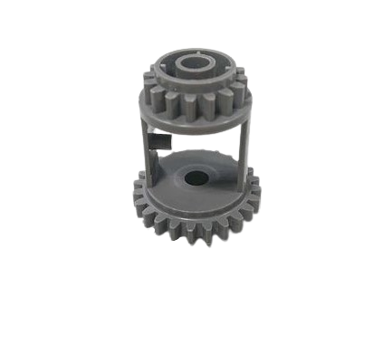

## 
Vehicle Chassis Design Process-車輛底盤設計過程
 

__硬體設計理念與底盤架構優化__
1.  **設計傳承與創新：** 本次 **自駕車**（Self-Driving-Cars）的軟硬體設計靈感延續了去年的機型，並**借鑑了去年世界冠軍車型**的優點。在此基礎上，我們將主控制器從 **Nvidia Jetson Nano 升級為 Nvidia Jetson Orin Nano**，此舉不僅顯著提升了整體運算性能，更為引入創新的軟體設計提供了堅實基礎，使車輛具備更強的競爭力。
 2.  **轉向幾何改良：** 底盤結構採用了工程上常見的 **Ackermann 轉向幾何**（Ackermann Steering Geometry）。更重要的是，我們針對**去年機構的缺點進行了改良**，使車輛在執行**避障**及**迴轉動作**時能夠更加平穩順暢。
 3.  **核心元件自主性：** 本次比賽所使用的**車輛底盤**為完全**自主設計與開發**。

__Hardware Design Philosophy and Chassis Optimization__
  1.  **Design Legacy and Innovation:** The software and hardware design of this **Self-Driving Car** continues the inspiration from last year's model while **drawing upon the strengths of last year's world champion vehicle design**. Building on this foundation, we upgraded the main controller from the **Nvidia Jetson Nano to the Nvidia Jetson Orin Nano**. This move not only significantly enhances the overall computational performance but also provides a robust basis for introducing innovative software designs, making the vehicle more competitive.

  2.  **Steering Geometry Improvement:** The chassis structure utilizes the common engineering principle of **Ackermann Steering Geometry**. Crucially, we implemented **improvements based on the shortcomings of last year's mechanism**, ensuring the vehicle performs **obstacle avoidance** and **turning maneuvers** with greater stability and smoothness.
  
  3.  **Autonomy of Core Components:** The **vehicle chassis** used in this competition was **independently designed and developed** by our team.
  
- ### Vehicle Chassis Improvement Record-車輛底盤設計改進紀錄

  

  <table>
  <tr>
  <th >2024 Season Competition Self-Driving Car Prototype-2024 年國際賽機型</th>
  <th  colspan=2 >2025 WRO World Final Competition Prototype - 2025 最終國際賽機型</th>
  </tr>
  <tr align=center>
  <td width="33%"></td>
  <td width="34%"></td>
  <td width="33%"></td>
  </tr>
  <tr>
  <th colspan=2>Description 說明</th>
  </tr>
  <tr>
  <td colspan="3">

#### **機型與功能的主要變更**

從去年度版本到本年度國際賽版本，我們的機型設計進行了多項關鍵優化：

* **機體尺寸優化：** 由於機型長度過長容易在**避障時移動場地方塊**，我們**縮短了機型整體長度**以提高避障穩定性。
* **主控制器升級：** 在全國賽中，我們發現 **Jetson Nano 的運算效率**已不符合需求。因此，我們將主控制器更換為**運算效率更高的 Jetson Orin Nano**。
* **轉向結構重設計（I）：** 去年度國際賽機型使用**鐵絲**來連動兩側轉向節，不僅**佔用面積較大**，且效率不佳。因此，我們**使用 3D 列印物件**重新設計了整個轉向結構。
* **轉向結構重設計（II）：** 鑑於自駕車的**轉向角度不足**，導致無法通過某些**急轉彎**。我們**重新設計轉向結構**，使其具備**更大的轉向空間**，以提升靈活性。
* **新增停車輔助感測器：** 在自駕車**前後方新增 TCRT5000 紅外感測器**，專用於**輔助停車程序**的精準運行。

#### **底盤設計的四次改版歷程**

我們的底盤設計總共經歷了四次迭代改版：

1.  **第一次改版：** 在車頭加入**弧形導角（Chamfer）**，以避免前輪接觸邊牆時發生**卡住**的情況，優化撞牆後的脫困能力。
2.  **第二次改版：** **加大轉向節放置孔**，並**改用軸承**來降低摩擦，使車輛轉彎過程更為**順暢**。
3.  **第三次改版：** 縮小轉向結構與馬達支架間的**空隙**，同時**減短軸距**（Wheelbase）以**提升轉彎角度**（縮小轉彎半徑）。
4.  **第四次改版：** 在車頭**延伸出小長方區塊**，目的是**保護紅外線感測器**，避免撞牆時遭受損壞。

#### **Major Changes in Model and Functionality**

From the previous year's version to this year's international competition version, our model design underwent several key optimizations:

* **Model Size Optimization:** Since the vehicle model was too long, it frequently **moved the field pillars/blocks during obstacle avoidance**. We **shortened the overall length of the model** to enhance obstacle clearance stability.
* **Main Controller Upgrade:** During the National Competition, we found that the **Jetson Nano's computing efficiency** was insufficient for our needs. Consequently, we replaced the main controller with the **higher-computing-efficiency Jetson Orin Nano**.
* **Steering Structure Redesign (I):** Last year's international model used **metal wires** to link the two steering knuckles, which **occupied a large area** and was inefficient. We therefore **redesigned the entire steering structure using 3D printed components**.
* **Steering Structure Redesign (II):** The autonomous vehicle's **steering angle was insufficient**, preventing it from navigating certain **sharp turns**. We **redesigned the steering structure** to allow for a **larger steering space**, enhancing its maneuverability.
* **Addition of Parking Assistance Sensors:** We **added TCRT5000 infrared sensors to the front and rear** of the vehicle, specifically dedicated to **assisting the precision of the parking procedure**.

#### **The Four Iterations of Chassis Design**

Our chassis design underwent a total of four iterations:

1.  **First Iteration:** **Arc-shaped chamfers** were added to the front of the car to prevent the front wheels from **getting stuck** when contacting the side walls, improving self-extrication capabilities after collision.
2.  **Second Iteration:** We **enlarged the mounting holes for the steering knuckles** and **switched to using bearings** to reduce friction, making the steering process **smoother**.
3.  **Third Iteration:** We **reduced the gap** between the steering structure and the motor brackets, and **shortened the wheelbase** to **increase the steering angle** (reducing the turning radius).
4.  **Fourth Iteration:** A **small rectangular block was extended** from the front of the car, specifically to **protect the infrared sensors** from damage during wall collisions.

  </td>
  </tr>
  </table>
  
 

**Final Version Vehicle Chassis Design and Physical Product Correspondence-最終版車輛底盤設計與實體對應**
- 下方表格展示了我們最終設計版本的車輛底盤（Vehicle Chassis）的3D 模型 與 最終製造的實體成品 之間的清晰對應關係。
- The table below presents the clear correspondence between the 3D Model and the final manufactured physical product of our final design version of the Vehicle Chassis.

  |3D Vehicle Chassis Design(3D 車輛底盤設計)| Vehicle Chassis Top View(車輛底盤俯視圖) | Vehicle Chassis Bottom View(車輛底盤底部視圖)|
  |:----:|:----:|:----:|
  ||||

  - 我們根據自駕車的具體性能需求，客製化設計了零件的尺寸與形狀 。利用 立體光刻（SLA）3D 列印機 和 雷射切割機，我們自行設計並製造了車輛底盤的所有零件，齒輪、樂高 6573 齒輪差速器及輪胎則為例外 。

  - 為大幅降低軸承的旋轉摩擦，我們將軸承精確地整合到車輛支架結構中 ，這一優化措施有效地提升了車輛的整體行駛速度。

  - 為了精準控制車輛的最佳轉彎半徑，並靈活調整阿克曼（Ackermann）比率，我們利用 3D 建模技術和 立體光刻（SLA）3D 列印機，依照具體需求客製化設計了 阿克曼轉向幾何結構 的關鍵零件和車輛支架 。

  - We customized the design of component dimensions and shapes based on the specific performance requirements of the autonomous vehicle. Utilizing a Stereolithography (SLA) 3D printer and a laser cutting machine, we self-designed and manufactured all parts of the vehicle chassis, excluding the gears, the LEGO 6573 differential gear, and the tires.

  - To significantly reduce the rotational friction of the bearings, we - precisely integrated them into the vehicle's support structure (bracket), a mechanical optimization that effectively enhanced the vehicle's overall driving speed.

  - In order to precisely control the vehicle's optimal turning radius and flexibly adjust the Ackermann ratio, we employed 3D modeling techniques and a Stereolithography (SLA) 3D printer to custom-design the critical components and vehicle brackets for the Ackermann steering geometry structure according to specific needs.

#### Evolution of the Ackermann Steering Geometry Structure 阿克曼轉向幾何結構的優化歷程
  

  <table>

  <tr>
    <th colspan=2>First Generation Steering Structure (V1.0) - 第一代轉向結構 (V1.0)</th>
  </tr>
  <tr>
  <td width=40%></td>
  <td width=60%>
  此版轉向結構設計過於寬大，且轉向桿由鐵絲拉製而成，導致形狀不易固定，影響了精確性。

  This version of the steering structure was designed to be overly wide, and the steering rod was made from drawn metal wire, which was difficult to fix into shape, impacting accuracy.

  </td>
  </tr>
  <tr>
    <th colspan=2>Second Generation Steering Structure (V2.0) - 第二代轉向結構 (V2.0)</th>
  </tr>
  <tr>
   <td></td>
  <td width=400>
  為了解決 V1.0 結構寬大和精度不足的問題，我們在 V2.0 中：

  - 縮小了整體版型。

  - 將轉向桿改為3D 列印物件以替代鐵絲，顯著提高了轉向桿的準確性，並提升了自駕車的行進轉向靈活度。 儘管如此，此版本因使用螺絲與樂高零件連接，導致轉向角度仍受限制。因此，下一版 (V3.0) 將改用圓頭十字軸與圓頭舵盤來增加轉向範圍。

To solve the V1.0 structure's bulkiness and accuracy issues, in V2.0 we:

  - Reduced the overall template size.

  - Replaced the metal wire steering rod with a 3D printed component, significantly improving the rod's accuracy and enhancing the self-driving car's steering agility. However, the use of screws to connect LEGO parts in this version still constrained the steering angle. Therefore, the next iteration (V3.0) will switch to rounded cross axles and rounded steering racks (or rudder plates) to increase the steering range.
  </td>
  </tr>
  <tr>
    <th colspan=2>Third Generation Steering Structure (V3.0) - 第三代轉向結構 (V3.0)</th>
  </tr>
  <tr>
  <td></td>
  <td width=400>
  此版在測試中出現轉向力矩（Torque）問題，促使我們重新檢視設計圖。下一版 (V4.0) 將進行以下修正：

  - 將轉向拉桿與連桿的連接位置調整至與圓頭舵盤平行，以優化力學性能。

  - 增加轉向極限擋塊，以避免轉向角度過大導致結構向內凹陷。

  This version encountered steering torque issues during testing, leading us to re-examine the design blueprint. The next version (V4.0) will incorporate the following fixes:

  - Adjust the connection point of the steering tie rod and linkage to be parallel with the rounded steering rack, optimizing mechanical performance.

 - Add a steering limit block to prevent the structure from collapsing inwards due to excessive steering angles.
    </td>
  </tr>
  <tr>
    <th colspan=2>Fourth Generation Steering Structure (V4.0) - 第四代轉向結構 (V4.0)</th>
  </tr>
  <tr>
    <td></td>
    <td width=400>
  此版本中新增的轉向極限擋塊尺寸過大，反而限制了轉向角度，降低了行進轉向靈活度。因此，在下一版 (V5.0) 中，我們將縮短極限擋塊，以兼顧轉向幅度與結構保護。

  The newly added steering limit block in this version was oversized, which inadvertently restricted the steering angle and reduced the steering agility. Therefore, in the subsequent version (V5.0), we will shorten the limit block to balance both the steering amplitude and structural protection.
    </td>
    </tr>
  <tr>
    <th colspan=2>最終版轉向結構 (V5.0)</th>
  </tr>
  <tr>
    <td></td>
    <td width=400>
  經過前幾代轉向結構的持續修正與優化，目前的轉向結構已能完全滿足我們機型的性能需求，達到了設計的穩定狀態。

  Following continuous correction and optimization across the previous generations, the current steering structure fully meets the performance requirements of our vehicle model, achieving a stable design state.
    </td>
  </tr>
  </table>
  

- ###  Selection and Modification of LEGO Differential Gears- 樂高齒輪差速器的選用與修改

  齒輪差速器是車輛傳動系統中的關鍵核心部件 ，其主要功能在於平衡並精確分配驅動動力至各個車輪。

  它允許驅動輪以不同的速度旋轉 ，這在車輛轉彎時尤為重要 。齒輪差速器透過一系列精密設計的齒輪機構 實現此功能，使兩個驅動輪能夠自適應地調整旋轉速度 ，這對於提高車輛的靈活性和操控性至關重要 。無論路況如何，差速器都能確保車輛的穩定性和平衡性 ，從而維持良好的行駛狀態。
  
  The gear differential is a critical core component of a vehicle's drivetrain , used to balance and precisely distribute power to the driving wheels.

  It enables the driving wheels to rotate at different speeds , which is especially crucial during turns. The differential achieves this function through a series of precisely engineered gear mechanisms , allowing the two driving wheels to adaptively adjust their rotational speeds. This capability is vital for enhancing the vehicle's agility and handling. Regardless of road conditions, the differential ensures the vehicle's stability and balance, thereby maintaining excellent driving performance.

   - #### Application and Comparison of LEGO Differential Gears 樂高積木齒輪差速器的應用與比較
      在本次自駕車競賽中，我們利用樂高積木齒輪差速器來實現車輛行駛與轉彎的核心功能。這類差速器主要分為兩種型號：樂高 6573 差速器 和 樂高 62821 差速器。

      __樂高 62821 差速器__
        - 結構組成： 該差速器由一個 28 齒外齒輪 和四個樂高 12 齒錐齒輪 (零件號 4565452) 組成。

        - 設計優勢： 其緊湊的封閉式外殼設計顯著提高了耐用性與扭矩傳遞效率。中心結構能夠將錐齒輪牢固地固定在位，確保動力平穩地分配到兩個輸出軸。

        - 性能定位： 這使其比舊款樂高 6573 差速器更有效率且更可靠。

      __樂高 6573 差速器__
        - 結構組成： 該差速器整合了一個 16 齒齒輪 和一個 24 齒齒輪。兩個齒輪的中心都有一個直徑 5 毫米的孔，方便安裝十字軸。

        - 結構特點： 差速器中心設有一個小支柱，旨在更好地固定直角錐齒輪，並可與三個樂高 12 齒錐齒輪 (零件號 4565452) 組合使用。

      In this competition, we utilized LEGO differential gears to implement the core functions of vehicle driving and turning. These differential gears primarily come in two models: the LEGO 6573 Differential and the LEGO 62821 Differential.

      __LEGO 62821 Differential__
        - Composition: This differential consists of one 28-tooth outer gear and four LEGO 12-tooth bevel gears (part number 4565452).

        - Design Advantages: Its compact, enclosed casing design enhances durability and torque transfer efficiency. The central structure securely holds the bevel gears in place, ensuring smooth power distribution to the two output shafts.

        - Performance Positioning: This makes it more efficient and reliable than the older LEGO 6573 Differential.

      __LEGO 6573 Differential__
        - Composition: This differential integrates one 16-tooth gear and one 24-tooth gear. Both gears feature a 5 mm diameter hole at their center for easy cross axle installation.

        - Structural Features: The center of the differential includes a small pillar designed to better secure the right-angle bevel gears, and it can be used in combination with three LEGO 12-tooth bevel gears (part number 4565452).

          

          <table>
          <tr align=center>
          <th>LEGO 62821 GearDifferential</th>
          <th>LEGO 6573 Gear Differential</th>
          </tr><tr align=center>
          <td></td>
          <td></td>
          </tr>
          </table>
          

    - #### Reason for Selection 選擇理由
      - 我們最初在轉向系統中採用了 樂高 62821 齒輪差速器作為核心組件。然而，在執行底盤尺寸縮小化的設計目標時，我們發現該差速器佔用空間過大，難以符合新的結構限制。

      - 因此，儘管 樂高 62821 齒輪差速器 具有較好的轉向效果，我們決定捨棄它，改用體積更小的 樂高 6573 齒輪差速器。這項替換成功解決了底盤尺寸必須縮小的結構問題，使我們得以實現緊湊型的車輛設計。

      - We initially incorporated the LEGO 62821 differential gear as a component in our steering system. However, during the process of meeting the design goal of reducing the chassis dimensions, we discovered that this differential occupied excessive space, making it incompatible with the new structural constraints.

      - Consequently, despite the LEGO 62821 differential gear offering superior steering performance, we chose to abandon it in favor of the smaller LEGO 6573 differential gear. This substitution successfully resolved the structural issue related to the required chassis size reduction, allowing us to achieve a compact vehicle design.

        

        <table>
        <tr>
        <th>LEGO 62821 Gear Differential </th>
        <th>LEGO 6573 Gear Differential </th>
        </tr><tr align=center>
        <td></td>
        <td></td>
        </tr>
        </table>
        

### 中文:
- ### Supplementary information-補充資訊
    - #### 什麼是阿克曼轉向幾何？
      __Ackermann轉向幾何介紹__
        - Ackermann轉向幾何由德國汽車工程師Lankensperger於1817年提出，是汽車中使用的一種轉向系統設計。此設計用於解決車輛轉彎時內外側轉向輪行徑的幾何差異問題。
        - Ackermann轉向幾何應用於車輛的轉向機構，透過四連桿系統的相應曲柄，使車輪相對於投影輪胎的轉向角增加約2至4度。這樣可使四個車輪的軌跡中心大致會聚於後軸延長線上，從而實現車輛轉彎。
  ### 英文:
    - #### What is an Ackermann Steering Geometry?
      __Ackermann Steering Geometry Introduction__
        - The Ackermann steering geometry, proposed by German automotive engineer Lankensperger in 1817, is a steering system design used in automobiles. It was developed to address the geometric discrepancy in the paths of the inner and outer turning wheels when a vehicle makes a turn.
        - People apply Ackermann steering geometry to the steering mechanism of vehicles. Through the corresponding cranks of the four-linkage system, the steering angle of the wheels relative to the projected tire is increased by about 2 to 4 degrees. This results in the rough convergence of the trajectory centers of all four wheels along the extension line of the rear axle, thereby achieving the vehicle's turning.
      
        

      Reference Link：[Ackermann steering geometry@Wikipedia](https://zh.wikipedia.org/zh-tw/%E9%98%BF%E5%85%8B%E6%9B%BC%E8%BD%89%E5%90%91%E5%B9%BE%E4%BD%95)
      ### 中文:
      #### Ackermann轉向幾何原理基於以下概念：
      - __轉彎半徑差異：__ 當車輛轉彎時，兩個前輪需以不同角度旋轉，使車輛能繞著一個中心點轉動。
      - __兩個前輪的轉向角度：__ Ackermann轉向幾何的設計確保兩個前輪在轉向時同時通過該中心點。
      - 與使用原始0% LEGO積木製作的Ackermann轉向幾何相比，本次比賽車輛的轉向機構參考了80%的Ackermann轉向幾何設計，帶來阻力降低與轉彎更順暢的優勢。Ackermann轉向幾何零件採用立體光固化（SLA）3D列印製作。然而，製程中最具挑戰性的是調整Ackermann比率，使車輛能夠達到理想的轉向角度，有效繞過障礙物。
      ### 英文:
      #### The principle of Ackermann steering geometry is based on the following concepts:     
       - __Difference in Turning Radius:__ When the vehicle makes a turn, the two front wheels need to rotate at different angles to allow the vehicle to pivot around a central point.
       - __Turning Angles of the Two Front Wheels:__ The design of the Ackermann steering geometry ensures that both front wheels pass through a central point simultaneously during steering.
      - Compared to the Ackermann steering geometry made from the original 0% LEGO bricks, the steering mechanism of this competition vehicle is designed with reference to an 80% Ackermann steering geometry. It offers advantages such as reduced resistance and smoother turns. The Ackermann steering geometry parts are produced using a stereolithography (SLA) 3D printer. However, the most challenging aspect of the process was adjusting the Ackermann ratio to achieve the ideal turning angle for our vehicle to navigate around blocks effectively.  
    ### 中文:  
  - #### 為什麼選擇80%的Ackermann比率？
    - 理論上，這種設計是實現平順且高效轉彎的最佳選擇，但可能導致輪胎過度磨損。因此，在汽車設計中，通常不會選擇100%的Ackermann比率。
    - 與100%的Ackermann比率相比，80%的Ackermann比率能帶來更順暢、更可預測的轉彎，提升操控性並減少輪胎磨損。
  ### 英文:
  - #### Why Choose an 80% Ackermann Ratio?
    - In theory, this design is the optimal choice for smooth and efficient turns. However, it may lead to excessive tire wear. Therefore, in automobile design, a 100% Ackermann ratio is usually not chosen. Compared to a 100% Ackermann ratio, an 80% Ackermann ratio allows for smoother, more predictable turns, improves maneuverability, and reduces tire wear.
  
    - #### Calculating the Ackermann Angle Graphically (a-b = ack)-計算Ackermann轉向角（a - b = ack）示意圖
    

    <table>
    <tr align=center>
    <td width="30%"></td>
    <td width="30%"></td>
    </tr>
    </table>
    

    Reference Video website：[汽车转弯 没那么简单: 阿克曼转向几何是个啥？How does Ackerman steering geometry work?](https://www.youtube.com/watch?v=8AimxDPWKcM)

# 
[Return Home](../../)
  
