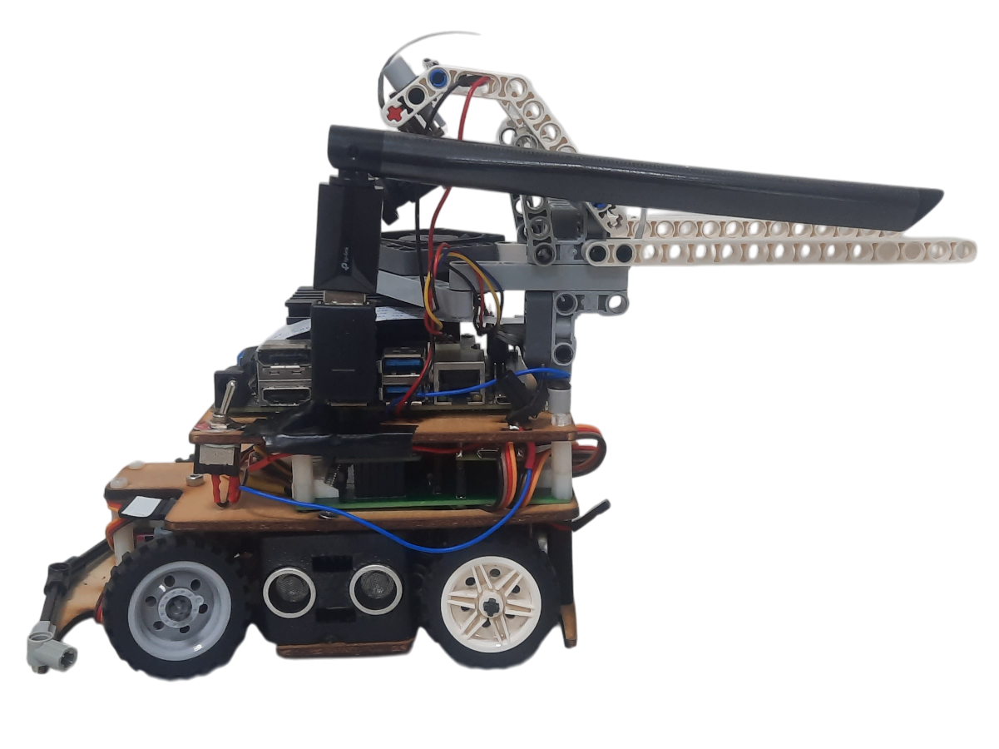
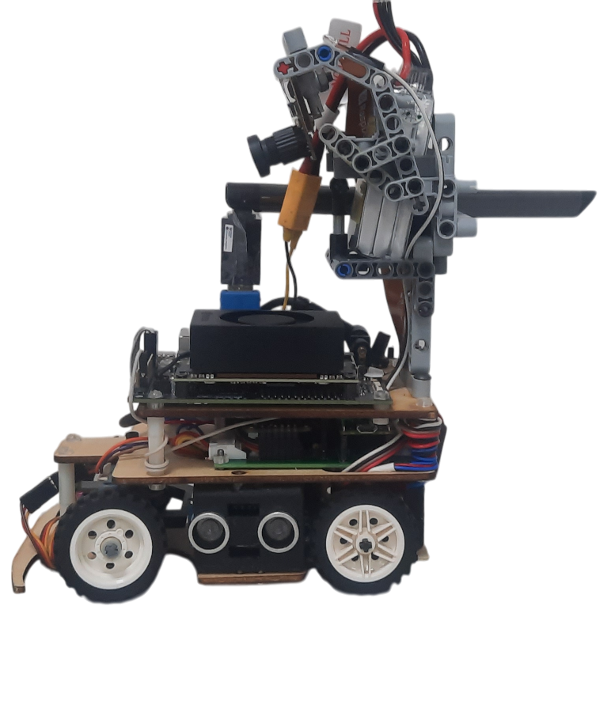

## 
Vehicle Chassis Design Process-車輛底盤設計過程
 

- ### Vehicle Chassis Design-車輛底盤設計
### 中文:
  - 這輛自駕車的軟硬體設計靈感來自於我們學長姐隊伍「Shinan-Fire-On-All-Cylinders」去年所打造的車型，並借鑑了去年世界冠軍車型的優點。在此基礎上，我們將主控制器從「Raspberry Pi 4B」升級為「Nvidia Jetson Orin Nano」，提升性能並引入創新設計，使車輛更具競爭力。
  - 本次比賽所使用的車輛底盤為自主設計與開發。
  - 車輛底盤採用了Ackermann轉向幾何結構，並針對去年機構的缺點進行改良，使避障及迴轉動作更加順暢。
  - 下表展示了車輛底盤的3D模型與實體成品。
  ### 英文:
  - The design inspiration for both the hardware and software of this self-driving car came from last year’s model created by our sister team (Shinan-Fire-On-All-Cylinders) and drew upon the strengths of the world championship-winning model from last year. Based on this, we made improvements by upgrading the main controller from the "Raspberry Pi 4B" to the "Nvidia Jetson Nano" to enhance performance and introduce innovative design elements, making the vehicle more competitive.
  - The vehicle chassis used in this competition is self-designed and developed.
  - We applied Ackermann steering geometry to the vehicle chassis and made improvements based on the shortcomings of last year’s mechanism, resulting in smoother obstacle avoidance and U-turns.
  - The following table shows the 3D models and finished products of the vehicle chassis.

    |3D Vehicle Chassis Design(3D 車輛底盤設計)| Vehicle Chassis Top View(車輛底盤俯視圖) | Vehicle Chassis Bottom View(車輛底盤底部視圖)|
    |:----:|:----:|:----:|
    ||||

  ### 中文:  
  - 我們可以根據車輛的具體需求自訂零件的尺寸與形狀，並利用立體光刻（SLA）3D列印機與雷射切割機，設計並製造車輛底盤的所有零件，齒輪、樂高62821齒輪差速器及輪胎除外。
  - 為了降低軸承的旋轉摩擦，我們在車輛支架中整合了軸承，從而提升車輛的速度。
  - 為了精準控制車輛的最佳轉彎半徑並靈活調整Ackermann比率，我們利用立體光刻（SLA）3D列印機及3D建模技術，依照具體需求設計了裝配Ackermann轉向幾何結構的車輛支架。
### 英文:英文:
  - We can customize the size and shape of parts according to the specific needs of the vehicle and use Stereolithography (SLA) 3D printers and laser cutters to design and manufacture all parts of the vehicle chassis, except for the gears, Lego 62821Gear Differential and tires.
  - To reduce rotational friction of the shafts, we integrated bearings into the vehicle's support frame, thereby increasing the vehicle's speed.
  - To precisely control the vehicle's optimal turning radius and flexibly adjust the Ackermann ratio, we used Stereolithography (SLA) 3D printers and 3D modeling technology to design the support frame for the Ackermann steering geometry on the vehicle chassis based on specific requirements.

- #### Vehicle Chassis Improvement Record-車輛底盤改進紀錄
  - 以下為去年模型（Shinan-Fire-On-All-Cylinders）與今年改良模型的比較，記錄於下表：

  - The following is a comparison between last year’s model (Shinan-Fire-On-All-Cylinders) and this year’s improved model, recorded in the table below:

  ### __全國賽比較國際賽機型__
  

  <table>
  <th width="30%">
2025全國賽機型</th>
  <th width="30%">
2025國際賽機型</th>
  <th>
Explanation(說明)</th>
  <tr>
  <td>
</td>
  <td>
</td>
  <td>基於全國賽我們發現機型存在一些問題：  
   <ol>
    <li>Jetson Nano的運算效率不足，導致有時會太晚看到障礙物。</li>
    <li>自駕車轉彎時角度不夠，導致有些急轉彎無法轉過去。</li>

   <ol>
  </td>
  </tr>
  </table>
  

 
  ### __Final Build-最終組裝__

  

  <table>
  <tr align=center>
  <th>
Photos of the final Build(最終組裝照片)</th>
  <th>
3D modeling of the final Build(最終組裝的3D建模)</th>
  <th>
Explanation(說明)</th>
  </tr><tr>
  <td width="30%"></td>
  <td width="30%"></td>

  <td>
    我們在底盤的設計上經歷了三次改版
    <ol>
      <li>第一次改版加入了弧形導角，避免自駕車前輪胎接觸邊牆導致卡住</li>
      <li>第二次改版我們將放置轉降向節的孔洞擴大，改為放置軸承減小摩擦力，讓轉彎更加順滑</li>
      <li>第三次改版我們將轉向結構與直流馬達支架之間的空閒區塊縮小，從而減短軸距讓轉彎角度更大</li>
    </ol>
  </td>
  </tr>
  </table>
  

  

    <table>
      <tr>
        <th colspan=2>轉向結構修改歷程</th>
      </tr>
      <tr>
        <th colspan=2>第一代轉向結構</th>
      </tr>
      <tr>
        <td></td>
        <td width=400>
          描述： &emsp;&emsp;這個版本的轉向結構過於寬大，因此我們在第二版轉向結構中將版型縮小，提升自駕車的靈活度。
        </td>
      </tr>
      <tr>
        <th colspan=2>第二代轉向結構</th>
      </tr>
      <tr>
        <td></td>
        <td width=400>
          描述： &emsp;&emsp;這個版本因為使用樂高元件進行連接使轉向的角度被限制住，因此我們在第三版中修改不同元件間的連接方式。
        </td>
      </tr>
      <tr>
        <th colspan=2>第三代轉向結構</th>
      </tr>
      <tr>
        <td></td>
        <td width=400>
          描述： &emsp;&emsp;這個版本的轉向結構中，力矩的設計有誤，因此我們修改了拉桿和連桿之間的位置，我們在連桿上新增了極限以防轉向結構轉過頭的問題。
        </td>
      </tr>
      <tr>
        <th colspan=2>第四代轉向結構</th>
      </tr>
      <tr>
        <td></td>
        <td width=400>
          描述： &emsp;&emsp;這個版本的轉向極限設置太大，所以我們修改極限擋塊的大小以提升轉向的最大角度。
        </td>
      </tr>
      <tr>
        <th colspan=2>第五代轉向結構</th>
      </tr>
      <tr>
        <td></td>
        <td width=400>
          描述： &emsp;&emsp;經過測試此版本已經符合我們自駕車的需求。
        </td>
      </tr>
    </table>
  

- ###  Gear Differential-齒輪差速器
### 中文:
  - 對於車輛的單一驅動系統來說，齒輪差速器是一個不可或缺的裝置，因為它能有效平衡動力並將動力分配到不同的車輪，使每個驅動車輪能以不同的速度旋轉，尤其是在轉彎時。這對提升車輛的靈活性和操控性能至關重要。
  ### 英文:
  - For a vehicle's single drive system, a gear differential is an indispensable device because it effectively balances power and distributes it to different wheels, allowing each driven wheel to rotate at different speeds, especially during turns. This is crucial for improving the vehicle's agility and handling performance.

### 中文:
- ### Supplementary information-補充資訊
    - #### 什麼是阿克曼轉向幾何？
      __Ackermann轉向幾何介紹__
        - Ackermann轉向幾何由德國汽車工程師Lankensperger於1817年提出，是汽車中使用的一種轉向系統設計。此設計用於解決車輛轉彎時內外側轉向輪行徑的幾何差異問題。
        - Ackermann轉向幾何應用於車輛的轉向機構，透過四連桿系統的相應曲柄，使車輪相對於投影輪胎的轉向角增加約2至4度。這樣可使四個車輪的軌跡中心大致會聚於後軸延長線上，從而實現車輛轉彎。
  ### 英文:
    - #### What is an Ackermann Steering Geometry?
      __Ackermann Steering Geometry Introduction__
        - The Ackermann steering geometry, proposed by German automotive engineer Lankensperger in 1817, is a steering system design used in automobiles. It was developed to address the geometric discrepancy in the paths of the inner and outer turning wheels when a vehicle makes a turn.
        - People apply Ackermann steering geometry to the steering mechanism of vehicles. Through the corresponding cranks of the four-linkage system, the steering angle of the wheels relative to the projected tire is increased by about 2 to 4 degrees. This results in the rough convergence of the trajectory centers of all four wheels along the extension line of the rear axle, thereby achieving the vehicle's turning.
      
        

      Reference Link：[Ackermann steering geometry@Wikipedia](https://zh.wikipedia.org/zh-tw/%E9%98%BF%E5%85%8B%E6%9B%BC%E8%BD%89%E5%90%91%E5%B9%BE%E4%BD%95)
      ### 中文:
      #### Ackermann轉向幾何原理基於以下概念：
      - __轉彎半徑差異：__ 當車輛轉彎時，兩個前輪需以不同角度旋轉，使車輛能繞著一個中心點轉動。
      - __兩個前輪的轉向角度：__ Ackermann轉向幾何的設計確保兩個前輪在轉向時同時通過該中心點。
      - 與使用原始0% LEGO積木製作的Ackermann轉向幾何相比，本次比賽車輛的轉向機構參考了80%的Ackermann轉向幾何設計，帶來阻力降低與轉彎更順暢的優勢。Ackermann轉向幾何零件採用立體光固化（SLA）3D列印製作。然而，製程中最具挑戰性的是調整Ackermann比率，使車輛能夠達到理想的轉向角度，有效繞過障礙物。
      ### 英文:
      #### The principle of Ackermann steering geometry is based on the following concepts:     
       - __Difference in Turning Radius:__ When the vehicle makes a turn, the two front wheels need to rotate at different angles to allow the vehicle to pivot around a central point.
       - __Turning Angles of the Two Front Wheels:__ The design of the Ackermann steering geometry ensures that both front wheels pass through a central point simultaneously during steering.
      - Compared to the Ackermann steering geometry made from the original 0% LEGO bricks, the steering mechanism of this competition vehicle is designed with reference to an 80% Ackermann steering geometry. It offers advantages such as reduced resistance and smoother turns. The Ackermann steering geometry parts are produced using a stereolithography (SLA) 3D printer. However, the most challenging aspect of the process was adjusting the Ackermann ratio to achieve the ideal turning angle for our vehicle to navigate around blocks effectively.  
    ### 中文:  
  - #### 為什麼選擇80%的Ackermann比率？
    - 理論上，這種設計是實現平順且高效轉彎的最佳選擇，但可能導致輪胎過度磨損。因此，在汽車設計中，通常不會選擇100%的Ackermann比率。
    - 與100%的Ackermann比率相比，80%的Ackermann比率能帶來更順暢、更可預測的轉彎，提升操控性並減少輪胎磨損。
  ### 英文:
  - #### Why Choose an 80% Ackermann Ratio?
    - In theory, this design is the optimal choice for smooth and efficient turns. However, it may lead to excessive tire wear. Therefore, in automobile design, a 100% Ackermann ratio is usually not chosen. Compared to a 100% Ackermann ratio, an 80% Ackermann ratio allows for smoother, more predictable turns, improves maneuverability, and reduces tire wear.
  
    - #### Calculating the Ackermann Angle Graphically (a-b = ack)-計算Ackermann轉向角（a - b = ack）示意圖
    

    <table>
    <tr align=center>
    <td width="30%"></td>
    <td width="30%"></td>
    </tr>
    </table>
    

    Reference Video website：[汽车转弯 没那么简单: 阿克曼转向几何是个啥？How does Ackerman steering geometry work?](https://www.youtube.com/watch?v=8AimxDPWKcM)

# 
[Return Home](../../)
  
