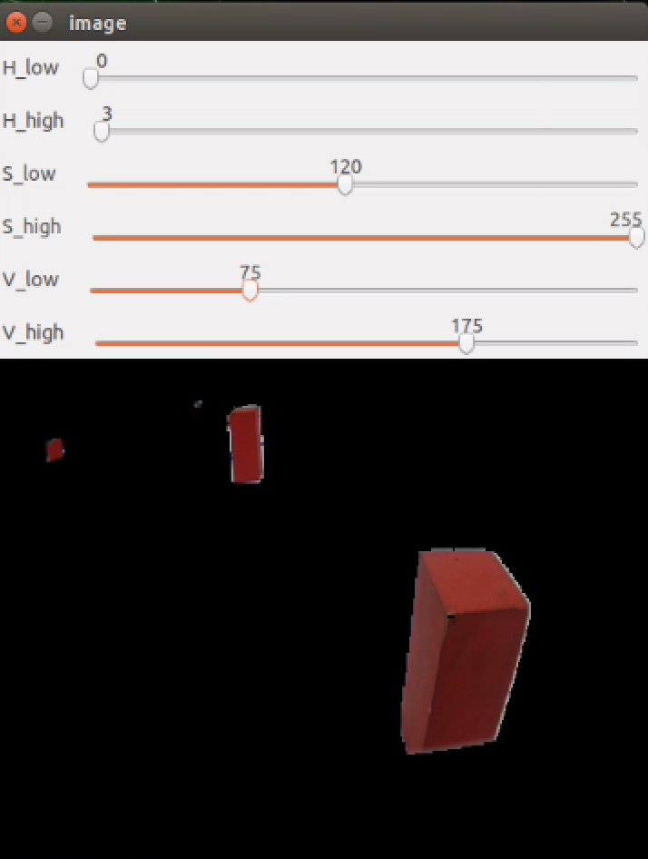
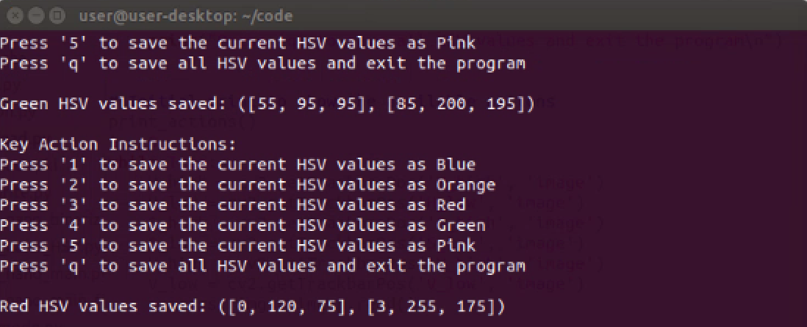
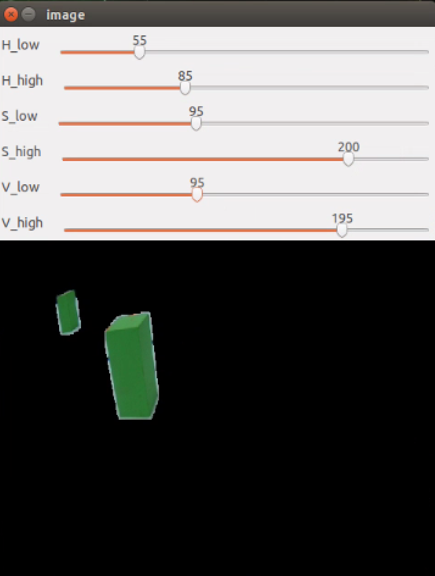
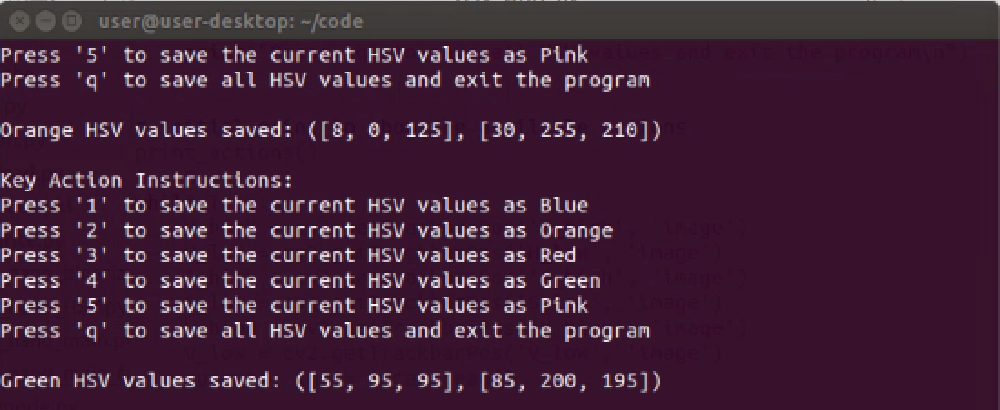
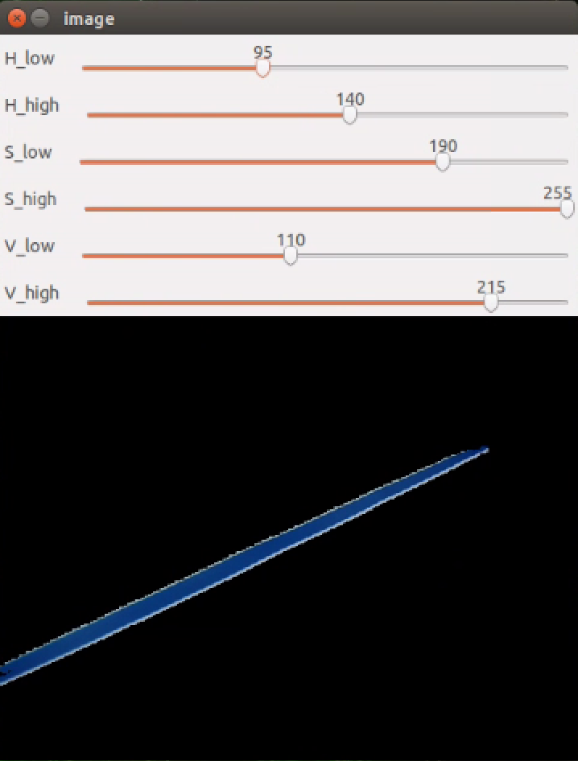
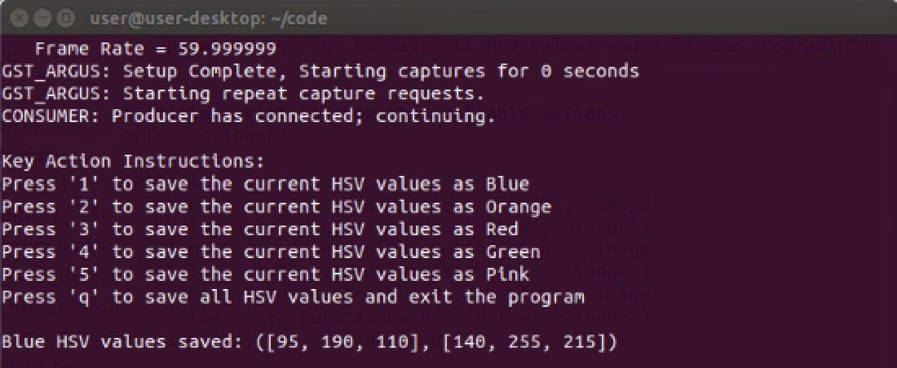
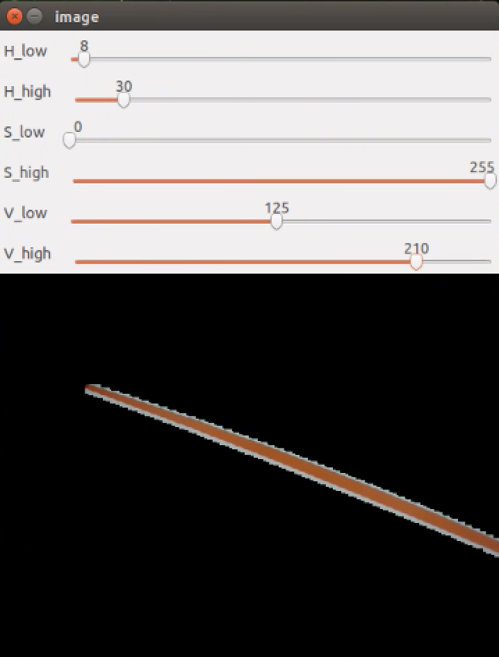
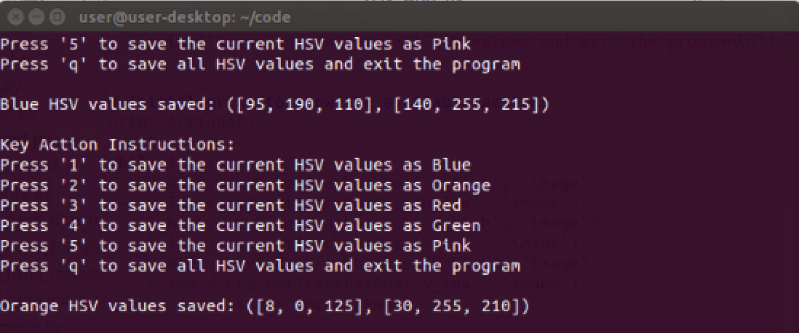
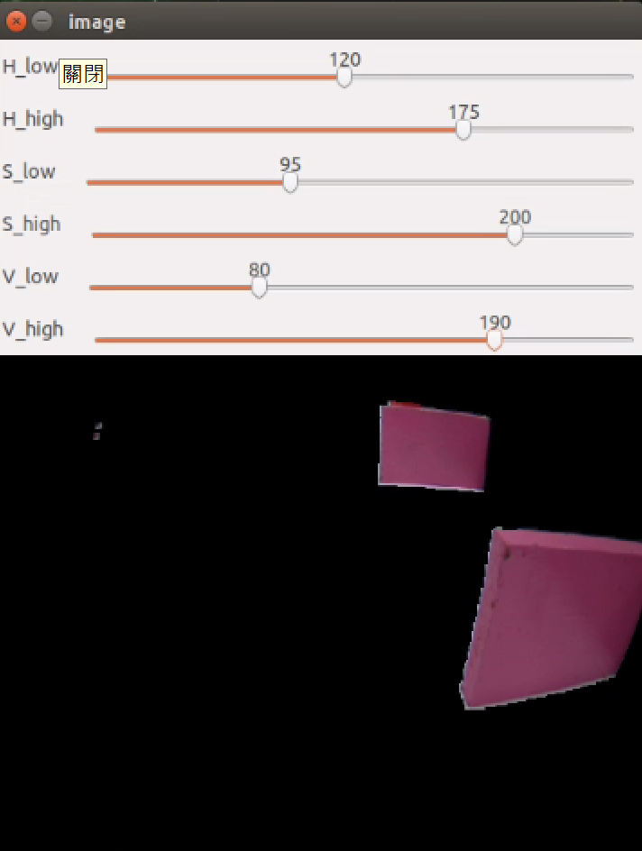
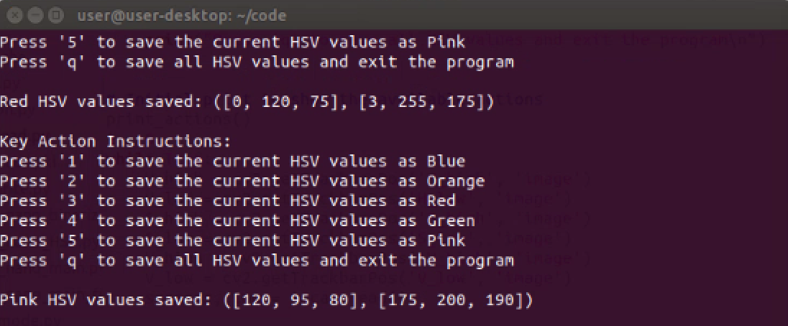

## 
 Automatically record the HSV values of the field-自動記錄場地的 HSV 值

為了記錄交通標誌積木、停車區邊牆及場地線的顏色，我們撰寫了一個程式，能自動將最終的 HSV 值保存在 Jetson Nano 控制器中。此功能省去手動記錄的麻煩，不僅節省時間，也確保了數據的準確性。

To record the colors of traffic sign blocks, parking area sidewalls, and field lines, we wrote a program that automatically saves the finalized HSV values in the Jetson Nano controller. This feature eliminates the need for manual recording, saving time and ensuring data accuracy.

- #### Image processing-影像處理
    ### 中文:
    - 在影像處理時，使用 HSV_write.py 檔案將交通標誌方塊與場地底圖上的線條轉換到不同的色彩空間是必須的步驟，以有效處理特定任務。
    - 我們使用 cv2.cvtColor 函數將原始的 RGB 影像轉換成 HSV（色相、飽和度、明度）色彩空間。
    - 轉換完成後，透過 cv2.inRange 函數並設定六個 HSV 閾值：H_low、H_high、S_low、S_high、V_low、V_high 來定義顏色範圍。cv2.inRange 函數會將 HSV 影像中每個像素與設定的範圍做比較，若像素值落在範圍內則保留，否則過濾掉。此過程可得到濾波後的影像。
    - 取得濾波後影像後，我們使用 pickle 模組將當前的六個 HSV 值保存成資料，生成 hsv_values.pkl 檔案。
    - 在 function.py 中，會將 hsv_values.pkl 檔案中保存的 HSV 值匯入到 hsv_values 字典，並將場地上的橘色與藍色線條、紅色與綠色交通標誌方塊、以及粉紅色邊界牆的 HSV 值分別指定給相應的變數。
    ### 英文:    
    - When processing images, using the [`HSV_write.py`](./code/HSV_write.py) file to convert lines on traffic sign blocks and field base maps into different color spaces is a necessary step to effectively handle specific tasks.
    - We use the `cv2.cvtColor` function to convert the original RGB image into the HSV (hue, saturation, value) color space.
    - Once the image has been converted, we use the `cv2.inRange` function and set six HSV values: `H_low`, `H_high`, `S_low`, `S_high`, `V_low`, and `V_high` to define a color range. The `cv2.inRange` function compares each pixel value in the HSV image with the specified HSV range. If the pixel value falls within this range, it is retained; otherwise, it is filtered out. This process allows us to obtain a filtered image.
    - After obtaining the filtered image, we use the pickle module to save the current six HSV values as data, generating an `hsv_values.pkl` file.
    - In [`function.py`](./code/function.py), the saved HSV values in the `hsv_values.pkl` file are imported into the `hsv_values dictionary`, where the HSV values for the orange and blue lines on the field, red and green traffic sign blocks, and pink boundary walls are assigned to variables corresponding to each color.

**Red traffic sign block-紅色交通標誌方塊**

|Adjusting the HSV Range Values for Red Color(調整紅色的 HSV 範圍值)|Save the HSV range values for Red(儲存紅色的 HSV 範圍值)|Live image of the Red traffic sign block(紅色交通標誌方塊的即時影像)|
|:----:|:----:|:----:|
||||

**Green traffic sign block-綠色交通標誌方塊**

|Adjusting the HSV Range Values for GreenColor(調整綠色的 HSV 範圍值)|Save the HSV range values for Green(儲存綠色的 HSV 範圍值)|Live image of the Green traffic sign block(綠色交通標誌方塊的即時影像)|
|:----:|:----:|:----:|
||||

**Blue line-藍色線條**

|Adjusting the HSV Range Values for Blue Color(調整藍色的 HSV 範圍值)|Save the HSV range values for Blue(儲存藍色的 HSV 範圍值)|Live image of the Blue line（藍色線條的即時影像）|
|:----:|:----:|:----:|
||||

**Orange line-橘色線條**

|Adjusting the HSV Range Values for Orange Color調整橘色的 HSV 範圍值)|Save the HSV range values for Orange(儲存橘色的 HSV 範圍值)|Live image of the Orange line(橘色線條的即時影像) |
|:----:|:----:|:----:|
||||

**Pink sidewall-粉紅色側牆**

|Adjusting the HSV Range Values for Pink Color(調整粉紅色的 HSV 範圍值)|Save the HSV range values for Pink(儲存粉紅色的 HSV 範圍值)|Live image of the Pink sidewall(粉紅色邊牆的即時影像)|
|:----:|:----:|:----:|
||||

# 
[Return Home](../../)
  
