<div align="center"></div>

## <div align="center"> Automatic storage and recording of game field object LAB values</div>

To accurately record the LAB values for the traffic sign blocks (red and green), the magenta side walls of the parking lot, and the blue lines and orange lines in the turning areas, we developed a Vehicle's control program. This program reads the image captured by the CSI camera and stores the final LAB values for the color of each object in the Jetson Orin Nano controller. This automation eliminates the tedious step of manual recording, significantly saving time and ensuring the accuracy and consistency of the data.
- #### Introduction to LAB Image Processing and Automatic Recording

    1. Color Space Conversion: We use the `cv2.cvtColor()` function to convert the original `RGB` image captured by the CSI camera into the `LAB` color space (`L`: Lightness, `A`: Red-Green axis, `B`: Yellow-Blue axis).
    2. Color Range Definition and Filtering: Subsequently, we precisely define the target color range by utilizing the `cv2.inRange()` function and setting six `LAB` thresholds: `L_{low}`, `L_{high}`, `A_{low}`, `A_{high}`, `B_{low}`, and `B_{high}`. The `cv2.inRange()` function compares every pixel in the `LAB` image with the defined range, retaining only the pixels within the range and filtering out the rest, thus yielding the filtered image.
    3. Value Storage and Application: After obtaining the filtered image, we use a graphical interface button to select the corresponding color object and save its `LAB` values. These values are stored in the `masks.py` file.([masks.py](../Programming/common/masks.py))
    4. Main Program Call: In the main Vehicle's control program10, we call the `LAB` values for each object from the masks.py file using the code snippet below, and input them to the corresponding function for `LAB` visual recognition.
        ```python
        from masks import rMagenta, rRed, rGreen, rBlue, rOrange, rBlack
        # Import all functions from 'function.py' (e.g., find_contours, max_contour).
        ```

<div align="center">

### Red traffic sign block ###

|Adjusting the LAB Range Values for Red Color|Save the LAB range values for Red|Real-time image of the red traffic sign block|
|:----:|:----:|:----:|
|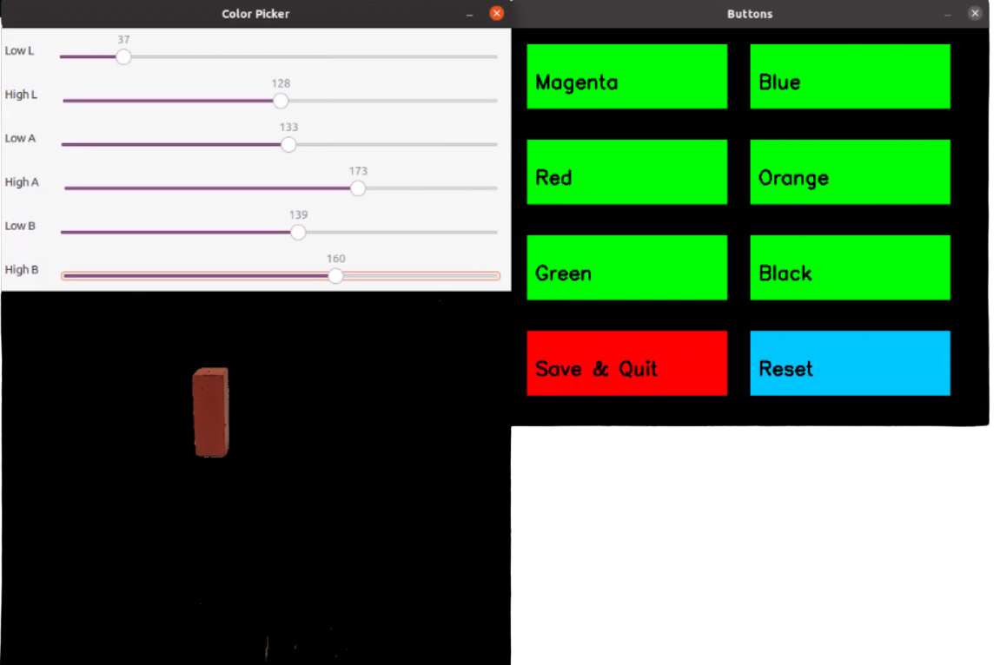|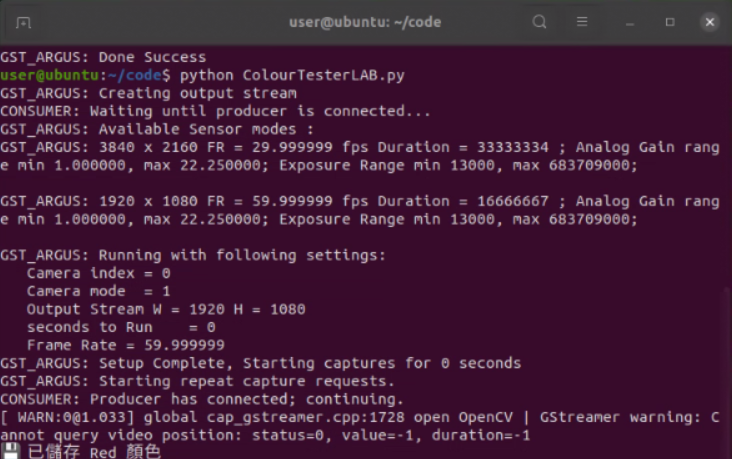|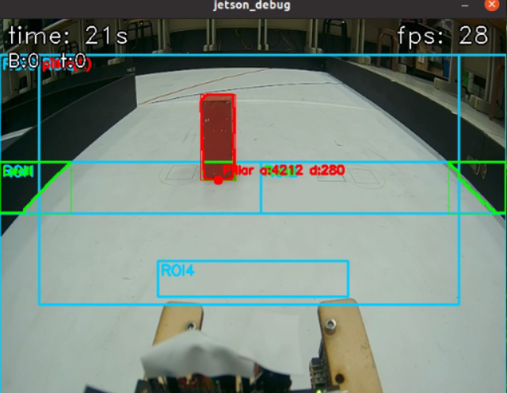|

### Green traffic sign block ###

|Adjusting the LAB Range Values for GreenColor|Save the LAB range values for Green|Real-time image of the green traffic sign block|
|:----:|:----:|:----:|
|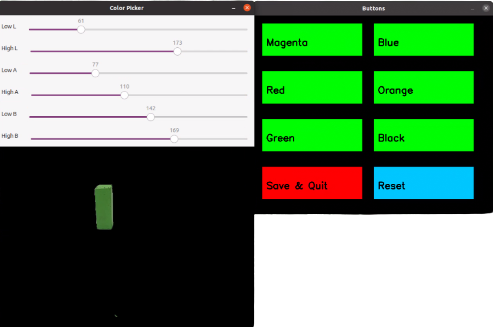|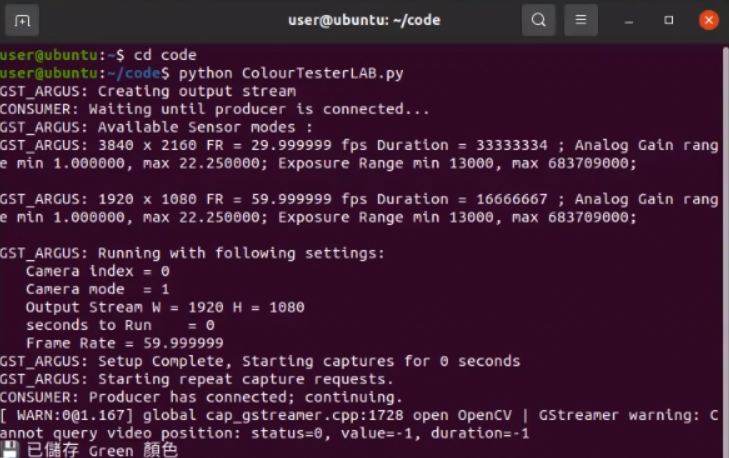|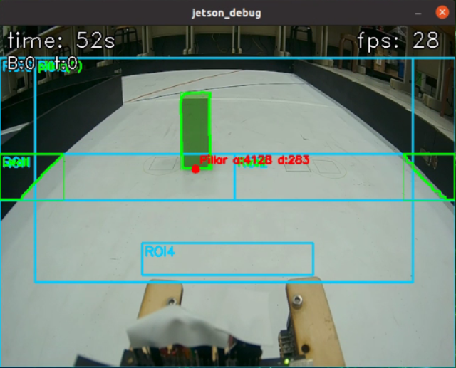|


### Blue line ###


|Adjusting the LAB Range Values for Blue Color|Save the LAB range values for Blue|Real-time image of the blue lines）|
|:----:|:----:|:----:|
|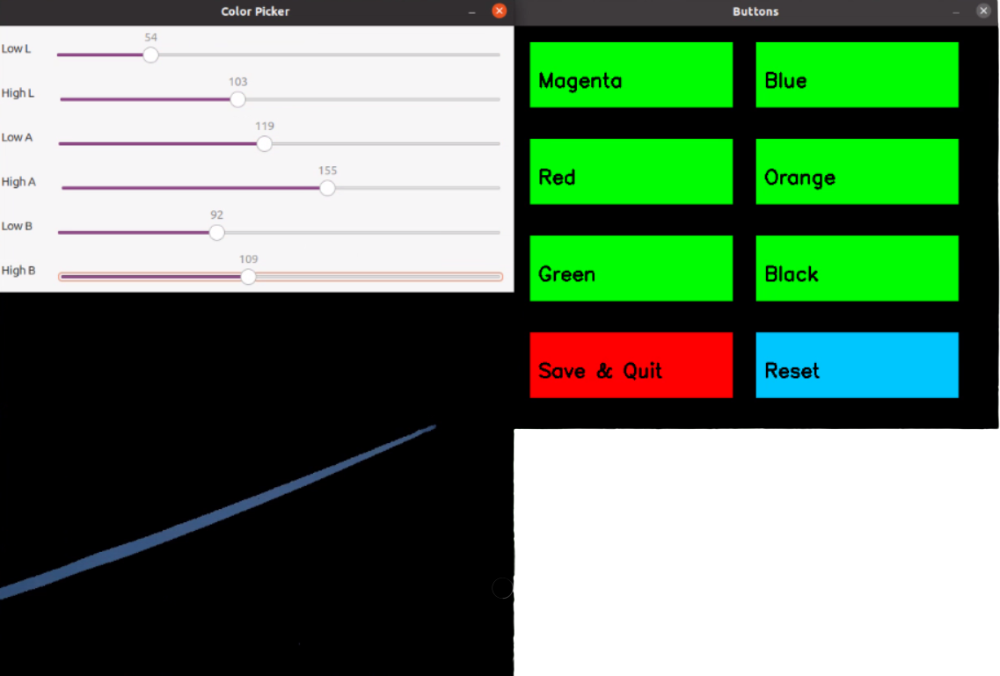|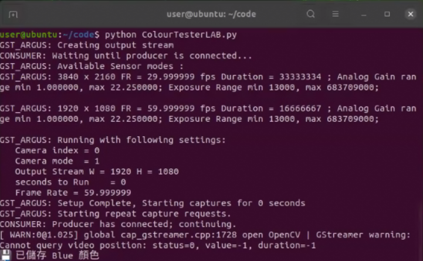|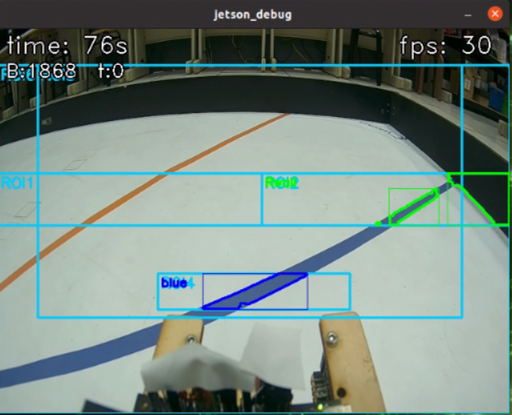|

### Orange line ###

|Adjusting the LAB Range Values for Orange Colo|Save the LAB range values for Orange|Real-time image of the orange lines|
|:----:|:----:|:----:|
|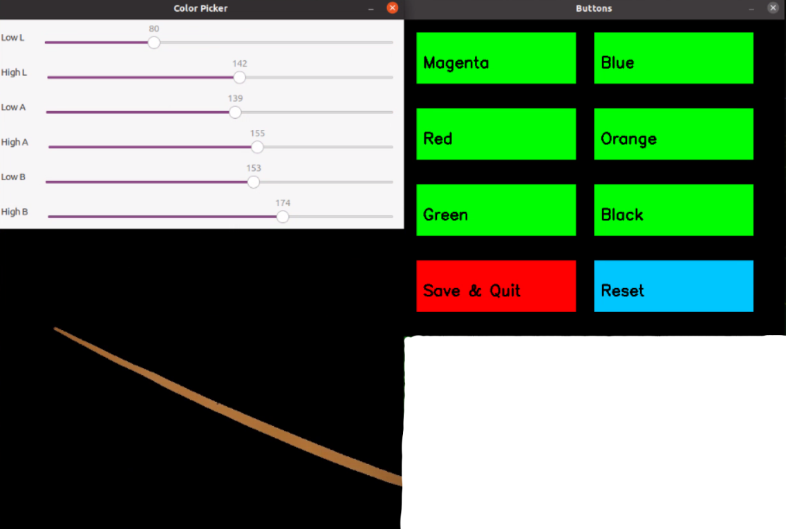|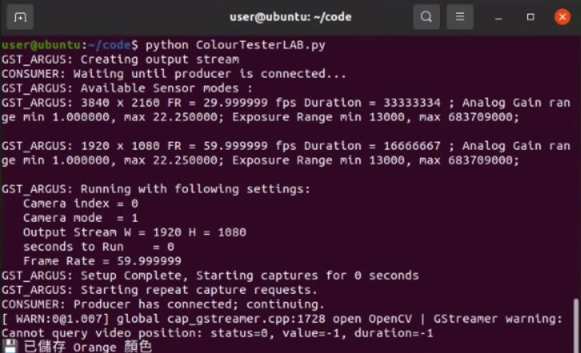||

### magenta side walls ###

|Adjusting the LAB Range Values for magenta Color|Save the LAB range values for magenta|Real-time image of the magenta side walls|
|:----:|:----:|:----:|
|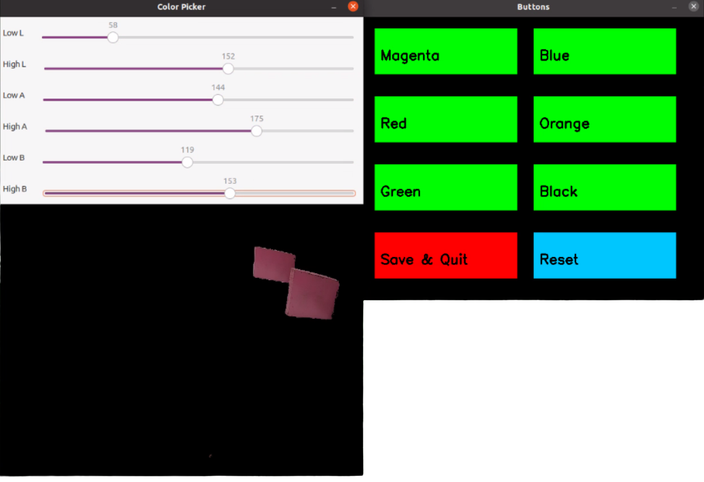||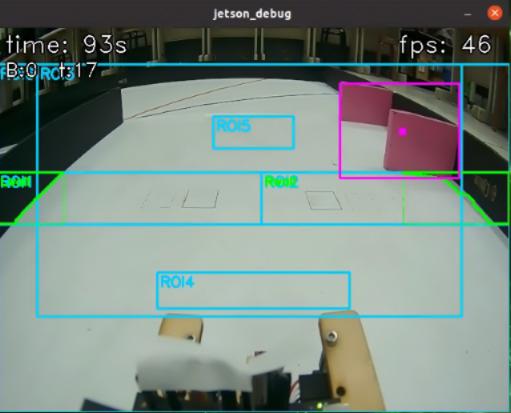|

</div>

# <div align="center">[Return Home](../../)</div>  
