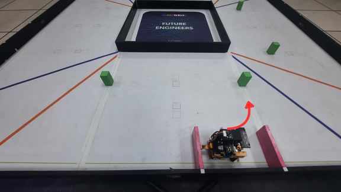
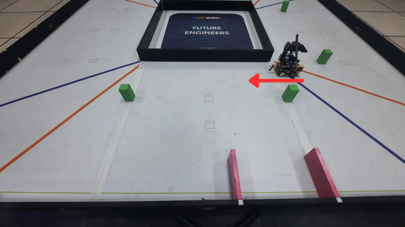
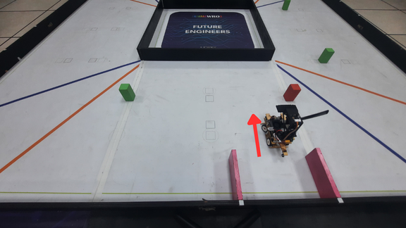
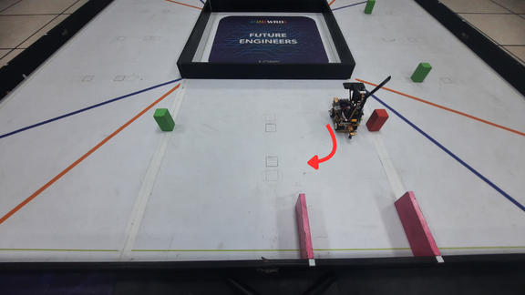
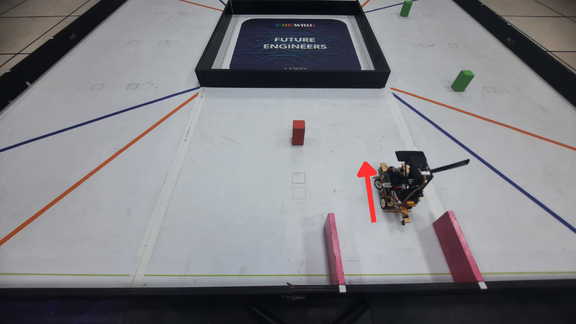
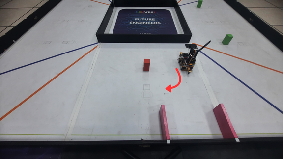

<div align="center"></div>

## <div align="center">Operational Procedure Guide for Vehicle Departure from the Parking Zone - 車輛從停車區出發的操作程序指南</div>
  **Parking Lot Exit Overview - 停車區出發概述。**
- ### Parking Lot Exit program-出發計劃
    ### 中文:
    1.  **系統啟動與方向判斷 (Jetson Orin Nano 職責)**
    - * 車輛啟動時，**主控系統 (Jetson Orin Nano)** 會透過攝影機執行影像識別，首先**確定車輛的預設行駛方向**（逆時針或順時針），隨後識別並鎖定**目標賽道路線的顏色**，作為整個任務的基礎。

    2.  **逆時針方向 (Counter-Clockwise) 行駛邏輯**
    -   * **偵測到綠柱時：** 車輛執行**向左轉 90 度**的換道動作，**前進至綠柱的內側**。隨後，車輛會**向右轉 90 度**，**後退至預定位置**（完成內側換道）。
    -   * **偵測到紅柱時：** 車輛執行**前進**，接著**向左轉 90 度**，**前進至紅柱的外側**。隨後，車輛會**後退並向右轉 90 度**，**後退至預定位置**（完成外側換道或避障）。
    -   * **未偵測到任何柱子時：** 系統將預設車輛**行駛於車道的外側**。

    3.  **順時針方向 (Clockwise) 行駛邏輯**
    -   * **偵測到綠柱時：** 車輛執行**向右轉 90 度**的換道動作，**前進至綠柱的外側**。隨後，車輛會**向左轉 90 度**，**前進至預定位置**（完成外側換道）。
    -   * **偵測到紅柱時：** 車輛執行**向右轉 90 度**的換道動作，**前進至紅柱的內側**。隨後，車輛會**向左轉 90 度**，**前進至預定位置**（完成內側換道）。
    -   * **未偵測到任何柱子時：** 系統將預設車輛**行駛於車道的外側**。
    ### 英文:
    1.  **System Startup and Direction Determination (Jetson Orin Nano Responsibility)**
    - * When the vehicle starts, the **main control system (Jetson Orin Nano)** performs image recognition via the camera to first **determine the vehicle's default driving direction** (Counter-Clockwise or Clockwise). Subsequently, it identifies and locks onto the **color of the target track line**, which serves as the basis for the entire mission.

    2.  **Counter-Clockwise (CCW) Driving Logic**
    - * **Upon detecting a Green Pillar:** The vehicle executes a **90-degree turn to the left** for a lane change, **driving forward to the inner side of the Green Pillar**. Subsequently, the vehicle **turns 90 degrees to the right** and **reverses to a predetermined position** (completing the inner lane change).
    - * **Upon detecting a Red Pillar:** The vehicle **drives forward**, then **turns 90 degrees to the left**, **driving forward to the outer side of the Red Pillar**. Subsequently, the vehicle **reverses, turns 90 degrees to the right**, and **reverses to a predetermined position** (completing the outer lane change or avoidance).
    - * **When no pillars are detected:** The system defaults the vehicle to **drive on the outer side of the lane**.

    3.  **Clockwise (CW) Driving Logic**
    - * **Upon detecting a Green Pillar:** The vehicle executes a **90-degree turn to the right** for a lane change, **driving forward to the outer side of the Green Pillar**. Subsequently, the vehicle **turns 90 degrees to the left** and **drives forward to a predetermined position** (completing the outer lane change).
    - * **Upon detecting a Red Pillar:** The vehicle executes a **90-degree turn to the right** for a lane change, **driving forward to the inner side of the Red Pillar**. Subsequently, the vehicle **turns 90 degrees to the left** and **drives forward to a predetermined position** (completing the inner lane change).
    - * **When no pillars are detected:** The system defaults the vehicle to **drive on the outer side of the lane**.
- **Code running on the Raspberry Pi Pico W controller.-在 Raspberry Pi Pico W 控制器上執行的程式碼。**
    ```
    if turn in (1, 2):
        if turn == 1:
            print("right")
            run_encoder_Auto(500, 40, 180)
        else:
            print("left")
            run_encoder_Auto(1200, 40, -180)

        mode = 1
    else:

        mode = 2

    LAST_COLOR = 0
    color = 0
    print(mode, color)
    print(' color（M,<1..6>[,<...>]  {"color":n}）...')

    while mode == 1 and color == 0:
        json_obj, m_tuple, got_stop = pump_uart()

        if json_obj:
            v = None
            try:
                if "color" in json_obj:
                    v = int(json_obj["color"])
                elif "c" in json_obj:
                    v = int(json_obj["c"])
            except:
                v = None
            
            if v is not None:
                if 1 <= v <= 6:
                    color = v
                    LAST_COLOR = color
                    print("[JSON] color =", color)
                    break # 收到有效 color，跳出 while 迴圈
                else:
                    if DEBUG: print("[IGNORE] JSON color out of range:", v)
            
            extract_magenta_from_json(json_obj)

        if m_tuple:
            first = m_tuple[0]
            if 1 <= first <= 6:
                color = first
                LAST_COLOR = color
                print("[M] color =", color, "raw:", m_tuple)
                break 
            else:
                if DEBUG: print("[IGNORE] M packet in mode1 (not color):", m_tuple)

        if json_obj is None and m_tuple is None:
            import time 
            time.sleep(0.002)

    if mode == 1 and color != 0: 
        if color == 1:
            print("1")
            run_encoder_Auto(2100, 60, 0)
            run_encoder_Auto(1400, 40, 180)
            run_encoder_Auto(1200, -45, 0)
        elif color == 2:
            print("2")
            run_encoder_Auto(1700, 60, 0)
            run_encoder_Auto(1150, -40, -180)
        elif color == 3:
            print("3")
            run_encoder_Auto(1700, 60, 0)
            run_encoder_Auto(1150, -40, -180)
        elif color == 4:
            print("4")
            run_encoder_Auto(600, 40, 180)
            run_encoder_Auto(400, 50, 0)
            run_encoder_Auto(1100, 40, -180)
            run_encoder_Auto(800, 50, 0)
        elif color == 5:
            print("5")
            run_encoder_Auto(600, 40, 180)
            run_encoder_Auto(2200, 60, 0)
            run_encoder_Auto(1150, 40, -180)
            run_encoder_Auto(800, 50, 0)
        elif color == 6:
            print("6")
            run_encoder_Auto(600, 40, 180)
            run_encoder_Auto(1500, 60, 0)
            run_encoder_Auto(1150, 40, -180)

    control_motor(0)
    set_servo_angle(0)

    ```
## <div align="center">Counter-clockwise green departure process-逆時針綠色出發流程</div>
<div align=center>
<table>
<tr>
<th>Preparing to turn left(準備左轉)</th>
<th>Start_reversing(準備向前)</th>
</tr><tr>
<td align=center></td>
<td align=center></td>
</tr>
</table>
</div>
<div align=center>
<table>
<tr>
<th>reparing to turn right(準備右轉)</th>
<th>Preparing to retreat(準備後退)</th>
</tr><tr>
<td align=center></td>
<td align=center></td>
</tr>
</table>
</div>
<div align=center>
<table>
<tr>
<th>Arrive at the designated location(到達預定位子)</th>
</tr><tr>
<td align=center></td>
<tr>
</table>
</div>

## <div align="center">Counter-clockwise red departure process-逆時針紅色出發流程</div>
<div align=center>
<table>
<tr>
<th>Preparing to turn left(準備左轉)</th>
<th>Start_reversing(準備向前)</th>
</tr><tr>
<td align=center></td>
<td align=center></td>
</tr>
</table>
</div>
<div align=center>
<table>
<tr>
<th>Prepare to back up and turn left(準備後退向左轉)</th>
<th>Arrive at the designated location(到達預定位子)</th>
</tr><tr>
<td align=center></td>
<td align=center></td>
</tr>
</table>
</div>

## <div align="center">Counter-clockwise, no color starting process-逆時針沒有顏色出發流程</div>
<div align=center>
<table>
<tr>
<th>Preparing to turn left(準備左轉)</th>
<th>Start_reversing(準備向前)</th>
</tr><tr>
<td align=center></td>
<td align=center></td>
</tr>
</table>
</div>
<div align=center>
<table>
<tr>
<th>Prepare to back up and turn left(準備後退向左轉)</th>
<th>Arrive at the designated location(到達預定位子)</th>
</tr><tr>
<td align=center></td>
<td align=center></td>
</tr>
</table>
</div>

## <div align="center">Clockwise Green Departure Process-順時針綠色出發流程</div>
<div align=center>
<table>
<tr>
<th>Preparing to turn right(準備右轉)</th>
<th>Ready to move forward(準備向前)</th>
</tr><tr>
<td align=center></td>
<td align=center></td>
</tr>
</table>
</div>
<div align=center>
<table>
<tr>
<th>Preparing to turn left(準備向左轉)</th>
<th>Ready to move forward(準備向前)</th>
</tr><tr>
<td align=center></td>
<td align=center></td>
</tr>
</table>
</div>
<div align=center>
<table>
<tr>
<th>Arrive at the designated location(到達預定位子)</th>
</tr><tr>
<td align=center></td>
</tr>
</table>
</div>

## <div align="center">Clockwise Red Departure Process-順時針紅色出發流程</div>
<div align=center>
<table>
<tr>
<th>Preparing to turn right(準備右轉)</th>
<th>Ready to move forward(準備向前)</th>
</tr><tr>
<td align=center></td>
<td align=center></td>
</tr>
</table>
</div>
<div align=center>
<table>
<tr>
<th>Preparing to turn left(準備向左轉)</th>
<th>Ready to move forward(準備向前)</th>
</tr><tr>
<td align=center></td>
<td align=center></td>
</tr>
</table>
</div>
<div align=center>
<table>
<tr>
<th>Arrive at the designated location(到達預定位子)</th>
</tr><tr>
<td align=center></td>
</tr>
</table>
</div>

## <div align="center">Clockwise green center departure process-順時針綠色中間出發流程</div>
<div align=center>
<table>
<tr>
<th>Preparing to turn right(準備右轉)</th>
<th>Preparing to turn left(準備向左轉)</th>
</tr><tr>
<td align=center></td>
<td align=center></td>
</tr>
</table>
</div>
<div align=center>
<table>
<tr>
<th>Ready to move forward(準備向前)</th>
<th>Arrive at the designated location(到達預定位子)</th>
</tr><tr>
<td align=center></td>
<td align=center></td>
</tr>
</table>
</div>

## <div align="center">Clockwise red center departure process-順時針紅色中間出發流程</div>
<div align=center>
<table>
<tr>
<th>Preparing to turn right(準備右轉)</th>
<th>Ready to move forward(準備向前)</th>
</tr><tr>
<td align=center></td>
<td align=center></td>
</tr>
</table>
</div>
<div align=center>
<table>
<tr>
<th>Preparing to turn left(準備向左轉)</th>
<th>Ready to move forward(準備向前)</th>
</tr><tr>
<td align=center></td>
<td align=center></td>
</tr>
</table>
</div>
<div align=center>
<table>
<tr>
<th>Arrive at the designated location(到達預定位子)</th>
</tr><tr>
<td align=center></td>
</tr>
</table>
</div>

# <div align="center">[Return Home](../../)</div>  
