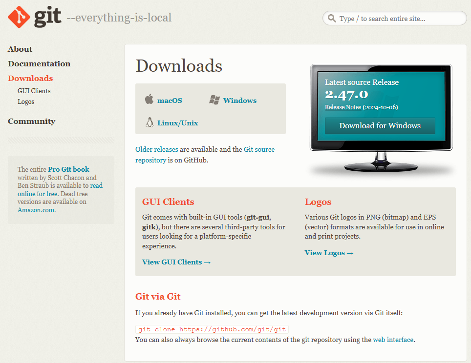
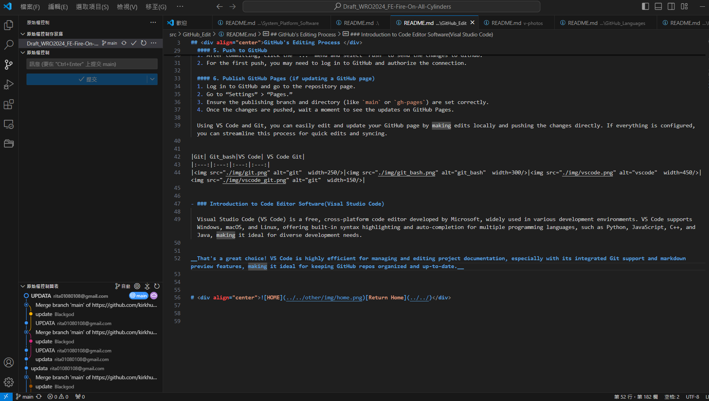

<div align="center"></div>

## <div align="center">Introduction to GitHub Editing Tools </div>
- Editing on the GitHub webpage is very intuitive and suitable for online editing; however, it is relatively inconvenient for adding or deleting files and folders. Therefore, our team has chosen to use offline editing. Below, we introduce the specific methods for offline editing.

- #### Offline Editing with VS Code + Git
  
  Here’s the process for editing a GitHub page using VS Code and Git:

  #### 1. Install Git and VS Code, and perform the initial configuration.
  - Please confirm that Git and VS Code software are installed on your computer. If they are not installed, please click the official website links below to download and install them.
  - Once Git is installed, it is advisable to set your username and email in the terminal or command prompt. This information will be associated with all your future commits.

    ```
      git config --global user.name "Your Name"
      git config --global user.email "your.email@example.com"
    ```
  <ul>
  <li><a href="https://git-scm.com/downloads" target="_blank">Git download page</a></li>
  <li><a href="https://code.visualstudio.com/Download" target="_blank">VS Code download page</a></li>
  </ul>
  

  #### 2. Clone the Repository from GitHub
  1. Open VS Code and press `Ctrl + Shift + P` (or `Cmd + Shift + P` on Mac) to open the Command Palette.
  2. Type `Git: Clone` and select that option.
  3. Paste the GitHub repository URL (e.g., `https://github.com/username/repo.git`) and press Enter.
  4. Select a local path as the workspace storage location. VS Code will automatically perform the Git Clone or Pull operation, downloading the repository content from GitHub to your local machine and initializing the project. This not only facilitates development but also ensures local backup of the data.

  #### 3. Edit Files
  - You can now browse and edit files in the project directly in VS Code. Any changes will appear instantly in the editor.

  #### 4. Commit Changes
  1. After making changes, click on the “Source Control” icon in the activity bar (usually the Git symbol).
  2. Review all uncommitted changes in the “Changes” section.
  3. Enter a commit message, like “Update index.html,” and then click the `✓` button to commit.

  #### 5. Push to GitHub  
  1. After committing, click the “...” menu and select “Push” to send the changes to GitHub.
  2. For the first push, you may need to log in to GitHub and authorize the connection.

  #### 6. Publish GitHub Pages (if updating a GitHub page)

  1. Log in to GitHub and go to the repository page.
  2. Go to “Settings” > “Pages.”
  3. Ensure the publishing branch and directory (like `main` or `gh-pages`) are set correctly.
  4. Once the changes are pushed, wait a moment to see the updates on GitHub Pages.

  Using VS Code and Git, you can easily edit and update your GitHub page by making edits locally and pushing the changes directly. If everything is configured, you can streamline this process for quick edits and syncing.
<div align="center">
<table>
<tr>
<th>Git Software</th>
<th>VS Code Software</th>
</tr>
<tr>
<td></td>
<td></td>
</tr>
</table>
</div>

- ### Introduction to Git Software

    Git is an open-source distributed version control system originally developed by Linus Torvalds, the creator of Linux, for managing large code repositories. Primarily used in software development, it effectively tracks and manages the historical changes of code and supports collaborative work among multiple developers.

    Key features and functions of Git include:

    - Version Management: It tracks every change made to the code, allowing developers to easily revert to previous code states and preserve every version of the code’s history.
    - Branch Management: Git allows developers to create and switch branches, enabling each team member to work independently on their own branch and later merge changes into the main branch. This is especially useful for collaboration and fast iteration.
    - Distributed Structure: Each developer’s local machine has a complete repository, which reduces dependence on a central server and increases speed and reliability.
    - Fast Merging and Conflict Resolution: Git efficiently merges branch changes and automatically detects conflicts, making it easier to resolve issues that arise during parallel development.
    
    Git is widely used in development, particularly when combined with remote code hosting platforms like GitHub and GitLab, allowing teams to collaborate, manage, and release projects with ease.
- ### Introduction to Code Editor Software(Visal Studio Code)


  Visual Studio Code (VS Code) is a powerful, free, and cross-platform code editor released by Microsoft, which has become the widely popular, first-choice tool in modern software development. It natively supports Windows, macOS, and Linux operating systems, and offers excellent built-in support for mainstream programming languages like Python, JavaScript, C++, and Java, including features like syntax highlighting and intelligent autocompletion, perfectly suiting diverse development scenarios. In recent years, by integrating the Copilot AI coding assistant, VS Code has significantly streamlined the programming process, markedly boosting development efficiency..

__That's a great choice! VS Code is highly efficient for managing and editing project documentation, especially with its integrated Git support and markdown preview features, making it ideal for keeping GitHub repos organized and up-to-date.__


# <div align="center">[Return Home](../../)</div>  


