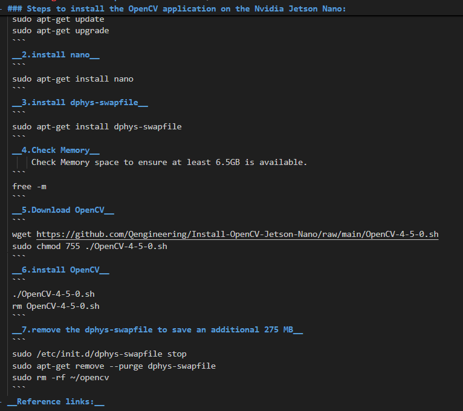
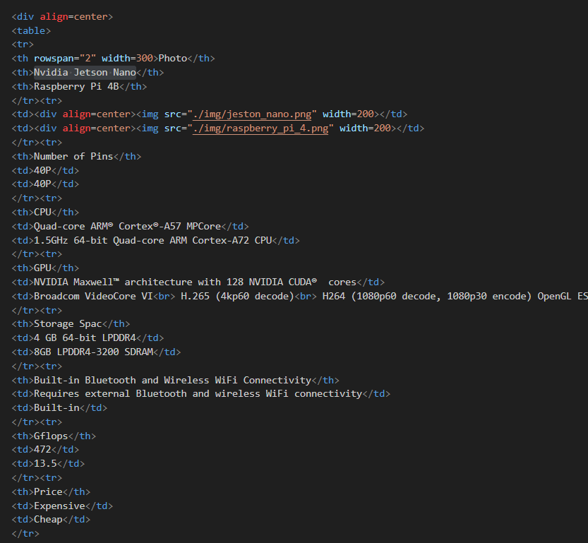

## 
GitHub Web Editing Languages-GitHub Web 編輯語言
 
### 中文:
 - 要在 GitHub 上撰寫工程文檔，我們需要學習以下兩類 Web 標記語言：
 - **HTML（超文本標記語言）**：HTML 是一種用於建立和建立網頁內容的標記語言。它定義了文字、圖像、連結和表格等元素的結構，使瀏覽器能夠正確顯示內容。在編寫工程文件時，HTML 幫助我們組織頁面結構，使資訊更具可讀性。
### 英文:
 - To write engineering documentation on GitHub, we need to learn the following two types of web markup languages:
  - **HTML (HyperText Markup Language)**: HTML is a markup language used to create and structure webpage content. It defines the structure for elements like text, images, links, and tables, allowing browsers to properly display content. When writing engineering documentation, HTML helps us organize the page structure, making information more readable.
    - #### [HTML Document link](https://www.w3schools.com/html/)
### 中文:
  - **Markdown**：Markdown 是一種輕量級標記語言，特別適合在 GitHub 上撰寫文件。它使用簡單的語法來格式化文本，例如標題、列表、連結、圖像和程式碼區塊。 Markdown 與 GitHub 內建渲染器無縫協作，讓工程文件易於閱讀和維護。
### 英文:
  - **Markdown**: Markdown is a lightweight markup language, especially suited for writing documentation on GitHub. It uses simple syntax to format text, such as headers, lists, links, images, and code blocks. Markdown works seamlessly with GitHub's built-in renderer, making engineering documentation easy to read and maintain. 
    - #### [Markdown Document link](https://markdown.tw/#link)

<table>
<tr align="center" >
<th>Markdown</th>
<th>HTML</th>
</tr>
<tr align="center">
<td> </td>
<td>HTML 語法"/> </td>
</tr>
</table>

# 
[Return Home](../../)
  

