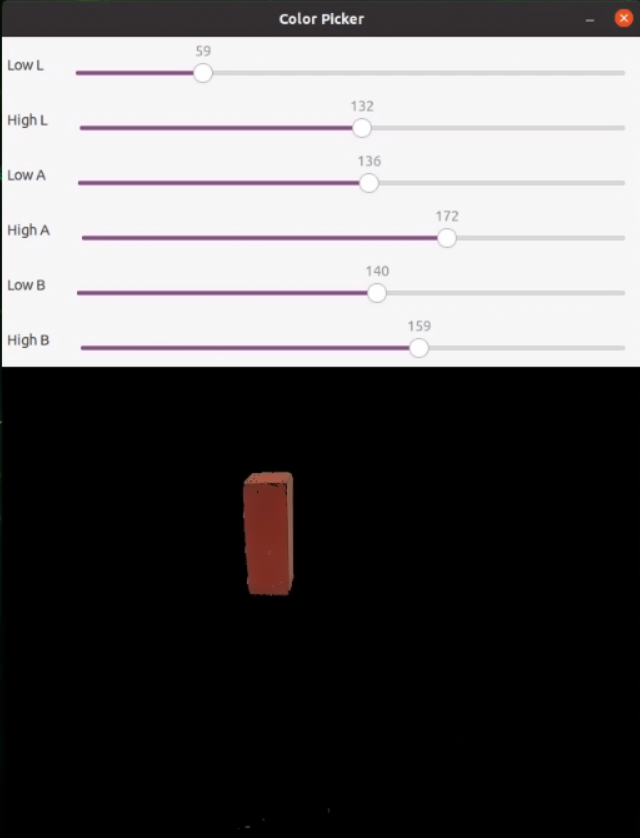
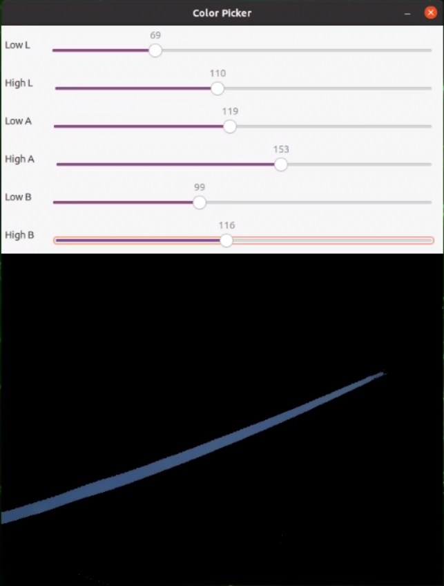
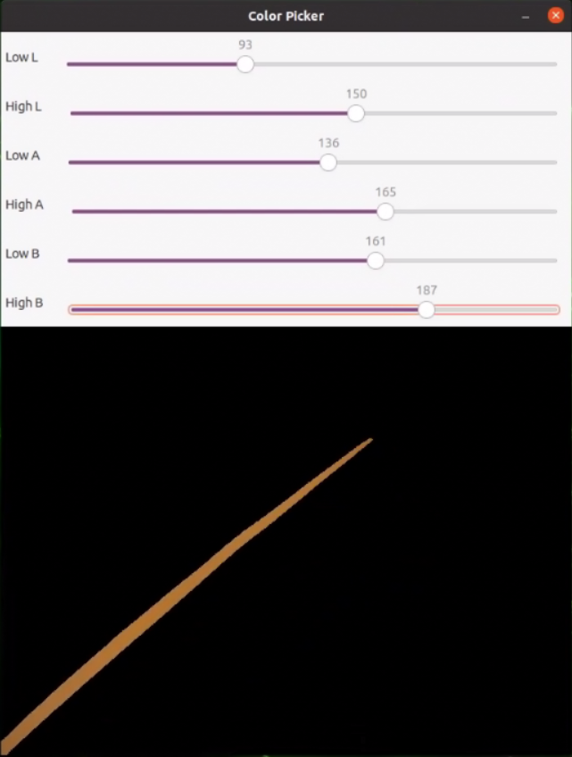
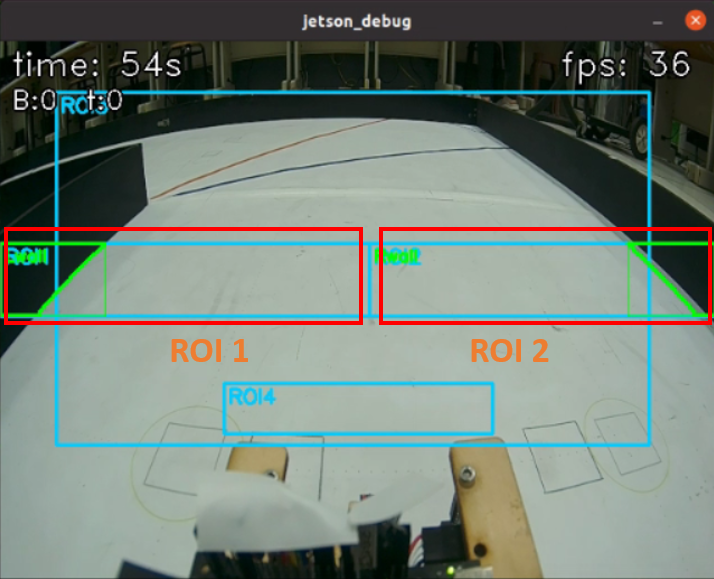
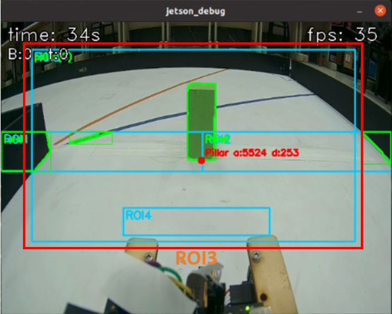
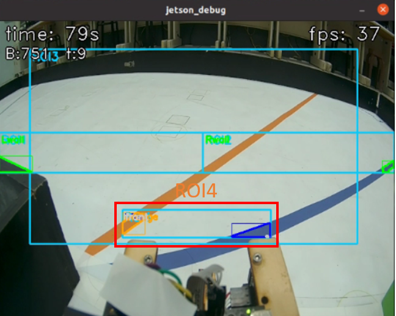
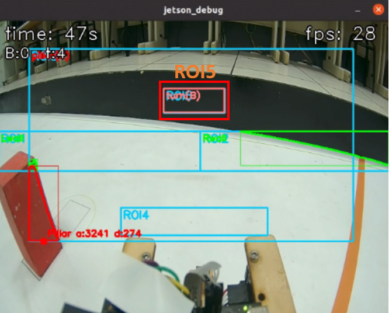
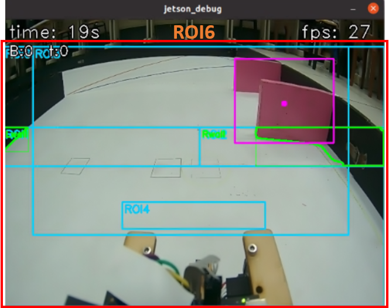

## 
Image Recognition Processing
 

  - There are six colors on the competition field—red, green, blue, orange, magenta, and black—which must be located via image recognition so the Vehicle can smoothly avoid obstacles or complete the assigned tasks.
  - We will use the popular image recognition software OpenCV to recognize objects on the competition field.
  
### Using LAB for Color Detection in OpenCV ([Color_LAB.py](../Programming/common/Color_LAB.py))
  - To perform color detection, we convert the RGB color space to LAB and define lower and upper LAB thresholds to establish a range, ensuring accurate target detection. The specific steps are as follows:

  1. **Color Conversion**:  
    - Use `cv2.cvtColor(image, cv2.COLOR_BGR2LAB)` to convert the RGB image to the LAB color space. L denotes lightness, ranging from 0 (black) to 100 (white); A denotes the red–green component (positive toward red, negative toward green); B denotes the yellow–blue component (positive toward yellow, negative toward blue). The key to using LAB for color recognition is separating lightness L from the chromatic channels A and B. In practice, you only need to tune the color thresholds on A and B to robustly filter the target color, while L can be adjusted to account for shadows, reflections, and exposure on site without interfering with color judgment.
  2. **Adjust Color-detection Thresholds**:  
    - Use `cv2.getTrackbarPos()` to read the real-time values from sliders (typically used with OpenCV’s window UI). The sliders can dynamically adjust the threshold parameters L HIGH, L LOW, A HIGH, A LOW, B HIGH, and B LOW. Tuning parameters on live video makes the process more intuitive and faster.
  3. **Filter The Target Color**:  
    - Use `cv2.inRange()` to set the lower and upper bounds of the color range and create a binary mask image. Pixels outside the range are set to black (value 0), which suppresses noise and preserves only the regions of the target color for subsequent processing and analysis.

<table>
<tr>
<th>Adjust the LAB range for red</th>
<th>Adjust the LAB range for green</th>
</tr>
<tr>
<td align="center"></td>
<td align="center"></td>
</tr>
<tr>
<th>Adjust the LAB range for blue</th>
<th>Adjust the LAB range for orange</th>
</tr>
<tr>
<td align="center"></td>
<td align="center"></td>
</tr>
</table>
<table>
<tr>
<th>Adjust the LAB range for magenta</th>
</tr>
<tr>
<td align="center"></td>
</tr>
</table>

### Using Edge Detection in OpenCV to trace the contours of the interior walls, exterior walls, red pillar, green pillar, orange lines, blue lines, and magenta walls, and to detect them with ROI (regions of interest)

  - Before the national selection rounds, we converted RGB images to grayscale and then to binary images to recognize the track walls. After the national selection rounds, we studied how other international teams recognized walls and objects and found that the Canadian team used edge detection to trace the contours of the interior walls, exterior walls, red pillar, green pillar, orange lines, blue lines, and magenta walls, which provided more stable detection. Therefore, we switched to an edge-detection approach: we define regions of interest (ROI1–ROI6), and for each target object we trace its contours within the corresponding ROI and convert them into X and Y coordinates and area. The specific steps are as follows:

    1. **Establish ROIs (regions of interest)**:  
      - Use `cv2.boundingRect()` to compute the axis-aligned minimum bounding rectangle for a set of points. It returns integer coordinates and size `(x, y, w, h)` and is commonly used to draw boxes or crop an ROI.
      - Use `cv2.rectangle(img, (x, y), (x + w, y + h), color, 1)` to draw a rectangle on `img`: `(x, y)` is the top-left corner, `(x + w, y + h)` is the bottom-right corner, `color` is a BGR triplet (e.g., `(255, 204, 0)` is cyan/blue-green), and the final `1` is the line thickness in pixels.

   2. **Draw contours for walls, objects, and lines**: 
      - Use `cv2.drawContours(img, contours, -1, color, thickness)` to render contours on `img`. `contours` is the list returned by `findContours`; `-1` means draw all contours in the list; `color` is BGR; `thickness` is the line width.
    3. **ROI1 and ROI2 overview**: 
      - On the CSI camera feed, define ROI1 and ROI2. Use ROI1 to detect the left wall and ROI2 to detect the right wall, trace the wall contours, and convert them to area values for computation on the Jetson Orin Nano.
   4. **ROI3 overview**: 
      - On the CSI camera feed, define ROI3. Use ROI3 to detect the red pillar and green pillar in straight segments, trace the pillar contours, and convert them to X/Y coordinates and area values as inputs to the Jetson Orin Nano.
    5. **ROI4 overview**: 
      - On the CSI camera feed, define ROI4. Use ROI4 to detect blue lines and orange lines in turning segments, trace the line contours, and convert them to area values as inputs to the Jetson Orin Nano.
   6. **ROI5 overview**: 
      - On the CSI camera feed, define ROI5. When the Self-Driving-Cars vehicle is in a cornering segment and ROI5 detects a wall, trace the wall contours and convert them to area values as inputs to the Jetson Orin Nano.
    7. **ROI6 overview**: 
      - On the CSI camera feed, define ROI6. During parking, use ROI6 to detect magenta walls in straight segments, trace the wall contours, and convert them to X/Y coordinates and area values as inputs to the Jetson Orin Nano.

  <!-- 上排（三欄） -->
  <table>
    <tr>
      <th width=400>Binarized wall detection</th>
      <th width=400>ROI1 and ROI2: detect walls</th>
      <th width=400>ROI3: detect the red pillar and green pillar</th>
    </tr>
    <tr>
      <td align="center">
        
      </td>
      <td align="center">
        
      </td>
      <td align="center">
        
      </td>
    </tr>
  </table>

  <!-- 下排（三欄） -->
  <table>
    <tr>
      <th>ROI4: detect orange lines and blue lines</th>
      <th>ROI5: assist in detecting the front wall</th>
      <th>ROI6: detect magenta walls</th>
    </tr>
    <tr>
      <td align="center">
        
      </td>
      <td align="center">
        
      </td>
      <td align="center">
        
      </td>
    </tr>
  </table>

# 
[Return Home](../../)
  
