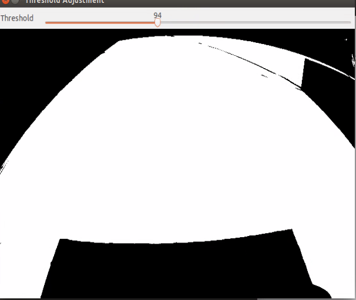
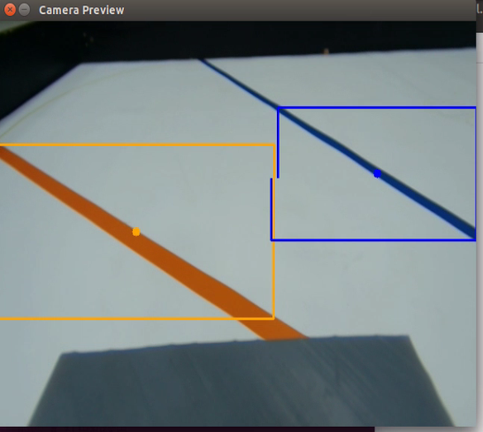

## 
Image Recognition Processing-影像辨識處理
 
### 中文:
  - 比賽場地上有紅、綠、藍、橙、粉、黑六種顏色，需要透過影像辨識來確定它們的位置，使車輛能夠順利避開障礙物或完成指定任務。 
  - 我們將使用流行的影像辨識軟體OpenCV來辨識比賽場上的物體。
  ### 英文:
  - On the competition field, there are six colors—red, green, blue, orange, pink, and black—that need to be identified through image recognition to determine their locations, enabling the vehicle to successfully avoid obstacles or complete designated tasks.
  - We will use the popular image recognition software OpenCV to identify objects on the competition field.
  
- #### Color Detection Using HSV in OpenCV-在 OpenCV 中使用 HSV 進行顏色檢測([jetson_nano_HSV.py](../Programming/common/jetson_nano_HSV.py))
  - 為了進行色彩偵測，我們將 RGB 色彩空間轉換為 HSV，並將 HSV 值分為上下限以建立範圍，確保準確的目標偵測。具體步驟如下：

  - To perform color detection, we convert the RGB color space to HSV and split the HSV values into upper and lower bounds to establish a range, ensuring accurate target detection. The detailed steps are as follows:
  ### 中文:
    1. **顏色轉換：**:
    使用 cv2.cvtColor(image, cv2.COLOR_BGR2HSV) 將 RGB 影像轉換為 HSV 色彩空間。HSV 色彩空間提供更直觀的顏色範圍控制，方便過濾特定顏色。
    2. **調整顏色範圍**：
    使用 cv2.getTrackbarPos() 函數取得滑桿的即時數值，通常配合 OpenCV 的視窗介面使用。在即時影像處理中，透過滑桿可動態調整參數，如門檻值或顏色範圍，方便測試與微調。
    3. **過濾目標顏色**：
    使用 cv2.inRange() 設定顏色範圍的上下界，建立二值遮罩圖像。此函數會將不在範圍內的像素轉為黑色（像素值為 0），過濾雜訊並保留目標顏色區域，以利後續處理與分析。
    ### 英文:
    1. **Color Conversion**:  
    Use `cv2.cvtColor(image, cv2.COLOR_BGR2HSV)` to convert the RGB image to HSV color space. The HSV space allows for more intuitive control over color range, making it easier to filter specific colors.
    2. **Adjusting Color Range**:  
    Use the function `cv2.getTrackbarPos()` to get the current value from the trackbar, which is typically used with an OpenCV display window. In real-time image processing, trackbars allow dynamic adjustment of parameters, such as the threshold or color range, making testing and fine-tuning convenient.
    3. **Filtering Target Color**:  
    Use `cv2.inRange()` to set the upper and lower bounds for the color range and create a binary mask image. This function converts out-of-range colors to black (pixel value 0), filtering out noise and retaining only the target color areas, facilitating further processing and analysis.
    

    <table>
    <tr>
    <th>Adjusting the HSV Range Values for Red Color(調整紅色的 HSV 範圍值)</th>
    <th>Adjusting the HSV Range Values for Green Color(調整綠色的 HSV 範圍值)</th>
    </tr>
    <tr>
    <td></td>
    <td></td>
    </tr>
    <tr>
    <th>Adjusting the HSV Range Values for Bule Color(調整藍色的 HSV 範圍值)</th>
    <th>Adjusting the HSV Range Values for Orange Color(調整橙色的 HSV 範圍值)</th>
    </tr>
    <tr>
    <td></td>
    <td></td>
    </tr>
    </table>
    <table>
    <tr>
    <th>Adjusting the HSV Range Values for Pink Color(調整粉紅色的 HSV 範圍值)</th>
    </tr>
    <tr>
    <td></td>
    </tr>
    </table>
    

- #### Adjust floor-to-boundary (black-and-white) threshold([jetson_nano_Binarized.py](../Programming/common/jetson_nano_binarization.py))
  ### 中文:
    在處理二值影像時，往往需要先將原始影像轉換為灰度，然後再進行二值化，以便更準確地處理特定任務。 
    1. **顏色轉換**:
    我們首先使用 `cv2.cvtColor(image, cv2.COLOR_BGR2GRAY)` 將 RGB 影像轉換為灰階影像，然後套用 `cv2.threshold(src,  thresh, maxval, type)` 將灰階影像轉換為二值影像。 
    2. **調整色彩範圍**：
    為了確保地板和側壁之間有清晰的黑白邊界，我們使用`cv2.getTrackbarPos()`來動態調整閾值，直到達到想要的邊界效果。
    When processing binary images, it is often necessary to convert the original image to grayscale first, followed by binarization, to handle specific tasks more accurately.
  ### 英文:
    1. **Color Conversion**:  
     We start by using `cv2.cvtColor(image, cv2.COLOR_BGR2GRAY)` to convert the RGB image to grayscale, then apply `cv2.threshold(src, thresh, maxval, type)` to transform the grayscale image into a binary image.
    2. **Adjusting Color Range**: 
     To ensure a clear black-and-white boundary between the floor and the sidewalls, we use `cv2.getTrackbarPos()` to dynamically adjust the threshold until the desired boundary effect is achieved.

     

     <table>
     <tr>
     <th>Adjust floor-to-boundary (black-and-white) threshold-調整地板到邊界（黑白）的閾值</th>
     </tr>
     <tr>
     <td></td>
     </tr>
     </table>
     

<table>
<tr>
<th> Obstacle Detection on in Images　(影像中的障礙物檢測）</th>
<th> Orange and Blue lines Detection on in Images（影像中的橙色和藍色線條檢測）</th>
<th> floor-to-boundary (black-and-white) Detection on in Images（影像中的地板到邊界（黑白）檢測）</th>
</tr>
<tr>
<td></td>
<td></td>
<td></td>
</tr>
</table>

# 
[Return Home](../../)
  
