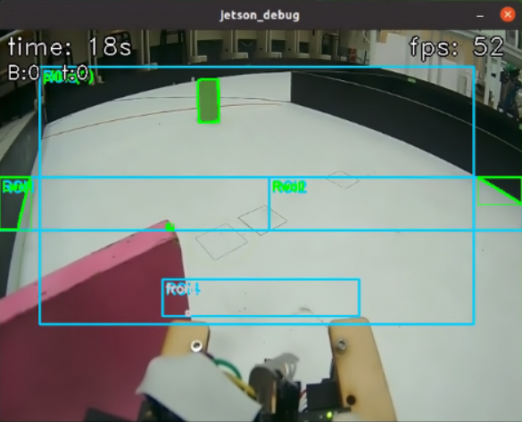
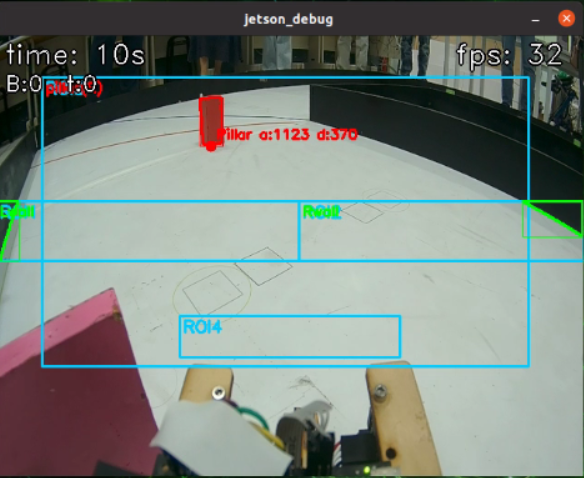
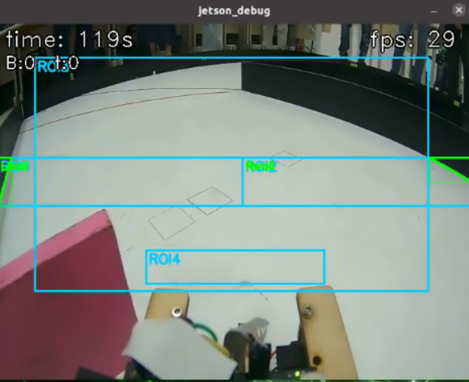

<div align=center>  </div>

## <div align="center">Overview of Parking Lot Departure Steering Control-停車場出發轉向控制概述</div> 

- ### 判斷行車方向
  ### 中文:
    - 我們首先判斷車輛的行駛方向是順時針還是逆時針，如果ROI2面積大於ROI1面積判斷是逆時針，ROI1面積大於ROI2面積是順時針。
  1. **ROI讀取面積介紹**:
    - 我們分別使用 pOverlap(img_lab, ROI1) 和 pOverlap(img_lab, ROI2)，透過 `pOverlap()`函式在左右兩側的 ROI 區域中，從 LAB 色彩空間影像 img_lab 內偵測出黑色區域，並進一步判斷這些區域是否與品紅色標記產生重疊。此步驟的主要目的在於辨識畫面左右兩側可能出現的牆面或立柱位置，為後續的輪廓擷取、面積分析與路徑判斷提供基礎依據。
  2. **找出ROI輪廓中最大面積**:
    - 我們使用 max_contour(contours_left, ROI1)[0] 與 max_contour(contours_right, ROI2)[0]，透過`max_contour()`函式分別從左右兩側偵測到的輪廓中，篩選出面積最大的輪廓區域，並取得其對應的面積值與中心點資訊。此步驟的目的在於找出畫面中最具代表性的牆面或立柱區塊，作為後續路徑判斷與方向控制的依據。
    
- program code:

```
        a = 0
        start_turn = 0
        while a == 0:
            rightArea = leftArea = areaFront = tArea = 0
            ok, img = cap.read()
            if not ok:
                continue
            img_lab = cv2.cvtColor(img, cv2.COLOR_BGR2Lab)
            img_lab = cv2.GaussianBlur(img_lab, (3,3), 0)

            contours_left  = pOverlap(img_lab, ROI1)
            contours_right = pOverlap(img_lab, ROI2)
            leftArea  = max_contour(contours_left,  ROI1)[0]
            rightArea = max_contour(contours_right, ROI2)[0]

            if leftArea - rightArea > 0:
                print("右轉"); start_turn = 1; a = 1
            else:
                print("左轉"); start_turn = 2; a = 1

        write(start_turn)     
```
<div align=center>

  |Counterclockwise_direction|The color and X, target coordinates of traffic signal blocks.|
  |:---:|:---:|
  |<div align="center"> </div>|<div align="center"> </div>|

</div> 

- ### 判斷顏色行駛路線
  ### 中文:
    - 若為逆時針方向，偵測到綠色柱子則行駛於內側，偵測到紅色柱子則行駛於外側，若未偵測到柱子，則預設行駛外側。
    - 若為順時針方向，偵測到綠色柱子則行駛於外側，偵測到紅色柱子則行駛於內側，若未偵測到顏色，則同樣行駛外側。

  1. **顏色輪廓偵測**:
    - 我們使用find_contours(img_lab, rRed,ROI3)和
    find_contours(img_lab, rGreen, ROI3)，這兩行使用 `find_contours()` 函式，在指定的區域 ROI3 內，從 LAB 色彩空間影像 img_lab 中分別偵測出**紅色區域（rRed）與綠色區
   （rGreen）**的所有輪廓（contours）。結果會是一組包含多個封閉區域的輪廓列表。
  2. **找出最佳立柱**:
    - 我們使用find_best_pillar(contours_red,redTarget,"red",img_lab)和find_best_pillar(contours_green, greenTarget, "green", img_lab)，這兩行使用
    `find_best_pillar()`函式會根據每個輪廓的大小、位置與距離目標點（redTarget / greenTarget）的遠近等條件進行評估。
    回傳的 best_red 與 best_green 各自顏色中評分最高、最接近可通過路線的立柱。若沒有找到符合條件的立柱，則可能回傳 None。


- program code:
    ```
        color = 0
        detect_start = time.time()
        TIMEOUT = 2.0
        while a == 1:
            ok, img = cap.read()
            if not ok:
                continue
            img_lab = cv2.cvtColor(img, cv2.COLOR_BGR2Lab)
            img_lab = cv2.GaussianBlur(img_lab, (3,3), 0)

            contours_left  = pOverlap(img_lab, ROI1, True)
            contours_right = pOverlap(img_lab, ROI2, True)
            leftArea  = max_contour(contours_left,  ROI1)[0]
            rightArea = max_contour(contours_right, ROI2)[0]

            contours_red   = find_contours(img_lab, rRed,   ROI3)
            contours_green = find_contours(img_lab, rGreen, ROI3)
            best_red,   _ = find_best_pillar(contours_red,   redTarget,   "red",   img_lab)
            best_green, _ = find_best_pillar(contours_green, greenTarget, "green", img_lab)
            candidates = [p for p in (best_red, best_green) if p is not None]
            cPillar = min(candidates, key=lambda P: P.dist) if candidates else Pillar(0, 1000000, 0, 0, 0)
            seen_green_wait = (cPillar.target == greenTarget and cPillar.area > 0)
            seen_red_wait   = (cPillar.target == redTarget   and cPillar.area > 0)

            # === RGB：看到綠亮綠；看到紅亮紅；其他關燈（等待階段）===
            if seen_green_wait:
                rgb.show("green")
            elif seen_red_wait:
                rgb.show("red")
            else:
                rgb.off()

            if start_turn == 2:
                if seen_green_wait: color = 1; print("green"); a = 2
                elif seen_red_wait: color = 2; print("red"); a = 2
                elif time.time() - detect_start > TIMEOUT: color = 3; a = 2
            else:
                if seen_green_wait: color = 4; print("green"); a = 2
                elif seen_red_wait: color = 5; print("red"); a = 2
                elif time.time() - detect_start > TIMEOUT: color = 6; a = 2

        print(color)
        write(color)
        time2 = time.time()
    ```
    

    <div align=center>
        <table>
          <tr>
            <th>Counterclockwise_green</th>
            <th>Counterclockwise_red</th>
            <th>Counterclockwise_NO</th>
          </tr>
          <tr>
            <td align=center></td>
            <td align=center></td>
            <td align=center></td>
          </tr>
        </table>
      </div>
    <div align=center>
    <div align=center>
        <table>
          <tr>
            <th>Counterclockwise_green</th>
            <th>Counterclockwise_red</th>
            <th>Counterclockwise_NO</th>
          </tr>
          <tr>
            <td align=center></td>
            <td align=center></td>
            <td align=center></td>
          </tr>
        </table>
      </div>
    <div align=center>


 

# <div align="center">[Return Home](../../)</div>  


