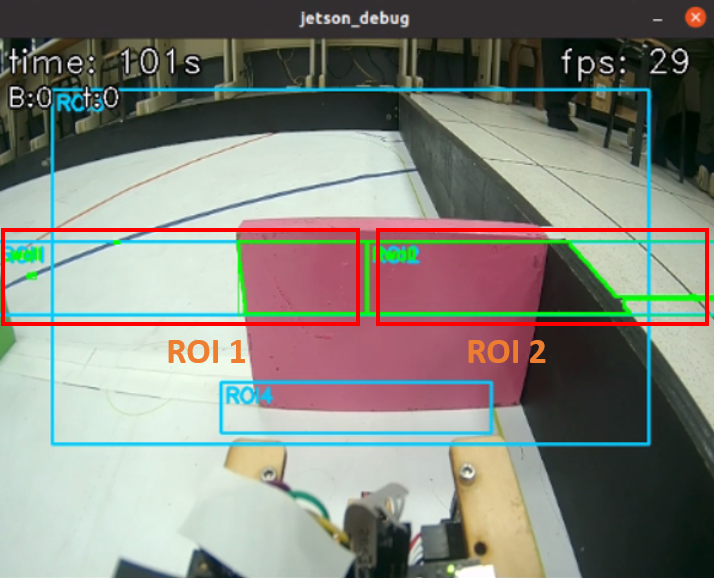
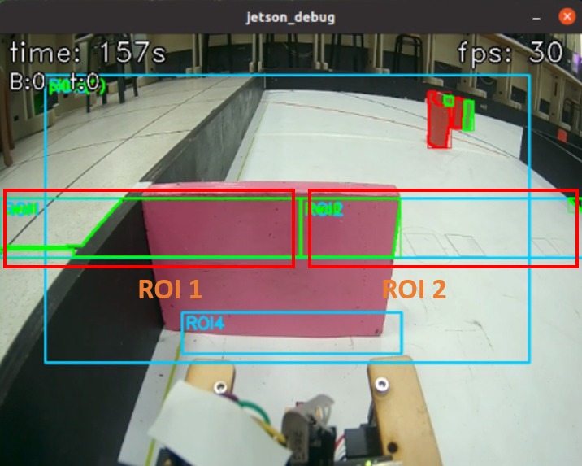
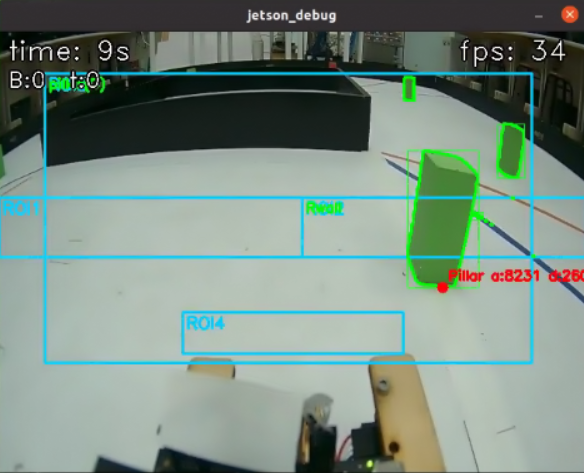
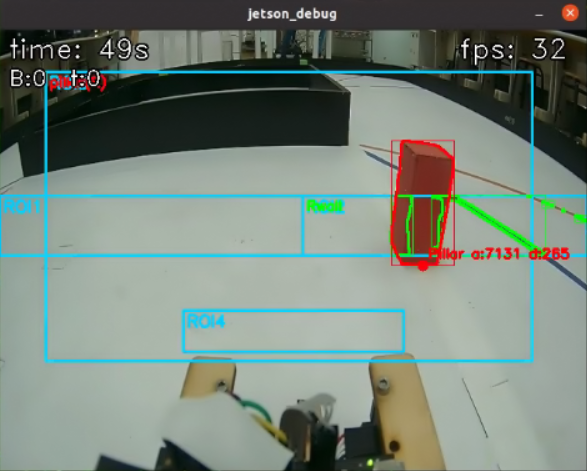
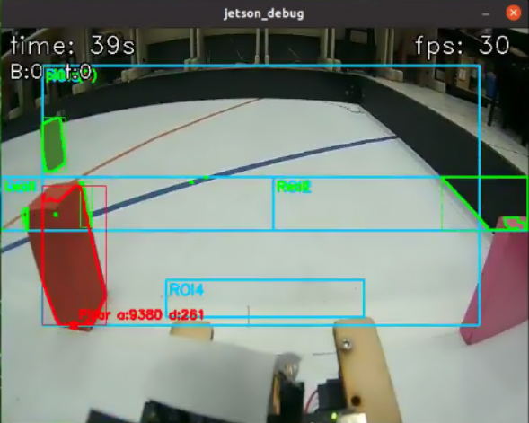
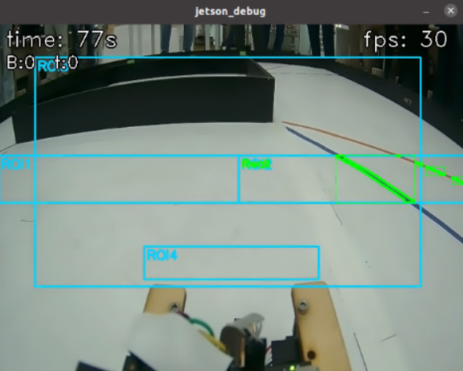
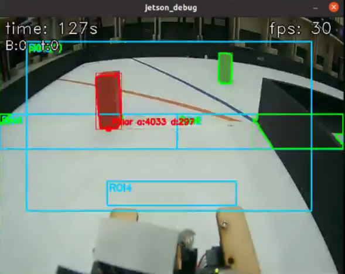

<div align=center>  </div>

## <div align="center">Overview of Parking Lot Departure Steering Control</div> 

- ### Determination of the Driving direction
  - Before the Vehicle departs from the parking lot, it utilizes the image captured by the CSI camera and applies the Region of Interest (ROI) technique to pre-determine the Driving direction. The determination logic is based on comparing the areas of `ROI_1` and `ROI_2`: if the area of `ROI_1` is greater than the area of `ROI_2`, the current Driving direction is determined to be the clockwise direction ; conversely, if the area of `ROI_2` is greater than the area of `ROI_1`, it is determined to be the Counterclockwise direction. Once the Driving direction is confirmed, the Vehicle exits the parking lot , and the system subsequently detects the presence of traffic signs blocks (red or green traffic signs) in the lane and executes the corresponding Lane Change decision based on the detected color.
    1. **ROI Area Reading and Wall Detection:**
      We utilize the functions `pOverlap(img_{lab}, ROI_1)` and `pOverlap(img_{lab}, ROI_2)` to detect black regions within the left and right `ROI` areas, using the `LAB` color space image `img_{lab}`. The `pOverlap()` function further determines whether these black regions overlap with the magenta markings. The primary goal of this step is to identify the positions of walls or pillars that may appear on the left and right sides of the image, thereby providing a solid basis for subsequent contour extraction, area analysis, and path determination. 

    2. **ROI Maximum Contour Area Extraction:**
      In the left and right `ROI` areas, we utilize the two functions `max_contour(contours_{left}, ROI_1)[0]` and `max_contour(contours_{right}, ROI_2)[0]`. Through the `max_contour()` function, the system can filter out the contour area of the largest black wall from the contours detected on both sides, and retrieve its corresponding area value and center point information. 

<div align=center>

  |Counterclockwise direction|Clockwise direction|
  |:---:|:---:|
  |<div align="center"> </div>|<div align="center"> </div>|

</div> 

- ### program code: ###

```python
a = 0
# Variable to store start turn direction (1=right, 2=left).start_turn = 0
# Loop until direction is determined.
while a == 0:
    # Reset area variables.
    rightArea = leftArea = areaFront = tArea = 0
    # Read a frame.
    ok, img = cap.read()
    # Skip if frame failed.
    if not ok:
        # Retry loop.
        continue
    # Convert to LAB color space.
    img_lab = cv2.cvtColor(img, cv2.COLOR_BGR2Lab)
    # Apply blur.
    img_lab = cv2.GaussianBlur(img_lab, (3,3), 0)

    # Find left wall contours (using pOverlap).
    contours_left   = pOverlap(img_lab, ROI1)
    # Find right wall contours.
    contours_right = pOverlap(img_lab, ROI2)
    # Get max area for left wall.
    leftArea    = max_contour(contours_left,  ROI1)[0]
    # Get max area for right wall.
    rightArea = max_contour(contours_right, ROI2)[0]

    # Compare areas to decide start direction.
    if leftArea - rightArea > 0:
        # Print and set direction to right.
        print("Turning Right"); start_turn = 1; a = 1
    # Otherwise, turn left.
    else:
        # Print and set direction to left.
        print("Turning Left"); start_turn = 2; a = 1
            
    # Ensure the frame is shown even while waiting. (Comment translated)
    # Ensure image is visible during waiting phase
    if debug:
        # Show the debug image.
        cv2.imshow("jetson_debug", img)
        # Check for 'q' to quit.
        if cv2.waitKey(1) == ord('q'):
            # Halt execution.
            raise HaltRun

# Send the start turn signal ('1' or '2') to Pico W.
write(str(start_turn))  
```

- ### Driving Route Decision Based on Color Recognition 
    - Counterclockwise direction : If the Driving direction is Counterclockwise direction , the Vehicle will drive on the inner wall of the lane when a green pillar is detected; it will drive on the exterior walls of the lane when a red pillar  is detected. If no pillar is detected, the default is to drive on the exterior walls  of the lane.
    - Clockwise direction : If the Driving direction is clockwise direction , the Vehicle will drive on the exterior walls of the lane when a green pillar is detected; it will drive on the inner wall of the lane when a red pillar  is detected. If no pillar is detected, the default is to drive on the exterior walls  of the lane.

  1. **Color Contour Detection**:
    We use the two lines of code: `find\_contours(img_{lab}, r_{Red}, ROI_3)` and `find\_contours(img_{lab}, r_{Green}, ROI_3)`. Through the `find\_contours()` function, the system can detect all contours of the red region (`r_{Red}`) and the green region (`r_{Green}`) from the `LAB` color space image `img_{lab}` within the specified Region of Interest `ROI_3`. The result of each detection is a list of contours containing multiple closed areas.
  2. **Detecting the Nearest Traffic Sign**:
    Subsequently, we call the functions `find\_best\_pillar(contours_{red}, redTarget, "red", img_{lab})` and `find\_best\_pillar(contours_{green}, greenTarget, "green", img_{lab})`. The `find\_best\_pillar()` function comprehensively evaluates each contour based on criteria such as size, position, and proximity to the target point (`redTarget` / `greenTarget`). The returned `best_{red}` and `best_{green}` are the pillars of their respective colors with the highest score and are closest to the passable route. If no suitable pillar is found, the function may return `None`.
    
  
    <div align=center>
    <table>
    <tr>
    <th>Counterclockwise Direction, Green Signal</th>
    <th>Drive on Inner Walls</th>
    </tr><tr>
    <td align=center></td>
    <td align=center></td>
    </tr>
    </table>
    </div>

    <div align=center>
    <table>
    <tr>
    <th>Counterclockwise Direction, Red Signal</th>
    <th>Drive on Exterior Walls</th>
    </tr><tr>
    <td align=center></td>
    <td align=center></td>
    </tr>
    </table>
    </div>

    <div align=center>
    <table>
    <tr>
    <th>Counterclockwise Direction, No Signal</th>
    <th>Drive on Exterior Walls</th>
    </tr><tr>
    <td align=center></td>
    <td align=center></td>
    </tr>
    </table>
    </div>

    <div align=center>
    <table>
    <tr>
    <th>Clockwise Direction, Green Signal</th>
    <th>Drive on Exterior Walls</th>
    </tr><tr>
    <td align=center></td>
    <td align=center></td>
    </tr>
    </table>
    </div>

    <div align=center>
    <table>
    <tr>
    <th>Clockwise Direction, Red Signal</th>
    <th>Drive on Inner Wall</th>
    </tr><tr>
    <td align=center></td>
    <td align=center></td>
    </tr>
    </table>
    </div>

    <div align=center>
    <table>
    <tr>
    <th>Clockwise Direction, Green Signal</th>
    <th>Drive on Exterior Walls</th>
    </tr><tr>
    <td align=center></td>
    <td align=center></td>
    </tr>
    </table>
    </div>
    
    <div align=center>
    <table>
    <tr>
    <th>Clockwise Direction, Red Signal</th>
    <th>Drive on Inner Wall</th>
    </tr><tr>
    <td align=center></td>
    <td align=center></td>
    </tr>
    </table>
    </div>

- ### program code: ###
    ```python
        color = 0
        # Record the start time for this detection phase.
        detect_start = time.time()
        # Set a timeout for color detection.
        TIMEOUT = 2.0
        # Loop while 'a' is 1 (detection phase).
        while a == 1:
            # Read a frame.
            ok, img = cap.read()
            # Skip if frame failed.
            if not ok:
                # Retry loop.
                continue
            # Convert to LAB and blur.
            img_lab = cv2.cvtColor(img, cv2.COLOR_BGR2Lab)
            # Apply blur.
            img_lab = cv2.GaussianBlur(img_lab, (3,3), 0)

            # Find wall contours (using 'add=True' for pOverlap).
            contours_left   = pOverlap(img_lab, ROI1, True)
            # Find right wall contours.
            contours_right = pOverlap(img_lab, ROI2, True)
            # Get max area for left wall.
            leftArea    = max_contour(contours_left,  ROI1)[0]
            # Get max area for right wall.
            rightArea = max_contour(contours_right, ROI2)[0]

            # Find red pillar contours in ROI3.
            contours_red   = find_contours(img_lab, rRed,   ROI3)
            # Find green pillar contours in ROI3.
            contours_green = find_contours(img_lab, rGreen, ROI3)
            # Find the best (closest) red pillar.
            best_red,   _ = find_best_pillar(contours_red,   redTarget,   "red",   img_lab)
            # Find the best (closest) green pillar.
            best_green, _ = find_best_pillar(contours_green, greenTarget, "green", img_lab)
            # Create a list of valid (non-None) candidates.
            candidates = [p for p in (best_red, best_green) if p is not None]
            # Select the closest pillar from the candidates, or create a dummy far-away pillar.
            cPillar = min(candidates, key=lambda P: P.dist) if candidates else Pillar(0, 1000000, 0, 0, 0)
            # Check if the closest pillar is green.
            seen_green_wait = (cPillar.target == greenTarget )
            # Check if the closest pillar is red.
            seen_red_wait   = (cPillar.target == redTarget)

            # === RGB: Green if green seen; Red if red seen; Off otherwise ===
            # If green is seen:
            if seen_green_wait:
                # Show green on RGB LED.
                rgb.show("green")
            # If red is seen:
            elif seen_red_wait:
                # Show red on RGB LED.
                rgb.show("red")
            # Otherwise:
            else:
                # Turn RGB LED off.
                rgb.off()

            # Determine the color signal code based on start_turn and detected color.
            if start_turn == 2: # Left start
                # If green seen:
                if seen_green_wait: color = 1; print("green"); a = 2
                # If red seen:
                elif seen_red_wait: color = 2; print("red"); a = 2
                # If timeout:
                elif time.time() - detect_start > TIMEOUT: color = 3; a = 2
            # If start_turn == 1 (Right start)
            else:
                # If green seen:
                if seen_green_wait: color = 4; print("green"); a = 2
                # If red seen:
                elif seen_red_wait: color = 5; print("red"); a = 2
                # If timeout:
                elif time.time() - detect_start > TIMEOUT: color = 6; a = 2

            # If in debug mode:
            if debug:
                # Draw the ROI boxes.
                draw_roi_boxes(img, [ROI1, ROI2, ROI3], color=(255, 204, 0), thickness=2)
                # Show the debug image.
                cv2.imshow("jetson_debug", img)
                # Check for 'q' to quit.
                if cv2.waitKey(1) == ord('q'):
                    # Halt execution.
                    raise HaltRun

        # Print the color signal code to be sent.
        print(f"Sending color signal: {color}")
        # Send the color signal ('1' - '6') to Pico W.
        write(str(color)) 

        # Record a timestamp for the final wait.
        time2 = time.time()
        # Loop while 'a' is 2 (final wait phase).
    ```

# <div align="center">[Return Home](../../)</div>
