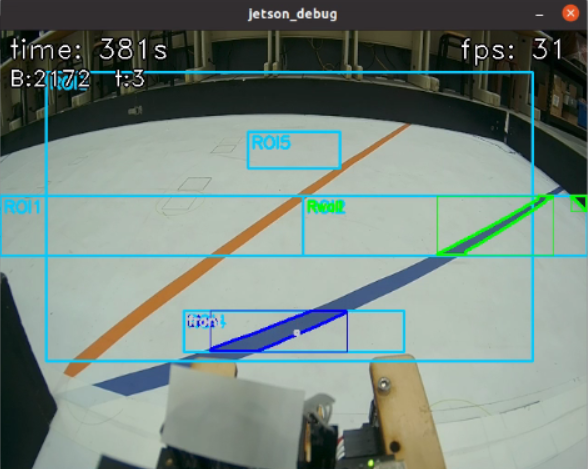
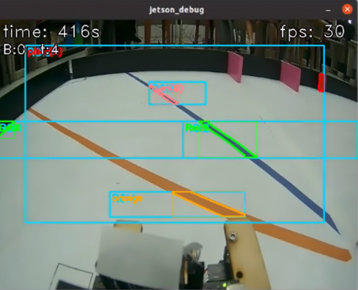
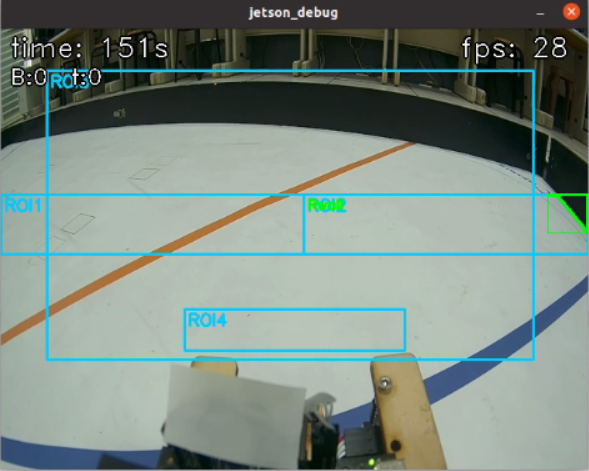
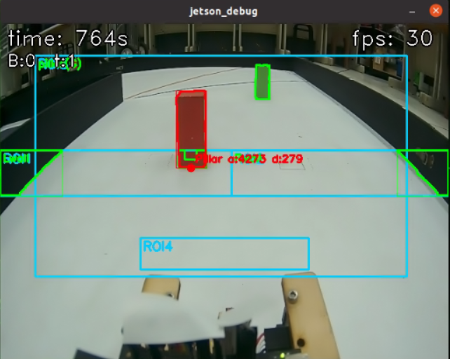
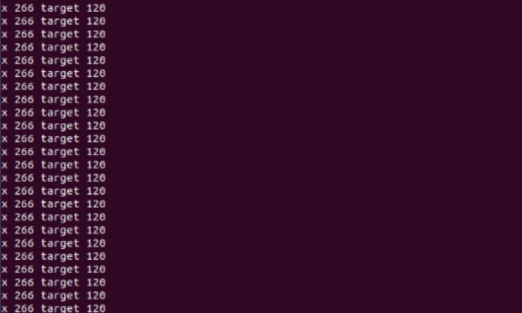

<div align=center>  </div>

## <div align="center">Steering Control Overview</div> 

 - ### Vehicle steering control
    1. **Direction Determination**:
        * The system uses the **Jetson Orin Nano controller** to read the image stream from the **CSI camera**. It then utilizes the designated **Region of Interest (ROI4)** to detect the **orange and blue lines** on the track, thereby determining whether the vehicle should execute a **left turn or a right turn**.
        * **Right Turn Decision:** If the **contour area of the detected orange line (maxO)** **exceeds the preset threshold (> 110)**, the system decides that a **right turn ("right")** is required.
        * **Left Turn Decision:** If the **contour area of the detected blue line (maxB)** **exceeds the preset threshold (> 110)**, the system decides that a **left turn ("left")** is required.
    2. **Curve Entry Signal**:
        * **Condition Check:** Once the system **confirms the intended turning direction** and **detects the corresponding turn line marker** (e.g., if a right turn is intended, the condition **`maxO > 100`** must be met), the system determines that curve entry is necessary.
        * **Flag Setting:** Subsequently, the system sets the primary **turning signal flag (`tSignal = True`)**, and simultaneously sets the **`rTurn` (right turn) or `lTurn` (left turn) flag** according to the direction, signaling the control logic to begin the turning maneuver.
    3. **Curve Auxiliary Detection and Avoidance Mechanism**:
        * **Trigger Condition:** When the **contour area of the wall on either side** (**`leftArea` (from ROI1) or `rightArea` (from ROI2)**) **exceeds the preset threshold of 1000**, the system determines that the vehicle is too close to the wall.
        * **Dynamic ROI Adjustment:** The system automatically activates a **smaller, high-sensitivity Region of Interest (ROI5)**, with coordinates `[270, 110, 370, 150]`, specifically designed to **enhance the detection of black and magenta contours**.
        * **Outer Wall Contact Reaction:** As soon as **ROI5 detects contact with the outer wall**, the system immediately **increases the steering angle**, causing the vehicle to turn more sharply to **prevent the vehicle body from colliding with the outer wall**.
    - Program code:
    ```python
    if turnDir == "none":
      if maxO > 110:
        turnDir = "right"
      elif maxB > 110:
        turnDir = "left"
    if (turnDir == "right" and maxO > 100) or (turnDir == "left" and maxB > 100):
      t2 = t
      if t2 == 7 and not pillarAtStart:
        ROI3[1] = 110
      if cPillar.area != 0 and ((leftArea > 1000 and turnDir == "left") or (rightArea > 1000 and turnDir == "right")):
        ROI5 = [270, 110, 370, 150]
      if turnDir == "right":
        rTurn = True
    else:
      lTurn = True
      if t == 0 and pillarAtStart == -1:
        pillarAtStart = True if ((startArea > 2000 and startTarget == greenTarget) or (startArea > 1500 and startTarget == redTarget)) else False
        tSignal = True
      elif (turnDir == "left" and maxO > 100) or (turnDir == "right" and maxB > 100):
        if t2 == 11:
          s = 2
          sTime = time.time()
    ```
     <div align=center>
        <table>
        <tr>
        <th>Blue Line Recognition</th>
        <th>Orange Line Recognition</th>
        </tr><tr>
        <td></td>
        <td></td>
        </tr>
        </table>
        </div>
     <div align=center>
        <table>
        <tr>
        <th>Turning with traffic signals</th>
        <th>Turning without traffic signals</th>
        </tr><tr>
        <td></td>
        <td></td>
        </tr>
        </table>
        </div>
     <div align=center>
        <table>
        <tr>
        <th>ROI5 assists in corner detection 
        before turning</th>
        <th>ROI 5 assisted turning detection</th>
        </tr><tr>
        <td></td>
        <td></td>
        </tr>
        </table>
        </div>   

  
</div> 

- ### Vehicle block avoidance control
  - According to task requirements, when the vehicle detects a red traffic signal block, the system triggers a rightward bypass maneuver; when it encounters a green block, it triggers a leftward bypass maneuver.
  - As the vehicle moves, the camera transmits video to the controller (Jetson Orin Nano), which then performs image processing to obtain the X and Y coordinates and the area size of objects in the frame. This data helps the controller determine the position and distance of objects for accurate navigation and obstacle avoidance.
  - Quadratic Bézier curves in red and green are drawn on the captured image to guide the vehicle toward the traffic signal and accurately position the block along the curve.
  
- The vehicle completes the traffic signal block avoidance through the following steps:
    
    1. The system detects traffic signal blocks through the camera and uses image recognition to analyze the y-coordinate, area, and color of the blocks, thereby determining the position of the block closest to the vehicle.
    2. Next, the system obtains the X-coordinate of the nearest block and compares it with the corresponding X-coordinate on the Bézier curve to calculate the X-axis deviation. The deviation is then multiplied by a preset avoidance coefficient to determine the final error value.
    3. Finally, based on the calculated error value, the servo motor's turning direction is adjusted to steer the vehicle appropriately, effectively avoiding the block and ensuring the safety and stability of its driving path.
    
<div align=center>

  |Recognize the color of traffic signal blocks.|The color and X, target coordinates of traffic signal blocks.|
  |:---:|:---:|
  |<div align="center"> </div>|<div align="center"> </div>|

# <div align="center">[Return Home](../../)</div>  


