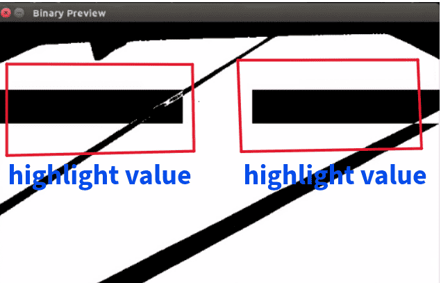
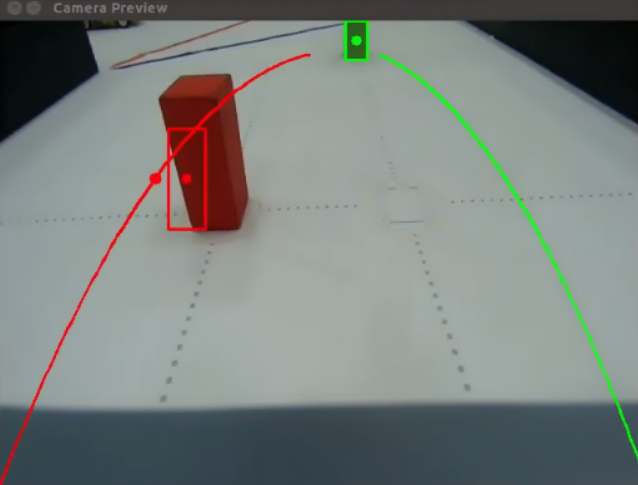
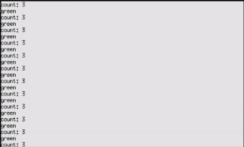
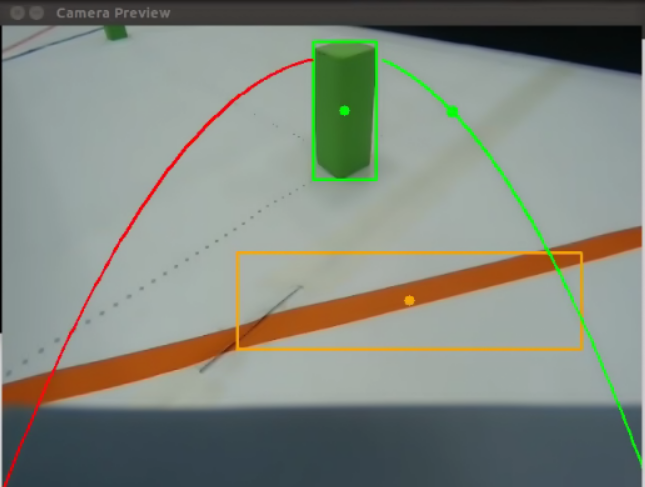

<div align=center>  </div>

## <div align="center">Steering Control Overview-轉向控制概述</div> 

 - ### Vehicle steering control-車輛轉向控制
    ### 中文:
    - 當車輛偵測到地面上的藍線或橘線時，系統會觸發轉向動作。側壁的突出顯示值偵測可確保車輛保持安全距離以避免碰撞，而藍線和橙線則可偵測可識別車輛的轉彎方向，使其能夠安全、精確地導航曲線或轉角處。 
    - 當車輛移動時，系統使用攝影機偵測突出顯示的值以及地面上的藍線和橙線。當接近轉彎時，系統會評估藍線和橙線的 y 軸位置，並使用這些值來確定轉彎的接近程度。距離越近，y軸值越大。系統選擇y軸值最大的顏色作為轉向的依據，確保轉向準確。 
    - 確定轉彎方向後，系統進一步評估攝影機視圖左側和右側突出顯示的值。只有當高亮值達到或超過4500時，才會啟動轉彎動作，這樣的設定可以有效防止過早轉彎，降低車輛因過早轉向而撞到側壁的風險，確保轉彎的準確性和安全性。
   ### 英文:
    - When the vehicle detects a blue or orange line on the ground, the system triggers a steering action. Highlighted value detection of the sidewall ensures the vehicle maintains a safe distance to avoid collisions, while the blue and orange line detection identifies the vehicle’s turning direction, allowing it to navigate curves or corners safely and precisely.
    - As the vehicle moves, the system uses the camera to detect highlighted values and the blue and orange lines on the ground. When approaching a turn, the system assesses the y-axis position of the blue and orange lines and uses these values to determine the proximity of the turn. The closer the distance, the larger the y-axis value. The system selects the color with the largest y-axis value as the basis for steering direction, ensuring accurate turning.
    - After determining the turning direction, the system further evaluates the highlighted values on the left and right sides of the camera view. The turn action only initiates when the highlighted value reaches or exceeds 4500. This setup effectively prevents premature turning, reducing the risk of the vehicle hitting the sidewall due to early steering, and ensures accuracy and safety in turning.
        - program code:
      ```
      if roi_values[0] >= roi_values[1]:
         if roi_values[0] >= 4500:
            print("right")
            combined_control_signal = pd_control(4500, roi_values[0], kp_roi, kd_roi)
         else:
            if roi_values[1] >= 4500:
               print("left")
              combined_control_signal = -pd_control(4500, roi_values[1], kp_roi, kd_roi)
      ```
<div align=center>

  |Sidewall highlighted value detection(側壁突出值檢測)
  |Field blue and orange line recognition(場地藍橙線識別)|
  |:---:|:---:|
  |<div align="center"> </div>|<div align="center"> </div>|

</div> 

- ### Vehicle block avoidance control-車輛避障控制
   ### 中文:
  - 根據任務需求，當車輛偵測到紅色交通號誌遮擋時，系統觸發向右繞行機動；當遇到綠色障礙物時，它會觸發向左繞行機動。 
  - 當車輛移動時，攝影機將視訊傳送到控制器（Jetson Nano），然後控制器進行影像處理以取得 X 和 Y 座標以及畫面中物體的面積大小。這些數據可協助控制器確定物體的位置和距離，從而實現精確導航和避障。 
  - 在捕獲的影像上繪製紅色和綠色的二次貝塞爾曲線，以引導車輛駛向交通號誌燈，並沿著曲線準確定位路障。
 ### 英文:
  - According to task requirements, when the vehicle detects a red traffic signal block, the system triggers a rightward bypass maneuver; when it encounters a green block, it triggers a leftward bypass maneuver.
  - As the vehicle moves, the camera transmits video to the controller (Jetson Nano), which then performs image processing to obtain the X and Y coordinates and the area size of objects in the frame. This data helps the controller determine the position and distance of objects for accurate navigation and obstacle avoidance.
  - Quadratic Bézier curves in red and green are drawn on the captured image to guide the vehicle toward the traffic signal and accurately position the block along the curve.
  
  - The vehicle completes the traffic signal block avoidance through the following steps:
    
    1. The system detects traffic signal blocks through the camera and uses image recognition to analyze the y-coordinate, area, and color of the blocks, thereby determining the position of the block closest to the vehicle.
    2. Next, the system obtains the X-coordinate of the nearest block and compares it with the corresponding X-coordinate on the Bézier curve to calculate the X-axis deviation. The deviation is then multiplied by a preset avoidance coefficient to determine the final error value.
    3. Finally, based on the calculated error value, the servo motor's turning direction is adjusted to steer the vehicle appropriately, effectively avoiding the block and ensuring the safety and stability of its driving path.
    
<div align=center>

  |Recognize the color of traffic signal blocks.|The color and X, Y coordinates of traffic signal blocks.|
  |:---:|:---:|
  |<div align="center"> </div>|<div align="center"> </div>|

</div>  


 - ### Vehicle U-turn control
    - According to task requirements, when the vehicle starts, if the traffic signal block behind it is red, the vehicle needs to make a U-turn and travel one loop in the opposite direction after completing the second lap around the course.
    - The system uses the camera to detect the presence of blue or orange lines and the gyroscope to check if the current angle is within ±35 degrees of the target angle. If these conditions are met, the turn count variable is incremented, and the system further checks if the vehicle has reached the final area of the second lap. Once a lap is completed, the lap count variable is incremented.
    - After completing a lap, the turn count variable is reset and starts counting anew. When the turn count variable reaches 3, it indicates that the vehicle has entered the final area of the second lap.
    - Upon reaching the final area of the second lap, the system will determine if the last traffic signal block is red. If it is red, the vehicle will perform a U-turn; if it is not red, the vehicle will continue forward.
 <div align="center">

|Display the current traffic signal block color and variables.|Record the last green block|
|:---:|:---:
|<div align="center"> </div>|<div align="center"> </div>|

</div>


# <div align="center">[Return Home](../../)</div>  


