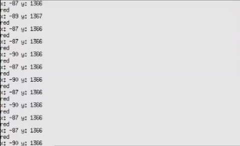

<div align=center>  </div>

## <div align="center">Steering Control Overview</div> 

 - ### Vehicle steering control
    
    1. **Direction Determination**:
        * The system uses the **Jetson Orin Nano controller** to read the image stream from the **CSI camera**. It then utilizes the designated **Region of Interest (ROI4)** to detect the **orange and blue lines** on the track, thereby determining whether the vehicle should execute a **left turn or a right turn**.
        * **Right Turn Decision:** If the **contour area of the detected orange line (maxO)** **exceeds the preset threshold (> 110)**, the system decides that a **right turn ("right")** is required.
        * **Left Turn Decision:** If the **contour area of the detected blue line (maxB)** **exceeds the preset threshold (> 110)**, the system decides that a **left turn ("left")** is required.
    2. **Curve Entry Signal**:
        * **Condition Check:** Once the system **confirms the intended turning direction** and **detects the corresponding turn line marker** (e.g., if a right turn is intended, the condition **`maxO > 100`** must be met), the system determines that curve entry is necessary.
        * **Flag Setting:** Subsequently, the system sets the primary **turning signal flag (`tSignal = True`)**, and simultaneously sets the **`rTurn` (right turn) or `lTurn` (left turn) flag** according to the direction, signaling the control logic to begin the turning maneuver.
    3. **Curve Auxiliary Detection and Avoidance Mechanism**:
        * **Trigger Condition:** When the **contour area of the wall on either side** (**`leftArea` (from ROI1) or `rightArea` (from ROI2)**) **exceeds the preset threshold of 1000**, the system determines that the vehicle is too close to the wall.
        * **Dynamic ROI Adjustment:** The system automatically activates a **smaller, high-sensitivity Region of Interest (ROI5)**, with coordinates `[270, 110, 370, 150]`, specifically designed to **enhance the detection of black and magenta contours**.
        * **Outer Wall Contact Reaction:** As soon as **ROI5 detects contact with the outer wall**, the system immediately **increases the steering angle**, causing the vehicle to turn more sharply to **prevent the vehicle body from colliding with the outer wall**.

   - ### **program code:**
    ```python
    if turnDir == "none":
      if maxO > 110:
        turnDir = "right"
      elif maxB > 110:
        turnDir = "left"
    if (turnDir == "right" and maxO > 100) or (turnDir == "left" and maxB > 100):
      t2 = t
      if t2 == 7 and not pillarAtStart:
        ROI3[1] = 110
      if cPillar.area != 0 and ((leftArea > 1000 and turnDir == "left") or (rightArea > 1000 and turnDir == "right")):
        ROI5 = [270, 110, 370, 150]
      if turnDir == "right":
        rTurn = True
    else:
      lTurn = True
      if t == 0 and pillarAtStart == -1:
        pillarAtStart = True if ((startArea > 2000 and startTarget == greenTarget) or (startArea > 1500 and startTarget == redTarget)) else False
        tSignal = True
      elif (turnDir == "left" and maxO > 100) or (turnDir == "right" and maxB > 100):
        if t2 == 11:
          s = 2
          sTime = time.time()
    ```
     <div align=center>
      <table>
      <tr>
      <th  align=center width="50%">Blue Line Detected in ROI4</th>
      <th  align=center width="50%">Orange Line Detected in ROI4</th>
      </tr><tr>
      <td  align=center width="50%"></td>
      <td  align=center width="50%"></td>
      </tr>

      <tr>
      <th  align=center width="50%">Performing Avoidance Maneuvers Upon Traffic Signal Detection</th>
      <th  align=center width="50%">Performing Turns Without Traffic Signal Detection</th>
      </tr><tr>
      <td  align=center width="50%"></td>
      <td  align=center width="50%"></td>
      </tr>

      <tr>
      <th  align=center width="50%">Activation of Auxiliary ROI5 Triggered by Inner Wall Detection During Turning Mode</th>
      <th  align=center width="50%">Executing Evasion Maneuver Upon Outer Wall Detection by ROI5</th>
      </tr><tr>
      <td  align=center width="50%"></td>
      <td  align=center width="50%"></td>
      </tr>
      </table>
     </div>   

- ### Vehicle Obstacle Avoidance Control

  * According to the mission requirements, when the vehicle detects a **Red Traffic Sign/Obstacle**, the system triggers a **Right Evasion Maneuver**.Conversely, when a **Green Obstacle** is encountered, the system triggers a **Left Evasion Maneuver**.
  * As the vehicle moves, the **camera** transmits the **video stream** to the main controller (**Jetson Orin Nano**).The controller then performs **image processing** to determine the **ideal X-coordinate position** of the **target pillar** within the image frame.This visual data (specifically the X-coordinate) assists the controller in **determining the object's spatial position and distance**, enabling **precise navigation and obstacle avoidance**.
  * On the captured image, the system uses the **`boundingRect()` function** to **draw a rectangle** around the target contour.This function returns the **X and Y coordinates of the rectangle's top-left corner**. When applied to the signal pillar's contour, these coordinates are then used to **determine its precise position** within the frame.
  
- **The vehicle completes the precise maneuver to avoid traffic signals (colored pillars) through the following three main steps:**
    
    1.  **Target Pillar Selection and Distance Calculation:**
        * If **two or more pillars** appear on the camera screen, the system calculates the distance from the **center point of the screen's bottom edge** to the **center point of the bottom of each pillar**.
        * The system selects the **pillar closest to the vehicle** as the current avoidance target, using its data to calculate the required servo motor steering angle.
    2.  **PD Control-Based Steering Decision:**
        * Steering control employs a **PD Control Algorithm**. The system calculates the angle based on the difference (error) between the **pillar's X-coordinate** and its **predetermined target X-coordinate**.
        * **Target X-coordinate Settings:**
          * The target X-coordinate for the **Green Pillar** is set to **430**.
          * The target X-coordinate for the **Red Pillar** is set to **110**.
    3.  **Safety Wall Avoidance Priority Mechanism:**
        * **Priority Check:** Simultaneously while detecting pillars, the system **continuously monitors the contour area of the left or right side walls**.
        * **Safety Override:** If the area of either side wall is **excessively large** (reaching a critical threshold), the system **cancels the current pillar selection** and **switches the control priority to wall avoidance**. The steering angle is then determined by the wall area deviation, causing the vehicle to **steer towards the center of the lane** to **prevent collision with the walls**, thereby ensuring safety.
    
<div align=center>

  |Recognize the color of traffic signal blocks.|The color and X, target coordinates of traffic signal blocks.|
  |:---:|:---:|
  |<div align="center"> </div>|<div align="center"> </div>|

# <div align="center">[Return Home](../../)</div>  
