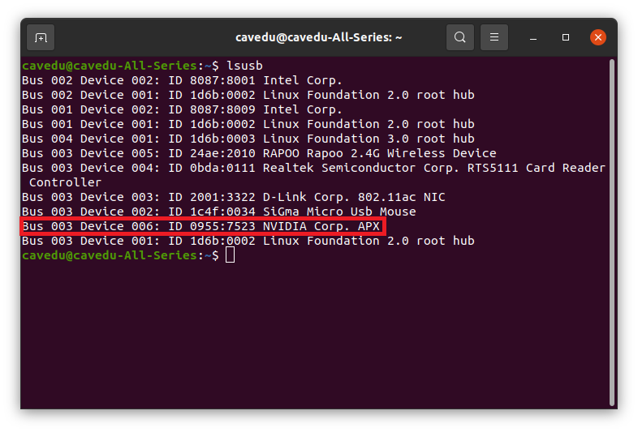
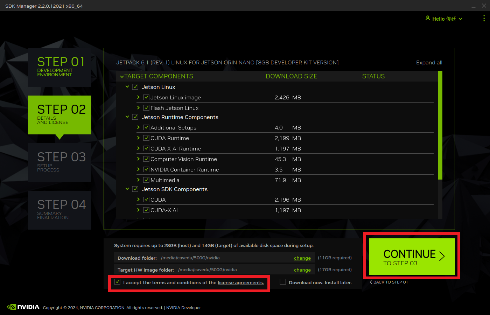

<div align=center>  </div>

## <div align="center">Software Platform Construction </div> 
- ### __Installing System Software Required for Self-Driving Cars__

   - ### Self-Driving Car Operating System Installation Flowchart-系統安裝流程圖

   <div align=center>
   
   </div>

   - ### Installing the Operating System on Nvidia Jetson Orin Nano

      - #### Preparation Before Installation - 操作前的準備
         - 請配置或備妥一台運行 Ubuntu 作業系統的實體主機。 嚴禁使用任何虛擬化環境 (如虛擬機) 來執行相關任務。
         - 務必確認您的 Jetson Orin Nano 已妥善安裝固態硬碟 (SSD)。
         - Please prepare or configure a physical host machine running the Ubuntu operating system. The use of any virtualization environment (such as a virtual machine) for executing the relevant tasks is strictly prohibited.
         - Please ensure that a Solid-State Drive (SSD) is properly installed on your Jetson Orin Nano.

      - #### NVIDIA SDK Manager Installation

         - Download [NVIDIA SDK Manager 2.3.0](https://developer.nvidia.com/sdk-manager)

          <div align=center></div>

         - Double-click the installation package to install, and upon completion and successful login, launching the application will display the following screen雙擊安裝包開始安裝，安裝完成後，登入並開啟（應用程式），即可看到以下畫面 
          <div align=center></div>

   
      - #### JetPack Software Version Installation, Upgrade, and Downgrade Guide

         - SDK Manager 是 NVIDIA 的官方工具，可為 Jetson 主機執行 JetPack 版本的安裝、升級與降級。操作前請先將 Nvidia Jetson Orin Nano 切換至 Recovery Mode 並依指示接通電源與連線。以下為 SDK Manager 的操作流程。
         - SDK Manager is an official tool from NVIDIA that allows you to install, upgrade, or downgrade JetPack versions on Jetson devices. Before proceeding, please switch the Nvidia Jetson Orin Nano to Recovery Mode and follow the instructions to connect the power and establish a connection. Below is the operation procedure for SDK Manager.
         
         <div align=center></div>

      <div align=center>
         <table>
         <tr>
         <th>Connect the Nvidia Jetson Orin Nano to the host computer.</th>
         <th>Verify whether the connection is successful.</th>
         <th>Select the developer kit.</th>
         </tr>
         <tr>
         <td></td>
         <td></td>
         <td></td>
         </tr>
         <tr>
         <th>Select the desired JetPack version from the menu.</th>
         <th>Check the option on the left side and click Next.</th>
         <th>Enter the administrator password.</th>
         </tr>
         <tr>
         <td></td>
         <td></td>
         <td></td>
         </tr>
         <tr>
         <th>Enter the relevant information of the motherboard.</th>
         <th>After the installation is complete, click "Finish" to exit.</th>
         <th>Successful login screen of Jetson Orin Nano</th>
         </tr>
         <tr>
         <td></td>
         <td></td>
         <td></td>
         </tr>
         </table>
      </div>

   - ### System environment initial setup Steps
      - Update the operating environment.
      ```bash
         sudo apt update
         sudo apt upgrade -y
      ```
     - Install required dependencies for pyenv Ubuntu
      ```bash
  
         sudo apt install update
         sudo apt install -y make build-essential libssl-dev zlib1g-dev \
            libbz2-dev libreadline-dev libsqlite3-dev wget curl llvm \
            libncursesw5-dev xz-utils tk-dev libxml2-dev libxmlsec1-dev libffi-dev liblzma-dev
      ```
     - Install nano
     ```bash
          sudo apt install nano
     ```
     - pyenv Installation
      ```bash
      curl https://pyenv.run | bash
      export PATH="$HOME/.pyenv/bin:$PATH"
      eval "$(pyenv init -)"
      eval "$(pyenv virtualenv-init -)"
      ```
     -  Python Installation
      ```bash      
      pyenv install 3.11.7
      pyenv global 3.11.7
      echo 'export PATH="$HOME/.pyenv/bin:$PATH"' >> ~/.bashrc
      echo 'eval "$(pyenv init -)"' >> ~/.bashrc
      echo 'eval "$(pyenv virtualenv-init -)"' >> ~/.bashrc  
      source ~/.bashrc

      ```

      - **BNO055** Driver Installation 
      ```bash
      sudo apt update
      sudo apt install i2c-tools -y
      sudo i2cdetect -y -r 7 
      python -m pip install --upgrade --user \
         adafruit-circuitpython-bno055 \
         circuitpython-bno055 \
         Jetson.GPIO \
         smbus2

      ```

      - **ASUS AC1200** or **TP Link AC1300** Driver Installation 
      ```bash
      mkdir -p ~/src && cd ~/src/
      git clone https://github.com/morrownr/88x2bu-20210702.git
      cd ~/src/88x2bu-20210702/
      sudo ./install-driver.sh

      sudo apt install dkms git -y && \
      sudo git clone https://github.com/RinCat/RTL88x2BU-Linux-Driver.git /usr/src/rtl88x2bu-git && \
      sudo sed -i 's/PACKAGE_VERSION="@PKGVER@"/PACKAGE_VERSION="git"/' /usr/src/rtl88x2bu-git/dkms.conf && \
      sudo dkms add -m rtl88x2bu -v git && \
      sudo dkms install -m rtl88x2bu -v git

      ```
      - __OpenCV Installation Instructions, please refer to Section [3-2 OpenCV Introduction](../OpenCV/README.md)-"安裝Open CV 說明，參考3-2 OpenCV Introduction單元"__

      - Setting up Program Automatic Startup 程式開機自動啟動設定 **程序自啟動**設置 -> 需要下載 __[Set_Auto_Run.sh](./code/Set_Auto_Run.sh)__
      ```bash
      sudo bash ./Set_Auto_Run.sh
      ```

# <div align="center">[Return Home](../../)</div> 