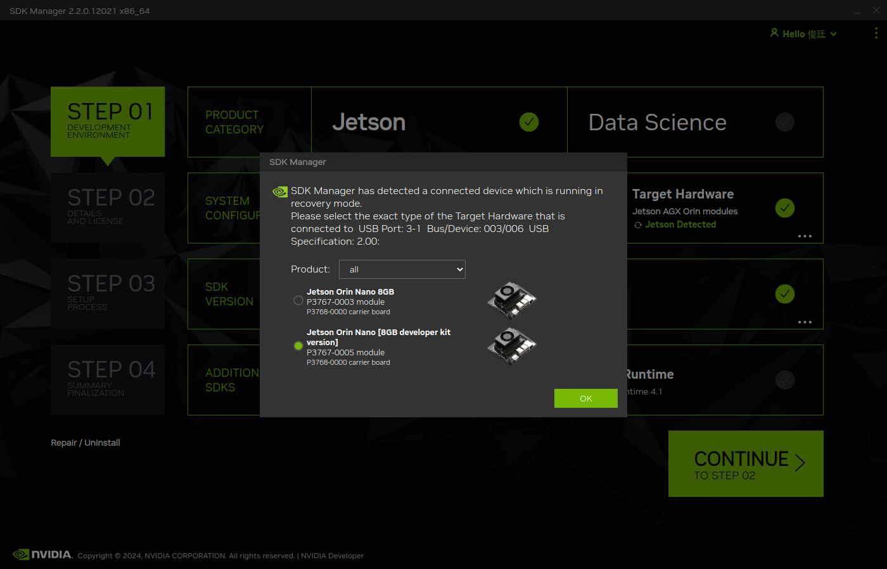
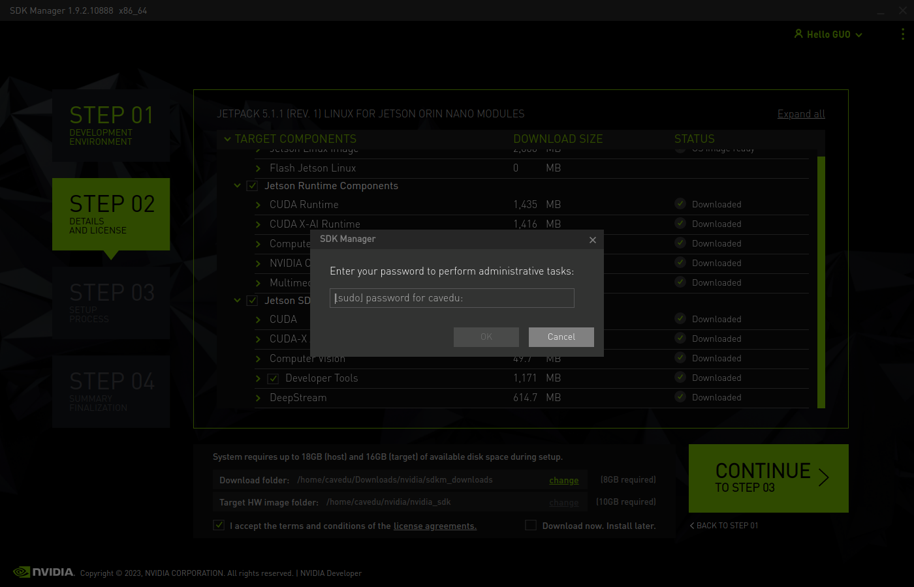
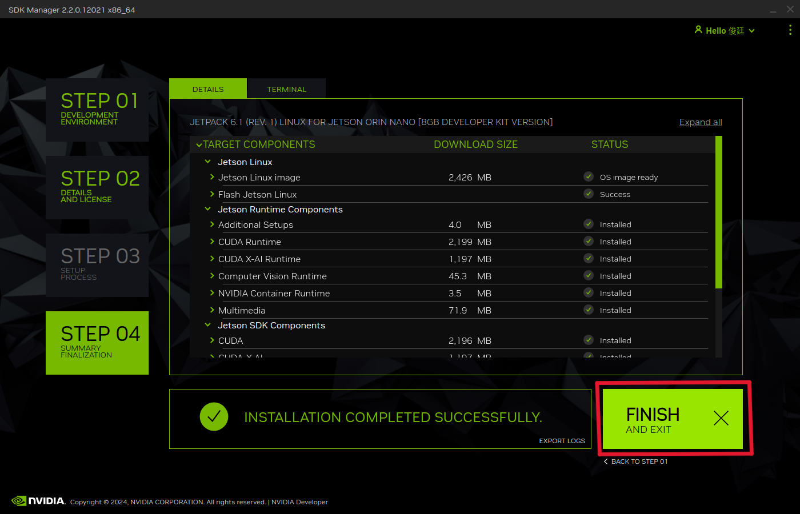
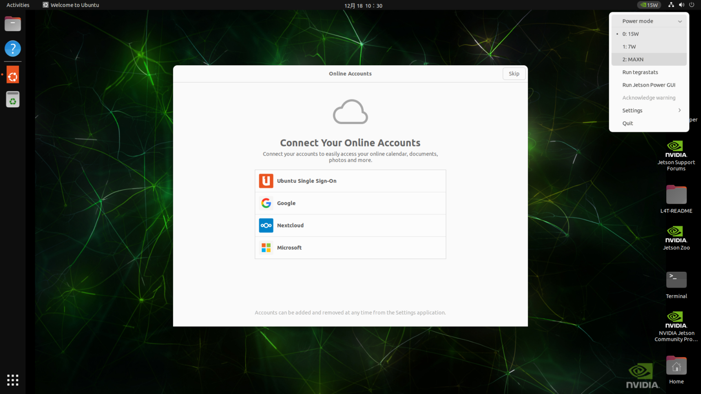

<div align=center>  </div>

## <div align="center">Software Platform Construction </div> 

### 操作前的準備

<ol>
    <li>需要一台原生Ubuntu系統主機***不能使用虛擬機***</li>
    <li>確保Jetson Orin Nano上面已經安裝SSD─用於硬體加速</li>
</ol>

### Nvidia SDK Manager 安裝

- 到官網下載SDK Manager的安裝包=>[超連結](https://developer.nvidia.com/sdk-manager)

  

- 開啟下載資料夾雙擊安裝包，若是安裝完成並且登入成功後開啟可以看到以下畫面

  

### 進行JetPack的升降及安裝操作界紹

- SDK Manager是NVIDIA的官方工具，可以進行Jetson主機的JetPack版本升降級，以下是SDK Manager的操作過程。

  <div align=center>
   <table>
    <tr>
     <th>將Jetson接上主機</th>
     <th>確認是否連接成功</th>
     <th>選擇開發者套件</th>
    </tr>
    <tr>
     <td></td>
     <td></td>
     <td></td>
    </tr>
    <tr>
     <th>在選單中選中所需的JetPack版本</th>
     <th>勾選左側選項，點擊下一步</th>
     <th>輸入管理者密碼</th>
    </tr>
    <tr>
     <td></td>
     <td></td>
     <td></td>
    </tr>
    <tr>
     <th>填入主機板的相關資訊</th>
     <th>安裝完畢後點擊"Finish"結束</th>
     <th>Jetson Orin Nano畫面</th>
    </tr>
    <tr>
     <td></td>
     <td></td>
     <td></td>
    </tr>
   </table>
  </div>

### 系統配置

 - 進行系統更新
    ```bash
    sudo apt install update
    sudo apt install upgrade -y

    ```

 - **python**版本升級
    ```bash
    # 安裝所需的支援庫
    sudo apt install update
    sudo apt install -y make build-essential libssl-dev zlib1g-dev \
      libbz2-dev libreadline-dev libsqlite3-dev wget curl llvm \
      libncursesw5-dev xz-utils tk-dev libxml2-dev libxmlsec1-dev libffi-dev liblzma-dev nano && curl https://pyenv.run | bash
    # 設定pyenv的PATH
    export PATH="$HOME/.pyenv/bin:$PATH"
    eval "$(pyenv init --path)"
    eval "$(pyenv virtualenv-init -)"
    # 安裝python3.11
    pyenv install 3.11.7
    pyenv global 3.11.7
    # 設定永久開啟
    printf '\nexport PATH="$HOME/.pyenv/bin:$PATH"\neval "$(pyenv init -)"\neval "$(pyenv virtualenv-init -)"' >> ~/.bashrc
    scoure ~/.bashrc

    ```

 - 安裝**BNO055**所需的驅動程序
    ```bash
    sudo apt update
    sudo apt install i2c-tools -y
    sudo i2cdetect -y -r 7 # 這行指令應改會在輸出中看到28這個位址
    python -m pip install --upgrade --user \
      adafruit-circuitpython-bno055 \
      circuitpython-bno055 \
      Jetson.GPIO \
      smbus2

    ```

 - 安裝ASUS AC1200驅動程序
    ```bash
    mkdir -p ~/src && cd ~/src/
    git clone https://github.com/morrownr/88x2bu-20210702.git
    cd ~/src/88x2bu-20210702/
    sudo ./install-driver.sh

    ```

 - 安裝支援CUDA加速的opencv
    ```bash
    # 下載 OpenCV 主程式碼
    cd ~
    git clone https://github.com/opencv/opencv.git
    cd opencv
    git checkout 4.7.0   # 可以選擇穩定版本

    # 下載 opencv_contrib 模組
    cd ~
    git clone https://github.com/opencv/opencv_contrib.git
    cd opencv_contrib
    git checkout 4.7.0   # 對應 OpenCV 版本

    # 安裝所需依賴庫
    sudo apt update
    sudo apt install -y libgtk-3-dev pkg-config build-essential cmake git \
        libatlas-base-dev libjpeg-dev libpng-dev libtiff-dev \
        libavcodec-dev libavformat-dev libswscale-dev \
        libv4l-dev v4l-utils libxvidcore-dev libx264-dev \
        libtbb2 libtbb-dev libdc1394-22-dev

    # 建立並清理Build資料夾
    mkdir -p ~/opencv/build
    cd ~/opencv/build
    rm -rf *

    # 設定python路徑
    PYTHON_EXEC=$(pyenv which python3)
    PYTHON_PREFIX=$(pyenv prefix)
    PYTHON_INCLUDE=$PYTHON_PREFIX/include/python3.11
    PYTHON_LIB=$PYTHON_PREFIX/lib/libpython3.11.so
    PYTHON_PACKAGES=$PYTHON_PREFIX/lib/python3.11/site-packages

    # 進行CMake設定
    cmake \
      -D CMAKE_BUILD_TYPE=Release \
      -D CMAKE_INSTALL_PREFIX=/usr/local \
      -D OPENCV_EXTRA_MODULES_PATH=~/opencv_contrib/modules \
      -D WITH_GSTREAMER=ON \
      -D WITH_CUDA=ON \
      -D ENABLE_FAST_MATH=ON \
      -D CUDA_FAST_MATH=ON \
      -D WITH_CUBLAS=ON \
      -D WITH_GTK=ON \
      -D BUILD_opencv_python3=ON \
      -D PYTHON3_EXECUTABLE=$PYTHON_EXEC \
      -D PYTHON3_INCLUDE_DIR=$PYTHON_INCLUDE \
      -D PYTHON3_LIBRARY=$PYTHON_LIB \
      -D PYTHON3_PACKAGES_PATH=$PYTHON_PACKAGES \
      -D BUILD_opencv_world=OFF \
      -D BUILD_EXAMPLES=OFF \
      -D BUILD_TESTS=OFF \
      -D BUILD_DOCS=OFF \
      -D BUILD_PERF_TESTS=OFF \
      ..

    # 編譯opencv
    make -j$(nproc)

    # 安裝opencv
    sudo make install

    # 驗證是否安裝成功
    python3 -c "import cv2; print('OpenCV version:', cv2.__version__)"
    python3 -c "import cv2; print(cv2.getBuildInformation())" | grep -E "GStreamer|GTK|CUDA"

    ```

# <div align="center">[Return Home](../../)</div> 