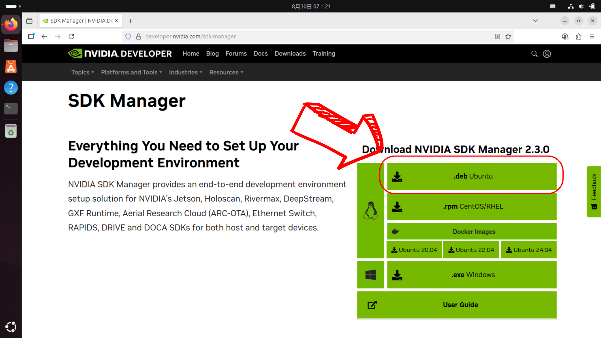

  

## 
Software Platform Construction 
 

- 安裝前的準備
<ol>
    <li>需要一台原生Ubuntu系統主機***不能使用虛擬機***</li>
    <li>確保Jetson Orin Nano上面已經安裝SSD─用於硬體加速</li>
</ol>

- 到官網下載SDK Manager的安裝包=>[超連結](https://developer.nvidia.com/sdk-manager)

  
# 
[Return Home](../../)
 
